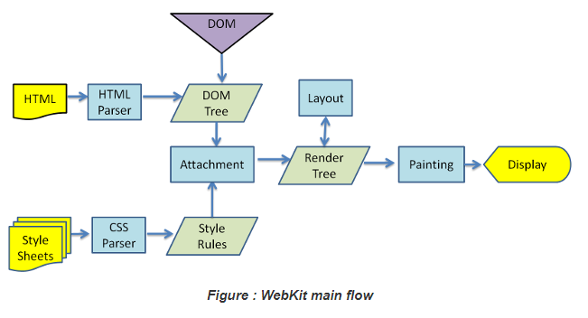
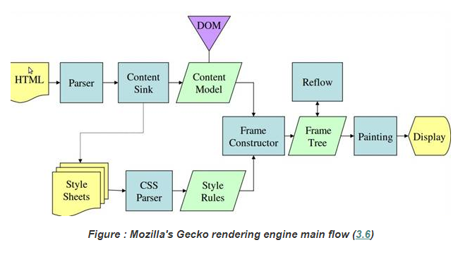

# 渲染引擎

## ★呈现引擎还是渲染引擎？

**➹：**[Rendering Engine，呈现引擎还是渲染引擎？ -- 简明现代魔法](http://www.nowamagic.net/academy/detail/48110130)

**➹：**[把浏览器的 rendering engine 翻译成「渲染引擎」是正确的吗？ - 知乎](https://www.zhihu.com/question/20728608)

## ★介绍

- 职责：渲染，即在浏览器的屏幕上显示用户所请求的内容

那么有哪些内容呢？

默认情况下（不借助插件或扩展程序），**✎：**

1. HTML、XML、图片

如果借助外力呢？**✎：**

1. PDF等其它类型的内容

本章将集中介绍渲染引擎的主要用途，**✎：**

**显示已使用CSS格式化的HTML和图片！**

## ★渲染引擎

不同的浏览器使用不同的渲染引擎，**✎：**

1. IE：Trident（三叉戟）
2. Firefox：Gecko（壁虎）——Mozilla公司「自制」的
3. Safari：WebKit——一种开源的渲染引擎，起初用于Linux平台，随后由Apple公司进行修改，从而支持苹果机和Windows
4. chrome、[Opera（v15）](https://zh.wikipedia.org/wiki/Opera%E9%9B%BB%E8%85%A6%E7%80%8F%E8%A6%BD%E5%99%A8)：Blink（亮瞎你的眼），WebKit中WebCore组件的分支

## ★主流程

渲染引擎说要干活儿了，首先得去网络层获取请求文档的内容，而且这可不是一次性拿完的。每次传输的单位一般是8kB的块，或者说文档一般被分成8kB的块分次传输。 为什么是8kB，因为是TCP/IP的默认缓冲区大小。

**➹：**[javascript - chunk是什么单位？ - SegmentFault 思否](https://segmentfault.com/q/1010000007709725?sort=created)

拿到东西之后，就按照如下的基本流程开始工作了，**✎：**

解释一波，**✎：**

1. 渲染引擎开始解析HTML文档并且把元素逐个转化成一棵树上所谓的DOM节点（有12种节点类型，你自己看着办！），这颗树也被作「content tree」.（你能告诉我这就是所谓的DOM tree吗？）

2. 解析样式数据，有两个来源，一个是 `.css`文件，一个是style元素里的那些（你习以为常的）样式。话说内联样式这货儿去哪呢？

3. HTML 中这些带有视觉指令的样式信息将用于创建另一个树结构——呈现树（render tree）

   （这是DOM树有了样式规则后的render树吗？）

4. 呈现树包含多个带有视觉属性（如颜色和尺寸）的矩形，这些矩形的排列顺序就是它们将在屏幕（screen）上显示的顺序。

5. 呈现树构建（construction）完毕之后，进入“[布局](https://www.html5rocks.com/zh/tutorials/internals/howbrowserswork/#layout)”（layout）处理（process，我觉得加工的翻译挺好的）阶段，也就是为每个节点分配一个应出现在屏幕上的确切坐标（exact coordinates）。

6. 下一个阶段是[绘制](https://www.html5rocks.com/zh/tutorials/internals/howbrowserswork/#Painting) - 渲染引擎会遍历（traversed）呈现树，由用户界面后端层（UI backend layer）将每个节点绘制出来。

> 需要着重指出的是，这是一个渐进的过程。为达到更好的用户体验，呈现引擎会力求尽快将内容显示在屏幕上。它不必等到整个 HTML 文档解析完毕之后，就会开始构建呈现树和设置布局。在不断接收和处理来自网络的其余内容的同时，呈现引擎会将部分内容解析并显示出来。

我似乎不能不「渐进」二字理解成Vue的「渐进」二字，Vue的「渐进」在我看来这是功能上的渐进。总之渲染引擎的基本流程就是源源不断地处理咯（如流水线般的操作！），**✎：**

1. 解析HTML文档为DOM树
2. 构建render树（我觉的这里叫「呈现」好，而不是渲染，因为这没有painting的过程）
3. 为render树搞点布局，即给每个节点分配一个确切的坐标
4. 绘制（老实说，绘制工作竟然是交给UI backend layer来做，或许我可以理解为，渲染引擎描绘了一幅内容画的轮廓，至于涂色，加深则交给UI backend layer来做）

## ★主流程示例

话说，blinkd的mian flow是怎样的呢？我猜这应该会跟WebKit有区别吧！

**➹：**[Chrome内核解析 -- 背景篇：Chromium/Blink的工作流程 - CSDN博客](https://blog.csdn.net/yunchao_he/article/details/41697489)

偶遇的链接，**✎：**

**➹：**[我在阿里的这两年 | Jark's Blog](http://wuchong.me/blog/2017/07/16/two-years-in-alibaba/)

话不多说，解释这两张图，**✎：**

从这两张图可以看出，虽然 （although）WebKit 和 Gecko 使用的术语（terminology）略有（slightly 、稍微）不同，但整体流程是基本（basically）相同的。

Gecko 将[视觉格式化元素](http://genie88.github.io/2015/10/29/css-visual-formatting-model-part1/)（visually formatted elements）组成的树称为“框架树”（Frame tree）。每个元素都是一个框架（frame）。WebKit 使用的术语（term ）是“呈现树”（Render Tree），它由“呈现对象”（Render Objects）组成（consists）。对于元素的放置，WebKit 使用的术语是“布局”（layout），而 Gecko 称之为“重排”（Reflow）。对于连接 DOM 节点和可视化信息（visual information）从而创建呈现树（ render tree）的过程，WebKit 使用的术语是“附加”（Attachment）。有一个细微的（minor ）非语义（non-semantic）差别，就是 Gecko 在 HTML 与 DOM 树之间还有一个称为“内容槽”（content sink）的层，用于生成 DOM 元素的「工厂」。

下一节，会逐一论述流程中的每一部分……

## ★小结

- 你需要去看一下所谓的视觉格式化元素，我之前了解过可以把一个元素看作是一个「框」，也就是所谓的「frame」，或许这书的「框」概念来自于Gecko

  ps：书名——精通CSS，高级web标准解决方案（第2版）

## ★Q&A

### ①WebKit?

**➹：**[WebKit - 维基百科，自由的百科全书](https://zh.wikipedia.org/wiki/WebKit)

### ②chunks ？

**➹：**[HTTP协议之chunk介绍 - CSDN博客](https://blog.csdn.net/u014558668/article/details/70141956)

**➹：**[http协议中content-length 以及chunked编码分析 | Sina App Engine Blog](http://blog.sae.sina.com.cn/archives/3795)

**➹：**[★HTTP协议之chunk编码(分块传输编码) - CSDN博客](https://blog.csdn.net/xifeijian/article/details/42921827)

### ③视觉格式化元素？

这与在「精通CSS，高级web标准解决方案（第2版）」中的第三章 可格式化模型相关联！（这一章节的后面那关于float的叙述不是很懂！）

### ④术语

> **术语**又称**技术名词**、**科学术语**、**科技术语**或**技术术语**，是在特定[专业](https://zh.wikipedia.org/wiki/%E5%B0%88%E6%A5%AD%E5%8C%96)领域中一般概念的[词语](https://zh.wikipedia.org/wiki/%E8%AF%8D%E8%AF%AD)指称，一个术语表示一个[概念](https://zh.wikipedia.org/wiki/%E6%A6%82%E5%BF%B5)。

**➹：**[术语 - 维基百科，自由的百科全书](https://zh.wikipedia.org/wiki/%E6%9C%AF%E8%AF%AD)

### ⑤可视化信息

**➹：**[信息可视化和数据可视化的异同和其他比较，到底怎么区分呢？ - 知乎](https://www.zhihu.com/question/46534447)

