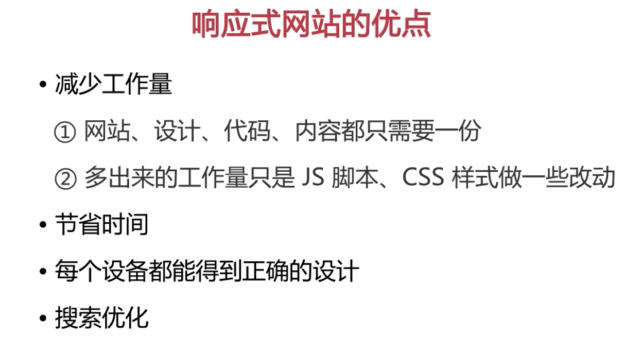
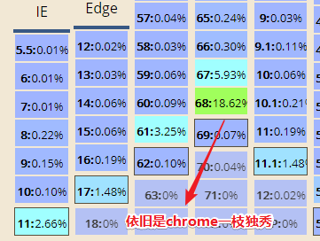

# 第1章 前期准备

## ★讲了什么

> 介绍了课程内容、背景和案例展示、什么是响应式网站、怎样分析设计图、响应式网站设计实践原则

## ★1-1 课程安排

1. 有主课程和拓展课程
2. 以案例为主线，把相关的知识点穿插到案例中！
3. 每个知识点学完后都会有相应的任务，总之学完一个知识点，得要有练习才行！
4. 前置知识：掌握比较基础的html、css、JavaScript即可！
5. 老师的讲课方式：比较细致

## ★1-2 课程简介

1. 看完这课后或多或少都会获得启发与收获！

2. 课程的主要脉络：通过一个实际案例来讲解相关的知识点，之所以这样讲是为了不让课程变得枯燥起来

3. 这个实际案例是由真实网站改编而来的，**✎：**

   1. 从0搭建，讲解其中要用的知识点以及可能遇到的问题
   2. 互联网金融P2P网站！——理财宝
      1. 页面有广告、产品等元素
   3. 所谓的互联网金融，就是把传统金融业务和互联网技术相结合来进行盈利！

4. 响应式的网站，在不同的分辨率下，都呈现出了不同的效果！总之就是页面的排版会发生变化！（注意这可不是减少1个px就会变化的啊！）

5. 通过这门课程，我到底能学到什么呢？

   其实，看目录基本上就能了解个大概了！

   总之，一图以蔽之，**✎：**

   

   解释一波，**✎：**

   1. 响应式网站这个概念是怎么来的，它有什么好处
   2. 从0开始构建的响应式网站，在这其中都涉及到了哪些知识，而这些知识又如何来应用呢？

   3. 你要知道你的姿势已过时，请解锁新姿势 :smirk:
   4. 还有围绕网站开发的其它知识等等……


## ★1-3 响应式网站设计的概念

### ◇什么是响应式网站？

在此之前，还是先看看这篇文章再说，**✎：**

**➹：**[Responsive Web Design · An A List Apart Article](https://alistapart.com/article/responsive-web-design)

文章比较长，而且是英文的，为了方便理解，所以就先看译文吧！，**✎：** :joy:

**➹：**[译言-响应式互联网设计](http://article.yeeyan.org/view/340229/299850)

摘录一些话，**✎：**

> 1. 互联网的短暂性，常常在一两年内就需要细化更改或取代。当我们发表作品时，需要和太多无形的变量 进行协商——视窗的尺寸、屏幕的分辨率、用户的个人定义、系统的自带字体，这些仅仅是其中的几个例子。
> 2. 我们常用子域名来把移动终端对网站的要求与那个“非移动网站”划分开来。但下一步呢？再加一个“iPad网站”？再加一个“诺基亚N90”网站？我们真的可以继续为每一个新的用户终端定量身定做吗？
> 3. 我们的弹性设计在以普通电脑显示屏为出发点的环境下能够游刃有余，但超出这个范围之外优化程度就很低了。
> 4. 近来一种叫“响应式建筑”的新兴专业正开始探讨实体空间应该如何对身处其间的人进行响应的问题。
> 5. 与其为特定的空间体验而创建不可变的空间，他们的建议是人和建筑能够并且应该相 互进行影响。同理，与其为越来越多不同的互联网设备量身定做一个个相互割裂的设计， 我们应该把这些设计需要当作同一个体验的不同层面来处理。

所以，**✎：**

> 我们应该推行响应式互联网设计

那么我们该如何开始呢？

1. [media types](http://www.w3.org/TR/CSS21/media.html)（针对各种特定的互联网终端设备）→☞[media queries](http://www.w3.org/TR/css3-mediaqueries/)（用以在媒介类别的基础上加以改善）

2. 下方这个例子的媒体查询的两部分，**✎：**

   1. 媒介类别——屏幕（screen），以及
   2. 括号中的查询内容，包括具体需要检验的媒介特性——最大设备宽度（max-device-width），以及紧跟其后的目标数值（480px）。

   ```html
   <link rel="stylesheet" type="text/css"
     media="screen and (max-device-width: 480px)"
     href="shetland.css" />
   ```

总之，**✎：**

> 一旦设备通过媒介查询的检验，相关的CSS样式表即施加到源码上。媒介查询简言之就是我们**设计师的条件注释**（[conditional comments](http://msdn.microsoft.com/en-us/library/ms537512%28VS.85%29.aspx)）。不同的是我们**并非针对某个浏览器的某个版本**，而是随着设计布局逐渐超越其初始的理想分辨率，对产生的问题进行**有意识的矫正**罢了。

### ◇总结一下响应式网站设计的一些概念

其实并没有什么官方的概念！简单的说，响应式设计是一种方法，它使网站可以在任何类型的设备，和任何尺寸的屏幕上，如从最小的手机一直到最宽大的大屏幕显示器，甚至是大屏幕电视投影之类的都可以轻松的浏览和使用！采用响应式设计呢？网站仅需要有一个版本你就能浏览全部的内容，而且网站会自己重新排列，用于完美地适配任何尺寸的屏幕！而且具有全尺寸的文本，你在手机里无须进行缩放，就能进行高效的操作！而在大屏幕的显示器中，你又无须忍受像蚂蚁一样小的蝇头小字，还有大片的空白。在不同设备中，网站展现出来不同的设计风格。


所以呢？有些人单纯地把响应式设计理解为弹性布局、自适应布局等等，这些都是不正确的！在作者2010年提出概念的时候就已经纠正了这种不正确了。

总之，**✎：**

> 响应式网站它是一个设计理念，它是多项技术的一个综合体

所以，会过头来看，这些就是响应式网站它的一些概念，**✎：**


那么响应式网站有什么优点呢？ :question: :question: :question:

## ★1-4 响应式网站的优点

响应式网站有什么样的优点呢？响应式网站主要有如下的一些优点，**✎：**

### ◇减少工作量

首先就是减少工作量，这是显而易见的也是最明显的优点，无论是网站、设计、代码还是内容，你都只需要创建一份，我们做这样一个假设，如果你的网站有一个单独维护的一个手机版站点，也就是移动版站点，那么你就需要创建和维护两套或者更多完全独立的html页面，还有其他它的一些代码，任何改动都需要对每个站点进行同步的修改，即便你试图让它们保持一致，在这个过程中由于人总是会出错的，所以也几乎肯定会出现一些问题。当然你也可以采取从后台生成或者获取一些内容，这会让这种同步看起来简单一些，但是也很难避免出问题。那么我们采用响应式设计，那么多出来的工作量，其实只是在脚本、样式上做一点点改动，这对于前端工程师来说是非常好的，而且对于这种招前端成本高又难招的一些现代企业来说，无疑也非常的具有诱惑力！

### ◇节省时间

减少工作量之后，其实它带来的显着效应就是节省时间。每个做企业尤其是做互联网企业的人都知道，人力的成本非常的高，但是**最高还是时间成本**，我们晚一天发布失去的不只是用户或者收入，可能我们机会甚至于公司的前途都随之失去，所以我们**迅速发布、快速迭代、敢于试错、小步快跑，一般来说都成为了互联网企业的基本理念**，所以采用响应式设计，我们可以缩短一点点的时间，提高一点点的用户体验，从而让企业离成功也更近一点点。

### ◇每个设备都能得到正确的设计

使用响应式设计呢？还有一个很具备说服力的理由，就是你创建网站，这个网站可以在现今市场上几乎任何设备都能够正确地好好地工作，更具有非常好的一个显示效果，不仅如此，很可能在未来出现的那些新设备上也具有一个很好的呈现，所以针对每个设备，响应式网站都可以让它得到一个 正确的设计，能够面向未来，这也是响应式网站的一个重要的优点。

### ◇搜索优化

采用响应式设计的一个网站，不管针对什么样的设备，同一个地址的url是相同的，不会出现像我们设计多套的时候出现的M或者Mobile之类打头的子域名，这也就是我们的搜索优化。谷歌自2012年以来开始推荐将响应式设计用于为智能手机优化的网站，不仅因为它能够创建一个更好的用户体验，还因为它允许谷歌的网站爬虫更有效的检索到你的内容，这意 味着所有对网站的一些改变将会很快的在搜索引擎的结果中得到更新，所以如果你根据不同的设备建立多套网站，那么搜索的优化比起响应式网站也会困难很多！

### ◇其它

当然响应式网站还有其他的很多优点，比如说更好的用户体验，更容易统计用户的来源等等，在这里就不一一说明了。

一图以蔽之，上面几点内容，**✎：**



### ◇响应式网站的缺点

那么说了这么多的优点，那么有没有缺点呢？当然也有。

比如响应式网站它会加载更多的样式或者脚本资源。

由于布局都是弹性的，作为设计师来说比较难精确的定位和控制，所以对设计师来说有更高的要求，而且对于老版本ie浏览器等等支持也不是很好，怎么说呢？ 其实这个世界上尤其是软件开发领域，它是没有银弹的，所谓银弹就是解决一切问题的终极方法——绝招、大杀器，也就是说一个技术的出现或者一个理念的出现，它总会有优点和缺点，有它适用的场景，我们只有**认真了解响应式这个网站它的概念，它的优点，它的缺点，它适用的场景，才能更好的决定我们怎么样来用，在什么情况下去用**。


## ★1-5 浏览器一览

### ◇需要掌握的技术

响应式网站开发都需要掌握哪些基础的技术，其实只要你有基本的html 、CSS和JavaScript知识，我们就可以开始响应式网站的开发了，其中所需要的关键知识在这门课程中都会一一提到。


### ◇有哪些浏览器呢？

再开始下一节之前，我们先来熟悉一下浏览器，为什么我们要熟悉浏览器呢？

作为一个前端开发人员开发的网站总是需要在浏览器上去显示的，所以知道有哪些浏览器、它们的版本和大概的用户量是非常重要的，我们没有精力也没有必要去兼容所有的浏览器它们的所有版本，因为一旦你兼容了某种浏览器的某个版本，就意味着你的每一次版本每一个发布都可能需要花费人力或者物力在它的上面去做测试，而且对它做兼容性的处理。

**在浏览器和版本的兼容性和工作量上去做取舍，这是网站的关键角色之一**，比如现在windows phone它所占的市场份额可能很小，那么是否兼容windows phone，你就要想一想同样的是否兼容ie8及以下版本的ie浏览器也是需要考虑的问题。


### ◇can i use？

在考虑哪些浏览器和版本的兼容性这些问题之前，我们先来看几个浏览器的统计，**✎：**

**➹：**["Can I use" usage table](https://caniuse.com/usage-table)

左边起第一栏是IE浏览器，IE从12的版本开始叫做Edge！

从第7栏开始都是些移动端的浏览器了！

还有其它一些浏览器，总之该网站罗列出来的这些浏览器的占比量为96.21%，还有就是，这些颜色亮一点的表示，占比比较大的，**✎：**



对了，这个统计是面向全世界的！可能没有为我们中国这个特定的国家做一些统计。

### ◇statcounter？

这也是一个全球的一个浏览器的统计的网站。但是相较于caniuse可以选择特定区域的统计！如选择中国区域，**✎：**

[Browser Market Share China | StatCounter Global Stats](http://gs.statcounter.com/browser-market-share/all/china/#monthly-201708-201808)


可见谷歌浏览器所占的比例非常的大，而且是在逐渐的升高。总之2个人中，1个人是用chrome浏览器的！ :joy:

对了，你还得去分析一下IE的占比，可见很平稳！可是，为什么要分析IE的呢？

其实很多兼容性问题往往都是ie所造成的兼容性问题，如我们是否决定兼容IE8？是否决定兼容IE9？

由于IE9以后的ie版本它的兼容性问题比之前的版本要少很多，所以我们有没有必要为这种10%以下的用户去做兼容呢？而且由于360它的用户代理的问题，其实**很大一部分使用360浏览器的用户他会被作为ie浏览器来统计**，因为360其实有两种内核，**✎：**

1. 一种急速它是用了webkit的内核
2. 另外一种它用了本机IE的一些内核，那就得看你本机IE的一个版本了

从趋势和份额来看，在国内PC浏览器其实IE的份额是逐渐下降的，而且第三方的浏览器也占据了很大的市场，如搜狗、360、QQ等等的。其中 有一个大家需要注意的就是移动版的QQ浏览器有一个很有意思的地方，虽然它的用户量可能不及其他的比如说原生浏览器、uc浏览器等等的，但是我们所用**微信它的内核采用了QQ浏览器的内核，也就是同样的X5内核**，**✎：**

**➹：**[腾讯浏览服务](https://x5.tencent.com/tbs/index.html)

有兴趣就可以来看一看腾讯的X5浏览服务这样一个产品，有时候我们做一些手机开发的时候，它调用了系统的webview ，但是由于安卓系统它各个版本的差别特别大，甚至于有一些版本，比如说三星低端的一些手机，它的原生浏览器的表现甚至于和webview 不一致，所以如果我们要简单的做一些兼容，可以用X5这样一个浏览服务来替换系统的webview ，当然这是后话了。

### ◇小结

总的来说浏览器的兼容性是响应式网站开发重要的一个考量因素。因为**兼容性是 一个很大的课题**，我们这门课程主要是聊响应式网站开发它的相关技术，而不是兼容性的相关技术，所以我们**这门课程主要是在chrome，也就是谷歌浏览器上进行调试**。关于其它的浏览器的兼容性问题和调试，后面会提到。**现在的浏览器其实对于Web标准的支持都变得越来越好了**，包括ie，包括其它的各种版本的浏览器，很多国产的这些浏览器也都用了比较现代的，比如说Webkit之类的内核，它们的表现其实兼容性都很好，相信**未来兼容性问题对我们前端开发人员的影响一定会越来越小**。

## ★1-6 媒体查询-1

## ★1-7 媒体查询-2
## ★1-8 媒体查询-3

## ★1-9 怎样分析设计图
## ★1-10 响应式网站设计实践原则

## ★小结

- 响应式互联网设计出现缘由——为啥你们总喜欢在移动端设备浏览页面？难道要为不同的设备搞一个新的页面，新的url？这岂不是累死大爷了啊！也忒他妈繁琐了吧！
- 自适应和响应式可不是一个概念，DOM元素天生就是自适应的！
- 你说你弄个弹性布局就是响应式网站？逗我吧！响应式网站可是一个设计理念哦！它是多项技术的综合体哦！你这个弹性布局的网站，没有用到媒体查询吧！没有用到[弹性图片](http://unstoppablerobotninja.com/entry/fluid-images)吧！没有想过换个尺寸看起来就会有点挫吧！
- 响应式网站有优点，也有缺点！总之不要什么一上来就搞响应式！你得根据需求去权衡！
- 由于IE的占比率已经少于10%了，具体一点是3.48%，所以并不需要去考虑IE的兼容性问题！
- 兼容性也是一个很大的课题，不过我还是直接使用最新版的chrome就好了！只要chrome已经支持的特性，不用管其它浏览器是否支持，直接用上！总之先把流程跑通，再去管那些细节！对了，偶然经常性的会看到在微信内置的浏览器里打开网页的时候，会提示你用chrome浏览器打开！

## ★Q&A

### ①「没有建设性的零和博弈」？

什么叫建设性？还有零和博弈是什么？

建设性：积极的、正面的，不是来挑事儿，来拆台！

零和博弈：一方有所得，其它方必有所失，零和博弈的例子有[赌博](https://zh.wikipedia.org/wiki/%E8%B3%AD%E5%8D%9A)、[期货](https://zh.wikipedia.org/wiki/%E6%9C%9F%E8%B2%A8)和[选举](https://zh.wikipedia.org/wiki/%E9%81%B8%E8%88%89)等

所以总体来说，这句话整体来看就是「对大家都不好」

**➹：**[什么叫「建设性意见」？ - 知乎](https://www.zhihu.com/question/24109359)

**➹：**[零和博弈 - 维基百科，自由的百科全书](https://zh.wikipedia.org/wiki/%E9%9B%B6%E5%92%8C%E5%8D%9A%E5%BC%88)

### ②响应式互联网设计？

**➹：**[译言-响应式互联网设计](http://article.yeeyan.org/view/340229/299850)

> 流动网格、弹性图片和媒介查询是响应式互联网设计的三大技术成分，但是崭新的思路也是必不可少的。与其把同样的内容割裂成不同设备专属的体验，我们可以**通过媒介查询，渐进增强式地将一个设计在不同的阅读环境中加以优化**。这么说并**不是要绝对否定在任何情况下使用针对特定设备的独立网站**，比如当移动用户在你的网站上的商业目的相比固定电脑用户要单一得多的时候，为两种情况分别输送不同的内容可能是最好的方法。
>
> 然而我们也不需要固守在那样的设计思路里。如今**越来越需要我们的设计能够呈现在一系列多种多样的体验之中。**响应式设计为我们指出了一条未来的路，是我们**终于可以依照万物生灭的规律来进行设计**了。

回顾开篇的那句话，**✎：**

> “在印刷媒体中设计师拥有一种熟悉的掌控感，从而常常渴望在互联网上也能同样地掌控全局。然而这种掌控其实只是实体印刷页面本身固有的一种局限而已。互联网恰恰没有这种局限，所以我们应该拥抱它给设计带来的自由天地。但首先，正如老子所说，万物作而弗始，生而弗有——我们应该先接受事物生灭的规律。”
>
> ——约翰·阿尔索普（John Allsopp）《[互联网设计之道](http://article.yeeyan.org/view/340229/302045)》(A Dao of Web Design)

你会觉得首尾呼应对吧！

对了，还有一句话很有概括性的话，**✎：**

> 英国建筑师克里斯托弗·列恩（Christopher Wren）曾打趣地说他所选择的建筑业“意在永恒”——多么引人入胜！我们的互联网业则常让人感觉“意在下周”。

或许这就是互联网，而不是建筑！

### ③费茨法则？

> **费茨法则** 是一个[人机互动](https://zh.wikipedia.org/wiki/%E4%BA%BA%E6%A9%9F%E4%BA%92%E5%8B%95)以及[人体工程学](https://zh.wikipedia.org/wiki/%E4%BA%BA%E4%BD%93%E5%B7%A5%E7%A8%8B%E5%AD%A6)中人类活动的模型，它预测了快速移动到目标区域所需的时间是目标区域的距离和目标区域的大小的函数。费茨法则多用于表现 *指*、*点* 这个动作的概念模型，无论是用手或者手指进行物理接触，抑或是在电脑屏幕上用假想的设备（例如鼠标）进行虚拟的触碰。 该法则由 [Paul Fitts](https://en.wikipedia.org/wiki/Paul_Fitts) 于 1954 年提出。

**➹：**[费茨法则 - 维基百科，自由的百科全书](https://zh.wikipedia.org/wiki/%E8%B4%B9%E8%8C%A8%E6%B3%95%E5%88%99)

关于模型，**✎：**

**➹：**[解谜计算机科学（1）](http://www.yinwang.org/blog-cn/2018/04/13/csbook-chapter1)

我的理解就是「符号很抽象，如为啥1+1=2呢？然后动用你的手指，一根手指+一根手指，就是两根手指了，两根手指如何表示呢？就是2这个符合咯！为了操作这些符号，我们需要建立一个手指模型，才能计算得出我们想要的结果！当然这个结果是基于这个模型的，也许换个模型就不适合了！如我们的手指模型是10进制的，如果是二进制的，那么1+1=10了啊！」

### ④弹性布局？响应式网站概念？（视频内容讲解）

弹性布局是当时（2010年左右吧！）很常用的解决布局不确定性的方案！

它也叫做流式布局、流动性布局、自适应布局等等……总之这都是它的一些别称！

弹性布局不对浏览器的宽度做任何的假设！因而能优雅地适应不论是水平式的还是竖直式的终端设备。

弹性布局的例子，**✎：**

[A Flexible Grid](https://alistapart.com/d/responsive-web-design/ex/ex-site-flexible.html)

缩放浏览器的窗口，你会发现左侧菜单，右侧的图片和文字都会相应的有一些缩放，而且可以适应窗口的大小（也就是说没有出现水平滚动条咯）！还有就是整个版式也没有更多的改变！

这个页面在我们常见的分辨率下还是不错的！

然而，在小于800x600的分辨率之下，这页面看起来就有点矬了！如左上角的图片的边缘很快就被裁去了！右下角的图片变小了，为此变得不清晰了！……同理，在宽屏显示器中图片则很快变成笨重的超大尺寸，令周围的文字内容不堪排挤。

总之，弹性布局在一定范围（如普通电脑显示屏）之内是可以的，可一旦超出这个范围之外优化程度就很低了！

借助「响应式建筑」的理念，作者提出，**✎：**

与其为越来越多不同的互联网设备量身定做一个个相互割裂的设计， 我们应该把这些设计需要当作同一个体验的不同层面来处理。

**这里的「不同层面处理」指的是响应式网站设计！**

是时候引入媒体查询这个概念了，这也叫媒介查询！

所谓的媒体查询指的是「针对某些设备的某些特征，可以应用不同的样式！」

---

引入媒体查询后作者改写的例子，**✎：**

[A Flexible Grid](https://alistapart.com/d/responsive-web-design/ex/ex-site-linearize.html)

当分辨率小到一定程度的时候，左侧的导航菜单到了顶部！即由原先左右的结构变成了上下的结构！这样一来，更有利于小屏幕的阅读！

然而对于大屏幕来说，右下角还是一行3张图片！

---

为此，作者又作出了改变，在高分辨率下，把右下角的图片变成一行6张的排列方式来处理图片！

[A Flexible Grid](https://alistapart.com/d/responsive-web-design/ex/ex-site-larger.html)

这样一来，即便是高分辨率屏也能优雅的呈现了！即看起来还可以！

总之，**✎：**

1. 大：左右布局，一行6张图
2. 中：左右布局，一行3张图
3. 小：上下布局，一行2张图

注意，这是同一个url，即浏览是的同一个页面所做出来的响应！

除了优化图片、导航之外，文字等也是可以优化的！毕竟文字也是可视化信息啊！同图片一样！

---

最终优化的例子，**✎：**

[A Flexible Grid](https://alistapart.com/d/responsive-web-design/ex/ex-site-FINAL.html)

1. 大：导航跑到右上边了
2. 中：导航跑到左边
3. 小：导航跑到顶端去了。而且左上角的logo背后那张图也不要了！而文字变得更加紧凑，更有利于我们的阅读！

总之，这就是一个网站优化的一个过程！

---

最后作者提出响应式布局不仅仅只限于改变布局！通过媒体查询我们可以相当精确地对页面进行重构！包括在小屏幕上扩大链接的目标区，从而更好地遵循触摸屏的费茨定律（[Fitts' Law](http://en.wikipedia.org/wiki/Fitts%27_law)）；包括对某些元素有选择性地显示或隐藏，从而改善页面的导航功能；还包括设置[响应式排字法](http://www.alistapart.com/d/responsive-web-design/ex/ex-article.html)，渐进地改变字体大小和行距，从而为显示设备提供最优化的阅读体验。

接着作者就讲了下兼容性的问题以及对未来的展望！

注意，这是2010年的文章，有些东西对现在来说已经有了新的一些技术来替代！

所以，为啥要很详细地来讲这个文章呢？

就是因为作者在最后提出了——响应式互联网设计的三大技术成分

1. 流动网格（刚才所说的[弹性网格](https://blog.csdn.net/ixygj197875/article/details/79365770)——就是有百分比的单位）
2. 弹性图片
3. 媒介查询（也就是媒体查询）

总之，这篇文章是个里程碑式的作品！为什么这么说呢？因为


还有就是提出了这3大技术，虽然这3大技术不是作者的发明，但是把这3大技术组合在一起并加入了作者自己的设计理念，这才是作者他的伟大之处！也就是说响应式网站设计的这个概念是作者在2010年首次提出的！


ps：弹性网格布局的公式——**目标元素宽度 ÷ 上下文元素宽度 = 百分比宽度**。这个百分比宽度就是当前目标元素的宽度！

不过目前应该都是用flex布局，或者如果兼容性好的话，用最新的grid布局！

### ⑤银弹？

**➹：**[银弹（Silver Bullet）是什么？ - 知乎](https://www.zhihu.com/question/20829469)

> 在软件工程中，银弹指能让生产力在十年中提高十倍的方法

也就是万金油！

老师说到，**✎：**

> 在这个世界上尤其是软件开发领域，它是没有银弹的

即没有最完美的解决方案！

总之就是在告诉你在合适的场合用合适的东西！

或许也没有所谓的最好的学习方法！不要试着找最好的了，这本就是无止境的！直接干，不怕事，不怕走弯路！


