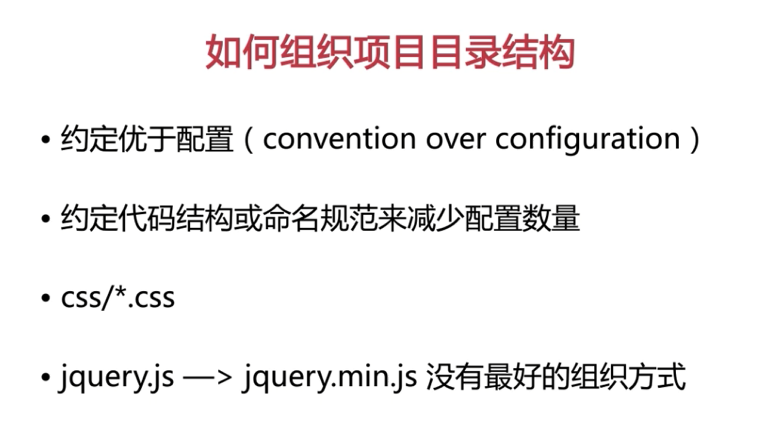

# 第2章 如何组织项目目录结构

## ★讲了什么？

> 介绍了约定优于配置的思想，常见的项目目录和文件的组织方式，一些基本文件的作用等知识，为编码开始做准备。

## ★2-1 简述

### ◇如何组织项目目录结构？

在开始制作页面之前需要做一些准备工作，其中比较重要的，就是**确定项目目录和文件的组织结构**。

一个比较规范的结构，有助于多元协作。那么在软件设计方面有一个概念叫做「convention over configuration」，就是**约定优于配置**，也有人把它叫做**按约定编程**。

这个概念，其中有重要的一环就是**约定代码结构和命名规范，从而来减少配置的数量**！

举个例子来说，我们约定所有的样式文件都要放到名称叫做`CSS`的文件夹下，那么我们在编写代码的时候就可以很自信的相信——如果一个文件夹的名字叫做`style`或者`js`之类的，那么它们下面一定不会有样式文件。

再举个例子，如果我们规定所有的脚本文件，它们压缩以后，**命名方式**都是在原先的文件名后面加上 `.min` 。这样约定后，当我们要发布的时候，只需要通过**自动化**的方式，简单地将所有引用脚本，它们的文件路径都加上 `.min` ，就可以保证线上环境引用的脚本代码都是经过压缩的。**✎：**

那么如果我们没有这样的约定呢？

也许张三喜欢加上`min`，李四喜欢加上`compress`等等，那么对于这些脚本我们就只能一个去检查。当然**关于发布不仅仅就是这么简单**，后面章节会涉及到更多打包发布的内容，接下来我们会再详细的讲解。

### ◇听说张三的组织方式棒棒哒？

接着我会介绍一种简单的项目文件和目录的组织方式。

在介绍之前，大家首先需要了解的就是——其实**没有最好的组织方式，每个人和每个团队都有自己的习惯**。

比如有的人喜欢把样式文件放在`css`的文件夹下，有的人就喜欢放到`style`文件夹下，有的人喜欢用简写命名文件夹，比如说`img`，那么有的人就喜欢用全称，比如`image`，有的人喜欢用单数，比如`image`，有的人喜欢用复数加个`s`。这些其实根本没有好坏、对错之分，也就是说**只有合适的、适合的就是最好的。**那么言归正传，我们来一起一步一步地把项目的基本结构搭建起来吧！**✎：**

## ★2-2 文件夹的组织

## ★2-3 有用的文件1（robots.txt、favicon.ico、humans.txt）

## ★2-4 有用的文件2（.editorconfig、gitignore）

## ★2-5 有用的文件3（LICENSE.txt、README.md、CHANGELOG.md）

## ★2-6 有用的文件4（markdown）

## ★小结

- 关于如何组织项目目录结构，有这么一个说法就是「约定优于配置」，如约定这个目录应该叫啥，这个文件的压缩版应该叫啥，当然这只是对命名的约定！还有其它的约定呢！

  给一个简单的目录命名吧！——样式就用`css`好了，图片就`img`吧 ！脚本那就`js`……

  之前看视频写的一个项目的目录结构，**✎：**

  **➹：**[ppambler/163-music-2018: 163-music-demo](ppambler/163-music-2018: 163-music-demo)

## ★Q&A

### ①约定优于配置？

**➹：** [约定优于配置 - 维基百科，自由的百科全书](https://zh.wikipedia.org/wiki/%E7%BA%A6%E5%AE%9A%E4%BC%98%E4%BA%8E%E9%85%8D%E7%BD%AE)

> **约定优于配置**（**convention over configuration**）[[1\]](https://zh.wikipedia.org/wiki/%E7%BA%A6%E5%AE%9A%E4%BC%98%E4%BA%8E%E9%85%8D%E7%BD%AE#cite_note-1)，也称作**按约定编程**[[2\]](https://zh.wikipedia.org/wiki/%E7%BA%A6%E5%AE%9A%E4%BC%98%E4%BA%8E%E9%85%8D%E7%BD%AE#cite_note-2)，是一种软件[设计范式](https://zh.wikipedia.org/w/index.php?title=%E8%AE%BE%E8%AE%A1%E8%8C%83%E5%BC%8F&action=edit&redlink=1)，旨在减少[软件开发人员](https://zh.wikipedia.org/wiki/%E8%BD%AF%E4%BB%B6%E8%AE%BE%E8%AE%A1%E5%B8%88)需做决定的数量，获得简单的好处，而又不失灵活性。
>
> 本质是说，开发人员仅需规定应用中不符约定的部分。

总之，**✎：**

> 如果您所用工具的约定与你的期待相符，便可省去配置；反之，你可以配置来达到你所期待的方式。

**➹：**[如何评价“约定优于配置”的程序语言? - 知乎](https://www.zhihu.com/question/47239663)

**➹：**[什么是约定优于配置？ - 知乎](https://www.zhihu.com/question/62960377)

看了这个答案，**✎：**

**➹：**[什么是约定优于配置？ - RMC Yang的回答 - 知乎](https://www.zhihu.com/question/62960377/answer/360959520)

其中说到，**✎：**

> 代码逻辑远比配置文件更容易debug。配置文件更像是declarative programming ，而程序逻辑是imperative programming. 在衍生对比，你可以想象一下写html和写JavaScript 的区别

我关注点在于HTML和JavaScript，这个声明式和命令式的对比真得很意思啊！我怎么就没有想到呢？前者语义化标签，我要个一级标题h1，我要个段落p等等……而后者则是一步步来操作DOM等……与此同时，联想到Vue的声明式渲染，你就会觉得JavaScript不需要做什么东西就能很好地操作DOM了……

对了，关于配置文件，**✎：**

> 通常，一个Web App在运行时都需要读取配置文件，比如数据库的用户名、口令等，在不同的环境中运行时，Web App可以通过读取不同的配置文件来获得正确的配置。

**➹：**[Day 6 - 编写配置文件 - 廖雪峰的官方网站](https://www.liaoxuefeng.com/wiki/0014316089557264a6b348958f449949df42a6d3a2e542c000/001432339034336cbf72acd43354d72831461e3871d9f2e000)

听说webpack的配置文件经常让开发者头疼，也有人说webpack将会被0配置的parcel给取代掉！

老实说，我还是不太懂约定优于配置的「配置」指的是什么？我在想把配置里的东西也约定好了，那么这里的「优于」应该不是指要了约定就不要配置吧！

**➹：**[约定优于配置——软件开发的简约原则 – 尘埃落定](https://www.lovelucy.info/convention-over-configuration.html)

我继续看了这篇文章，难道配置指的是if……else……？或者说这里的配置指的就是不遵循规范，任性而为？而不是我想象中的配置文件——即我想象中的配置文件似乎也是一种约定。

那么Vue框架呢？它也是约定优于配置咯！或者说这所谓的语法本质上来说也是一种约定咯？

言而总之，我能否认为配置是相对于约定来说的！或者说配置是一个人的约定……

也就是说，**✎：**

> 「配置」是一个人的约定，而「约定」是大家都认可的约定……
>
> 一个任性自由，一个大家好才是真得好……

:joy::joy::joy:

