# Life of a Pixel

## ★资料

**➹：**[前端代码如何通过浏览器演化为屏幕显示的像素](https://zhuanlan.zhihu.com/p/44737615)

**➹：**[Life of a Pixel 2018 - Google 幻灯片](https://docs.google.com/presentation/d/1boPxbgNrTU0ddsc144rcXayGA_WF53k96imRH8Mp34Y/edit#slide=id.p)

## ★临时笔记

1. 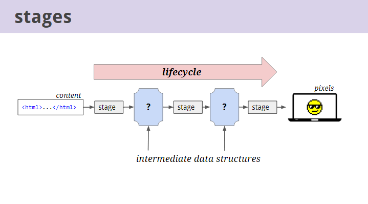

   这图给我的第一眼就是，内容经过2次解析，变成了一种可以被渲染引擎渲染解释的数据结构！

2. 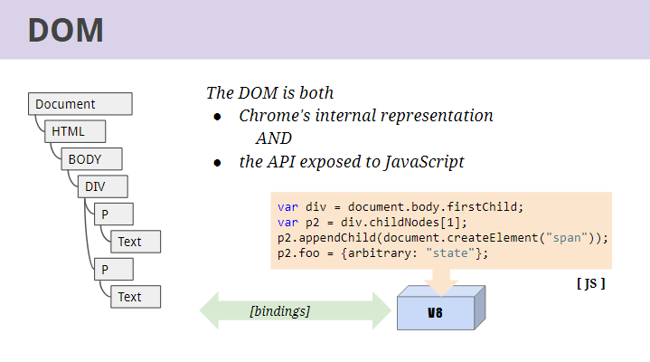

   > The DOM serves double duty as both the internal representation of the page, and the API exposed to script for querying or modifying the rendering.
   >
   > The JavaScript engine (V8) exposes DOM web APIs as thin wrappers around the real DOM tree through a system called "bindings".

   **✎：**

   > DOM作为页面的内部表示，以及用于查询或修改渲染的脚本的API都是双重职责。
   >
   > JavaScript引擎（V8）通过一个称为“绑定”的系统将DOM web api暴露在真正的DOM树周围。

   按照我的理解就是，DOM树是Chrome浏览器的内部表现，为什么这么说呢？你可以通过JavaScript所提供的DOM API就能发现这一点！

   把HTML解析成一颗DOM树，这很好地诠释了元素父子间，兄弟间的关系！

## ★最终笔记

### ◇苏格拉底的话

> 未经审视的人生没有价值

**➹：**[为何很多人说“未经审视的人生没有价值”呢？ - 知乎](https://www.zhihu.com/question/19951844)

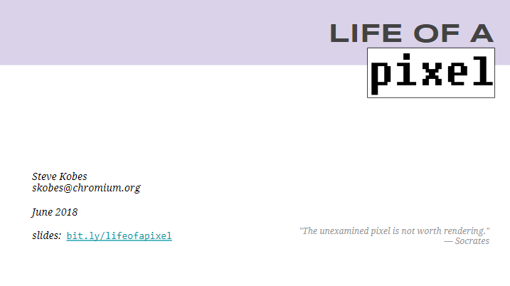

> The unexamined pixel is not worth rendering
>
> ​	——未经审视的像素不值得渲染

这是原话，**✎：**

> The unexamined life is not worth living

稍微谷歌了一下，发现对这句话的翻译千奇百怪……

**➹：**[苏格拉底曾说：“未经审视的人生不值得过”，如何理解这里的“审视”？ - 知乎](https://www.zhihu.com/question/270551757)

如果我此刻非要理解的话，那就是「你没有思考过自己所做的一切，随波逐流，那么你这一生并不值得过下去！」

### ◇讲什么

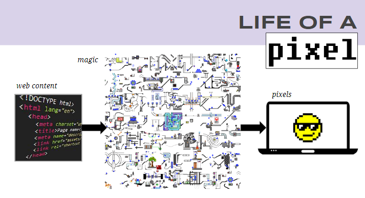

> This talk is about how Chrome turns web content into pixels.  The entire process is called "rendering".
>
> We'll describe what we mean by content, and what we mean by pixels, and then we'll explain the magic in between.

> 这个演讲是关于Chrome如何将网页内容变成像素的。这整个过程称之为“渲染”。
>
> 我们会描述内容和像素各自是什么意思，然后我们会解释这两者间的「魔力」。

### ◇以Chrome的哪个版本来讲

> Chrome's architecture is constantly evolving.  This talk connects high-level concepts (which change slowly) to specific classes (which change frequently).
>
> The details are based primarily on what is currently shipping in the canary channel (M69), but a few of the biggest future refactorings are mentioned in passing

> Chrome的架构在不断发展。这篇演讲将高层次的概念(变化缓慢)与特定的阶级(变化频繁)联系起来。
>
> 这里的描述主要是基于目前在金丝雀版本（M69）的阐述，同时也会在演讲中提到一些未来最大的重构

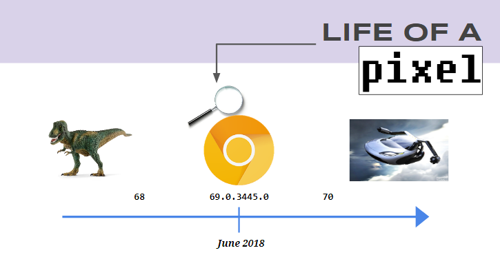

我目前所用的Chrome版本号，**✎：**

### ◇你看到的网页内容

> "Content" is the generic term in Chromium for all of the code inside a webpage or the frontend of a web application.
>
> It's made of text, markup (surrounding the text), styles (defining how markup is rendered), and script (which can modify all of the above dynamically).
>
> There are other kinds of content, which we won't cover here.

「Content」是一个关于网页中或者web应用中前端的所有代码的这么一个通用术语。

它由**文本**、**标记**(围绕文本)、**样式**(定义如何呈现标记)和**脚本**(可以动态地修改上述所有内容)组成。

还有其它类型的内容（如图片、音频、视频、svg等等），我们不会在这里介绍。

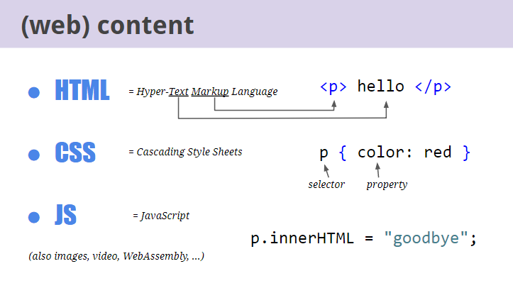

图中的「property」让我想起了，**✎：**

> JavaScript 提供了一个内部数据结构，用来描述对象的属性，控制它的行为，比如该属性是否可写、可遍历等等。这个内部数据结构称为“属性描述对象”（attributes object）。每个属性都有自己对应的属性描述对象，保存该属性的一些元信息。

**➹：**[属性描述对象 -- JavaScript 标准参考教程（alpha）](https://javascript.ruanyifeng.com/stdlib/attributes.html)

虽然这是CSS的语法，不过可以这样理解这些属性值，如把red再封装一层。就像是这样，**✎：**

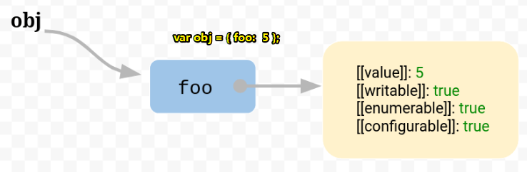

**➹：**[JavaScript 的 this 原理 - 阮一峰的网络日志](http://www.ruanyifeng.com/blog/2018/06/javascript-this.html)

### ◇一张真正的网页

> A real webpage is just thousands of lines of HTML, CSS, and JavaScript delivered in plain text over the network.
>
> There's no notion of compilation or packaging as you might find on other kinds of software platforms - the webpage's source code is the input to the renderer.

一张真正的网页只是成千上万行HTML、CSS和JavaScript以纯文本的形式通过网络传递。

没有编译或打包的概念，你可能会发现在其他类型的软件平台-网页的源代码是渲染器的输入。

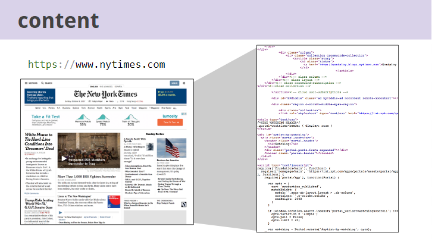

**➹：**[纽约时报](https://www.nytimes.com)

以一个浏览器界面去看这张网页，**✎：**

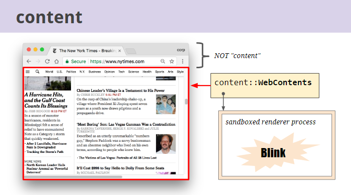

> Architecturally, the "content" namespace in the Chromium C++ codebase is responsible for everything in the red box.
>
> Contrast with tab strip, address bar, navigation buttons, menus, etc. which live outside of "content".
>
> Key to Chrome's security model: rendering happens in a sandboxed process.

在架构上，Chromium c++代码库中的以“content”为命名空间的负责红框中的所有内容，与存在于“content”之外的标签栏、地址栏、导航按钮、菜单等形成对比。

Chrome安全模型的关键在于渲染是在沙箱进程中发生的！你要知道沙箱的标签意味着安全！

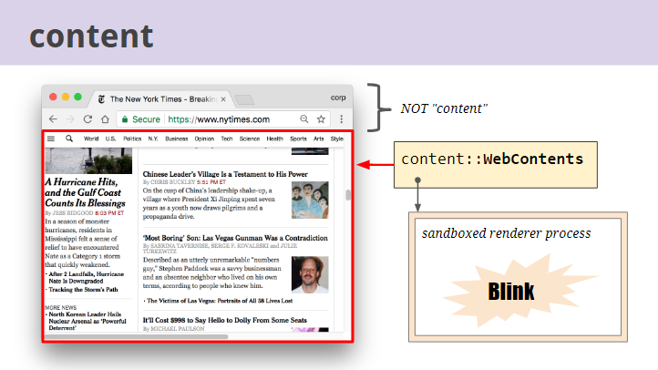

没想到连滚动条都是「content」的一员，也是交由Bink来搞事情！

### ◇像素

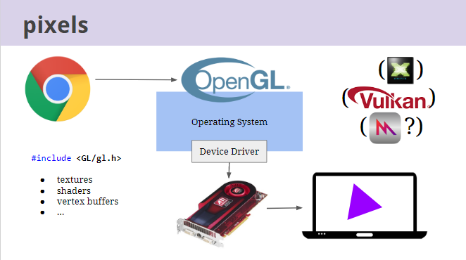

> At the other end of the pipeline we have to get pixels onto the screen using the graphics libraries provided by the underlying operating system.
>
> On most platforms today, that's a standardized API called "OpenGL".  On Windows there's an extra translation into DirectX.  In the future, we may support newer APIs such as Vulkan.
>
> These libraries provide low-level graphics primitives like "textures" and "shaders", and let you do things like "draw a polygon at these coordinates into a buffer of virtual pixels".  But obviously they don't understand anything about the web or HTML or CSS.

在管道（流水线）的另一端，我们必须使用底层操作系统提供的图形库将像素显示在屏幕上。

在今天的大多数平台上，这是一个被称为“OpenGL”的标准化API。而在Windows上有一个额外的效果翻译器——DirectX。将来，我们可能会支持诸如Vulkan之类的新API。

这些库提供低级的作图基元，比如“纹理”和“[着色器](https://learnopengl-cn.readthedocs.io/zh/latest/01%20Getting%20started/05%20Shaders/)”，并且允许您做一些事情，比如“在这些坐标的虚拟像素缓冲区上绘制一个多边形（图中的那个等边三角形）”。但很明显，它们对web（浏览器？网络？web应用？）、HTML或CSS一无所知。（即只是单纯地由输入转化为输出）

ps：作图基元——在某些中小型计算机制图系统中，一个单项的图形操作。如：画一串点、画一直线、画一串图文。

### ◇目标

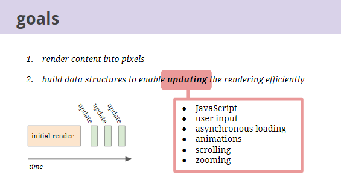

> So the goal of rendering can be stated as: turn HTML / CSS / JavaScript into the right OpenGL calls to display the pixels.
>
> But keep in mind a second goal as we describe the pipeline:  We also want the right intermediate data structures to update the rendering efficiently after it's produced, and answer queries about it from script or other parts of the system.

因此，呈现的目标可以表述为：将HTML / CSS / JavaScript转换为正确的OpenGL调用来显示像素。

但是，在描述流水线时要记住第二个目标：我们还需要合适的中间数据结构，以便在页面生成之后还高效地更新呈现，并从脚本或系统的其它部分回答关于呈现的查询。

在这儿，更新页面的途径有JavaScript、用户输入、异步加载、动画、滚动、缩放……

没想到缩放也会更新页面重新渲染！我很好奇这是个什么样的数据结构，才能做到高效地再次渲染！

### ◇流程

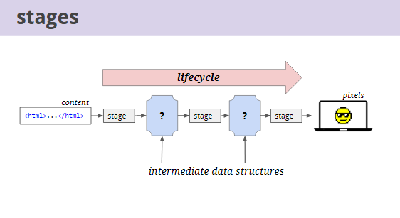

> We break the pipeline into multiple "lifecycle stages", generating those intermediate outputs.
>
> We'll first describe each stage of a working pipeline, then come back to the notion of efficient updating and introduce some concepts for optimization.

我们将管道分解为多个“生命周期阶段”，生成这些中间输出。

我们将首先描述工作管道的每个阶段，然后回到高效更新的概念，并引入一些优化的概念。

这里有3个阶段，头两个阶段的产物是不知名的数据结构，最后一个阶段就是最终的渲染结果了！

### ◇解析

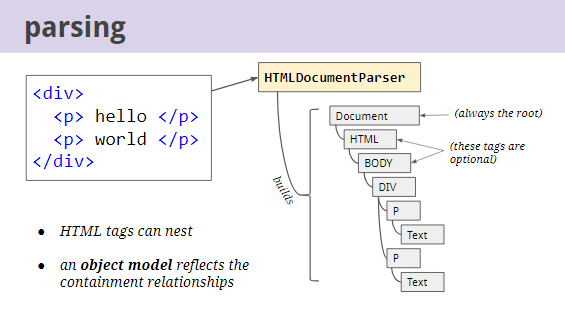

> HTML tags impose a semantically meaningful hierarchical structure on the document.  For example, a` 
` may contain two paragraphs, each with text.  So the first step is to parse those tags to build an object model that reflects this structure.

HTML标记在文档上强加了一个语义上有意义的层次结构。例如，一个div中可能包含两个段落，每个段落都有文本。因此，第一步是解析这些标记，以构建反映这种结构的对象模型。

也就是说你的HTML文档中的内容是有语义有层次的（即嵌套），借此可以解析HTML文档构建成一个DOM树

也就是之所以用树这种数据结构是有原因的啊！这是根据材料来决定的啊！

图中说到，Document节点总是存在的，是永远的根节点，而HTML、BODY等这些标签则是可选的！

### ◇DOM

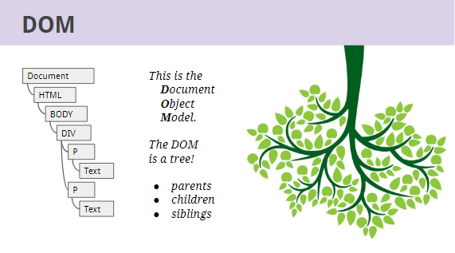

> If you've taken computer science classes you may recognize this as a "tree".

如果你上过CS课，你可能会认为这是一棵“树”。

当你站在div这个节点去看整颗树的时候，你会发现它有爸爸、儿子、弟兄、爷爷、祖先……

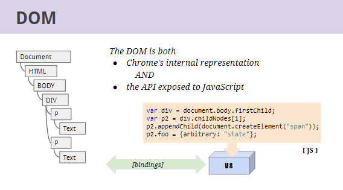

> The DOM serves double duty as both the internal representation of the page, and the API exposed to script for querying or modifying the rendering.
>
> The JavaScript engine (V8) exposes DOM web APIs as thin wrappers around the real DOM tree through a system called "bindings".

DOM是个什么样的存在？既是页面的内部表示，又是暴露给脚本查询或修改呈现的API。

JavaScript引擎(V8)通过一个名为“bindings”的系统，将DOM web APIs作为围绕真正的DOM树的thin warppers（薄包装纸？）给开放了。

之前有了解过DOM接口，然后各大浏览器对DOM接口实现有点差异，这些实现产物叫做DOM web APIs，我们开发者可以通过使用DOM web APIs来查询、更新这颗在内存中的树！

这个bindings系统真有意思！不过在这其中起到关键作用的可是V8啊！

ps：有个评论提到Shadow DOM，其中提到，**✎：**

> We layout in flat tree order, instead of dom order

### ◇style

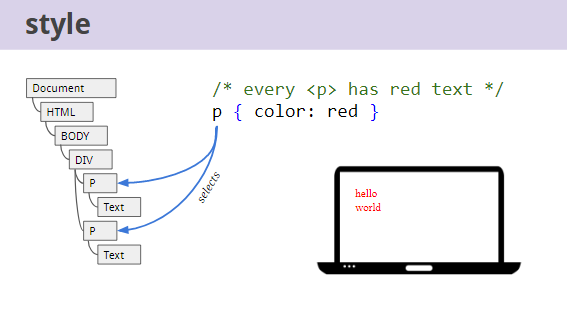

> Having built the DOM tree, the next step is to process the CSS styles.
>
> A CSS selector selects a subset of DOM elements that its property declarations should apply to.

构建了DOM树之后，下一步是处理CSS样式。

CSS选择器选择其属性声明应当应用于其DOM元素子集。

即你的选择器是P这个DOM元素，那么这个color则作用于其子文本节点，而且这是可继承的，**✎：**

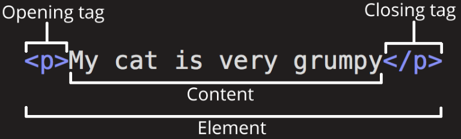

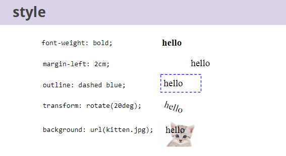

> Style properties are the knobs by which web authors can influence the rendering of DOM elements.
>
> There are hundreds of style properties.

样式属性是web作者可以通过它影响DOM元素呈现的开关按钮。

而且这有数百种样式属性。如文本的粗细、元素间的间距大小、元素的边框是虚线还是实线，是红的黄的还是绿的啊、是够可以元素倾斜旋转啊？、是否可以让元素有背景图啊！

**➹：**[transform - CSS：层叠样式表 - MDN](https://developer.mozilla.org/zh-CN/docs/Web/CSS/transform)

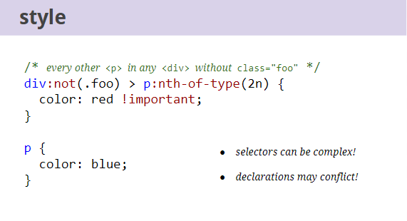

> Furthermore, it's not trivial to determine which elements a style rule selects.
>
> Some elements may be selected by more than one rule, with conflicting declarations for a particular style property.

此外，确定样式规则所选择的元素并不简单。

某些元素可以由多个规则选择，这样一来，特定样式属性的声明就会相互冲突了啊！

关于样式规则，**✎：**

> CSS由多组`规则`组成，每个规则由“选择器”（selector）、“属性”（property）和“值”（value）组成：
>
> 1. `选择器`（Selector）:多个选择器可以半角逗号（,）隔开。
> 2. `属性`（property）:CSS1、CSS2、CSS3规定了许多的属性，目的在控制选择器的样式。
> 3. `值`（value）:指属性接受的设置值，多个关键字时大都以空格隔开。
>
> 属性和值之间用半角冒号`：`隔开，**属性和值合称为“特性”**。多个特性间用`；`隔开，前后用`{}`括起来
>
> 对于重复属性设置，优先级高的覆盖优先级低的，相同的优先级后面的覆盖前面的。

**➹：**[语法 · GitBook](https://jirengu-inc.github.io/book.jirengu.com-fe/%E5%89%8D%E7%AB%AF%E5%9F%BA%E7%A1%80/CSS/%E8%AF%AD%E6%B3%95.html)

这就是为什么chrome会等所有样式都加载完毕后才会去渲染最终的一颗DOM树！形象一点就是，女孩子不化好装就不出门！你要知道粉底可是一层铺一层的，如选择脸蛋的这个元素，啊……此处省略很多字……完全不知道女性是怎样化妆的……

**➹：**[怎么化妆才可以化出韩剧女生的好皮肤底妆？ - 知乎](https://www.zhihu.com/question/27397083)

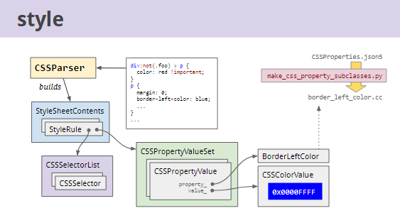

> The CSS parser builds a model of the style rules.
>
> Style rules are indexed in various ways for efficient lookup.
>
> (Property classes are auto-generated at build time by Python scripts.)

CSS解析器构建样式规则的模型。

样式规则以各种方式建立索引，以便高效查找。

(属性类是在构建时由Python脚本自动生成的。)

 这图给我的赶脚就是你写的样式，经过CSSPaser这个工人之手，**✎：**

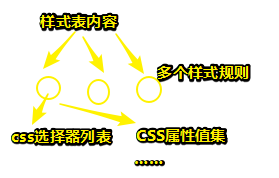

对了，一个「CSSPropertyValue」可以称之为特性，也就是CSS属性值集客看作是特性集……

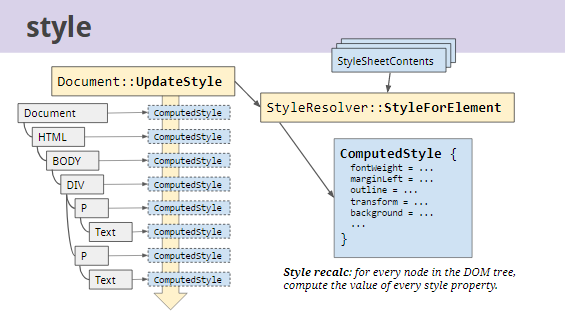

> Style resolving (or recalc) takes all the parsed style rules from the active style sheets in the document, including a set of default styles supplied by the browser, and computes the final value of every style property for every DOM element.  These are stored in an object called ComputedStyle which is just a giant map of style properties to values.

样式分解(或重新计算)从文档中的活动样式表中获取所有解析过的样式规则，包括一组由浏览器提供的默认样式，并为每个DOM元素计算每个样式属性的最终值。它们存储在一个名为ComputedStyle的对象中，这个对象只是样式属性到值的巨大映射。

ps：

> Style recalc: for every node in the DOM tree, compute the value of every style property.

对于DOM树中的每个节点，计算每个样式属性的值。

也就是DOM树中的每个节点的样式属性的值都是经过计算而得来的最终值咯！由于ComputedStyle是个对象，按照JavaScript的说法就是这是个引用类型，即地址不变，内容是可以变化的啊！

这个计算需要哪些家伙参与呢？样式表（我不知道内联样式、内部样式、外部样式这3个家伙是不是被统一称作为活动样式表，对了，还有浏览器提供的默认样式），总之我就认为这是所有样式集合！

不知道是不是这样——页面更新了，那么样式就要再次计算了，是重新计算呢？还是只是局部计算？

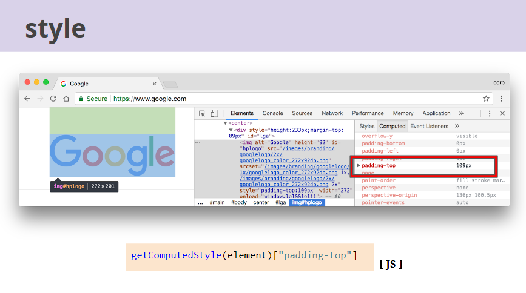

> Chrome developer tools will show you the "computed style" for any DOM element.  It's also exposed to Javascript.  These are based on Blink's ComputedStyle object (but a few properties are augmented with layout data).

Chrome开发工具将向您展示任何DOM元素的“计算样式”。当然，它也会暴露在Javascript中（即可以被JavaScript操作）。注意，这些都是基于Blink的ComputedStyle对象(但是一些属性是通过布局数据扩展的)。

所以，你在查看一个元素的最终样式的时候，你需要看它的「computed style」，这才是正确的！

## ★总结

## ★Q&A

### ①金丝雀？

> **Canary** - daily build，这个是最新且可以用于哪些不怕死的开发者和极客们玩新功能的版本。反正bug和漏洞是很多的，但是新玩意也是很多的。这个经过了一定的测试，但是bug应该还是蛮多的。

**➹：**[Chrome 、Chromium 和 Chrome Canary 这三个版本之间的关系和异同是什么？ - 知乎](https://www.zhihu.com/question/19795356)

### ②WebAssembly？

**➹：**[如何评论浏览器最新的 WebAssembly 字节码技术？ - 知乎](https://www.zhihu.com/question/31415286)

> **WebAssembly**或称**wasm**是一个**实验性**的低阶[程式语言](https://translate.googleusercontent.com/translate_c?depth=1&hl=zh-CN&prev=search&rurl=translate.google.com&sl=zh-TW&sp=nmt4&u=https://zh.wikipedia.org/wiki/%25E7%25A8%258B%25E5%25BC%258F%25E8%25AA%259E%25E8%25A8%2580&xid=17259,15700021,15700124,15700149,15700186,15700191,15700201,15700214&usg=ALkJrhgxwslHV6pmqZaajXsjYf9QAmHa7g) ，应用于[浏览器](https://translate.googleusercontent.com/translate_c?depth=1&hl=zh-CN&prev=search&rurl=translate.google.com&sl=zh-TW&sp=nmt4&u=https://zh.wikipedia.org/wiki/%25E7%2580%258F%25E8%25A6%25BD%25E5%2599%25A8&xid=17259,15700021,15700124,15700149,15700186,15700191,15700201,15700214&usg=ALkJrhjrDryXaSCDwFkYgX49ARM442G19w)内的[客户端](https://translate.googleusercontent.com/translate_c?depth=1&hl=zh-CN&prev=search&rurl=translate.google.com&sl=zh-TW&sp=nmt4&u=https://zh.wikipedia.org/wiki/%25E5%25AE%25A2%25E6%2588%25B6%25E7%25AB%25AF&xid=17259,15700021,15700124,15700149,15700186,15700191,15700201,15700214&usg=ALkJrhhk_8HV2AubcdyBYromseRHeog9JA) 。 WebAssembly是可携式的[抽象语法树](https://translate.googleusercontent.com/translate_c?depth=1&hl=zh-CN&prev=search&rurl=translate.google.com&sl=zh-TW&sp=nmt4&u=https://zh.wikipedia.org/wiki/%25E6%258A%25BD%25E8%25B1%25A1%25E8%25AA%259E%25E6%25B3%2595%25E6%25A8%25B9&xid=17259,15700021,15700124,15700149,15700186,15700191,15700201,15700214&usg=ALkJrhhDo4BxElwXGVx9RigGjZoX4r1WTQ) [[1\]](https://translate.googleusercontent.com/translate_c?depth=1&hl=zh-CN&prev=search&rurl=translate.google.com&sl=zh-TW&sp=nmt4&u=https://zh.wikipedia.org/zh/WebAssembly&xid=17259,15700021,15700124,15700149,15700186,15700191,15700201,15700214&usg=ALkJrhhVaoPDLMCV9ai8w6VwZGKGbD5D5Q#cite_note-1) ，被设计来提供比[JavaScript](https://translate.googleusercontent.com/translate_c?depth=1&hl=zh-CN&prev=search&rurl=translate.google.com&sl=zh-TW&sp=nmt4&u=https://zh.wikipedia.org/wiki/JavaScript&xid=17259,15700021,15700124,15700149,15700186,15700191,15700201,15700214&usg=ALkJrhhMwraKCw5MpGHKkkGEG5DzqNFLsA)更快速的[编译](https://translate.googleusercontent.com/translate_c?depth=1&hl=zh-CN&prev=search&rurl=translate.google.com&sl=zh-TW&sp=nmt4&u=https://zh.wikipedia.org/wiki/%25E7%25BC%2596%25E8%25AF%2591&xid=17259,15700021,15700124,15700149,15700186,15700191,15700201,15700214&usg=ALkJrhj8TxjXHD8i6VODkx4nI5RLeO4NQQ)及执行[[2\]](https://translate.googleusercontent.com/translate_c?depth=1&hl=zh-CN&prev=search&rurl=translate.google.com&sl=zh-TW&sp=nmt4&u=https://zh.wikipedia.org/zh/WebAssembly&xid=17259,15700021,15700124,15700149,15700186,15700191,15700201,15700214&usg=ALkJrhhVaoPDLMCV9ai8w6VwZGKGbD5D5Q#cite_note-github.com-2) 。 WebAssembly将让开发者能运用自己熟悉的程式语言（最初以[C](https://translate.googleusercontent.com/translate_c?depth=1&hl=zh-CN&prev=search&rurl=translate.google.com&sl=zh-TW&sp=nmt4&u=https://zh.wikipedia.org/wiki/C%25E8%25AA%259E%25E8%25A8%2580&xid=17259,15700021,15700124,15700149,15700186,15700191,15700201,15700214&usg=ALkJrhhd3i1T1PcNq_DnbSyA_BdvjJUSfg) / [C++](https://translate.googleusercontent.com/translate_c?depth=1&hl=zh-CN&prev=search&rurl=translate.google.com&sl=zh-TW&sp=nmt4&u=https://zh.wikipedia.org/wiki/C%252B%252B&xid=17259,15700021,15700124,15700149,15700186,15700191,15700201,15700214&usg=ALkJrhi7SFShK4GtqcLyG7xuk4MfLk0D7Q)作为实作目标）编译，再借虚拟机器引擎在浏览器内执行[[3\]](https://translate.googleusercontent.com/translate_c?depth=1&hl=zh-CN&prev=search&rurl=translate.google.com&sl=zh-TW&sp=nmt4&u=https://zh.wikipedia.org/zh/WebAssembly&xid=17259,15700021,15700124,15700149,15700186,15700191,15700201,15700214&usg=ALkJrhhVaoPDLMCV9ai8w6VwZGKGbD5D5Q#cite_note-3) 

**➹：**[WebAssembly - Wikiwand](https://www.wikiwand.com/zh/WebAssembly)

强烈推荐下面这个答案，**✎：**

**➹：**[如何评论浏览器最新的 WebAssembly 字节码技术？ - 罗志宇的回答 - 知乎](https://www.zhihu.com/question/31415286/answer/58022648)

其中提到这么一个技术，**✎：**

> 对于不支持 Web Assembly 的浏览器， 会有一段 Javascript 把 Web Assembly 重新翻译为 Javascript 运行， 这个技术叫 **polyfill**, HTML5 刚出来的时候很常用的一个技术。

**polyfill**：这个技术之前在芳芳视频中讲到过，不过忘记了，在哪儿节课讲的了！

### ③Chromium？

> **Chromium**是Google为发展自家的浏览器[Google Chrome](https://www.wikiwand.com/zh-cn/Google_Chrome)而开启的项目，以[BSD许可协议](https://www.wikiwand.com/zh-cn/BSD%E6%8E%88%E6%AC%8A%E6%A2%9D%E6%AC%BE)等数种许可发行并[开放源代码](https://www.wikiwand.com/zh-cn/%E9%96%8B%E6%94%BE%E5%8E%9F%E5%A7%8B%E7%A2%BC)。Chromium与Google Chrome共享大部分代码和功能，但功能和商标之间有一些细微差别。
>
> Chromium 的更新速度很快，每隔数小时即有新的开发版本发布，每次的更新幅度不一定相同，可能增加新功能，或者单纯修正问题，由于新功能会先在Chromium上测试，等待认证后才会应用在Google Chrome上，所以Chromium相当于Google Chrome的先行版。

**➹：**[Chromium - Wikiwand](https://www.wikiwand.com/zh-cn/Chromium)

看来我还是使用Google Chrome好了！

而且国内与很多浏览器是基于Chromium开发的，如QQ浏览器、UC浏览器、还有前段时间很「火」的红芯浏览器等等……

**➹：**[日常使用，Google Chrome 和 Chromium 二者间如何选择？ - 知乎](https://www.zhihu.com/question/19799660)

**➹：**[基于chromium的浏览器和chrome有什么差距？ - 知乎](https://www.zhihu.com/question/27046250#explore)

**➹：**[主流浏览器内核介绍（前端开发值得了解的浏览器内核历史） - 前端 - 掘金](https://juejin.im/entry/57ff3cea0e3dd90057e5f25e)

Google Chrome的内核可是Blink啊！不要跟chromium搞混了啊！

### ④沙盒？

> 在[计算机安全](https://www.wikiwand.com/zh-hans/%E8%AE%A1%E7%AE%97%E6%9C%BA%E5%AE%89%E5%85%A8)领域，**沙盒**（英语：sandbox，又译为**沙箱**）是一种安全机制，为执行中的程式提供的隔离环境。通常是作为一些来源不可信、具破坏力或无法判定程序意图的程序提供实验之用[[1\]](https://www.wikiwand.com/zh-hans/%E6%B2%99%E7%9B%92_(%E9%9B%BB%E8%85%A6%E5%AE%89%E5%85%A8)#citenote1)。
>
> 沙盒通常严格控制其中的程序所能访问的资源，比如，沙盒可以提供[用后即回收](https://www.wikiwand.com/zh-hans/%E5%A1%97%E9%8A%B7%E7%A9%BA%E9%96%93)的磁盘及内存空间。在沙盒中，网络访问、对真实系统的访问、对输入设备的读取通常被禁止或是严格限制。从这个角度来说，沙盒属于[虚拟化](https://www.wikiwand.com/zh-hans/%E8%99%9A%E6%8B%9F%E5%8C%96)的一种。
>
> 沙盒中的所有改动对[操作系统](https://www.wikiwand.com/zh-hans/%E6%93%8D%E4%BD%9C%E7%B3%BB%E7%BB%9F)不会造成任何损失。通常，这种技术被[计算机](https://www.wikiwand.com/zh-hans/%E8%AE%A1%E7%AE%97%E6%9C%BA)技术人员广泛用于测试可能[带毒](https://www.wikiwand.com/zh-hans/%E8%AE%A1%E7%AE%97%E6%9C%BA%E7%97%85%E6%AF%92)的程序或是其他的[恶意代码](https://www.wikiwand.com/zh-hans/%E6%81%B6%E6%84%8F%E8%BD%AF%E4%BB%B6)[[2\]](https://www.wikiwand.com/zh-hans/%E6%B2%99%E7%9B%92_(%E9%9B%BB%E8%85%A6%E5%AE%89%E5%85%A8)#citenote2)。

**➹：**[沙盒 (计算机安全)](https://www.wikiwand.com/zh-hans/%E6%B2%99%E7%9B%92_(%E9%9B%BB%E8%85%A6%E5%AE%89%E5%85%A8))

### ⑤管道？

**➹：**[pipeline是什么？ - 知乎](https://www.zhihu.com/question/267436664)

**➹：**[流水线 (计算机)](https://www.wikiwand.com/zh-hans/%E6%B5%81%E6%B0%B4%E7%BA%BF_(%E8%AE%A1%E7%AE%97%E6%9C%BA))

> **流水线**，亦称[管线](https://www.wikiwand.com/zh-hans/%E7%AE%A1%E7%B7%9A)，是现代计算机[处理器](https://www.wikiwand.com/zh-hans/%E5%A4%84%E7%90%86%E5%99%A8)中必不可少的部分，是指将计算机[指令](https://www.wikiwand.com/zh-hans/%E6%8C%87%E4%BB%A4)处理过程拆分为多个步骤，并通过多个硬件处理单元并行执行来加快指令执行速度。其具体执行过程类似工厂中的流水线，并因此得名。
>
> 如果作出类比，则计算机指令就是流水线传送带上的产品，各个硬件处理单元就是流水线旁的工人。

如果我把content看作是流水线上产品的原料，那么渲染引擎等就是工人，最终都是把原料加工成产品，而这个产品则是用户所浏览的一张真正的网页！

### ⑥OpenGL？

**➹：**[OpenGL - 维基百科，自由的百科全书](https://zh.wikipedia.org/zh/OpenGL)

> **OpenGL** （ 英语： *Open Graphics Library* ，译名： **开放图形库**或者“开放式图形库”）是用于[渲染](https://translate.googleusercontent.com/translate_c?depth=1&hl=zh-CN&prev=search&rurl=translate.google.com&sl=zh-TW&sp=nmt4&u=https://zh.wikipedia.org/wiki/%25E6%25B8%25B2%25E6%259F%2593&xid=17259,15700021,15700124,15700149,15700186,15700191,15700201,15700214&usg=ALkJrhiz4SEmREqamxuwswZKFQm-uhOgzw) [2D](https://translate.googleusercontent.com/translate_c?depth=1&hl=zh-CN&prev=search&rurl=translate.google.com&sl=zh-TW&sp=nmt4&u=https://zh.wikipedia.org/wiki/%25E4%25BA%258C%25E7%25BB%25B4%25E8%25AE%25A1%25E7%25AE%2597%25E6%259C%25BA%25E5%259B%25BE%25E5%25BD%25A2&xid=17259,15700021,15700124,15700149,15700186,15700191,15700201,15700214&usg=ALkJrhjf-RiM1B05ygKvqfedwW2gzL1XiA) 、 [3D](https://translate.googleusercontent.com/translate_c?depth=1&hl=zh-CN&prev=search&rurl=translate.google.com&sl=zh-TW&sp=nmt4&u=https://zh.wikipedia.org/wiki/%25E4%25B8%2589%25E7%25B6%25AD%25E8%25A8%2588%25E7%25AE%2597%25E6%25A9%259F%25E5%259C%2596%25E5%25BD%25A2&xid=17259,15700021,15700124,15700149,15700186,15700191,15700201,15700214&usg=ALkJrhj0ORbYAlTnNRCaA4Hu-PICoS4vvw) [矢量图形](https://translate.googleusercontent.com/translate_c?depth=1&hl=zh-CN&prev=search&rurl=translate.google.com&sl=zh-TW&sp=nmt4&u=https://zh.wikipedia.org/wiki/%25E7%259F%25A2%25E9%2587%258F%25E5%259C%2596%25E5%25BD%25A2&xid=17259,15700021,15700124,15700149,15700186,15700191,15700201,15700214&usg=ALkJrhh79H2dzISFizze_hKiYveA2HKZxQ)的跨[语言](https://translate.googleusercontent.com/translate_c?depth=1&hl=zh-CN&prev=search&rurl=translate.google.com&sl=zh-TW&sp=nmt4&u=https://zh.wikipedia.org/wiki/%25E7%25A8%258B%25E5%25BC%258F%25E8%25AA%259E%25E8%25A8%2580&xid=17259,15700021,15700124,15700149,15700186,15700191,15700201,15700214&usg=ALkJrhgxwslHV6pmqZaajXsjYf9QAmHa7g) 、 [跨平台](https://translate.googleusercontent.com/translate_c?depth=1&hl=zh-CN&prev=search&rurl=translate.google.com&sl=zh-TW&sp=nmt4&u=https://zh.wikipedia.org/wiki/%25E8%25B7%25A8%25E5%25B9%25B3%25E5%258F%25B0&xid=17259,15700021,15700124,15700149,15700186,15700191,15700201,15700214&usg=ALkJrhiy3RMXFjcYFz17KFOmaGfihTGHig)的[应用程序编程接口](https://translate.googleusercontent.com/translate_c?depth=1&hl=zh-CN&prev=search&rurl=translate.google.com&sl=zh-TW&sp=nmt4&u=https://zh.wikipedia.org/wiki/%25E5%25BA%2594%25E7%2594%25A8%25E7%25A8%258B%25E5%25BA%258F%25E7%25BC%2596%25E7%25A8%258B%25E6%258E%25A5%25E5%258F%25A3&xid=17259,15700021,15700124,15700149,15700186,15700191,15700201,15700214&usg=ALkJrhhe5gjTqC_QGryuDt5L70FeD9vbrQ) （API）。 这个接口由近350个不同的函数调用组成，用来从简单的图形位元绘制复杂的三维景象。 而另一种程式介面系统是仅用于[Microsoft Windows](https://translate.googleusercontent.com/translate_c?depth=1&hl=zh-CN&prev=search&rurl=translate.google.com&sl=zh-TW&sp=nmt4&u=https://zh.wikipedia.org/wiki/Microsoft_Windows&xid=17259,15700021,15700124,15700149,15700186,15700191,15700201,15700214&usg=ALkJrhgEpZBq9CBJ7vrQyn0gQbs9ahNYEA)上的[Direct3D](https://translate.googleusercontent.com/translate_c?depth=1&hl=zh-CN&prev=search&rurl=translate.google.com&sl=zh-TW&sp=nmt4&u=https://zh.wikipedia.org/wiki/Direct3D&xid=17259,15700021,15700124,15700149,15700186,15700191,15700201,15700214&usg=ALkJrhg3kon0gxZD16m9VWqmV32IknRhCw) 。 OpenGL常用于[CAD](https://translate.googleusercontent.com/translate_c?depth=1&hl=zh-CN&prev=search&rurl=translate.google.com&sl=zh-TW&sp=nmt4&u=https://zh.wikipedia.org/wiki/CAD&xid=17259,15700021,15700124,15700149,15700186,15700191,15700201,15700214&usg=ALkJrhhUHG9w2oWBUOgz1GucVBqodLQxWQ) 、 [虚拟实境](https://translate.googleusercontent.com/translate_c?depth=1&hl=zh-CN&prev=search&rurl=translate.google.com&sl=zh-TW&sp=nmt4&u=https://zh.wikipedia.org/wiki/%25E8%2599%259B%25E6%2593%25AC%25E5%25AF%25A6%25E5%25A2%2583&xid=17259,15700021,15700124,15700149,15700186,15700191,15700201,15700214&usg=ALkJrhiAbs4smTqb49y0HMmGStbSMGp8hg) 、科学视觉化程式和[电子游戏开发](https://translate.googleusercontent.com/translate_c?depth=1&hl=zh-CN&prev=search&rurl=translate.google.com&sl=zh-TW&sp=nmt4&u=https://zh.wikipedia.org/wiki/%25E7%2594%25B5%25E5%25AD%2590%25E6%25B8%25B8%25E6%2588%258F%25E5%25BC%2580%25E5%258F%2591&xid=17259,15700021,15700124,15700149,15700186,15700191,15700201,15700214&usg=ALkJrhj2xJu6Lb83_O_zcfukRkL2hl5hOA) 。

### ⑦API？

**➹：**[用大白话给你科普，到底什么是 API（应用程序编程接口）？_36氪](https://36kr.com/p/5128407.html)

我既有的认识就是一些能提供你用的东西！

### ⑧Web？

**➹：**[Web 是什么意思？ - 知乎](https://www.zhihu.com/question/19860216)

> Web 所指的非常简单，即用网页浏览器浏览网页。而且，在1994年便有了耳熟能详的“万维网”这个通俗易懂的名字。

**➹：**[Web 是什么意思？ - 冯东的回答 - 知乎](https://www.zhihu.com/question/19860216/answer/13184646)

**✎：**

> Web 在不同语境下有不同意义。 
> 目前来看最常用的意义是指在 Intenet 上和 HTML 相关的部分。换句话说，目前在 Intenet 上通过非浏览器访问的网络资源并不称为 Web。这也是 Wired 的那篇《Web 已死，互联网永生》的意思。