# Flex布局

## ★资料

**➹：**[30 分钟学会 Flex 布局 - 知乎](https://zhuanlan.zhihu.com/p/25303493)

## ★草稿

### ◇一些基本概念

#### main轴和cross轴

flex容器默认存在2条轴——水平main轴和垂直cross轴，在这里需要注意的是「main轴也有垂直的那一天，同理，cross轴也有水平的那一天！」。总之没有绝对说水平的一定是main轴，毕竟或许它是cross轴也说不定呢！

#### flex item

在容器中的每个单元块被称之为 flex item，每个item占据的主轴空间为 (main size)， 占据的交叉轴的空间为 (cross size)。

如果flex容器默认是水平main轴和垂直cross轴，那么每个item的宽就是main size了，同理它们的高就是cross size了。总之这取决于你主轴的方向！

### ◇贯穿全文的图


> 左上都是轴的起点吗？
>
> 还是不分方向的？即这头是起点，那对头就是终点了？

### ◇Flex 容器

我要flex布局了，你们这些元素通通给我听好了！我可以随意指定你们为flex布局的！如果你们天生是块状的，那么我就把你们的display属性值弄为flex，如果是行内的，那就inline-flex……

对了，被我指定了flex布局家伙们，你们此刻有了一个新的名称，叫flex容器！

还有就是你们之前的儿子们存在的 **float、clear、vertical-align 这些属性**，将会GG，即失效了！

> 话说，孙子有受到影响吗？不是说好了，祸不及三代吗？

身为flex容器的你们，将会具有以往没有的6种属性……

那么这6种属性是什么呢？它们分别是，**✎：**

1. flex-direction
2. flex-wrap
3. flex-flow
4. justify-content
5. align-items
6. align-content

#### 解析6种属性

##### flex-direction

决定主轴的方向(即item的排列方向)

既然如此，那它能取哪些值呢？

```css
.container {
    flex-direction: row | row-reverse | column | column-reverse;
}
```

额……能告诉我，哪个是默认值吗？

row就是默认值，表示主轴为水平方向，起点在**左端**。

> 我的天，轴的起点不是随意而定的啊！如果值是row-reverse，这是不是说明起点在右端呢？

没错，确实如此哈！

看看使用后的效果，**✎：**

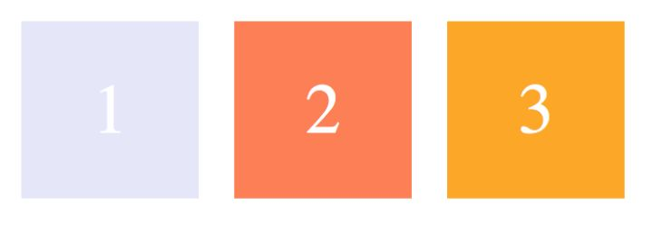

那么如何才能变成321呢？

这个很简单，你把值改为 row-reverse即可！

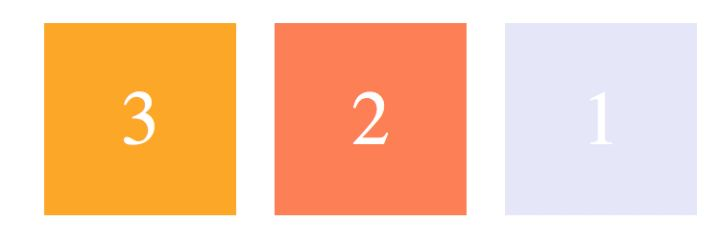

总之，row-reverse这个值会告诉你此刻的这个容器中主轴为水平方向，而起点在右端……

> 我们写的HTML代码，写的是一个元素跟着一个元素的，而此刻因为它们的爸爸是flex容器，再加上flex-direction属性的值为row-reverse，导致元素排列颠倒了，而且呈现水平，即把item的display为block的元素弄为水平的了了！话说，你们这样做对得起float属性吗？
>
> 对了，我有个问题就是这些item有脱离文档流吗？还有这个爸爸flex容器有脱离文档流吗？
>
> 我猜应该咩有吧？总不能也要清除所谓的「浮动」吧！

同理，那么剩下的那两个常用的值也就很好理解了，**✎：**

- column：主轴为垂直方向，起点在上沿

  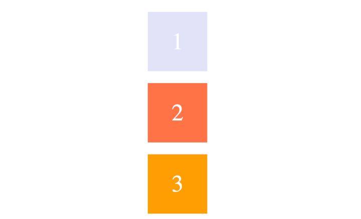

  这个结果就跟它们的爸爸不是flex容器时一个模样，不过用了flex之后，你会发现，我们能够把这些item看作是一个整体，如一串冰糖葫芦一样……

- column-reverse：主轴为垂直方向，起点在下沿

  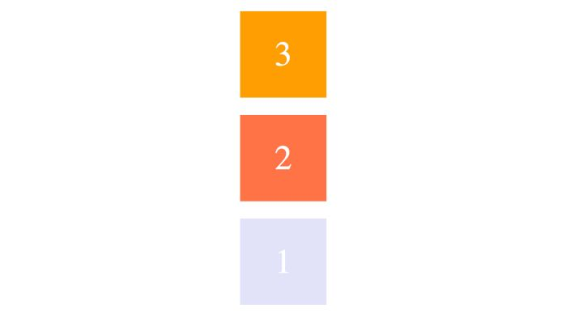

##### flex-wrap

这个属性将会决定容器内的item是否可换行

默认情况下，item都排在主轴线上，而使用 flex-wrap则可实现item的换行。

```css
.container {
    flex-wrap: nowrap | wrap | wrap-reverse;
}
```

在这里，nowrap作为该属性的默认值，即不换行。总之，当主轴尺寸固定时，当空间不足时，项目尺寸会随之调整而并不会挤到下一行。

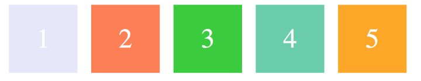

  既然nowrap是不换行，那么wrap显然是当项目主轴总尺寸超出容器时，就得换行了，下图的第一行在上方哈！

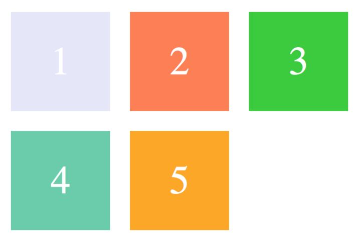

那么wrap-reverse呢？

它也是换行 的，只是把这些行给翻转了，即第一行由原来的上方变为下方了，**✎：**

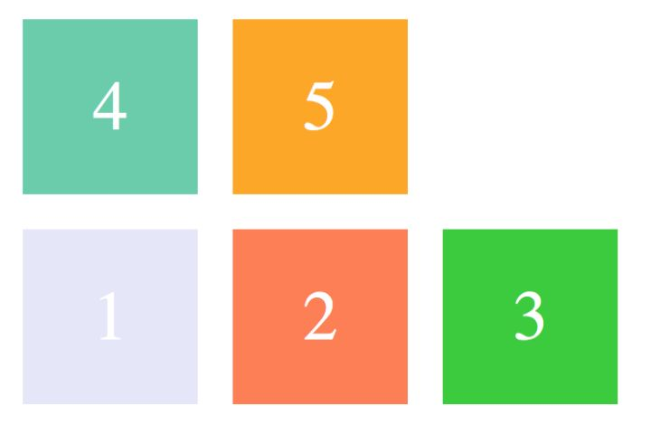

##### flex-flow

听说，你总喜欢打包，那么这个属性就很适合你了，因为它是**flex-direction 和 flex-wrap 的简写形式**

如何个简写法呢？

```css
.container {
    flex-flow: <flex-direction> || <flex-wrap>;
}
```

> 话说，这个 `<>`和 `||`表示什么呀？

那么它的默认值呢？——row nowrap

不过这个不需要记了，因为我们一般都是喜欢拆开来写的！

##### justify-content

这个属性**定义了项目在主轴的对齐方式**

那么有哪些对齐方式呢？

```css
.container {
    justify-content: flex-start | flex-end | center | space-between | space-around;
}
```

以下测试是建立在**主轴为水平方向**时进行的，即**flex-direction: row**

先来说说它的默认值吧！，**✎：**

flex-start 左对齐


那么剩下的那4个常用的值，使用后又会有怎样的效果呢？

flex-end：右对齐


center：居中


space-between：两端对齐，项目**之间**的**间隔相等**，即剩余空间等分成间隙。


space-around：每个项目**两侧**的**间隔相等**，所以项目之间的间隔比项目与边缘的间隔大一倍。

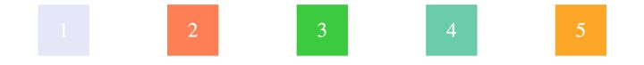

##### align-items

该属性**定义了项目在交叉轴上的对齐方式**

那么它有哪些值呢？

```css
.container {
    align-items: flex-start | flex-end | center | baseline | stretch;
}
```

同justify-content一样，也是**建立在主轴为水平方向时测试，即 flex-direction: row**

同样，它也有默认值，那么它的默认值是什么呢？——stretch

表示如果项目未设置高度或者设为 auto，将占满整个容器的高度。效果如下，**✎：**

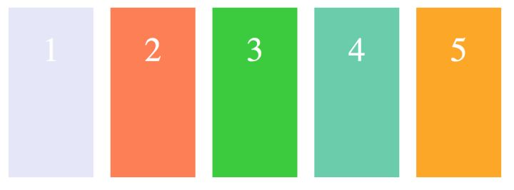

总之，具体来讲就是假设容器高度设置为 100px，而项目都没有设置高度的情况下，则项目的高度也为 100px。

---

flex-start：交叉轴的起点对齐

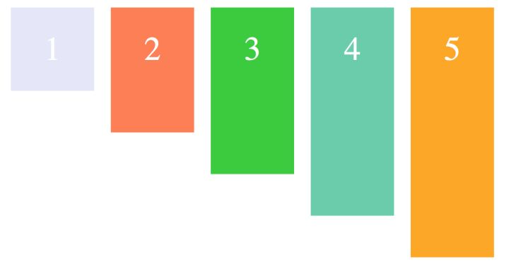

假设容器高度设置为 100px，而项目分别为 20px, 40px, 60px, 80px, 100px, 则如上图显示。

> 讲真，这个对齐是这什么啊？
>
> 我试着用wps创建一个word文档测试了一下，按照我的理解就是，把每一行文字都看作是一个整体，然后从整个段落的视角来看对齐方式，而对齐方式有哪几种呢？
>
> 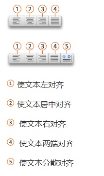
>
> 图中的那些横杠就是一行文本了，而多行没有回车的文本就形成了一个段落，也就是你得从一个段落视角去看对齐！关于分散对齐，指的是为了让段落两端同时对齐，需要增加字符间距哈！而两端对齐则是将文字左右两端同时进行对齐，并根据需要增加字间距！
>
> **➹：**[对齐或两端对齐文本 - Word for Mac](https://support.office.com/zh-cn/article/%E5%AF%B9%E9%BD%90%E6%88%96%E4%B8%A4%E7%AB%AF%E5%AF%B9%E9%BD%90%E6%96%87%E6%9C%AC-b9096ed4-7323-4ff3-921a-1ba7ba31faf1)

通过对「对齐方式」的认识，我觉得可以把所谓的「交叉轴的起点对齐」，看作是你站在水平主轴的左起点，方向是你的正面朝向的右终点，然后按左对齐即可！直观一点就是，**✎：**

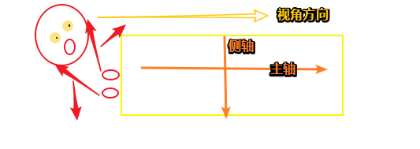

为此，我更进一步把一个个item看作是一行行文字，把整个flex容器看作是一个段落！

---

好了，那我们接下来看看flex-end又是个什么情况，其实根据flex-start并不难猜出，显然是右对齐哈。而正规的一点说法就是 **交叉轴的终点对齐**

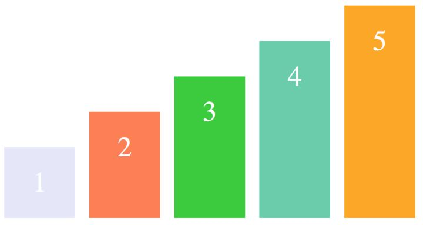

---

center：交叉轴的中点对齐

显然可以理解为文本居中对齐，即item居中对齐！

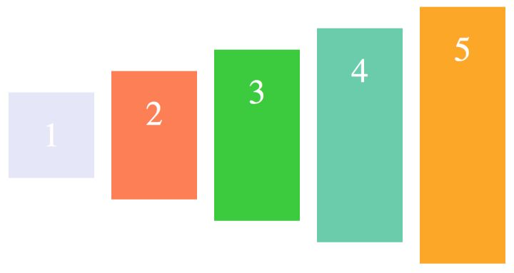

---

baseline: 项目的第一行文字的基线对齐

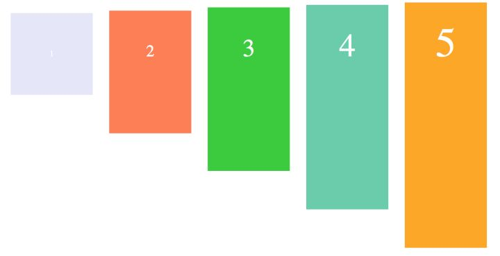

以文字的底部为主，仔细看图可以理解。

> 讲真，实在理解不了，按照之前的理解就是「文字的baseline对齐，通过行高不一样才能发现区别，不过一般来说行高都是一样的」
>
> **➹：**[基线 - Wikiwand](https://www.wikiwand.com/zh-hans/%E5%9F%BA%E7%B7%9A)
>
> 不过当我看到这个幅图后，就开始有点理解了，**✎：**
>
> 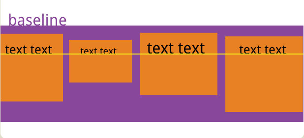
>
> 也就是说，每个item的第一行文字的基线，必须和其它item的基线连成一条直线咯！而不是所谓的折线！反正这种情况可以把item当作是可以在海中上下方向上升和下沉的潜艇！即把此时的容器当作是大海，然后海底中有4艘大小不一的潜艇……
>
> 突然发觉上面的，**✎：**
>
> - stretch：如果item未设置高度或者设为 auto，将占满整个容器的高度
>
> - flex-start：交叉轴的起点对齐
> - center：交叉轴的中点对齐
> - flex-end：交叉轴的终点对齐
>
> 都可以看作是潜艇哈！
>
> - stretch：哪艘潜艇最高，那么潜艇都会被拉伸成一样高
> - flex-start：4艘大小不一的潜艇浮出水面
> - center：4艘大小不一的潜艇在海水的中央位置搞事情
> - flex-end：4艘大小不一的潜艇在海底摸鱼……

---

总之**baseline用得最少，最多的是center和flex-start**

##### align-content


#### 小结

1. flex-direction决定了主轴方向，以及轴的起点。相应地也就决定了侧轴方向，不过侧轴的起点是怎样的呢？

   比如主轴为水平，而起点是从左到右，那么侧轴是从上到下吗？

2. 我还是喜欢叫cross轴，或者是侧轴！而不是交叉轴！