# 学习CSS布局

## ★必备基础

**➹：**[Learn to Code HTML & CSS](https://learn.shayhowe.com/html-css/)

**➹：**[Learn to Code Advanced HTML & CSS](https://learn.shayhowe.com/advanced-html-css/)

## ★资料

**➹：**[学习CSS布局](http://zh.learnlayout.com/)

## ★没有布局

如果你想要的只是一大段内容，那么没有任何布局就好了。 但是，如果用户使浏览器窗口非常宽，那么阅读时会有些烦人：

> 在每一行之后，您的眼睛需要很长的距离才能从右到左行进到下一行。 尝试调整浏览器大小以查看我的意思！

在解决这个问题之前，我们需要了解一个很重要的属性： `display`

## ★display属性

### ◇概述

display是CSS控制布局最重要的属性。 每个元素都有一个默认的display值，具体取决于它的元素类型。 大多数元素的display默认值通常是block或者是inline。 一个 block 元素通常被叫做块级元素。一个 inline 元素通常被叫做行内元素。。

### ◇block

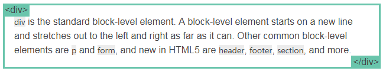

`div` 是一个标准的块级元素。一个块级元素会新开始一行并尽可能撑满容器或者说是向左和向右延伸。其他常用的块级元素包括 `p` 、 `form` 和HTML5中的新元素： `header` 、 `footer` 、 `section` 等等。

> 其实就TM的回车换行对吧！
>
> 感觉撑满容器这个说法很不好，毕竟该说法还可以拆分成向左或向右……

### ◇inline

`span` 是一个标准的行内元素。一个行内元素可以在段落中 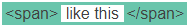包裹一些文字而不会打乱段落的布局。 `a` 元素是最常用的行内元素，因为它可以被用作链接啊！

### ◇none

另一个常见的display值是none。 某些特殊元素（如脚本）将此作为默认值。 它通常与JavaScript一起使用来隐藏（hide）和显示（show）元素，而不会真正删除和重新创建它们。

 这与`visibility`不同。 将`display`设置为`none`，然后其将render的页面中，该元素就好像不存在一样。 而`visibility: hidden;`则将会隐藏元素，但元素仍将占用它完全可见时的空间

### ◇其它display值

还有很多更奇特的 display 值，例如 `list-item` 和 `table` 。[这里有一份详细的列表](https://developer.mozilla.org/en-US/docs/CSS/display)。之后我们会讨论到 `inline-block` 和 `flex` 。

**➹：**[display - CSS：层叠样式表 - MDN](https://developer.mozilla.org/zh-CN/docs/Web/CSS/display)

### ◇友情提示

正如我所提到的，每个元素都有一个默认的display类型。

> 如：
>
> - `display-outside`类型定义了元素怎样参与[流式布局](https://developer.mozilla.org/zh-CN/docs/Web/CSS/CSS_Flow_Layout)的处理，如block、inline……
> - `display-inside`定义了元素内子元素的布局方式，如flex、grid……

 但是，您始终可以覆盖默认值！ 虽然搞一个inline div是没有意义的，但您可以使用它来自定义**具有特定语义的**元素的display。 一个常见的例子是为水平菜单制作 inline `li`元素。（本来li元素默认是block的！）

## ★margin:auto;

```css
#main {
  width: 600px;
  margin: 0 auto; 
}
```

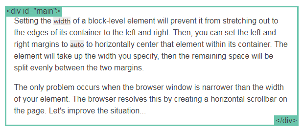

设置块级元素的`width`将阻止它向左和向右延伸到其容器（它爸爸）的边缘。 然后，您可以将左右边距设置为`auto`以将该元素水平居中于其容器中。 元素将占用你所指定的宽度，然后剩余的空间将在两个边距之间均匀分割，也就是说把剩余空间一分为二，然后该元素的左边一份，同理该元素的右边也一份……

唯一的问题是，当浏览器窗口比元素的宽度还要窄时，浏览器会显示一个水平滚动条来容纳页面。

就像这样：

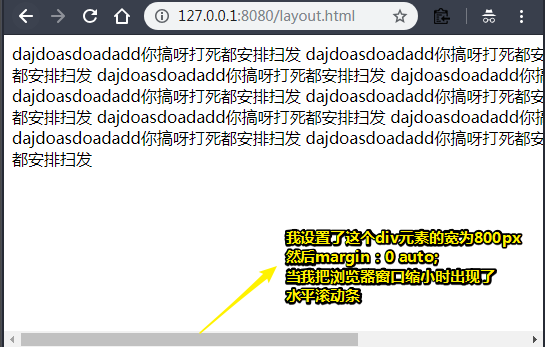

> 即便浏览器窗口大于800px，即咩有水平滚动条，文字始终还是那么多行……毕竟文字关注是它的容器div呀！
>
> 总之垂直方向上与原先一致，只是水平方向上多了个滚动条而已！

让我们再来改进下这个方案...

## ★max-width

```css
#main {
  max-width: 600px;
  margin: 0 auto; 
}
```

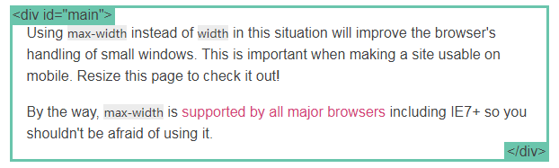

在这种情况下使用 `max-width` 替代 `width` 可以使浏览器更好地处理小窗口的情况。这点在移动设备上显得尤为重要，调整下浏览器窗口大小检查下吧！

顺便提下， [所有的主流浏览器](http://caniuse.com/#search=max-width)包括IE7+在内都支持 `max-width` ，所以放心大胆的用吧。

测试效果：

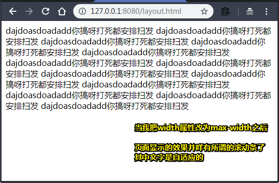

> 最大宽度就是800px，如果小于800px，那就自适应吧！反正我就是不想要滚动条了！
>
> 即便窗口缩小了，始终还是水平居中的！

## ★盒模型

当我们谈论宽度时，我们应该讲下与它相关的另外一个重点知识：*盒模型*。当您设定了元素的宽度时，元素实际上会比您设定的更大：这是因为元素的边框和填充（或者说是内边距）会将元素拉伸超过指定的宽度。看看下面的例子，其中两个宽度值相同的元素在页面显示中会有不同的大小。

```css
.simple {
  width: 500px;
  margin: 20px auto;
}

.fancy {
  width: 500px;
  margin: 20px auto;
  padding: 50px;
  border-width: 10px;
}
```

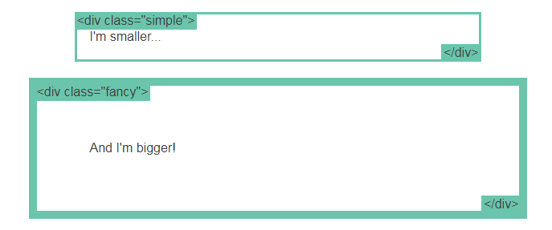

> simple：我小一些……
>
> fancy：我比它大！

以前有一个代代相传的解决方案是通过数学计算，即CSS开发者总是需要写一个比他们想要的更小的一个宽度值，换句话说就是减去填充（或者说是内边距）和边框的宽度。不过，谢天谢地，你再也不用这么做了...

> 想要下边的div跟上边的div的宽度所显示的效果保持一致大小的话，那么就需要这样做：
>
> 1. 我想要500px宽的盒子，但是我需要它有填充物全方位50px，然后包装纸全方位10px，所以：
>
>    `500px-50*2-10*2=380px`
>
>    所以你需要把该div的宽度设置为380px
>
> 额……天天都要计算，真TM操蛋，难道就不能逆着来吗？即写个500px，然后padding、border之类的就占据原先内容的宽度的就好了，即挤挤更健康，而不是默认的吹气球……

## ★box-sizing

原始的盒子模型行为最终被认为是不直观的，因此创造了一个名为box-sizing的新CSS属性。 当你设置`box-sizing:border-box;` 在元素上时，该元素的填充和边框不再增加它的宽度。 

这是与上一个点相同的示例，唯一的区别是使用`box-sizing:border-box;` 在两个元素上：

```css
.simple {
  width: 500px;
  margin: 20px auto;
  -webkit-box-sizing: border-box;
     -moz-box-sizing: border-box;
          box-sizing: border-box;
}

.fancy {
  width: 500px;
  margin: 20px auto;
  padding: 50px;
  border: solid blue 10px;
  -webkit-box-sizing: border-box;
     -moz-box-sizing: border-box;
          box-sizing: border-box;
}
```

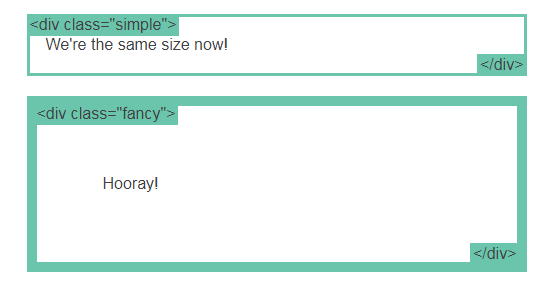

> simple：我们现在一样大小了！
>
> fancy：万岁！

由于这要比之前默认的姿势要好得多，而且目前也没有更好的方案，所以一些CSS开发者希望他们所有页面上的所有元素都始终以这种方式搞事情。 

所以这些CSS开发者在他们的页面上都放置了以下CSS：

```css
* {
  -webkit-box-sizing: border-box;
     -moz-box-sizing: border-box;
          box-sizing: border-box;
}
```

 这样一来，就可确保所有元素始终会以这种更直观的方式来进行调整或者说是排版！

由于`box-sizing`是一个相当新的属性，所以你现在应该使用`-webkit-`和`-moz-`前缀，就像我在这些例子中所做的那样。 毕竟此技术（或者说是这样的做法）可在特定浏览器中启用实验功能。 另外，请记住，这个是[IE8 +](http://caniuse.com/#search=box-sizing)的。

## ★position

 为了制作更复杂的布局，我们需要讨论`position` 属性。它有一大堆合理的值，不过它们的名字毫无意义或者说是这名字真TM的抽象，所以很显然的是你也无法记住它们的名字。

 让我们先一个个的过一遍，不过你最好还是把这页放到书签里。

### ◇static

```css
.static {
  position: static;
}
```

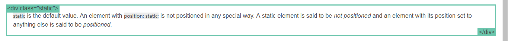

static是默认值。 一个位置为static的元素; 不是以任何特殊方式定位的。 据说静态元素没有定位，并且其位置设置为其他任何东西的元素被称为定位。

> `static` 是默认值。任意 `position: static;` 的元素不会被特殊的定位。一个 static 元素表示它*不会被“positioned”*，而一个 position 属性被设置为其他值的元素表示它*会被“positioned”*。

### ◇relative

```css
.relative1 {
  position: relative;
}
.relative2 {
  position: relative;
  top: -20px;
  left: 20px;
  background-color: white;
  width: 500px;
}
```

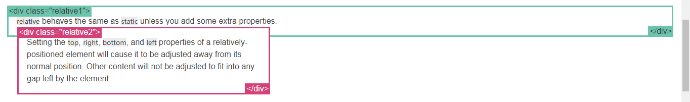

1.  除非添加一些额外的属性，否则relative的行为（表现）与static相同。

2. 设置相对定位元素的顶部，右侧，底部和左侧属性将使其远离其正常位置进行调整。 其他内容不会被调整以适应元素留下的任何空白

   > 在一个相对定位（position属性的值为relative）的元素上设置 `top`、 `right` 、 `bottom` 和 `left` 属性会使其偏离其正常位置。其他的元素的位置则不会受该元素的影响发生位置改变来弥补它偏离后剩下的空隙。

> 也就是说粉红色的div不要脸咯，抢了人家的地盘，还不让人家抢它原先自己的地盘咯！  

### ◇fixed

 固定元素相对于视口（viewport）定位，这意味着即使滚动页面，它也始终保持在同一位置。 与`relative` 一样，使用top，right，bottom和left属性。

> 一个固定定位（position属性的值为fixed）元素会相对于视窗来定位，这意味着即便页面滚动，它还是会停留在相同的位置。和 `relative` 一样， `top` 、 `right` 、 `bottom` 和 `left` 属性都可用。

我确定你已经注意到页面右下角的固定定位元素。 我现在允许你注意它。

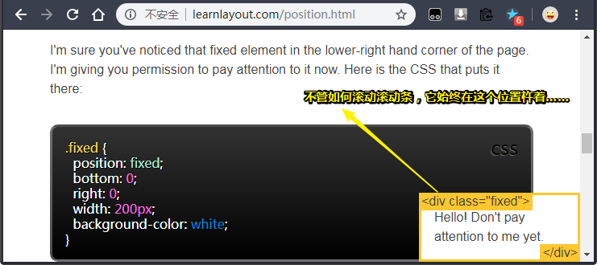

> Hello！暂时不要太关注我哦。

 这是将它放在那里的CSS：

```css
.fixed {
  position: fixed;
  bottom: 0;
  right: 0;
  width: 200px;
  background-color: white;
}
```

 一个固定定位的元素不会在页面上留下通常会出现的空白。

> 一个固定定位元素不会保留它原本在页面应有的空隙（脱离文档流）

令人惊讶地是移动浏览器对 fixed 的支持很差， [这里有相应的解决方案](http://bradfrostweb.com/blog/mobile/fixed-position/).

### ◇absolute

`absolute` 是最棘手的position值。 `absolute`的行为或者说是表现与`fixed`类似 ，但是它不是相对于viewport，而是相对于*最近的“positioned”祖先元素*。

如果绝对定位（position属性的值为absolute）的元素没有“positioned”祖先元素，那么它是相对于文档的 body 元素，并且它仍然会随着页面滚动而移动。 请记住，一个“positioned”元素是指 position 值不是 `static` 的元素。

下面是一个简单的例子：

```css
.relative {
  position: relative;
  width: 600px;
  height: 400px;
}
.absolute {
  position: absolute;
  top: 120px;
  right: 0;
  width: 300px;
  height: 200px;
}
```

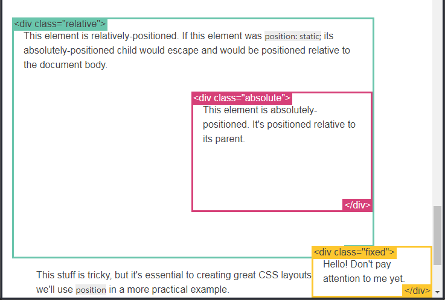

1. 该元素相对定位。 如果这个元素是`position:static; `，那么它绝对定位的孩子会逃脱，并将相对于文档body定位

   > 这个元素是相对定位的。如果它是 `position: static;` ，那么它的绝对定位子元素会跳过它直接相对于body元素定位。

2. 这个元素是绝对定位的。 它相对于它的父元素定位

虽然这个东西让人觉得很棘手，但它对于创建出色的CSS布局至关重要。 在下一小节中，我们将在更实际的示例中使用`position`。

> 这部分比较难理解，但它是创造优秀布局所必需的知识。下一页我们会使用 `position`做更具体的例子。

