# 学习CSS布局

## ★必备基础

**➹：**[Learn to Code HTML & CSS](https://learn.shayhowe.com/html-css/)

**➹：**[Learn to Code Advanced HTML & CSS](https://learn.shayhowe.com/advanced-html-css/)

## ★资料

**➹：**[Learn CSS Layout](http://learnlayout.com/)

**➹：**[学习CSS布局](http://zh.learnlayout.com/)

## ★简介

该站点教授的是在任何网站的布局中所使用的CSS基础知识。

我们假设你已经掌握了CSS的选择器、属性和值。并且你可能已经对布局有一定了解，即使亲自去写的话还是会很苦恼。如果你想要从头开始学习HTML和CSS，那么你可以看下[这篇教程](http://learn.shayhowe.com/html-css/)。不然的话，让我们看看我们是否可以让你在下一个项目少一些烦恼（Fury，愤怒、狂暴……）。

## ★没有布局

如果你想要的只是一大段内容，那么没有任何布局就好了。 但是，如果用户使浏览器窗口非常宽，那么阅读时会有些烦人：

> 在每一行之后，您的眼睛需要很长的距离才能从右到左行进到下一行。 尝试调整浏览器大小以查看我的意思！

在解决这个问题之前，我们需要了解一个很重要的属性： `display`

## ★display属性

### ◇概述

display是CSS控制布局最重要的属性。 每个元素都有一个默认的display值，具体取决于它的元素类型。 大多数元素的display默认值通常是block或者是inline。 一个 block 元素通常被叫做块级元素。一个 inline 元素通常被叫做行内元素。。

### ◇block


`div` 是一个标准的块级元素。一个块级元素会新开始一行并尽可能撑满容器或者说是向左和向右延伸。其他常用的块级元素包括 `p` 、 `form` 和HTML5中的新元素： `header` 、 `footer` 、 `section` 等等。

> 其实就TM的回车换行对吧！
>
> 感觉撑满容器这个说法很不好，毕竟该说法还可以拆分成向左或向右……

### ◇inline

`span` 是一个标准的行内元素。一个行内元素可以在段落中 包裹一些文字而不会打乱段落的布局。 `a` 元素是最常用的行内元素，因为它可以被用作链接啊！

### ◇none

另一个常见的display值是none。 某些特殊元素（如脚本）将此作为默认值。 它通常与JavaScript一起使用来隐藏（hide）和显示（show）元素，而不会真正删除和重新创建它们。

 这与`visibility`不同。 将`display`设置为`none`，然后其将render的页面中，该元素就好像不存在一样。 而`visibility: hidden;`则将会隐藏元素，但元素仍将占用它完全可见时的空间

### ◇其它display值

还有很多更奇特的 display 值，例如 `list-item` 和 `table` 。[这里有一份详细的列表](https://developer.mozilla.org/en-US/docs/CSS/display)。之后我们会讨论到 `inline-block` 和 `flex` 。

**➹：**[display - CSS：层叠样式表 - MDN](https://developer.mozilla.org/zh-CN/docs/Web/CSS/display)

### ◇友情提示

正如我所提到的，每个元素都有一个默认的display类型。

> 如：
>
> - `display-outside`类型定义了元素怎样参与[流式布局](https://developer.mozilla.org/zh-CN/docs/Web/CSS/CSS_Flow_Layout)的处理，如block、inline……
> - `display-inside`定义了元素内子元素的布局方式，如flex、grid……

 但是，您始终可以覆盖默认值！ 虽然搞一个inline div是没有意义的，但您可以使用它来自定义**具有特定语义的**元素的display。 一个常见的例子是为水平菜单制作 inline `li`元素。（本来li元素默认是block的！）

## ★margin:auto;

```css
#main {
  width: 600px;
  margin: 0 auto; 
}
```


设置块级元素的`width`将阻止它向左和向右延伸到其容器（它爸爸）的边缘。 然后，您可以将左右边距设置为`auto`以将该元素水平居中于其容器中。 元素将占用你所指定的宽度，然后剩余的空间将在两个边距之间均匀分割，也就是说把剩余空间一分为二，然后该元素的左边一份，同理该元素的右边也一份……

唯一的问题是，当浏览器窗口比元素的宽度还要窄时，浏览器会显示一个水平滚动条来容纳页面。

就像这样：


> 即便浏览器窗口大于800px，即咩有水平滚动条，文字始终还是那么多行……毕竟文字关注是它的容器div呀！
>
> 总之垂直方向上与原先一致，只是水平方向上多了个滚动条而已！

让我们再来改进下这个方案...

## ★max-width

```css
#main {
  max-width: 600px;
  margin: 0 auto; 
}
```


在这种情况下使用 `max-width` 替代 `width` 可以使浏览器更好地处理小窗口的情况。这点在移动设备上显得尤为重要，调整下浏览器窗口大小检查下吧！

顺便提下， [所有的主流浏览器](http://caniuse.com/#search=max-width)包括IE7+在内都支持 `max-width` ，所以放心大胆的用吧。

测试效果：


> 最大宽度就是800px，如果小于800px，那就自适应吧！反正我就是不想要滚动条了！
>
> 即便窗口缩小了，始终还是水平居中的！

## ★盒模型

当我们谈论宽度时，我们应该讲下与它相关的另外一个重点知识：*盒模型*。当您设定了元素的宽度时，元素实际上会比您设定的更大：这是因为元素的边框和填充（或者说是内边距）会将元素拉伸超过指定的宽度。看看下面的例子，其中两个宽度值相同的元素在页面显示中会有不同的大小。

```css
.simple {
  width: 500px;
  margin: 20px auto;
}

.fancy {
  width: 500px;
  margin: 20px auto;
  padding: 50px;
  border-width: 10px;
}
```


> simple：我小一些……
>
> fancy：我比它大！

以前有一个代代相传的解决方案是通过数学计算，即CSS开发者总是需要写一个比他们想要的更小的一个宽度值，换句话说就是减去填充（或者说是内边距）和边框的宽度。不过，谢天谢地，你再也不用这么做了...

> 想要下边的div跟上边的div的宽度所显示的效果保持一致大小的话，那么就需要这样做：
>
> 1. 我想要500px宽的盒子，但是我需要它有填充物全方位50px，然后包装纸全方位10px，所以：
>
>    `500px-50*2-10*2=380px`
>
>    所以你需要把该div的宽度设置为380px
>
> 额……天天都要计算，真TM操蛋，难道就不能逆着来吗？即写个500px，然后padding、border之类的就占据原先内容的宽度的就好了，即挤挤更健康，而不是默认的吹气球……

## ★box-sizing

原始的盒子模型行为最终被认为是不直观的，因此创造了一个名为box-sizing的新CSS属性。 当你设置`box-sizing:border-box;` 在元素上时，该元素的填充和边框不再增加它的宽度。 

这是与上一个点相同的示例，唯一的区别是使用`box-sizing:border-box;` 在两个元素上：

```css
.simple {
  width: 500px;
  margin: 20px auto;
  -webkit-box-sizing: border-box;
     -moz-box-sizing: border-box;
          box-sizing: border-box;
}

.fancy {
  width: 500px;
  margin: 20px auto;
  padding: 50px;
  border: solid blue 10px;
  -webkit-box-sizing: border-box;
     -moz-box-sizing: border-box;
          box-sizing: border-box;
}
```


> simple：我们现在一样大小了！
>
> fancy：万岁！

由于这要比之前默认的姿势要好得多，而且目前也没有更好的方案，所以一些CSS开发者希望他们所有页面上的所有元素都始终以这种方式搞事情。 

所以这些CSS开发者在他们的页面上都放置了以下CSS：

```css
* {
  -webkit-box-sizing: border-box;
     -moz-box-sizing: border-box;
          box-sizing: border-box;
}
```

 这样一来，就可确保所有元素始终会以这种更直观的方式来进行调整或者说是排版！

由于`box-sizing`是一个相当新的属性，所以你现在应该使用`-webkit-`和`-moz-`前缀，就像我在这些例子中所做的那样。 毕竟此技术（或者说是这样的做法）可在特定浏览器中启用实验功能。 另外，请记住，这个是[IE8 +](http://caniuse.com/#search=box-sizing)的。

## ★position

 为了制作更复杂的布局，我们需要讨论`position` 属性。它有一大堆合理的值，不过它们的名字毫无意义或者说是这名字真TM的抽象，所以很显然的是你也无法记住它们的名字。

 让我们先一个个的过一遍，不过你最好还是把这页放到书签里。

### ◇static

```css
.static {
  position: static;
}
```


static是默认值。 一个位置为static的元素; 不是以任何特殊方式定位的。 据说静态元素没有定位，并且其位置设置为其他任何东西的元素被称为定位。

> `static` 是默认值。任意 `position: static;` 的元素不会被特殊的定位。一个 static 元素表示它*不会被“positioned”*，而一个 position 属性被设置为其他值的元素表示它*会被“positioned”*。

### ◇relative

```css
.relative1 {
  position: relative;
}
.relative2 {
  position: relative;
  top: -20px;
  left: 20px;
  background-color: white;
  width: 500px;
}
```


1.  除非添加一些额外的属性，否则relative的行为（表现）与static相同。

2. 设置相对定位元素的顶部，右侧，底部和左侧属性将使其远离其正常位置进行调整。 其他内容不会被调整以适应元素留下的任何空白

   > 在一个相对定位（position属性的值为relative）的元素上设置 `top`、 `right` 、 `bottom` 和 `left` 属性会使其偏离其正常位置。其他的元素的位置则不会受该元素的影响发生位置改变来弥补它偏离后剩下的空隙。

> 也就是说粉红色的div不要脸咯，抢了人家的地盘，还不让人家抢它原先自己的地盘咯！  

### ◇fixed

 固定元素相对于视口（viewport）定位，这意味着即使滚动页面，它也始终保持在同一位置。 与`relative` 一样，使用top，right，bottom和left属性。

> 一个固定定位（position属性的值为fixed）元素会相对于视窗来定位，这意味着即便页面滚动，它还是会停留在相同的位置。和 `relative` 一样， `top` 、 `right` 、 `bottom` 和 `left` 属性都可用。

我确定你已经注意到页面右下角的固定定位元素。 我现在允许你注意它。


> Hello！暂时不要太关注我哦。

 这是将它放在那里的CSS：

```css
.fixed {
  position: fixed;
  bottom: 0;
  right: 0;
  width: 200px;
  background-color: white;
}
```

A fixed element does not leave a gap（缺口、间隙） in the page where it would normally have been located.

 一个固定定位的元素不会在页面上留下通常会出现的空白。

> 一个固定定位元素不会保留它原本在页面应有的空隙（脱离文档流）
>
> 直接理解就是脱离文档流对吧！
>
> **➹：**[脱离文档流分析 - 放开那个女孩的个人空间 - 开源中国](https://my.oschina.net/u/2306318/blog/880076)

令人惊讶地是移动浏览器对 fixed 的支持很差， [这里有相应的解决方案](http://bradfrostweb.com/blog/mobile/fixed-position/).

### ◇absolute

`absolute` 是最棘手的position值。 `absolute`的行为或者说是表现与`fixed`类似 ，但是它不是相对于viewport，而是相对于*最近的“positioned”祖先元素*。

如果绝对定位（position属性的值为absolute）的元素没有“positioned”祖先元素，那么它是相对于文档的 body 元素，并且它仍然会随着页面滚动而移动。 请记住，一个“positioned”元素是指 position 值不是 `static` 的元素。

下面是一个简单的例子：

```css
.relative {
  position: relative;
  width: 600px;
  height: 400px;
}
.absolute {
  position: absolute;
  top: 120px;
  right: 0;
  width: 300px;
  height: 200px;
}
```


1. 该元素相对定位。 如果这个元素是`position:static; `，那么它绝对定位的孩子会逃脱，并将相对于文档body定位

   > 这个元素是相对定位的。如果它是 `position: static;` ，那么它的绝对定位子元素会跳过它直接相对于body元素定位。

2. 这个元素是绝对定位的。 它相对于它的父元素定位

虽然这个东西让人觉得很棘手，但它对于创建出色的CSS布局至关重要。 在下一小节中，我们将在更实际的示例中使用`position`。

> 这部分比较难理解，但它是创造优秀布局所必需的知识。下一页我们会使用 `position`做更具体的例子。

## ★position例子

通过具体的例子可以帮助我们更好地理解“position”。下面是一个真正的页面布局

```css
.container {
  position: relative;
}
nav {
  position: absolute;
  left: 0px;
  width: 200px;
}
section {
  /* position is static by default */
  margin-left: 200px;
}
footer {
  position: fixed;
  bottom: 0;
  left: 0;
  height: 70px;
  background-color: white;
  width: 100%;
}
body {
  margin-bottom: 120px;
}
```

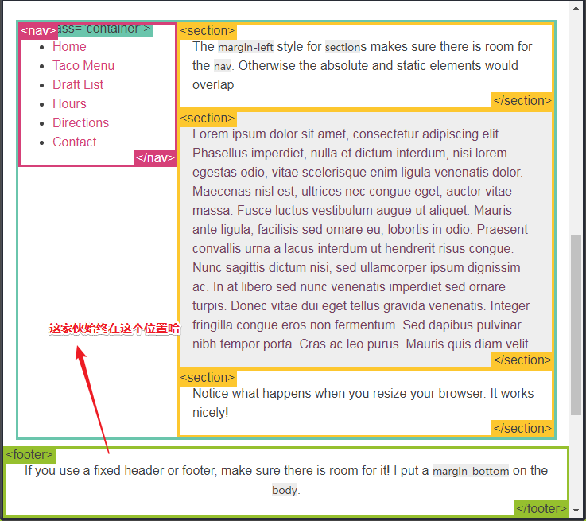

> 为啥nav没有完全脱离文档流呢？
>
> 1. 因为`section` 的 `margin-left` 样式确保了有足够的空间容纳 `nav` 元素。 否则，absolute的元素和默认static的元素将会重叠
>
> 那么谁在前，谁在后呢？——根据「除非添加一些额外的属性，否则relative的行为（表现）与static相同。」这个说法，所以absolute始终会在我们视野的前面！
>
> 2. 注意观察当你调整浏览器大小时会发生什么。你会发现它们工作得很好！
>
> 毕竟没有设置宽度的元素，天生自适应……
>
> 3. 如果你使用了一个固定定位的页眉或页脚，请确保有足够的空间来显示它们！所以我在 `body` 上面加了 个`margin-bottom` 。
>
> 讲真第3点很细节哈！

这个例子在容器（container）比nav元素高的时候可以正常工作。如果容器比nav元素低的话，那么nav会溢出到容器的外边。

在接下来的几页中，我们将讨论具有不同优缺点的其他布局技术。

---

## ★float

 用于布局的另一个CSS属性是float。Float 可用于实现文字环绕图片，就像这样：

```css
img {
  float: right;
  margin: 0 0 1em 1em;
}
```

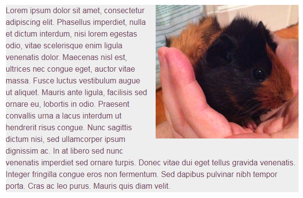

> 这是部分无视的脱离文档流，因为盒子内的文本知道它的存在呀！
>
> 总之这都是为了实现图文混排哈！

## ★clear

`clear`属性对于控制浮动的行为很重要。 比较这两个例子：

```html
<div class="box">...</div>
<section>...</section>
```

```css
.box {
  float: left;
  width: 200px;
  height: 100px;
  margin: 1em;
}
```

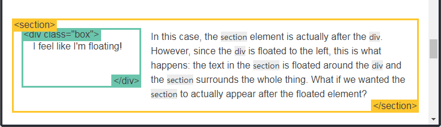

> 1. 我感觉好像我在漂浮！
>
> 2. 在这个例子中， `section` 元素实际上是在 `div` 之后的（译注：DOM结构上，你打开chrome的开发者工具就能见着！）。然而 ，因为`div` 元素是浮动到左边的，所以会发生这种情况：
>
>    这`section` 中的文本（text）就浮动在了 `div`周围 ，并且 `section` 元素包围了这整个元素。如果我们希望该`section`元素实际出现在浮动元素之后怎么办？

```css
.box {
  float: left;
  width: 200px;
  height: 100px;
  margin: 1em;
}
.after-box {
  clear: left;
}
```

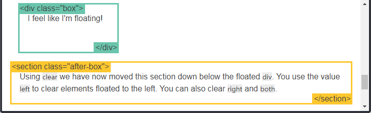

> 1. 使用 `clear` 我们就可以将这个段落移动到浮动元素 `div` 下面。你需要用 `left` 值才能清除元素的向左浮动。你还可以用 `right` 或 `both` 来清除向右浮动或同时清除向左向右浮动。
>
> 说白了就是说通过clear属性告诉自己「我已经忘记前面的元素它曾经是浮动元素，所以我们还是按正常文档流来渲染吧！」

## ★the clearfix hack

> 在这里我所理解的hack，就是奇淫技巧

在使用浮动的时候经常会遇到一个古怪的、让人觉得不好的事情：

```css
img {
  float: right;
}
```

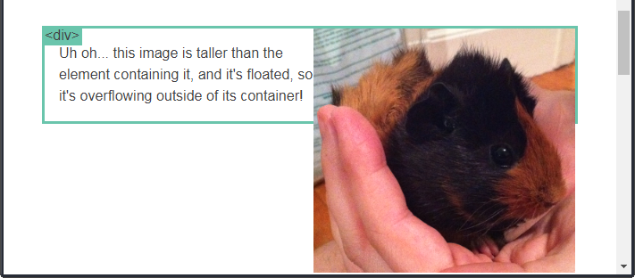

> 不......这个图片比包含它的元素还要高， 而且它是浮动的，于是它就溢出到了它的容器外边了！
>
> 同学你不要看美女了，你看你装的水都溢出了……

嘘！见证奇迹的时刻到了！

有一种办法可以解决这个问题，但是它很丑陋，它被称之为「*clearfix hack*」

让我们尝试添加这个新的CSS：

```css
.clearfix {
  overflow: auto;
}
```

 现在让我们看看会发生什么：

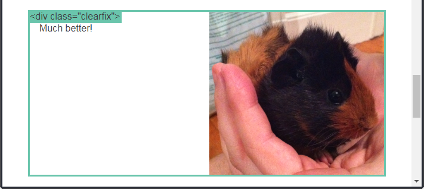

>   好多了！
>
> 儿子如果你浮动了的话，那我只好对自己清除浮动了！这样我就不能无视你的存在了！
>
> 所以你还是脱离不了我的五指山之下！

这适用于现代浏览器。 如果您想支持IE6，那么您就需要添加以下内容：

```css
.clearfix {
  overflow: auto;
  zoom: 1;
}
```

有异国情调的（exotic ，独特的）浏览器可能需要「额外的关照」。 [clearfixing的世界是非常吓人的（scary）](http://stackoverflow.com/questions/211383/which-method-of-clearfix-is-best)，但这个简单的解决方案对于今天来说适用于绝大多数浏览器。

总之clearfix这潭水很深很深……

万能姿势：

```css
.container::after {
  content: "";
  display: block;
  clear: both;
}
```

遇到因为float而出现的溢出，那就直接对容器搞这个吧！

## ★浮动布局例子

 使用`float`进行整个布局是很常见的。 这里有一个我之前用 `position` 实现的布局例子，这次我使用 `float` 实现了它。

> 完全使用 `float` 来实现页面的布局是很常见的？或许现在都会使用flex或者说是grid了！

```css
nav {
  float: left;
  width: 200px;
}
section {
  margin-left: 200px;
}
```

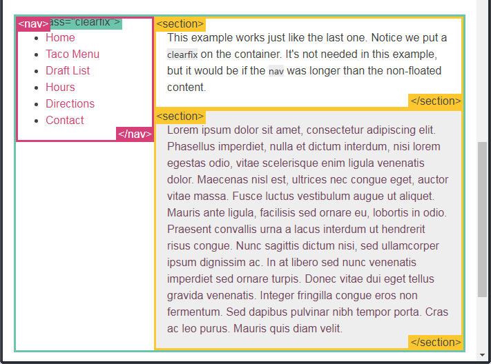

> 这个例子和之前的那个外观一模一样。请注意我们在容器上做了 `clearfix` 。原本在这个例子中是不需要的，但是当 `nav` 比非浮动的内容还要长时就需要了。

似乎浮动方便许多啊！不过你还得考虑清楚浮动！

## ★百分比宽度（percent width）

百分比是一种相对于包含块的测量（measurement）单位。 它非常适合图像：这里我们制作的图像始终是其容器宽度的50％。 尝试缩小页面以查看会发生什么！

```css
article img {
  float: right;
  width: 50%;
}
```

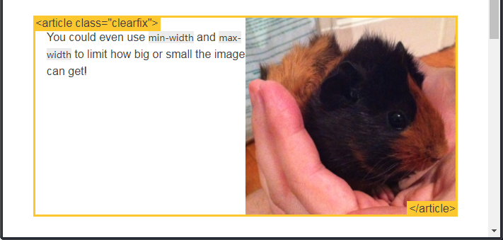

缩小页面测试：

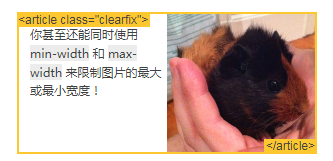

可见图片的宽度始终是其容器宽度的50%……

> 当然，您甚至还可以同时使用 `min-width` 和 `max-width` 来限制图片的最大或最小宽度……

### ◇百分比宽度布局

您可以使用百分比进行布局，但这可能需要更多工作。 在下面的示例中，当窗口宽度很窄时，`nav` 的内容开始以一种令人不快的方式换行了。总而言之，选一种最合适你的内容的方式。。

窗口宽度很窄的情况就像这样：

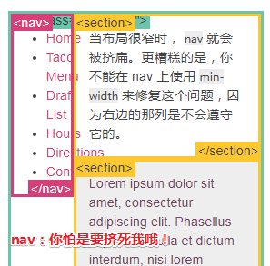

---

```css
nav {
  float: left;
  width: 25%;
}
section {
  margin-left: 25%;
}
```

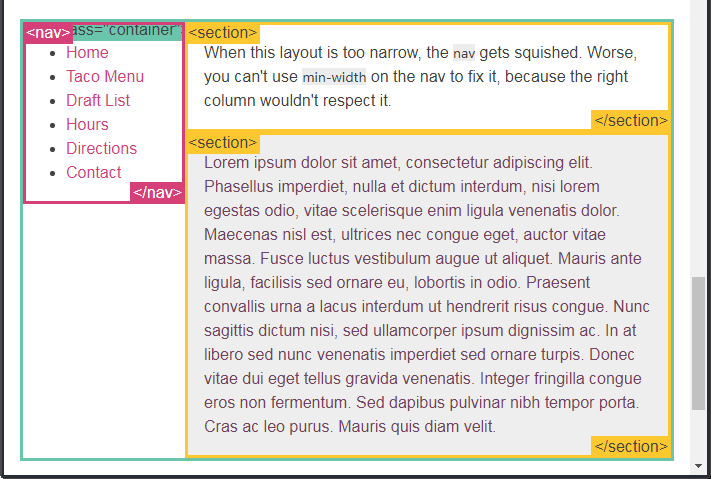

当这种布局太窄时，`nav` 就会被挤扁。 更糟糕的是，你不能在nav上使用`min-width`来修复它，因为右边的那列可不会尊重它

> nav已经脱离了文档流了，不过其它盒子只是部分无视它，如它的文本内容还是可以被其它盒子给发现的！
>
> 我以为按照我所想的，那section里的文本内容是不会覆盖nav中的内容，结果还是覆盖了！或者说是section的橙黄色框碰到nav中的内容就停止了
>
> 可没有想到的是根据我所测试的结果发现，这种想法是错误的，因为section就直接完全无视了！
>
> 而且你也不能对`nav`使用`min-width`来解决这种情况！

## ★媒体查询

 “响应式设计”是一种使网站“响应”它所显示的浏览器和设备的策略......无论如何都看起来很棒。

> “响应式设计（Responsive Design” 是一种让网站针对不同的浏览器和设备“呈现”不同显示效果的策略，这样可以让网站在任何情况下显示的很棒！

媒体查询是执行此操作的最强大工具。 让我们采用使用百分比宽度的布局，并在浏览器太小而无法放入侧边栏中的菜单时将其显示在一列（一栏）中：

> 媒体查询是做此事所需的最强大的工具。让我们使用百分比宽度来布局，然后在浏览器变窄到无法容纳侧边栏中的菜单时，把布局显示成一列：

```css
@media screen and (min-width:600px) {
  nav {
    float: left;
    width: 25%;
  }
  section {
    margin-left: 25%;
  }
}
@media screen and (max-width:599px) {
  nav li {
    display: inline;
  }

```

大于等于600px的结果：

> 容器中是双栏的效果

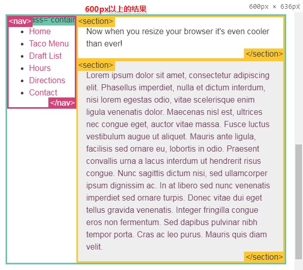

小于600px的结果：

> 这里就是单栏的效果了！

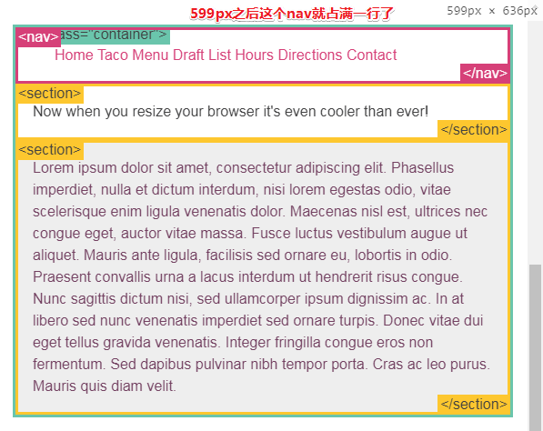

>  现在，当你调整浏览器的大小时，它比以往更酷了！
>
> 当你调整浏览器窗口大小时，布局比以前更酷了！

田田（Tada）！ 现在我们的布局在移动浏览器上看起来也很棒。 这里有[一些同样使用媒体查询的热门网站](https://mediaqueri.es/mse/)。 除了`min-width` 和 `max-width`之外，在[MDN文档](https://developer.mozilla.org/zh-CN/docs/Web/Guide/CSS/Media_queries)中你还可以学到更多有关媒体查询的知识。

### ◇友情提示

使用[meta viewport](https://dev.opera.com/articles/an-introduction-to-meta-viewport-and-viewport/)之后可以让你的布局在移动浏览器上显示的更好。

## ★inline-block

你可以创建很多网格来铺满浏览器。

>  您可以创建一个填充浏览器宽度并且换行得很好的盒子网格（grid）

在过去很长的一段时间内使用 `float` 是一种选择，但是使用 `inline-block` 会更简单。

`inline-block` 元素类似于 `inline`元素，但它们可以具有宽度和高度。

让我们看下使用这两种方法的例子：

### ◇困难的方式（使用浮动）

```css
.box {
  float: left;
  width: 200px;
  height: 100px;
  margin: 1em;
}
.after-box {
  clear: left;
}
```

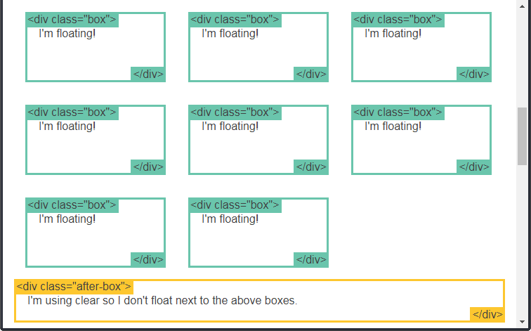

> 1. 我在浮动！
> 2. 我在使用 clear，所以我不会浮动到上面那堆盒子的旁边。
>
> 浏览器窗口宽度减小时，这些盒子网格也很自然地就换行了！

### ◇简单的方式（使用inline-block）

你可以用 `display` 属性的值 `inline-block` 来实现相同的效果。

```css
.box2 {
  display: inline-block;
  width: 200px;
  height: 100px;
  margin: 1em;
}
```

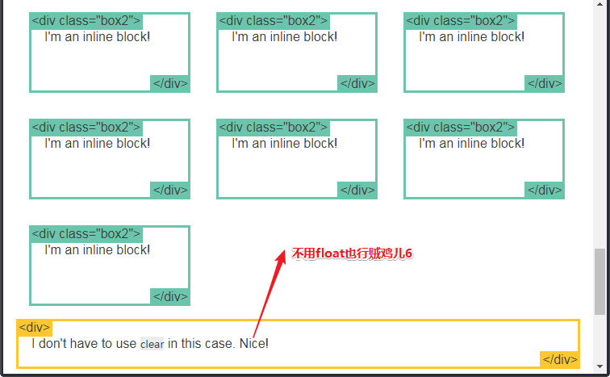

> 1. 我是一个行内块！
> 2. 这次我可没有用 `clear` 。太棒了！

你得做些额外工作来让[IE6和IE7支持](http://blog.mozilla.org/webdev/2009/02/20/cross-browser-inline-block/) `inline-block` 。有些时候人们会谈到 `inline-block` 触发一些叫做 `hasLayout` 的东西，你只需要知道那是用来支持旧浏览器的。如果你对此很感兴趣，可以在前面那个链接中找到更详细的信息。否则，我们就继续下去吧。

**➹：**[haslayout详解 - 小火柴的蓝色理想 - 博客园](https://www.cnblogs.com/xiaohuochai/p/4845314.html)

> haslayout是IE7-浏览器的特有属性。
>
> hasLayout是一种只读属性，有两种状态：true或false。当其为true时，代表该元素有自己的布局，否则代表该元素的布局继承于父元素。
>
> [注意]通过`element.currentStyle.hasLayout`可以得出当前元素的hasLayout情况

## ★inline-block布局

你也可以使用 `inline-block` 来布局。有一些事情需要你牢记：

- `vertical-align` 属性会影响到 `inline-block` 元素，你可能会把它的值设置为 `top` 。

- 你需要设置每一列（栏）的宽度

- 如果HTML源代码中元素之间有空格，那么列（栏）与列（栏）之间会产生空隙

  > 如果列（栏）之间存在任何空格，则列（栏）之间将存在间隙
  >
  > 那么如何解决这些空隙呢？
  >
  > **➹：**[去除inline-block元素间间距的N种方法 « 张鑫旭-鑫空间-鑫生活](https://www.zhangxinxu.com/wordpress/2012/04/inline-block-space-remove-%E5%8E%BB%E9%99%A4%E9%97%B4%E8%B7%9D/)

```css
nav {
  display: inline-block;
  vertical-align: top;
  width: 25%;
}
.column {
  display: inline-block;
  vertical-align: top;
  width: 75%;
}
```

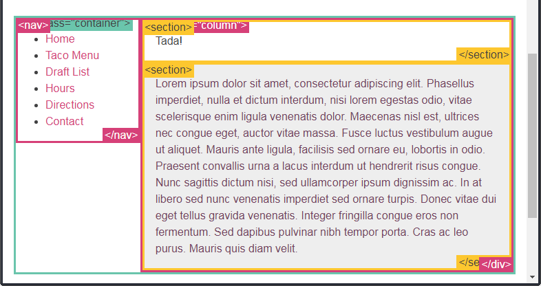

## ★column（栏？列？）

这里有一系列新的CSS属性，可以帮助你很轻松的实现文字的多列布局。让我们瞧瞧：

> 有一组新的CSS属性可以让您轻松制作多列文本，看一看：

```css
.three-column {
  padding: 1em;
  -moz-column-count: 3;
  -moz-column-gap: 1em;
  -webkit-column-count: 3;
  -webkit-column-gap: 1em;
  column-count: 3;
  column-gap: 1em;
}
```

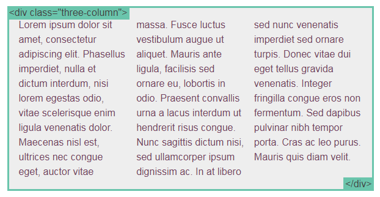

CSS columns是很新的标准，所以你需要使用前缀，并且它不被[IE9及以下和Opera Mini](http://caniuse.com/#search=column)支持。还有一些与column 相关的属性，[点击这里了解更多](http://www.quirksmode.org/css/multicolumn.html)。否则让我们讨论下一个主题。

## ★flexbox

新的 `flexbox` 布局模式被用来重新定义CSS中的布局方式。很遗憾的是最近规范变动过多，导致各个浏览器对它的实现也有所不同。不过我仍旧想要分享一些例子，来让你知道即将发生的改变。这些例子目前只能在支持 flexbox 的 Chrome 浏览器中运行，基于[最新的标准](http://www.w3.org/TR/css3-flexbox/)。

> 新的`flexbox`布局模式准备（poised）重新定义我们在CSS中所进行的布局方式。 不幸的是，规范最近发生了很大的变化，因此它在不同的浏览器中的实现方式也有所不同。 不过，我想分享几个例子，以便你知道即将发生的事情。 这些示例目前仅适用于使用[最新版本标准](http://www.w3.org/TR/css3-flexbox/)的[某些浏览器](http://caniuse.com/flexbox)。

网上有不少过时的 flexbox 资料。 如果你想要了解更多有关 flexbox 的内容，[从这里](http://css-tricks.com/old-flexbox-and-new-flexbox/)学习如何辨别一份资料是否过时。我已经写了一份[关于最新标准的详细文章](http://weblog.bocoup.com/dive-into-flexbox/)。

> 有很多过时的flexbox资源。 如果您想了解有关flexbox的更多信息，请从[此处](http://css-tricks.com/old-flexbox-and-new-flexbox/)了解如何识别资源是否是最新的。 我[使用最新语法编写了一篇详细的文章](http://weblog.bocoup.com/dive-into-flexbox/)。

使用flexbox你还可以做的更多；这里只是一些让你了解概念的例子：

> 你可以用flexbox做更多的事情；这里只是一些让你了解它的理念（idea）的几个例子：
>
> 如可以实现简单布局、牛逼的布局、还有常用的绝对居中布局……

### ◇使用 Flexbox 的简单布局

```css
.container {
  display: -webkit-flex;
  display: flex;
}
nav {
  width: 200px;
}
.flex-column {
  -webkit-flex: 1;
          flex: 1;
}
```

> 关于flex值为1：
>
> 下面两个是等价的
>
> ```css
> .item {flex: 1;}
> .item {
>     flex-grow: 1;
>     flex-shrink: 1;
>     flex-basis: 0%;
> }
> ```
>
> 所以flex-colum占据了所有的剩余空间，也就是说这个nav盒子只要这个容器的200px宽就好了，剩下的都给`section.flex-column`这个盒子吧！
>
> 至于flex-shrink为1表示的是：如果空间不足，该item将缩小，而且负值对该属性无效。
>
> 而flex-basis呢？
>
> 则是**当主轴为水平方向的时候**且`flex-basis` 值为 0 % 时，是把该item视为零尺寸的，也就是说即使你声明该 `section.flex-column`这个盒子 尺寸为 600px，也并没有什么卵用。
>
> **➹：**[Flex布局 - fe-learn-2018](https://ppambler.github.io/fe-learn-2018/CSS/01-Flex%E5%B8%83%E5%B1%80.html)


> 1. Flexbox好容易使用！
>
> 之前都是围绕一个容器来展开的多栏布局，如今使用了flexbox之后依旧如此！

### ◇使用 Flexbox 的牛逼布局

```css
.container {
  display: -webkit-flex;
  display: flex;
}
.initial {
  -webkit-flex: initial;
          flex: initial;
  width: 200px;
  min-width: 100px;
}
.none {
  -webkit-flex: none;
          flex: none;
  width: 200px;
}
.flex1 {
  -webkit-flex: 1;
          flex: 1;
}
.flex2 {
  -webkit-flex: 2;
          flex: 2;
}
```

> `initial`这个值相当于是`flex: 0 1 auto`
>
> 关于flex-basis的默认值：auto，即item本来的大小, 这时候 item 的宽高取决于 width 或 height 的值。
>
> 而 `flex:none`则是`0 0 auto`，flex-grow的默认值为 0，表示如果存在剩余空间，也不放大；同理 flex-shrink 属性为 0，空间不足时，也不缩小

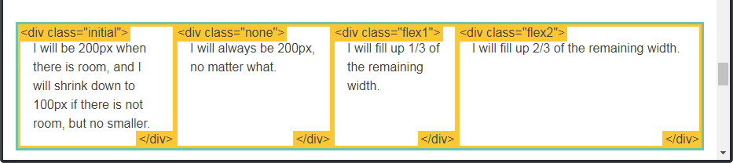

> 1. 当有空间，即空间足够时，我将是200px；如果没有空间，即空间不足时，我将缩小到100px，但不会更小。
> 2. 无论窗口如何变化，我总是200px宽
> 3.  我将填满剩余宽度的1/3
> 4.  我将填满剩余宽度的2/3。
>
> 似乎这些盒子都不怎么考虑自身的高度！讲真自适应的高度也挺好的！
>
> 通过控制台缩小浏览器窗口我发现，元素是一层叠一层的，就像是PS里的图层概念一样！

### ◇使用 Flexbox 的居中布局

```css
.vertical-container {
  height: 300px;
  display: -webkit-flex;
  display:         flex;
  -webkit-align-items: center;
          align-items: center;
  -webkit-justify-content: center;
          justify-content: center;
}
```

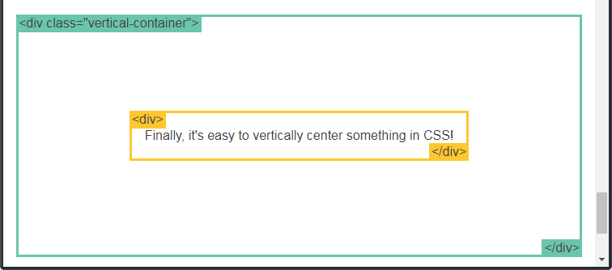

> 1. CSS里总算是有了一种简单的垂直居中布局的方法了！
>
> 最后，使用flexbox在CSS中实现垂直居中显然很容易！

## ★css frameworks（css框架）

因为 CSS 布局很难使用，所以催生了不少 CSS 框架来帮助开发者。如果你想看看那么这里有一些。只有在框架的功能满足你的需求时，使用框架才是个好主意。掌握CSS的工作方式是无可替代的。因为 CSS 布局很难使用，所以催生了不少 CSS 框架来帮助开发者。如果你想看看那么这里有一些。只有在框架的功能满足你的需求时，使用框架才是个好主意。掌握CSS的工作方式是无可替代的。

> 因为CSS布局非常棘手，所以有一些CSS框架可以来帮助简化布局。如果你想看的话，这里有一些。如果框架确实能够满足您的网站需要，那么使用框架只是一个好主意。不过，它们并不能代替你知道**CSS是如何工作的**。

[](http://www.blueprintcss.org/) [](http://www.unsemantic.com/)[](http://bluetrip.org/) [](http://twitter.github.com/bootstrap/)[](http://susy.oddbird.net/) [](http://foundation.zurb.com/)[](http://imperavi.com/kube/) [](http://groundworkcss.github.com/)[](http://semantic-ui.com/) [](http://purecss.io/)

到此为止！如果你对本站有任何反馈，请在[Twitter](https://twitter.com/intent/tweet?source=webclient&text=%40_gsmith)上联系我！


---

## ★总结

- 看到有关布局的CSS属性，请在你的脑海中对该元素说「布局！布局！布局！……」

- 当你想用有关布局的CSS属性时，请在你的脑海中对该元素说「我的兄弟会受我影响吗？我的行为对于父级、祖先辈元素会有联系吗？」

- 我开始意识到看原文的意义，当你不理解翻译过来的中文所讲述的是什么东东的时候，或者说理解起来很吃力的时候，那么你就去看它的原文，即英文！

- 感觉这一系列教程都指出了我们会经常遇到的点！然后提示我们要注意它们！

- 我要去看的文章：

  **➹：**[Monese - Media Queries](https://mediaqueri.es/mse/)

  **➹：**[Dev.Opera — An Introduction to Meta Viewport and @viewport](https://dev.opera.com/articles/an-introduction-to-meta-viewport-and-viewport/)

  **➹：**[Dive into Flexbox - design, tools and workflow - Bocoup](https://bocoup.com/blog/dive-into-flexbox)

  **➹：**[[译]深入了解 Flexbox 伸缩盒模型 - 小影志](https://c7sky.com/dive-into-flexbox.html)

- 一些牛逼的CSS框架：

  **➹：**[Semantic UI](https://semantic-ui.com/)

  **➹：**[Pure](https://purecss.io/)

- 讲真关于CSS布局，我一直来都感到很头疼……有种很想使用框架的即视感！

- 我之前有看过一些关于CSS布局的视频，不过我看了之后始终还是不会布局！因为它们并没有像这篇教程这样有始有终，当然目前似乎都打算使用了Grid布局了！

## ★Q&A

### ①一些概念？

-  **所谓的文档流**，指的是元素排版布局过程中，元素会自动从左往右，从上往下的流式排列。

-  **脱离文档流**，也就是将元素从普通的布局排版中拿走，其他盒子在定位的时候，**会当做脱离文档流的元素不存在而进行定位**。

 **只有绝对定位absolute和浮动float才会脱离文档流。**

部分无视和完全无视的区别？

需要注意的是，使用float脱离文档流时，其他盒子会无视这个元素，但其他盒子内的文本依然会为这个元素让出位置，环绕在周围(可以说是部分无视)。而对于使用absolute position脱离文档流的元素，其他盒子与其他盒子内的文本都会无视它。(可以说是完全无视)

**➹：**[脱离文档流分析 - 放开那个女孩的个人空间 - 开源中国](https://my.oschina.net/u/2306318/blog/880076)

### ②CSS hack？

由于不同的浏览器，甚至同一浏览器的不同版本对CSS的解析认识不一样，导致生成的页面效果不一致，写出针对不同浏览器CSS code就称为CSS hack。

常用的CSS hack 有三种方式，CSS 内部hack、选择器hack、HTML 头部引用，其中第一种最常用。

> 按照我的理解就是，相较于正常的CSS语法，它们都是一些奇怪的语法！

**➹：**[CSS hack - 谦行 - 博客园](http://www.cnblogs.com/dolphinX/p/3292630.html)

### ③CSS3制作图形大全？

**➹：** [css3制作图形大全 – 前端开发，JQUERY特效，全栈开发，vue开发](https://www.jqhtml.com/8045.html)

