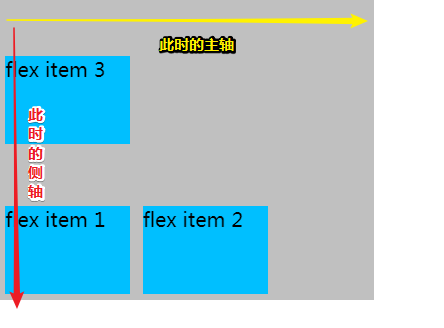
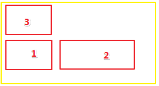
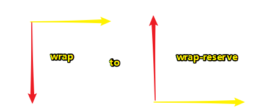
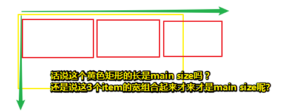
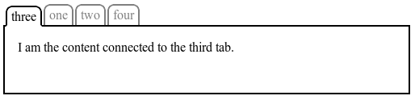
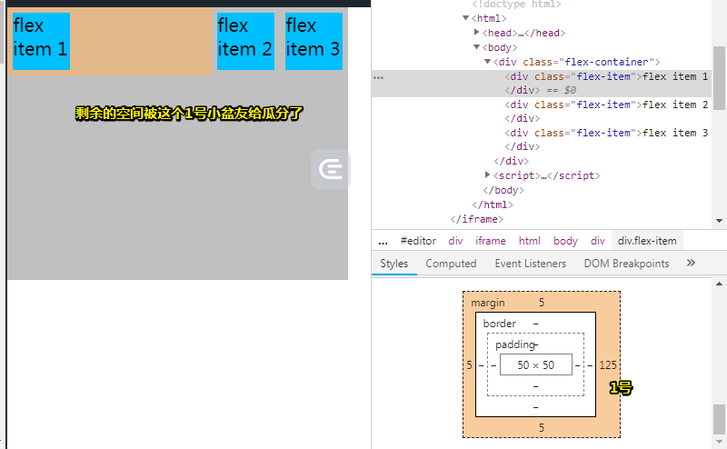
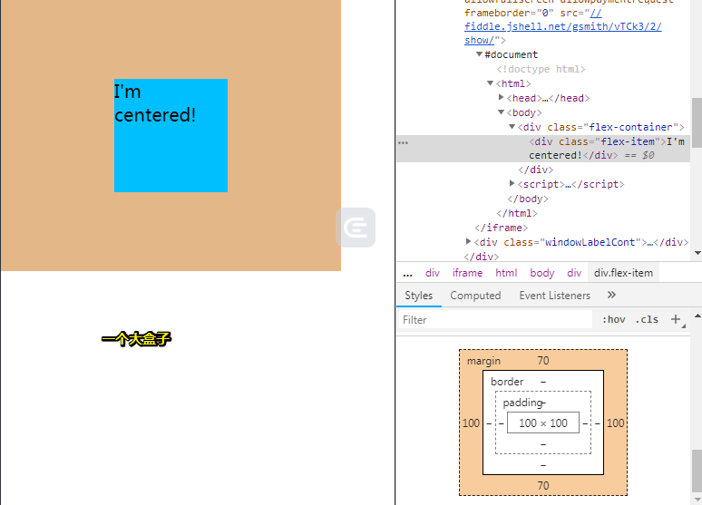
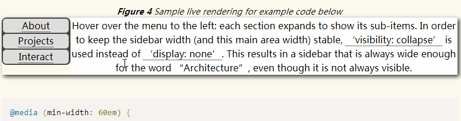

# 深入了解Flexbox

## ★资料

**➹：**[Dive into Flexbox - design, tools and workflow - Bocoup](https://bocoup.com/blog/dive-into-flexbox)

**➹：**[[译]深入了解 Flexbox 伸缩盒模型 - 小影志](https://c7sky.com/dive-into-flexbox.html)

## ★引子

之前对flexbox了解得还是很不够，而且对一些属性的理解甚是表面！而这次打算用flex布局来写个在线简历！所以就再次回顾Flexbox了。

总之，如果你之前那种姿势不能好好理解flexbox的话，那就换几篇文章去看看，然后去理解flexbox！

## ★介绍

Flexbox是CSS3中出现的一种新布局模式，而它是为了现代网络中更为复杂的网页需求而设计出来的。

 本文将介绍最新且稳定的Flexbox 语法的技术细节。 浏览器对它的支持越来越快，所以当 Flexbox 被广泛支持并应用时你将会快人一步。 如果您想知道它的作用以及它是如何工作的（工作原理），不妨仔细了解下吧！

> 有一个很新且很稳定东西出现了，此时并咩有被广泛应用，如果你提前加入这场使用它的游戏，那么你将会快人一步，而不是等到被大家广为熟知的时候。如之前的Vue、typescript……

## ★为什么需要Flexbox？

作者长期以来一直使用这些布局姿势（如表格、浮动、行内块和其它CSS属性等）来布局网站内容。然而，这些工具都不是为我们现在制作的复杂网页和Web应用而设计的。不管是简单的垂直居中，还是灵活的网格布局都很难靠一己之力轻易实现，因此成就了CSS grid frameworks（如960栅格系统和BootStrap，注意可不是目前的**CSS Grid 网格单元格布局**）。

但是，如果真得有这么多项目需要来做这些事情，那么为什么不让它来的更简单些呢？Flexbox 的目的就是改变这一切（如以前的垂直居中很难轻易实现）

> 简单的布局可以用以前的姿势，布局复杂的就用flex之类的，不过就目前的Web来看，网页或者是Web应用相较之前已经很复杂了！所以flex布局能兼容以前的旧姿势吗？即以前的姿势能做的，那么现在用上了flex也能实现同样的效果！

## ★规范状态和浏览器支持情况

Flexbox 规范的相关工作已经进展了3年。不同的浏览器也实现了不同的实验版本。在2012年9月，Flexbox语法的第三个重大修订版本进入到了W3C候选推荐阶段。 这意味着W3C对当前语法感到满意，简而言之就是W3C认为当前的Flexbox语法是稳定的，然后鼓励浏览器开发商去实现它。

Flexbox 规范时间表：

- 2009年7月 工作草案 (display: box;)
- 2011年3月 工作草案 (display: flexbox;)
- 2011年11月 工作草案 (display: flexbox;)
- 2012年3月 工作草案 (display: flexbox;)
- 2012年6月 工作草案 (display: flex;)
- 2012年9月 候选推荐 (display: flex;)

浏览器正在快速采用（支持）Flexbox，Chrome 22+, Opera 12.1+, 和 Opera Mobile 12.1+ 已经支持了本文中所描述的 Flexbox。[Firefox 18](https://developer.mozilla.org/en-US/docs/CSS/Using_CSS_flexible_boxes) 和 [Blackberry 10](http://caniuse.com/flexbox) 也很快就会实现。我推荐大家使用已经支持的浏览器来阅读本文和查看例子。

**➹：**[CSS Flexible Box Layout Module Level 1](https://www.w3.org/TR/css-flexbox-1/)

**➹：**[Can I use... Support tables for HTML5, CSS3, etc](https://caniuse.com/#search=flex)

> 微软都宣布不要使用IE了，所以大胆地去用吧！毕竟现在已经2019年了！距离第一份草案的出现已过去10年了！
>
> 如果有时间可以看看上面的第一个链接！毕竟它是一手资料！
>
> 突然感觉规范（specification）就是在对浏览器厂商提需求，至于这个需求合不合理，需要一系列的工作草案，这时浏览器厂商也会实现不同的实验版本。
>
> 如果到了候选推荐的话，那么这就意味着 W3C 认为当前的语法是稳定的，并鼓励浏览器开发商去实现它。
>
> 举个例子来说，你现今所看的 `display:flex`，起初是从`display: box;`、 `display: flexbox;`演变而来的
>
> 如果还是不好理解的话，那就看看这个Flexbox 规范时间表：
>
> - 2009年7月 工作草案 (display: box;)
> - 2011年3月 工作草案 (display: flexbox;)
> - 2011年11月 工作草案 (display: flexbox;)
> - 2012年3月 工作草案 (display: flexbox;)
> - 2012年6月 工作草案 (display: flex;)
> - 2012年9月 候选推荐 (display: flex;)
> - ……
>
> 给人一种最后的草案，才是候选推荐的感觉……简而言之，就像考数学试卷需要草稿纸一样，千万不要还没有想清楚就写在试卷上，其实当你在草稿纸写清楚后，再写到试卷上这点时间只不过几十秒而已，而你直接在试卷上写的话，需要顾前顾后，以防没有位置写了！这点顾前顾后的时间，又浪费几十秒，而且容易打断思维。况且写在草稿纸上还能给人抄！

ps：当我看到问题①的时候，我才明白草案和候选推荐的关系！

## ★概念和术语

虽然Flexbox使得创建过去「难以或不可能」的布局变得微不足道，但是我们需要一些时间来习惯Flexbox的做事方式。 新的术语和新的抽象概念可能会是我们使用 Flexbox 时的一个障碍，所以让我们先来了解以下它们

Flexbox由*Flex Containers* 和*Flex Items*组成

通过设置元素的 [display](http://learnlayout.com/display.html) 属性为 `flex` 或 `inline-flex`可以得到一个伸缩容器。设置为 `flex` 的容器被渲染为一个块级元素，而设置为 `inline-flex`的容器则渲染为一个行内元素。

Flex容器的每个子元素都是一个Flex Item，而且可以有任意数量的Flex项目。 Flex容器外和Flex项目内的一切元素都照常渲染，即都不受影响。 简而言之，Flexbox定义了Flex项目在Flex容器内的布局方式，或者说是 「Flexbox 定义了伸缩容器内伸缩项目该如何布局。」

> flex容器关注的是flex item，而flex item里的元素、内容什么的，真得会照常渲染吗？
>
> 总之爸爸能操纵儿子的布局

### ◇Flex Lines 伸缩行

伸缩项目沿着伸缩容器内的一个 *伸缩行* 定位。通常每个伸缩容器只有一个伸缩行。


> 我想现在应该叫做main轴了吧！

总之，flex容器里的item默认情况下的定位是沿着一个水平伸缩行从左至右显示。

测试代码：

```html
<div class="flex-container">
    <div class="flex-item">flex item 1</div>
    <div class="flex-item">flex item 2</div>
</div>
```

```css
.flex-container {
    display: -webkit-flex;
    display: flex;
    width: 300px;
    height: 240px;
    background-color: Silver;
}

.flex-item {
    background-color: DeepSkyBlue;
    width: 100px;
    height: 100px;
    margin: 5px;
}
```

效果：


<script async src="//jsfiddle.net/Ambler/csmt7n09/embed/js,html,css,result/dark/"></script>

### ◇Writing Modes 书写模式

在你设计 Flexbox 时的有一个重要的部分是更改伸缩行的方向。默认情况下，**伸缩行和文本方向一致：从左至右，从上往下。**

> 嗦嘎，原来如此啊！一般我们写的文本都是从左往右写的，而有一些文字（如希伯来语、阿拉伯语……）是自右向左书写的
>
> **➹：**[今天，突然想和你扒一扒 世界文字隐藏的书写秘密](https://www.douban.com/note/634144086/)

这是 [W3C 关于一个名为*书写模式*的新特性工作草稿](http://www.w3.org/TR/css3-writing-modes/)。书写模式是一个新的方法，让你可以从右往左写，甚至竖着写，就像你知道的某些语言一样。

书写模式是一个正在进行的计划，但是 Chrome 已经率先支持了 `direction` CSS 属性。如果我们在上一个例子中设置方向为 `rtl` (从右往左) 那么不仅仅文字会从右往左书写，而且 *伸缩行也改变了方向*，并更改了页面的布局。

<script async src="//jsfiddle.net/Ambler/f6oaz5pr/embed/js,html,css,result/dark/"></script>

> 设置body的CSS样式：
>
> ```css
> body {
>     direction: rtl;
> }
> ```
>
> 从这可以看出伸缩行的方向依赖于文本的书写方向，默认的方向（从左到右）是们所接受的，如果是从右到左的话，那么不管是flex容器还是其中的flex item，它们的方向都会发生变化，即一个种对称性变化吧！或者说是我们用户的视角是从右往左看内容的
>
> 不过，我想这些问题不需要我这个菜鸟去考虑！

这也许就就是一个能解释为什么许多flexbox术语如此抽象难懂的地方。当你正在制作一个语言不确定的页面时，你不能简单的只是说“上”、“下”、“左”、“右”。

### ◇The Main Axis and the Cross Axis 主轴和侧轴

为了描述抽象的书写模式（To abstract over the writing-mode），Flexbox 使用 *主轴* 和 *侧轴*的概念。伸缩行跟随主轴。侧轴则垂直于主轴。

> To abstract over the writing-mode：为了在书写模式上进行抽象？
>
> 把书写模式抽象了一层，然后就有了主轴和侧轴的概念？把苹果和橙子抽象了一层，就有了水果的概念？
>
> 也就说这是为了让我们理解书写模式，而衍生了许多概念吗？


起点、终点和各轴的方向的名称如下：

- 主轴起点 Main Start
- 主轴终点 Main End
- 主轴方向 Main Direction (有时候也称为伸缩流方向 Flow Direction)
- 侧轴起点 Cross Start
- 侧轴终点 Cross End
- 侧轴方向 Cross Direction

> flow流？难道是说唱的flow？

在继续了解之前明白主轴和侧轴是至关重要的。Flexbox 中的一切都和这些轴有关。在我们所有的例子中，书写模式都是从左至右，从上到下，但是你需要记住**并不是所有的 Flexbox 都是这样的**。


> 话说main sizes是不是指单行里多个item的size的总和呢？

## ★flex容器的属性

### ◇flex-direction 伸缩流的方向

`flex-direction` 允许你更改伸缩容器的主轴方向。`flex-direction` 的默认值是 `row`。使用此值，Flex项目则按写入模式的方向布局。 可见，这意味着默认情况下是从左到右，从上到下的。 其他值如下：

- row-reverse: 主轴起点和主轴终点交换。如果书写模式是从左至右，伸缩项目则是从右往左排列。
- column: 主轴和侧轴交换。如果书写系统是水平的，那么伸缩项目现在是垂直布局的。
- column-reverse: 和 column 一样，但是方向相反。

让我们以前面的例子为例，将`flex-direction`更改为`column`：

<script async src="//jsfiddle.net/Ambler/k70em8j6/embed/js,html,css,result/dark/"></script>

可见，现在我们的Flex项目是垂直布局的

### ◇justify-content 主轴对齐

伸缩容器的 `justify-content` 属性用于调整主轴上伸缩项目的位置。可能的值为：

- flex-start (默认)
- flex-end
- center
- space-between
- space-around

这里我们设置 `justify-content` 为 `center` 让伸缩项目在主轴上居中对齐：

<script async src="//jsfiddle.net/Ambler/j8ztbhq3/1/embed/html,css,result/dark/"></script>

`flex-start`, `flex-end`, 和 `center` 一看就懂。`space-between` 和 `space-around` 则是分配伸缩项目之间空白空间的不同方法。这张规范中的图示很好的解释了一切：


> 你可以看见最后那个，它是把剩余空间等比分配到flex item的两边，而倒数第二个则是把剩余空间扔到flex item与flex item之间去了
>
> 你可以想象成父亲在教导三个孩子该站到哪个位置上去

### ◇align-items 侧轴对齐

`align-items` 是一个和 `justify-content` 相呼应的属性。`align-items` 调整伸缩项目在侧轴上的定位方式。

> align-items is complementary to justify-content.（`align-items` 是对 `justify-content` 的补充）

可能的值有：

- flex-start (default)
- flex-end
- center
- baseline
- stretch

这里我们设置 `align-items` 为 `center` 让伸缩项目在侧轴上居中对齐：

<script async src="//jsfiddle.net/Ambler/8vyohjdk/embed/html,css,result/"></script>

和之前一样，`flex-start`, `flex-end`, 和 `center` 的意义显而易见。`stretch` 也很简单：它会将伸缩项目从侧轴起点拉伸到侧轴终点。`baseline` 则是让伸缩项目与它们的基线对齐。基线根据伸缩项目的内容计算得到。下面这张来自W3C标准的图例很好的解释了这些属性：


> 话说什么叫对齐呢？比如说「在数学上，线段是直线上两点间的一段」，那么对齐呢？是有条参考线吗？
>
> 这些元素大小不一，有些肥，有些瘦，有些高，有些矮，但它们都有共性，都是矩形盒子，有所谓的基线（除非咩有文本内容）、中线，也有父元素给它们的边界
>
> **➹：**[ppt排版技巧：论对齐原则的重要性 - 知乎](https://zhuanlan.zhihu.com/p/44269364)

### ◇flex-wrap 伸缩行换行

目前为止，每个伸缩容器都有且只有一个伸缩行。使用 `flex-wrap` 你可以为伸缩容器创建多个伸缩行。这个属性接受以下值：

- nowrap (默认)
- wrap
- wrap-reverse

如果 `flex-wrap` 设置为 `wrap`，在一个伸缩行容不下所有伸缩项目时，伸缩项目会换行到一条新增的伸缩行上。新增的伸缩行根据**侧轴的方向**添加。

我们使用 `flex-wrap` 来看个例子：

<script async src="//jsfiddle.net/Ambler/5p1wL4mv/embed/html,css,result/dark/"></script>

`wrap-reverse` 和 wrap 一样，只是新的伸缩行会被添加到侧轴的反方向上。

> 这个似乎不是很好理解哈！于是就去看了w3c：
>
> **➹：**[CSS Flexible Box Layout Module Level 1](https://www.w3.org/TR/css-flexbox-1/#flex-wrap-property)
>
> 有这么一段话描述这个属性：
>
> flex-wrap属性控制着Flex容器是否是单线（single-line）还是多线（multi-line），并且该Flex容器的横轴方向决定了新线的堆叠方向。如，容器默认是横的且从左往右，那么该线就是直接另起一行咯，如一叠纸一样……
>
> 还有就是flex容器默认是单线的，即flex items打死都不换行，为什么这么说呢？因为默认是nowrap值啊！如果是wrap值的话，那么此地不留爷自有留爷处……
>
> 当取值是 `wrap-reverse`时，结果是这样的：
>
> 
>
> 可见新线的堆叠方向是侧抽的反方向，还有你可别想成是这样的：
>
> 
>
> 为什么这样说呢？
>
> w3c中说到「当flex-wrap 的值是 wrap-reverse时,  cross-start 和 cross-end 的方向被交换了」，即它们俩位置颠倒了，**侧轴方向变为从下到上**了，所以1和2才会在底下
>
> 形象理解就是这样：
>
> 
>
> 我靠单词拼错了……可见决定一个元素的开始需要主轴和侧轴同时决定，简而言之就是往原点那个角落扔个盒子即可！

### ◇align-content 堆栈（stack）伸缩行

`align-content` 会更改 `flex-wrap` 的行为。它和 `align-items` 相似，但是不是对齐伸缩项目，它对齐的是伸缩行。可能你已经想到了，它接受的值也很相似：

- stretch (默认)
- flex-start
- flex-end
- center
- space-between
- space-around

这些值与 `justify-content` 和 `align-items` 中的值一样。

在这个例子中，我们设置 `align-content` 为 `center`：

<script async src="//jsfiddle.net/Ambler/79m5k2h4/embed/html,css,result/"></script>

`align-content`及其对multi-line flex 容器的影响的说明：


> 可见该属性一般是针对多行的哈！与之类似的那个align-items显然是针对单行的！

**➹：**[CSS Flexible Box Layout Module Level 1](https://www.w3.org/TR/css-flexbox-1/#align-content-property)

### ◇flex-flow 伸缩方向与换行

`flex-flow` 是 `flex-direction` 和 `flex-wrap` 的缩写。

> flex-flow: [flex-direction] [flex-wrap]

举个例子：

```css
.flex-container {
  -webkit-flex-flow: column nowrap;
  flex-flow: column nowrap;
}
```

**➹：**[CSS Flexible Box Layout Module Level 1](https://www.w3.org/TR/css-flexbox-1/#flex-flow-property)

## ★flex items的属性

> 根据这种下面这张图的约定：
>
> 
>
> main size就是单个item的尺寸？还是说一个flex item的宽就是TM的它自己定义的width，在这里的main size只是表示的是这个item在这个主轴是row的方向上，该元素的宽就叫做main size而已？
>
> 为啥叫尺寸呢？因为你无法确定此时这个元素的main 「size」是width还是height
>
> 直接看w3c的术语表：
>
> **➹：**[CSS Flexible Box Layout Module Level 1](https://www.w3.org/TR/css-flexbox-1/#box-model)

**一个伸缩项目是一个伸缩容器的任何直接子元素，而且伸缩容器中的文本也会被视为一个伸缩项目。**

伸缩项目中内容与普通流一样。举例来说，当一个伸缩项目被设置为浮动，你依然可以在这个伸缩项目中放置一个浮动元素。

> The contents of Flex Items render as normal. For example, while setting float on a Flex Item does nothing, you could have a floated element inside of a Flex Item.
>
> 例如，当你在Flex项上设置float其实是没有任何作用的，所以你就可以在Flex项中包含浮动元素啦！

flex items（注意它是有s的，表示是所有item）都有一个 *主轴长度(Main Size)* 和一个 *侧轴长度(Cross Size)*。

> The Main Size is the size of the Flex Item in the dimention of the Main Axis. The Cross Size is the size of the Flex Item in the dimention of the Cross Axis. Effectively, the width or height of a Flex Item may be its Main Size or Cross Size depending on the Flex Container’s axes.

main size是flex item在主轴这个维度上的尺寸。cross size是flex item在侧轴这个维度上的尺寸。或者说，一个伸缩项目的宽或高取决于flex容器的轴，可能就是它的主轴长度或侧轴长度。

 或者说，一个Flex项目的宽度或高度可能是其main轴或cross轴大小，具体取决于Flex容器的轴。

> 或者说，一个伸缩项目的宽或高取决于伸缩容器的轴，可能就是它的主轴长度或侧轴长度。
>
> 说白了，就是一个item的宽高是不确定的，这要看flex 容器的xy轴的大小了！话说这关乎flex容器的宽高吗？还是说溢出的item也会被算作flex容器的轴大小你额？如
>
> 

下面的属性可以调整伸缩项目的行为：

### ◇order 显示顺序

`order` 是最简单明了的属性。设置伸缩项目的 order 可以调整它们渲染时的顺序。在这个例子中，我们设置其中一个伸缩项目的 `order` 为 -1，于是它被提前到了其他伸缩项目的最前面。

<script async src="//jsfiddle.net/Ambler/2p86dsx9/embed/html,css,result/"></script>

如果需要文档顺序和显示顺序不同时，这就是个很有用的功能了。

如：



> 可见这图显示了一个简单的选项卡式界面，其中活动窗口的选项卡始终是第一个，相关代码如下：
>
> ```css
> .tabs {
>   display: flex;
> }
> .tabs > .current {
>   order: -1; /* Lower than the default of 0 */
> }
> ```

还有：

```html
<!DOCTYPE html>
<header>...</header>
<main>
   <article>...</article>
   <nav>...</nav>
   <aside>...</aside>
</main>
<footer>...</footer>
```


> 可以看到article这个元素与其在DOM中的顺序是不一样的！

**➹：**[CSS Flexible Box Layout Module Level 1](https://www.w3.org/TR/css-flexbox-1/#order-property)


### ◇margin 外边距

你应该对 `margin: auto;` 的[这种用法效果](http://learnlayout.com/margin-auto.html)很熟悉了。在伸缩盒中，它也能做同样的事情，但是更加强大。一个 "auto" 的 margin 会合并（absorb/吸收）剩余的（extra/额外的）空间。它可以用来把伸缩项目挤到其他位置。

这里我们在第一个伸缩项目上声明了 `margin-right: auto;`，导致了所有的剩余（额外的）空间被合并（吸收、吸纳）到该元素的右边去了：

> 本来1、2、3号小盆友好好的排好队了，而突然，这个1号小盆右放了一个屁，把2、3号小盆友挤到它的最右边去了……毕竟1号的屁也是它本身的一部分，直到2、3号无路可逃，那些屁才不会占据它们的空间，显然他们此刻紧闭鼻子和嘴巴……

<script async src="//jsfiddle.net/Ambler/efj7owhm/2/embed/html,css,result/"></script>

> 我们通过审查元素可以看到：
>
> 

这里我们使用 `margin: auto;` 来重现经典CSS布局中的圣杯：真正的垂直居中：

> 关于圣杯：圣物之意，即很高大尚的，很牛逼的东西，在这里也就说绝对居中在CSS布局中等同于圣杯一样重要，而我们通过flex布局就很容易实现它了！
>
> **➹：**[圣杯到底是什么？ - 知乎](https://www.zhihu.com/question/28953628)

<script async src="//jsfiddle.net/Ambler/5enfhq0r/embed/html,css,result/"></script>

我看了它代码：

```html
<style>
.flex-container {
    display: -webkit-flex;
    display: flex;
    width: 300px;
    height: 240px;
    background-color: Silver;
}

.flex-item {
    background-color: DeepSkyBlue;
    width: 100px;
    height: 100px;
    margin: auto;
}
</style>
<div class="flex-container">
	<div class="flex-item">I'm centered!</div>
</div>
```

就一个flex容器加上一个`margin:auto`就搞定了！而且子元素不需要给定宽高，父元素也是如此！当然你给定了父元素高度，那么就会比较直观的显示它是绝对居中的，不管怎样，兜底的情况就是水平居中啦！只要给个flex容器以及对其直接子元素一个`margin:auto`即可！

> 这个绝对居中的审查元素情况：
>
> 

---

> 我觉得这个应用到移动端，做弹性的自适应挺好的，只要你不对元素写死宽高就好了！
>
> 还有感觉这个属性的作用类似于flex item中的某个能够吸收剩余空间的属性，这让我想起了ES6中的class的关键字，对，它是个语法糖，而在这里我可以认为 `flex-grow`也是个语法糖！

### ◇align-self 侧轴对齐

伸缩项目的 `align-self` 属性会有效地覆盖该项目的伸缩容器的 `align-items` 属性。它的值和 `align-items` 一样：

> 似乎翻译不怎么翻译副词啊！副词表程度……

- stretch (默认)
- flex-start
- flex-end
- center
- baseline

在这个例子中我们为每个伸缩项目应用了不同的 `align-self` 值：

<script async src="//jsfiddle.net/Ambler/uez39nfq/embed/html,css,result/"></script>

我在这个例子中包含了两个基线对齐的Flex项目，因为它们的对齐方式只相对于彼此

> 谁的文字离它们的爸爸边界最远那就选择谁！

### ◇flex 伸缩性

现在我们终于要开始设置伸缩盒的伸缩性了。`flex` 指定了一个伸缩项目该如何优先分配主轴上的剩余（free，可用）空间。

让我们一次看一个常见的值：

> flex是一个shorthand，即手短，少写点东西
>
> 它可有的值：`none | [ <‘flex-grow’> <‘flex-shrink’>? || <‘flex-basis’> ]`
>
> 默认值是： `0 1 auto`
>
> 生长以填充，收缩防溢出，如果flex-grow和flex-shrink值都为零，则flex项完全不灵活，否则就是灵活的。

#### flex: [number]

此语法指定了一个数字，表示此Flex项应采用的剩余（free）空间的比率

> 代表了这个伸缩项目该占用的剩余空间比例

在这个例子中，第一个伸缩项目占用了 2/4 的剩余空间，而另外两个各占用了 1/4 的剩余空间。

<script async src="//jsfiddle.net/Ambler/9dtw5rb2/embed/html,css,result/"></script>

为每个Flex项目设置数字为1会很有用，因为这可以使可用（剩余）空间均匀分布：

> 如果把每个伸缩项目都设置为 1 的话，那么剩余空间就会被平均分配了

<script async src="//jsfiddle.net/Ambler/4h70fqup/embed/html,css,result/"></script>

> 这些flex item可没有设置宽高哦！

#### flex: initial

当有可用空间时，其flex值设置为initial的Flex Item将不灵活（inflexible ），但如果需要则可以缩小（shrink smaller）。

> 一个 `flex` 属性值被设为 `initial` 的伸缩项目，在有剩余空间的情况下不会有任何变化，但是在必要的情况下会被收缩。

#### flex: auto

其flex值设置为auto的Flex Item将沿主轴完全灵活。

 auto目前适用于Opera 12.11，但在Chrome 23.0.1271.95中不起作用。 你可以经常使用`flex:1`;来解决这个问题。

> 一个 `flex` 属性值被设为 `auto` 的伸缩项目，会根据主轴自动伸缩以占用所有剩余空间。
>
> `auto` 目前仅在 Opera 12.11 尚有效，在 Chrome 23.0.1271.95 上无效。你可以通过使用 `flex: 1;` 来达到一样的效果。
>
> 即它的 `flex-grow` 属性为1哈！而`flex-grow`默认值为 0，即如果存在剩余空间，也不放大，既然为1，那么就会吃掉剩余空间！
>
> `flex:auto`这个值即 `1 1 auto`，而 `flex:none`的话则是 `0 0 auto`

#### flex: none

flex值设置为none的Flex Item在所有情况下都是完全不灵活的

> 一个 `flex` 属性值被设为 `none` 的伸缩项目，在任何情况都不会发生伸缩。形象一点就是flex item此时可不是金箍棒了

#### flex 缩写

> advanced flex：高级姿势的flex

`flex` 也可以把 `flex-grow`, `flex-shrink`, 和 `flex-basis` 这3个缩写（shorthand，简写）为1个声明：

> flex: [flex-grow] [flex-shrink] [flex-basis]

大多数用例不需要这种语法。 此外，它需要对flex算法有更专业的理解。 如果你有勇气，[到规范里看一下吧](http://www.w3.org/TR/css3-flexbox/#flex)。

> 大多数情况下没必要使用这种语法。另外，它需要一个更容易理解的伸缩算法。如果你觉得自己挺厉害的，[到规范里看一下吧](http://www.w3.org/TR/css3-flexbox/#flex)。

您还可以将flex-grow，flex-shrink和flex-basis中的每一个指定为单独的属性。不过， 我**强烈建议不要这样做**：因为当使用flex简写时，那些更明智的默认值将应用于未给出的值。

> 当然你也可以将 `flex-grow`, `flex-shrink`, 和 `flex-basis` 作为单个属性分开来设置。但我强烈反对这种方式：当使用 `flex` 缩写时，即使没有某些值没有设置也能获得更合理的默认值。

**➹：**[CSS Flexible Box Layout Module Level 1](https://www.w3.org/TR/css-flexbox-1/#flex-property)

### ◇visibility 叠加项目

当该值生效时，应用 `visibility: collapse;` 和 `visibility: hidden;` 与 `display: none;` 的效果是不一样的。对于flex items来说，如果是 `collapse`，该元素会影响伸缩容器的侧轴宽高，但不会被显示，也不会占用（消耗）主轴上的任何空间。这对于你想动态添加（add）或移除（remove）伸缩项目而又不会影响伸缩容器的侧轴宽高来说，这将会非常有用。

目前为止，`visibility: collapse;` 似乎还没有在让任何浏览器中正确实现。现在 `visibility: collapse;` 还和 `visibility: hidden;` 实现着一样的效果。我希望能尽快得到改观。

在 [这里](http://www.w3.org/TR/css3-flexbox/#visibility-collapse) ，您可以看到一个很好的模拟示例，以此来说明 `collapse` 应该是如何工作的。



> 将鼠标悬停在左侧的菜单上：每个部分都会展开以显示其子项。 为了保持侧边栏宽度（和主要区域宽度）稳定， 使用`visibility: collapse ` 而不是`display:none`。 这导致侧边栏对于“Architecture”这个词来说总是足够宽，即使它并不总是可见的。
>
> 在这里的Architecture难道是总体结构之意？
>
> **➹：**[架构、构架、结构、框架之间有什么区别？ - 知乎](https://www.zhihu.com/question/32105413)
>
> 讲真，这真得有点叼啊！

## ★总结（Conclusion）

正如您所看到的，Flexbox（伸缩布局盒）是一种强大的新型布局模式，它将彻底改变网站的布局。 正如您所看到的，它需要一种全新的思维方式。 希望本文为您准备开始使用Flexbox制作网站。 我不了解你，但在我看来，未来很棒。

> 如你所见，伸缩布局盒(Flexbox) 是一个强大的新型布局模式，将会给网站带来革命性的布局方法，但它也需要一种全新的思考方式。希望这篇文章能为你使用伸缩布局盒构建网站带来帮助。我不知道你怎么想，但是在我看来未来是美好的。


---

## ★总结

- 我开始意识到了解一个技术或者是方案的诞生历史是非常重要的，因为这是你深入了解它的必经途径。像我之前学习flexbox，我知道它是因为以前的布局方式不好用才出现的，其实明确一点来说就是以前的布局方式不适合现在这种网页、web应用变得复杂的情况。然后有了flexbox这样的概念之后，也会基于此诞生许多概念，而这些概念总有一些是基于某些原因而出现的，如main轴和侧轴就是因为书写模式的原因而出现的……

  还有就是整体了解了在flex布局出现之前有哪些布局姿势！

  所以了解技术或者方案的历史非常重要！

  **➹：**[前端进化史：从「自适应」到「响应式」 - 前端进阶 - SegmentFault 思否](https://segmentfault.com/a/1190000000355077)

- 关于翻译，我得找一些有中文翻译的文章，然后中英对照来看，等能力水平有一定程度之后，我才去看英文，因为这时你有许多概念是懂得的！除非你想看其它不相关方面内容的英文……

- [有哪些非常好的前端网站或个人博客？ - 知乎](https://www.zhihu.com/question/42186243)

- 关于W3C的CSS规范文档：[层叠样式表](https://www.w3.org/Style/CSS/#translations)

- 发展与变化似乎紧密结合的，就像Web的发展，衍生了很多新技术和新的解决方案。真不知道人为啥有那么多需求呢？讲真，不要更新了，我学不动了……

  **➹：**[2016 年哪些互联网技术开始变得流行，哪些过时了？ - 知乎](https://www.zhihu.com/question/53351477)

  关于下面这个链接：

  **➹：**[对于计算机学科的学习，你所理解的什么是“内功”？作为初学者在平时如何去修炼这种“内功”？ - 知乎](https://www.zhihu.com/question/27928759)

  的有些评论，我真得笑抽了，如：

  > 李戈的课我觉得挺经典的。看了你这个回答，我决定再去听听战老师的课。以前看课程介绍，真的是被他的图雷到了，乡土气息非常浓厚，感觉像个江湖术士一样。谢谢分享真实感受。

  关于战老师的课，我觉得是那种越嚼越有味的课，不过当你嚼不动了，那你就得停下来了，不然牙齿蹦了，总之，找工作前可以8分学可以直接应用到工作中的课，即接近工作的课，2分学类似战老师这种偏向思维、内功的课，如数据结构与算法、网络等等。找到工作且稳定之后，可以逐渐把重心转移到内功的修炼上来

  注意，你要紧跟一个原则就是「不要试图一次把这些东西给弄懂！」有些东西，咩有一定的积累，是很难继续进行下去的！

- 不知为何，看到手写的草图，相较于用工具画的图，反而会有更深的理解和记忆！

- 有些博客是偏告诉你怎么用方面的，而有些则告诉你原理是怎样的……前者快上手，而后者则让你比较理解之后才使用！我突然感觉还是看MDN比较好，或者说最后都得看MDN……

  **➹：**[flex 布局的基本概念 - CSS：层叠样式表 - MDN](https://developer.mozilla.org/zh-CN/docs/Web/CSS/CSS_Flexible_Box_Layout/Basic_Concepts_of_Flexbox)

- 可以想想写一篇「深入了解xxx」是如何写的……如：

  1. 大致解释xxx是什么和你这篇博客讲什么，好让读者有没有看下去的胃口
  2. 为啥需要xxx？——解释why，一般都是这样：因为zzz、yyy不好用呀！所以用了xxx，还有主要是为了解决什么问题而出现的，没有它的话，会咋样？有了它之后，又会咋样……
  3. 多用人吗？支持如何？——「这怕是个孤儿吧！」「相信我，用起来杠杆的」「你看ppd都是它的支持者」……
  4. 整些概念和术语出来，好理解后面的使用？——解释what，话说这二者是一个意思吗？还是说这概念是flexbox造出来的，还没有成为让大家都得这样说的术语，只是针对flexbox而产生出来的概念？
  5. 咋用呢？——解释How，用起来吧！用到你自己的项目中去，用到你的工作中去……
  6. 总结？——从这当中我学到什么什么？改变了我以往的什么什么观念？对我目前的什么什么行为产生了什么什么改变？优点和缺点？在什么场景下就可以使用它？是否还有继续深入下去的必要？是否还有更好的姿势？……

- 我不知道flex翻译成「伸缩」、「弹性工作制的」好不好，子元素因为父元素成为了flex container，变成了flex item，为此父元素具有控制子元素如何布局的能力，而且父元素的兄弟不会影响这些flex item，反过来flex item也不会影响它爸的兄弟……当然flex item也有了吃掉剩余空间的能力以及其它什么的能力等等……

  如果按照目前的理解来看，翻译成「伸缩」是挺形象的，因为flex item给我的感觉就像是金箍棒……

- 在翻译的时候，如果遇到概念（经常会出现的东西）就把它的英文给写出来！如 flex container、flex items、single-line……

- 不知是不是看了上一篇布局教程的缘故，这次看flex布局轻松许多，还是说这篇有关flexbox的资料好呢？

- 有些翻译很恶心呀，你要看w3c的术语表，你才知道这些单词具体表示什么意思：

  **➹：**[CSS Flexible Box Layout Module Level 1](https://www.w3.org/TR/css-flexbox-1/#box-model)

  有这么一句话：

  > The [flex-flow](https://www.w3.org/TR/css-flexbox-1/#propdef-flex-flow) value and the [writing mode](https://www.w3.org/TR/css-writing-modes-4/#writing-mode) determine how these terms map to physical directions (top/right/bottom/left), axes (vertical/horizontal), and sizes (width/height).
  >
  > flex-flow和writing mode决定了这些术语如何映射到物理方向（顶部/右侧/底部/左侧），轴（垂直/水平）和尺寸或者说是大小（宽度/高度）。

  以下是应用于 row flex容器的各种*directions* 和*sizing* 的术语的图示。

  

- 你唯有对这个知识点（如flex布局）不断地提出疑问，才能不断地深入了解它！

- 感觉看英文的解释比中文好多了，因为看中文总会有歧义，而且有些翻译的不是很好，而英文则少有，比较原汁原味！

## ★Q&A

### ①下图中NOTE、REC、CR等表示什么？

> 这是W3C的CSS规范文档：[Cascading Style Sheets](https://www.w3.org/Style/CSS/) 中的「STAN­DARDS & DRAFTS」这部分的 内容解释


---

1. Working Draft (WD)：工作草案是由W3C发布的，供社区review的文档，包括W3C成员、公开的和其它技术机构。
2. Candidate Recommendation (CR)：候选建议书是满足工作组技术要求，并且经过广泛review的文档。
3. Proposed Recommendation（PR）：提议建议书是已经被W3C负责人接受质量达标（质量足以作为W3C建议书）的文档。
4. W3C Recommendation (REC)：W3C建议书是一项规范或要求，经过广泛达成共识，已获得W3C成员和负责人的认可。W3C建议将其建议书广泛用作Web标准，根据W3C专利条款授予的W3C免版税知识产权许可适用于W3C建议书。
5. Obsolete Recommendation：过时的建议书是W3C认为不具有足够的市场相关性以支持继续建议社区去实现的规范，而不是说存在需要撤销建议书的基本问题。
6. Rescinded Recommendation：撤销的建议书是W3C不再认可的完整建议书，认为不可能再恢复到建议书状态。
7. Working Group Note, Interest Group Note (NOTE)：工作组说明或兴趣组说明是由特许工作组或兴趣组发布的，用来给有用的，但不打算作为正式标准的文档提供稳定参考，或者用来记录没有形成推荐书的被废弃的工作。

总之从WD到REC，成熟度越来越高，不过负责人（Director）可以拒绝向更高成熟度阶段发展，也可以选择回退到低成熟度阶段。

还有主要流程为：WD→☞CR→☞PR→☞REC

所以也就是说目前 「CSS Flexible Box Layout Module Level 1」是CR阶段咯，即将迈入PR了呀！

**➹：**[W3C规范制定流程 - 黯羽轻扬](http://www.ayqy.net/blog/w3c%E8%A7%84%E8%8C%83%E5%88%B6%E5%AE%9A%E6%B5%81%E7%A8%8B/)

### ②概念和术语的区别？

Concepts and Terminology：

前者： 概念，观念；思想（concept复数形式）

后者：术语

> 概念是反映对象的特有属性的思维形式。人们在反复的实践和认识过程中，将事物共同的本质特点抽出来加以概括，从感性认识飞跃到理性认识，就成为概念。术语是学术和各种工艺上的专门用语。

**➹：**[概念和术语有什么区别？_百度知道](https://zhidao.baidu.com/question/424263255335166292.html)

### ③关于w3c的规范文档翻译？

**➹：**[» W3C技术文档的中文翻译 - W3C中国](http://www.chinaw3c.org/cn-translation.html)

**➹：**[层叠样式表2级修订版1（CSS 2.1）规范中文翻译](http://www.ayqy.net/doc/css2-1/cover.html)

**➹：**[w3c-html-ig-zh/w3c-glossary: W3C翻译词汇表](https://github.com/w3c-html-ig-zh/w3c-glossary)

**➹：**[W3CTranslation - Glossary](https://w3c-html-ig-zh.github.io/w3c-glossary/)

**➹：**[w3c/chinese-ig: Web中文兴趣组](https://github.com/w3c/chinese-ig)

**➹：**[★Glossary](https://www.w3.org/Glossary)

### ④关于计算机辅助翻译？

**➹：**[职业翻译们是否会用到类似google translate之类的辅助工具？ - 知乎](https://www.zhihu.com/question/23105140)

**➹：**[计算机辅助翻译 - 知乎](https://www.zhihu.com/topic/19667925/hot)

### ⑤flex布局到底是一维的还是二维的？

mdn上说：

> Flexible Box 模型，通常被称为 flexbox，是一种一维的布局模型。它给 flexbox 的子元素之间提供了强大的空间分布和对齐能力。本文给出了 flexbox 的主要特性，更多的细节将在别的文档中探索。
>
> 我们说 flexbox 是一种一维的布局，是因为一个 flexbox 一次只能处理一个维度上的元素布局，一行或者一列。作为对比的是另外一个二维布局 [CSS Grid Layout](https://developer.mozilla.org/en-US/docs/Web/CSS/CSS_Grid_Layout)，可以同时处理行和列上的布局。

我们通常会把它的主轴和侧轴看作是平面直角坐标系的x轴和y轴，即二维的！

所以这TM到底是一维的还是二维的？——我想这TM需要根据上下文来判断啊！这TM还需要判断吗？是就是，不是就不是，搞那么多花肠子出来真TM操蛋！

**➹：**[【前端工程师手册】关于flexbox的why、what和how - 个人文章 - SegmentFault 思否](https://segmentfault.com/a/1190000014078511)

**➹：**[flex 布局的基本概念 - CSS：层叠样式表 | MDN](https://developer.mozilla.org/zh-CN/docs/Web/CSS/CSS_Flexible_Box_Layout/Basic_Concepts_of_Flexbox)

**➹：**[flex布局踩过的那些坑 - 前端CSS - SegmentFault 思否](https://segmentfault.com/a/1190000006559564)

### ⑥假设是默认的flex容器，那么main size到底是单个子元素占主轴的空间还是所有item占主轴的空间？

如果是W3C是定义了规范文档，那么MDN就定义了火狐浏览器对其实现的解释了呀！

你要知道实现一个规范并不代表会100%实现的呀！

而这张图是mdn上的：


所以说mian size即是单个元素占主轴的空间咯！

那么W3C上的这张图：


显然，它这里描述的是main size是多个元素占主轴的空间啊！

所以听谁的？

### ⑦关于圣杯布局？

**➹：**[关于「圣杯布局」 - 天道酬勤 - SegmentFault 思否](https://segmentfault.com/a/1190000004524159)

### ⑧其它关于flex布局的文章？

**➹：**[深入理解 flex 布局以及计算_Flexbox, Layout 教程_w3cplus](https://www.w3cplus.com/css3/flexbox-layout-and-calculation.html)

**➹：**[一起从头学习Flex - 掘金](https://juejin.im/post/59b226edf265da24754db7fb)

**➹：**[css – 可见性之间有什么区别：隐藏和可见性：在flexbox中崩溃？ - 程序园](http://www.voidcn.com/article/p-kcthtvly-bud.html)

**➹：**[【前端工程师手册】关于flexbox的why、what和how - 个人文章 - SegmentFault 思否](https://segmentfault.com/a/1190000014078511)

### ⑨隐喻是什么鬼？

**➹：**[隐喻（软件工程术语）_百度百科](https://baike.baidu.com/item/%E9%9A%90%E5%96%BB/3953646)

**➹：**[语用学是如何理解和研究隐喻的？与认知语言学有何不同？ - 知乎](https://www.zhihu.com/question/26440580)

**➹：**[软件架构入门 - 阮一峰的网络日志](http://www.ruanyifeng.com/blog/2016/09/software-architecture.html)

