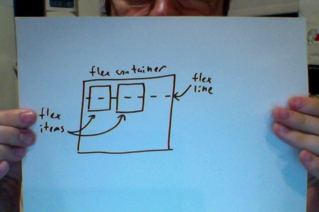
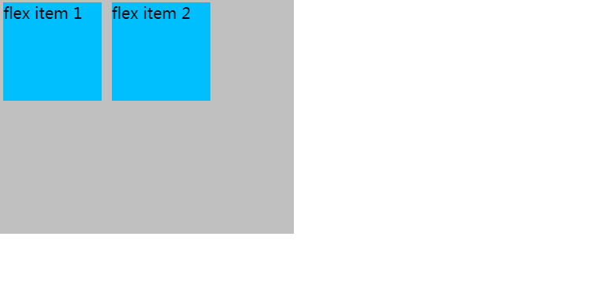
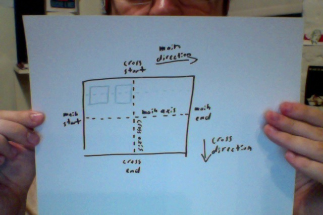
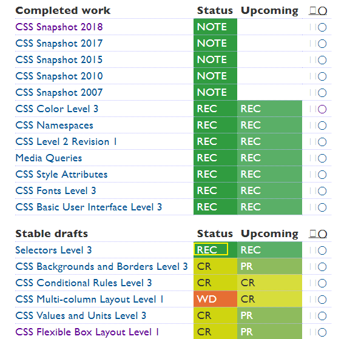

# 深入了解Flexbox

## ★资料

**➹：**[Dive into Flexbox - design, tools and workflow - Bocoup](https://bocoup.com/blog/dive-into-flexbox)

**➹：**[[译]深入了解 Flexbox 伸缩盒模型 - 小影志](https://c7sky.com/dive-into-flexbox.html)

## ★引子

之前对flexbox了解得还是很不够，而且对一些属性的理解甚是表面！而这次打算用flex布局来写个在线简历！所以就再次回顾Flexbox了。

总之，如果你之前那种姿势不能好好理解flexbox的话，那就换几篇文章去看看，然后去理解flexbox！

## ★介绍

Flexbox是CSS3中出现的一种新布局模式，而它是为了现代网络中更为复杂的网页需求而设计出来的。

 本文将介绍最新且稳定的Flexbox 语法的技术细节。 浏览器对它的支持越来越快，所以当 Flexbox 被广泛支持并应用时你将会快人一步。 如果您想知道它的作用以及它是如何工作的（工作原理），不妨仔细了解下吧！

> 有一个很新且很稳定东西出现了，此时并咩有被广泛应用，如果你提前加入这场使用它的游戏，那么你将会快人一步，而不是等到被大家广为熟知的时候。如之前的Vue、typescript……

## ★为什么需要Flexbox？

作者长期以来一直使用这些布局姿势（如表格、浮动、行内块和其它CSS属性等）来布局网站内容。然而，这些工具都不是为我们现在制作的复杂网页和Web应用而设计的。不管是简单的垂直居中，还是灵活的网格布局都很难靠一己之力轻易实现，因此成就了CSS grid frameworks（如960栅格系统和BootStrap，注意可不是目前的**CSS Grid 网格单元格布局**）。

但是，如果真得有这么多项目需要来做这些事情，那么为什么不让它来的更简单些呢？Flexbox 的目的就是改变这一切（如以前的垂直居中很难轻易实现）

> 简单的布局可以用以前的姿势，布局复杂的就用flex之类的，不过就目前的Web来看，网页或者是Web应用相较之前已经很复杂了！所以flex布局能兼容以前的旧姿势吗？即以前的姿势能做的，那么现在用上了flex也能实现同样的效果！

## ★规范状态和浏览器支持情况

Flexbox 规范的相关工作已经进展了3年。不同的浏览器也实现了不同的实验版本。在2012年9月，Flexbox语法的第三个重大修订版本进入到了W3C候选推荐阶段。 这意味着W3C对当前语法感到满意，简而言之就是W3C认为当前的Flexbox语法是稳定的，然后鼓励浏览器开发商去实现它。

Flexbox 规范时间表：

- 2009年7月 工作草案 (display: box;)
- 2011年3月 工作草案 (display: flexbox;)
- 2011年11月 工作草案 (display: flexbox;)
- 2012年3月 工作草案 (display: flexbox;)
- 2012年6月 工作草案 (display: flex;)
- 2012年9月 候选推荐 (display: flex;)

浏览器正在快速采用（支持）Flexbox，Chrome 22+, Opera 12.1+, 和 Opera Mobile 12.1+ 已经支持了本文中所描述的 Flexbox。[Firefox 18](https://developer.mozilla.org/en-US/docs/CSS/Using_CSS_flexible_boxes) 和 [Blackberry 10](http://caniuse.com/flexbox) 也很快就会实现。我推荐大家使用已经支持的浏览器来阅读本文和查看例子。

**➹：**[CSS Flexible Box Layout Module Level 1](https://www.w3.org/TR/css-flexbox-1/)

**➹：**[Can I use... Support tables for HTML5, CSS3, etc](https://caniuse.com/#search=flex)

> 微软都宣布不要使用IE了，所以大胆地去用吧！毕竟现在已经2019年了！距离第一份草案的出现已过去10年了！
>
> 如果有时间可以看看上面的第一个链接！毕竟它是一手资料！
>
> 突然感觉规范（specification）就是在对浏览器厂商提需求，至于这个需求合不合理，需要一系列的工作草案，这时浏览器厂商也会实现不同的实验版本。
>
> 如果到了候选推荐的话，那么这就意味着 W3C 认为当前的语法是稳定的，并鼓励浏览器开发商去实现它。
>
> 举个例子来说，你现今所看的 `display:flex`，起初是从`display: box;`、 `display: flexbox;`演变而来的
>
> 如果还是不好理解的话，那就看看这个Flexbox 规范时间表：
>
> - 2009年7月 工作草案 (display: box;)
> - 2011年3月 工作草案 (display: flexbox;)
> - 2011年11月 工作草案 (display: flexbox;)
> - 2012年3月 工作草案 (display: flexbox;)
> - 2012年6月 工作草案 (display: flex;)
> - 2012年9月 候选推荐 (display: flex;)
> - ……
>
> 给人一种最后的草案，才是候选推荐的感觉……简而言之，就像考数学试卷需要草稿纸一样，千万不要还没有想清楚就写在试卷上，其实当你在草稿纸写清楚后，再写到试卷上这点时间只不过几十秒而已，而你直接在试卷上写的话，需要顾前顾后，以防没有位置写了！这点顾前顾后的时间，又浪费几十秒，而且容易打断思维。况且写在草稿纸上还能给人抄！

ps：当我看到问题①的时候，我才明白草案和候选推荐的关系！

## ★概念和术语

虽然Flexbox使得创建过去「难以或不可能」的布局变得微不足道，但是我们需要一些时间来习惯Flexbox的做事方式。 新的术语和新的抽象概念可能会是我们使用 Flexbox 时的一个障碍，所以让我们先来了解以下它们

Flexbox由*Flex Containers* 和*Flex Items*组成

通过设置元素的 [display](http://learnlayout.com/display.html) 属性为 `flex` 或 `inline-flex`可以得到一个伸缩容器。设置为 `flex` 的容器被渲染为一个块级元素，而设置为 `inline-flex`的容器则渲染为一个行内元素。

Flex容器的每个子元素都是一个Flex Item，而且可以有任意数量的Flex项目。 Flex容器外和Flex项目内的一切元素都照常渲染，即都不受影响。 简而言之，Flexbox定义了Flex项目在Flex容器内的布局方式，或者说是 「Flexbox 定义了伸缩容器内伸缩项目该如何布局。」

> flex容器关注的是flex item，而flex item里的元素、内容什么的，真得会照常渲染吗？
>
> 总之爸爸能操纵儿子的布局

### ◇Flex Lines 伸缩行

伸缩项目沿着伸缩容器内的一个 *伸缩行* 定位。通常每个伸缩容器只有一个伸缩行。



> 我想现在应该叫做main轴了吧！

总之，flex容器里的item默认情况下的定位是沿着一个水平伸缩行从左至右显示。

测试代码：

```html
<div class="flex-container">
    <div class="flex-item">flex item 1</div>
    <div class="flex-item">flex item 2</div>
</div>
```

```css
.flex-container {
    display: -webkit-flex;
    display: flex;
    width: 300px;
    height: 240px;
    background-color: Silver;
}

.flex-item {
    background-color: DeepSkyBlue;
    width: 100px;
    height: 100px;
    margin: 5px;
}
```

效果：



<script async src="//jsfiddle.net/Ambler/csmt7n09/embed/js,html,css,result/dark/"></script>

### ◇Writing Modes 书写模式

在你设计 Flexbox 时的有一个重要的部分是更改伸缩行的方向。默认情况下，**伸缩行和文本方向一致：从左至右，从上往下。**

> 嗦嘎，原来如此啊！一般我们写的文本都是从左往右写的，而有一些文字（如希伯来语、阿拉伯语……）是自右向左书写的
>
> **➹：**[今天，突然想和你扒一扒 世界文字隐藏的书写秘密](https://www.douban.com/note/634144086/)

这是 [W3C 关于一个名为*书写模式*的新特性工作草稿](http://www.w3.org/TR/css3-writing-modes/)。书写模式是一个新的方法，让你可以从右往左写，甚至竖着写，就像你知道的某些语言一样。

书写模式是一个正在进行的计划，但是 Chrome 已经率先支持了 `direction` CSS 属性。如果我们在上一个例子中设置方向为 `rtl` (从右往左) 那么不仅仅文字会从右往左书写，而且 *伸缩行也改变了方向*，并更改了页面的布局。

<script async src="//jsfiddle.net/Ambler/f6oaz5pr/embed/js,html,css,result/dark/"></script>

> 设置body的CSS样式：
>
> ```css
> body {
>     direction: rtl;
> }
> ```
>
> 从这可以看出伸缩行的方向依赖于文本的书写方向，默认的方向（从左到右）是们所接受的，如果是从右到左的话，那么不管是flex容器还是其中的flex item，它们的方向都会发生变化，即一个种对称性变化吧！或者说是我们用户的视角是从右往左看内容的
>
> 不过，我想这些问题不需要我这个菜鸟去考虑！

这也许就就是一个能解释为什么许多flexbox术语如此抽象难懂的地方。当你正在制作一个语言不确定的页面时，你不能简单的只是说“上”、“下”、“左”、“右”。

### ◇The Main Axis and the Cross Axis 主轴和侧轴

为了描述抽象的书写模式（To abstract over the writing-mode），Flexbox 使用 *主轴* 和 *侧轴*的概念。伸缩行跟随主轴。侧轴则垂直于主轴。

> To abstract over the writing-mode：为了在书写模式上进行抽象？
>
> 把书写模式抽象了一层，然后就有了主轴和侧轴的概念？把苹果和橙子抽象了一层，就有了水果的概念？
>
> 也就说这是为了让我们理解书写模式，而衍生了许多概念吗？



起点、终点和各轴的方向的名称如下：

- 主轴起点 Main Start
- 主轴终点 Main End
- 主轴方向 Main Direction (有时候也称为伸缩流方向 Flow Direction)
- 侧轴起点 Cross Start
- 侧轴终点 Cross End
- 侧轴方向 Cross Direction

> flow流？难道是说唱的flow？

在继续了解之前明白主轴和侧轴是至关重要的。Flexbox 中的一切都和这些轴有关。在我们所有的例子中，书写模式都是从左至右，从上到下，但是你需要记住**并不是所有的 Flexbox 都是这样的**。

## ★flex容器的属性

### ◇flex-direction 伸缩流的方向

`flex-direction` 允许你更改伸缩容器的主轴方向。`flex-direction` 的默认值是 `row`。使用此值，Flex项目则按写入模式的方向布局。 可见，这意味着默认情况下是从左到右，从上到下的。 其他值如下：

- row-reverse: 主轴起点和主轴终点交换。如果书写模式是从左至右，伸缩项目则是从右往左排列。
- column: 主轴和侧轴交换。如果书写系统是水平的，那么伸缩项目现在是垂直布局的。
- column-reverse: 和 column 一样，但是方向相反。

让我们以前面的例子为例，将`flex-direction`更改为`column`：

<script async src="//jsfiddle.net/Ambler/k70em8j6/embed/js,html,css,result/dark/"></script>

可见，现在我们的Flex项目是垂直布局的


## ★总结

- 我开始意识到了解一个技术或者是方案的诞生历史是非常重要的，因为这是你深入了解它的必经途径。像我之前学习flexbox，我知道它是因为以前的布局方式不好用才出现的，其实明确一点来说就是以前的布局方式不适合现在这种网页、web应用变得复杂的情况。然后有了flexbox这样的概念之后，也会基于此诞生许多概念，而这些概念总有一些是基于某些原因而出现的，如main轴和侧轴就是因为书写模式的原因而出现的……

  还有就是整体了解了在flex布局出现之前有哪些布局姿势！

  所以了解技术或者方案的历史非常重要！

  **➹：**[前端进化史：从「自适应」到「响应式」 - 前端进阶 - SegmentFault 思否](https://segmentfault.com/a/1190000000355077)

- 关于翻译，我得找一些有中文翻译的文章，然后中英对照来看，等能力水平有一定程度之后，我才去看英文，因为这时你有许多概念是懂得的！除非你想看其它不相关方面内容的英文……

- [有哪些非常好的前端网站或个人博客？ - 知乎](https://www.zhihu.com/question/42186243)

- 关于W3C的CSS规范文档：[层叠样式表](https://www.w3.org/Style/CSS/#translations)

- 发展与变化似乎紧密结合的，就像Web的发展，衍生了很多新技术和新的解决方案。真不知道人为啥有那么多需求呢？讲真，不要更新了，我学不动了……

  **➹：**[2016 年哪些互联网技术开始变得流行，哪些过时了？ - 知乎](https://www.zhihu.com/question/53351477)

  关于下面这个链接：

  **➹：**[对于计算机学科的学习，你所理解的什么是“内功”？作为初学者在平时如何去修炼这种“内功”？ - 知乎](https://www.zhihu.com/question/27928759)

  的有些评论，我真得笑抽了，如：

  > 李戈的课我觉得挺经典的。看了你这个回答，我决定再去听听战老师的课。以前看课程介绍，真的是被他的图雷到了，乡土气息非常浓厚，感觉像个江湖术士一样。谢谢分享真实感受。

  关于战老师的课，我觉得是那种越嚼越有味的课，不过当你嚼不动了，那你就得停下来了，不然牙齿蹦了，总之，找工作前可以8分学可以直接应用到工作中的课，即接近工作的课，2分学类似战老师这种偏向思维、内功的课，如数据结构与算法、网络等等。找到工作且稳定之后，可以逐渐把重心转移到内功的修炼上来

  注意，你要紧跟一个原则就是「不要试图一次把这些东西给弄懂！」有些东西，咩有一定的积累，是很难继续进行下去的！

- 不知为何，看到手写的草图，相较于用工具画的图，反而会有更深的理解和记忆！

- 有些博客是偏告诉你怎么用方面的，而有些则告诉你原理是怎样的……前者快上手，而后者则让你比较理解之后才使用！我突然感觉还是看MDN比较好，或者说最后都得看MDN……

  **➹：**[flex 布局的基本概念 - CSS：层叠样式表 - MDN](https://developer.mozilla.org/zh-CN/docs/Web/CSS/CSS_Flexible_Box_Layout/Basic_Concepts_of_Flexbox)

- 可以想想写一篇「深入了解xxx」是如何写的……如：

  1. 大致解释xxx是什么和你这篇博客讲什么，好让读者有没有看下去的胃口
  2. 为啥需要xxx？——解释why，一般都是这样：因为zzz、yyy不好用呀！所以用了xxx，还有主要是为了解决什么问题而出现的，没有它的话，会咋样？有了它之后，又会咋样……
  3. 多用人吗？支持如何？——「这怕是个孤儿吧！」「相信我，用起来杠杆的」「你看ppd都是它的支持者」……
  4. 整些概念和术语出来，好理解后面的使用？——解释what，话说这二者是一个意思吗？还是说这概念是flexbox造出来的，还没有成为让大家都得这样说的术语，只是针对flexbox而产生出来的概念？
  5. 咋用呢？——解释How，用起来吧！用到你自己的项目中去，用到你的工作中去……
  6. 总结？——从这当中我学到什么什么？改变了我以往的什么什么观念？对我目前的什么什么行为产生了什么什么改变？优点和缺点？在什么场景下就可以使用它？是否还有继续深入下去的必要？是否还有更好的姿势？……

## ★Q&A

### ①下图中NOTE、REC、CR等表示什么？

> 这是W3C的CSS规范文档：[Cascading Style Sheets](https://www.w3.org/Style/CSS/) 中的「STAN­DARDS & DRAFTS」这部分的 内容解释



---

1. Working Draft (WD)：工作草案是由W3C发布的，供社区review的文档，包括W3C成员、公开的和其它技术机构。
2. Candidate Recommendation (CR)：候选建议书是满足工作组技术要求，并且经过广泛review的文档。
3. Proposed Recommendation（PR）：提议建议书是已经被W3C负责人接受质量达标（质量足以作为W3C建议书）的文档。
4. W3C Recommendation (REC)：W3C建议书是一项规范或要求，经过广泛达成共识，已获得W3C成员和负责人的认可。W3C建议将其建议书广泛用作Web标准，根据W3C专利条款授予的W3C免版税知识产权许可适用于W3C建议书。
5. Obsolete Recommendation：过时的建议书是W3C认为不具有足够的市场相关性以支持继续建议社区去实现的规范，而不是说存在需要撤销建议书的基本问题。
6. Rescinded Recommendation：撤销的建议书是W3C不再认可的完整建议书，认为不可能再恢复到建议书状态。
7. Working Group Note, Interest Group Note (NOTE)：工作组说明或兴趣组说明是由特许工作组或兴趣组发布的，用来给有用的，但不打算作为正式标准的文档提供稳定参考，或者用来记录没有形成推荐书的被废弃的工作。

总之从WD到REC，成熟度越来越高，不过负责人（Director）可以拒绝向更高成熟度阶段发展，也可以选择回退到低成熟度阶段。

还有主要流程为：WD→☞CR→☞PR→☞REC

所以也就是说目前 「CSS Flexible Box Layout Module Level 1」是CR阶段咯，即将迈入PR了呀！

**➹：**[W3C规范制定流程 - 黯羽轻扬](http://www.ayqy.net/blog/w3c%E8%A7%84%E8%8C%83%E5%88%B6%E5%AE%9A%E6%B5%81%E7%A8%8B/)

### ②概念和术语的区别？

Concepts and Terminology：

前者： 概念，观念；思想（concept复数形式）

后者：术语

> 概念是反映对象的特有属性的思维形式。人们在反复的实践和认识过程中，将事物共同的本质特点抽出来加以概括，从感性认识飞跃到理性认识，就成为概念。术语是学术和各种工艺上的专门用语。

**➹：**[概念和术语有什么区别？_百度知道](https://zhidao.baidu.com/question/424263255335166292.html)


