# 像素的那些事儿

## ★引子

时常和CSS里边的px单位打交道，但是我从未了解过它是什么。它引起了我的好奇，所以我打算「浅」入了解它一番。

## ★名词党

> 名词党：懂很多炫酷屌炸的概念的表面含义，由于没有什么深刻理解，以致于无法用出来。一般会有「装逼」的嫌疑。
>
> **➹：**[如何不成为名词党? - 知乎](https://www.zhihu.com/question/35816294)
>
> **➹：**[为什么需要知识图谱？什么是知识图谱？——KG的前世今生 - 知乎](https://zhuanlan.zhihu.com/p/31726910)

## ★像素

在数字成像（数字图像采集）中，像素（pixel、pel、picture element）是光栅图像里边的一个物理点（physical point）。

根据一种知识表示形式——语义网络(Semantic Network)来说，像素和光栅图像是part-of关系，如下所示：

像素它是屏幕上所显示的图片里边的最小可控元素。

此时我在想：

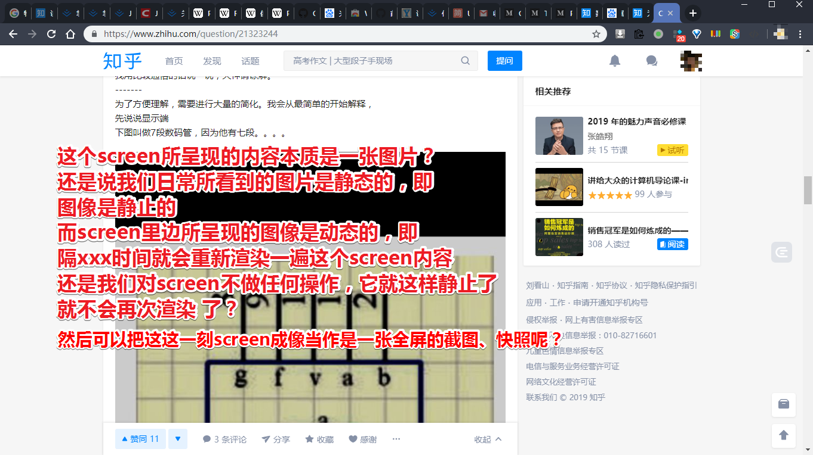

那么问题来了，计算机是如何显示出字符的？

根据这个[答案](https://www.zhihu.com/question/21323244/answer/182936660)的理解（大学期间，学过单片机，但忘记了）：

1. 假如显示端只有[7段数码管](https://baike.baidu.com/item/%E4%B8%83%E6%AE%B5%E6%95%B0%E7%A0%81%E7%AE%A1)：

   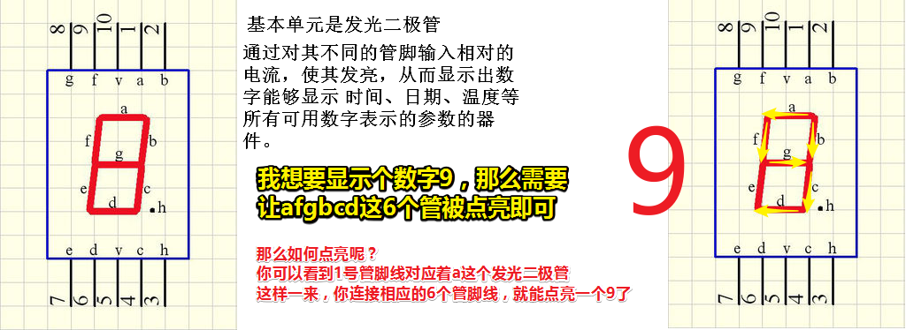

   至此，一个字符就这样被显示出来了，同理，其它数字，英文字母的显示也是如此。总之，我们需要繁琐的操控7根小电线，换言之，输入xx根线，输出（点亮）xx个管。那么问题来了，假如我想显示我的名字呢？比如「猪八戒」，于是产生了系列的疑问，比如说「中文怎么显示？7段数码管表示宝宝做不呀！」「显示3个中文字符会不会有点多啊？这我得接入多少根线才能点亮猪八戒呀！老子不干了……」

   于是就出现了译码器。那么它有啥用呢？——之前你显示个9需要用到6根线，而现在你用上了译码器这个黑家伙，只需要接入4根线就可以做到了，你说神不神奇？

   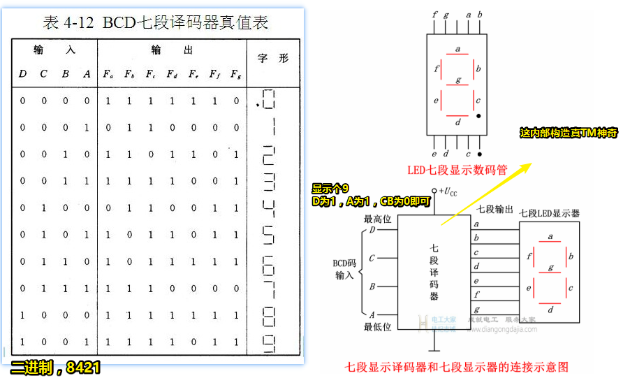

   > 关于译码器的实现，就像是chrome对ES6新特性所支持的程度那样：
   >
   > 1. 一批能人异士为了解决某个xxx问题制定了相关规则和标准，即画饼。
   > 2. 按照规范来实现译码器的内部电路，目的是可以「**减少数码管显示所需要控制的管脚数量**」
   > 3. 测试译码器：
   >    1. 通过，ok，老子可以卖译码器赚钱了；
   >    2. 不通过，老子不干了，老子自己写规范，不要你家的规范，你家的规范就是在欺负我「菜」！反正结果就那样，为啥要用你家的规范？
   >
   > 由于接上了一个译码器，此时「接入的7根线」沦为了输出。（输出与输入是相对的，比如说7根线相对于7段译码器来说就是输出，而相对于7段LED显示器来说就是输入！）

   当然这样的译码器比较简单。

2. 抽象（抽出事物的本质特性而暂时不考虑它们的细节）一下，然后你可以想象出一个非常牛逼、牛逼的译码器，你只需要告诉它15个1或0，那么它就可以控制一个「三百万段数码管」（`1366*768*3`）（宝宝表示：「用了它之后，我这显示得有多丰富啊！要显示啥字符就显示啥字符！」）。那么这牛逼的译码器是否已经被实现了呢？——很遗憾的告诉你，它已经被实现了，而它名字就是「[VGA](https://baike.baidu.com/item/VGA%E6%8E%A5%E5%8F%A3)」（它还使用了时钟的概念，可见这是新加的功能，有了质的飞跃，不单只是多了几个输入，然后可以多控制几个输出），所以 你不能拿它「赚钱」了。

   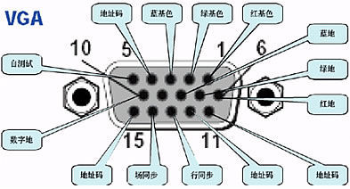

3. CPU端

   不要觉得CPU只有一个输出的电线，它是可以同时有多个输入和输出的，而且又可以不同时（时钟）有多个输入输出

## ★总结

## ★Q&A

### ①什么是信号？

我理解的信号？就是看玄幻小说时，主角被人发现了，然后一帮狗腿子就向天空发射一颗弹，这颗弹就是信号弹，用于通知其它人过来围剿、打杀主角。

而[维基](https://zh.wikipedia.org/wiki/%E4%BF%A1%E5%8F%B7)里边的定义是这样的：

> **信号**（英语：Signal）可以指：
>
> 科学概念：
>
> - [信号 (信息论)](https://zh.wikipedia.org/wiki/信号_(信息论))，可用数学函数表示的一种信息流。
> - [细胞信号传送](https://zh.wikipedia.org/wiki/细胞信号传送)，生物细胞响应周遭环境并与之沟通。
> - [Unix信号](https://zh.wikipedia.org/wiki/Unix信号)，信号是消息的表现形式，消息则是信号的具体内容。
> - 在[计算机科学](https://zh.wikipedia.org/wiki/计算机科学)中，信号表示计算过程中传递的事件。
> - 在[电信](https://zh.wikipedia.org/wiki/电信)中，信号是通信协议的一部分。
>
> 其他：
>
> - [交通信号灯](https://zh.wikipedia.org/wiki/交通信号灯)，交通控制的一种方式。

抽象一来看，信号可以影响xxx的行为，当然，这是信号的用途，而我还是不知道信号到底是什么。

还有我可以理解为信号就是就是消息的载体，如信号弹是「主角在发信号弹的这个位置被我发现了，请大少爷和其它狗腿子快点过来」这个消息的载体！

**➹：**[什么是信号？ - 知乎](https://www.zhihu.com/question/302481988)

**➹：**[通信工程荐书（一）：数字信号处理精要 - 知乎](https://zhuanlan.zhihu.com/p/49894985)

### ②什么是模拟信号？

无线电波「指在自由空间（包括空气和真空）传播的射频频段的电磁波」是用来传输数据的，形象点来说，无线电波就是一种运送东西的交通工具。

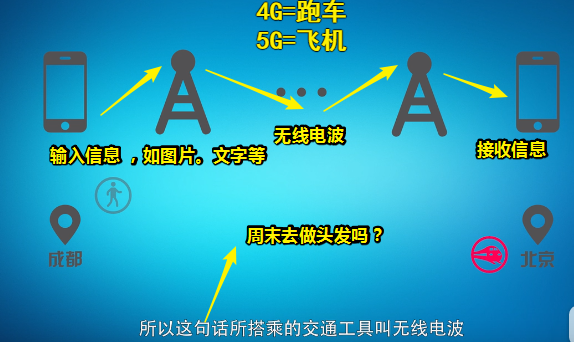

无线电波是如何产生的？

打开开关和关闭开关，这旁边的电压表有一定的波动

可件，打开或关闭开关的瞬间，磁场发生了变化，那么就会让旁边的电路产生电流

反复打开和关闭，电压表会有一个周期性的波动！

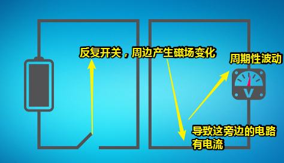

无线电波可以抽象成啥样？（类似于拍打水面的波纹，一圈又一圈……一波又一波）

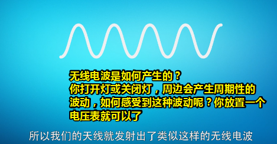

如何产生这样的波纹？——加大电流，把开关换成是振荡器，经过振荡器的电流转换成交流电，那么这就意味着正负极是来回交替变化的，然后我们的天线就发射出这种正弦曲线波形了。

> 交流电流是指**大小和方向都发生周期性变化的电流**，在一个周期内的运行平均值为零。不同于直流电，后者的方向是不会随着时间发生改变的，并且直流电没有周期性变化。 **通常波形为正弦曲线**。交流电可以有效传输电力。但实际上还有应用其他的波形，例如三角形波、正方形波。生活中使用的市电就是具有正弦波形的交流电。

---

在手机传输信息之前，往往需要将模拟信号转化为电信号之后才会传输。那么模拟信号是什么呢？

模拟信号简单来说就是用电信号去模拟其它的信号（信息的载体）。比如电信号模拟出我们的图像（信息的载体），模拟出声音的声波：

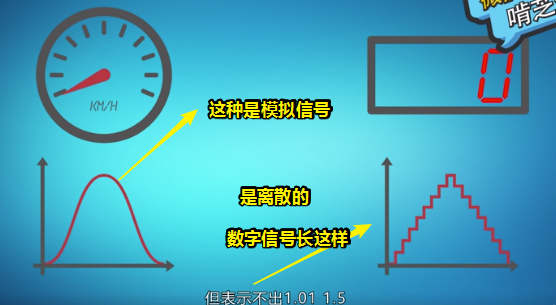

为啥需要数字信号？

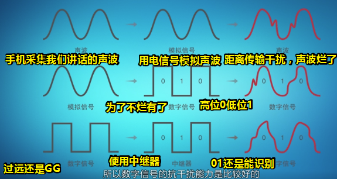

> 电信号是指以电压、电流、电磁波等为载体的信号。简单来说就可以把「周末去做头发」这个信息放在电磁波（可以简单地把电磁波看做是信息）里边。而电信号是以电磁波的方式在传输线上传播的。
>
> 额……似乎这样理解才是对的，电信号是二进制信息流的载体呀！然后我们要传输数据的话，显然需要把电信号转化成是电磁波的形式，然而搜索得知「电信号实际上是一种电磁波」。
>
> 无线电波和有线电波的区别：都是传输电磁波，不过传输的方式不同。（无线电波和光都是电磁波）
>
> **➹：**[无线电波和有线电波的区别是什么？ 爱问知识人](https://iask.sina.com.cn/b/16594416.html)

如何让模拟信号转化为数字信号？（以下是转换原理，采样率和量化等级比较低，如果提高了，那么形状上自然会越来越接近下边那个曲线。也就意味着能更好的还原出我们的模拟信号）

> 我们用电信号模拟了声波，而这电信号实际是一种信息，至此我们可以量化它！然后搞成是数字信号（这才是二进制流呀！），即便它是数字信号，也是通过无线或无线电波来传输的。传输过去之后数字信号要还原成电信号，然后复原为声波。
>
> 有这样一个例子：
>
> 你想知道声波是如何转化成电信号的？那么首先要明白一件事，就是自己嘴里的电信号是什么。
>
> 对于声音而言，转化得到的电信号就是声音的波形。而波形中就包括了音量、音色等所有的信息
>
> 那么我现在写的这个笔记又是如何从本地传输到github的服务器上的呢？
>
> 传输到指定的主机的不是电磁波，而是数据。数据是可以被解读的，可以描述自己需要被发送到什么主机，解读数据的方式就是网络协议，负责投递到指定主机的协议就是IP（网际协议）。
>
> 嗦嘎……传输的居然不是电磁波？电磁波不是数据的载体么？没有载体的话，那么数据是如何被传输的？总不能说电流与二进制数据的关系，就像是水流与轮船的关系吧！
>
> 对了，交流电是发生周期性变化的电流呀！既然有周期性变化，那么就有信息呀！即这是以电流（还是电压呢？）为载体的电信号呀！而平时我们上网都是用有线来上网的，我不知道是不是转化为光信号，既然是光信号，那么这TM还是电磁波呀！

1. 对模拟信号进行采样，如每秒对正弦曲线波形采样一次

2. 采样完成之后，进行量化，由于模拟信号是一个连续变化的值，所以我们需要离散这些值，然后把它们量化为一级、二级、三级这样……类似于在学校时的考试分数，60分以下不及格，60~70为合格，71-100为优秀。同样这量化类似于xxx电器把省电程度量化为一级能效、二级能效……

3. 量化完成之后，对量化的等级进行编码，如一级就是001，二级就是010……即一个等级对应一组二进制数字，然后连接起来，就得到一串二进制数字：

   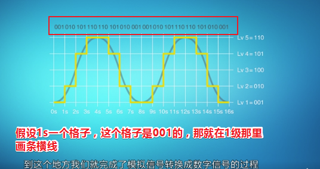

> 话说我们拿到的一串二进制数字有何用？
>
> 这是声波的采集和量化而来的，意味着我们可以还原你说过那些话儿
>
> 那么我们平时写的文本文件呢？难道直接就是通过编码化为一串二进制数字，即二进制字节流这样无须采样和量化吗？还是说还要搞成为电磁波，即正弦曲线波形，然后通过无线电波传给遥远的她，然后那么的她解析无线电波为一连串二进制，然后解码为对应的字符串！
>
> 额……好像无线电波就是电磁波额！难道直接就是把一连串二进制数值搞成是电磁波，即无线电波传给远方的她？可是无线电波不是火车吗？用于装东西的啊！按理说应该只有一辆火车，但其实传输了一定量的数据就是一辆崭新的火车了。
>
> 话说，这电磁波的波形即便为正弦曲线波形，也会有矮的和胖的吧？总不可能都是一模一样的波形吧！你看水波一圈比一圈大，形式上都是一个圈圈！

**➹：**[模拟信号_百度百科](https://baike.baidu.com/item/%E6%A8%A1%E6%8B%9F%E4%BF%A1%E5%8F%B7/706796)

**➹：**[无线电波是怎么产生的？为啥无线电波可以隔空传输图片、视频这些数据？_哔哩哔哩 (゜-゜)つロ 干杯~-bilibili](https://www.bilibili.com/video/av23448535/)

**➹：**[什么是模拟信号？数字信号？区别是啥？它们又是如何完成转换的？ - 知乎](https://zhuanlan.zhihu.com/p/39962777)

**➹：**[什么叫信号失真？ - 知乎](https://www.zhihu.com/question/67365966)

**➹：**[为什么要采用交流电？交流电有什么好处？ - 知乎](https://www.zhihu.com/question/52692992)

> 上边这个问题类似于为啥CPU需要时钟一样，如果不用交流电，那么整个xxx系统的工作就是不可靠的！

**➹：**[电信号在传输线中是怎样传播？ - 知乎](https://www.zhihu.com/question/67157381)

**➹：**[声波是如何转化成电信号的？ - 知乎](https://www.zhihu.com/question/25003786)

**➹：**[无线通信中的术语，超通俗解释！（上） - 知乎](https://zhuanlan.zhihu.com/p/48820296)

**➹：**[无线电波是光吗_百度知道](https://zhidao.baidu.com/question/61398368.html)

**➹：**[开脑洞，如果人类能看见无线电波，会是一番怎么样的景象？ - 知乎](https://www.zhihu.com/question/283851254)

**➹：**[数据怎样在网络中传输的？要经过怎样的包装才能保证传输准确？ - 知乎](https://www.zhihu.com/question/57012774)

### ③CPU？时钟？

> CPU 可以有时钟，也可以没有时钟。使用时钟工作的 CPU 被称为同步 CPU（synchronous CPU），而不使用时钟工作的 CPU 被称为异步 CPU（asynchronous CPU）。目前市面上广泛销售的 CPU 都是同步 CPU。

由于CPU是不可能自己单独完成工作的，而无固定频率（即“时钟“）的CPU和周边工作单元协同工作时，因为**大家步调不一致，沟通起来效率会打折扣**。

所以为什么要引入时钟呢？

> 引入“时钟”最重要的作用是**为了简化 从而降低计算机的设计成本。**

假如没有引入时钟会咋样？

> 想象一下，大BOSS就是CPU分配工作，时刻提醒自己，记着要告诉RAM：你准备好，我要在0.000000000000123456........秒后调用你的数据哦，还有要再对Modem说：0.000000234567....秒开始给我下载，哎那个键盘，老子正忙着呢，你这时候给我提交输入不是添乱嘛！。。。。。。。。哎唷，搞的大家都很累好么！

而引入时钟（周期）的话，这些都简化了：**比如只要在固定周期去接收和处理键盘提交的输入就好了**。

什么是同步工作？

> CPU接了个给广场铺砖的活，于是带一帮只懂铺砖的RAM、Modem、key、、去干活，用边长1×1的地砖是最简单的，只要给大家说：A你从第一块开始铺，B从100块开始，C从200块开始。。。。。。这样大家可以同步工作了。
>
> 如果ABCDEFG.....大家各用各自规格的地板砖来开工，CPU准得急死！

这里的同步指的是一起干，而且是大家各自互不干扰的干，类似于一个人干时，未来的活儿，被未来的你干你！

可见，简单来说，**时钟（周期）就是为了规定一个最小单位（比如100块）的地板砖**。

再形象点，我们知道一个交响乐团里边需要有一个指挥，不然整首歌的演奏只靠每个人的记忆来确定自己什么时候该唱，该拉小提琴等等的话，那么这显然很容易让这首歌被演奏的不齐！而有了指挥之后，xx什么时候该唱，yy什么时候该弹等等都有了确切的认识，至此，大家协同工作演绎完整首歌曲将不在话下。

**➹：**[来自外公的一封信_哔哩哔哩 (゜-゜)つロ 干杯~-bilibili](https://www.bilibili.com/video/av45999302/)

或者说它就是个节拍器，作用于寄存器上，以 `1+2+3+4+...+10=？`来说， 用于保证下一个操作数和上一次计算的和是同时进入逻辑运算单元（ALU，算术逻辑单元）「时钟的高压5V脉冲到了就同时写入」，然后得到一个外部输出和内部输出，在下一个时钟脉冲到达之前，一直保持稳定状态，然后当时钟电压再次升高到5V以后，两个寄存器同时被写入新的值，逻辑运算单元接收到两个新输入……依次类推……

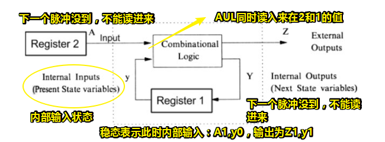

> 5v脉冲到了，就打破稳态！即Ay的值发生了变化，至此通过ALU的计算，ZY的值也发生了变化！来到了下一轮的稳态！

总之，时钟保证了ALU的「同步」（同时步入ALU的大门）读取，这样的逻辑电路之间的迭代，才是有章法的！

**讲真，具体实现我是真得不明白，我也不知道我到底理解了没。我只知道时钟的存在，会保证CPU里边的各个小模块的输入和输出是稳定的！不会乱来！然后所有小模块都稳定了，那么整个计算机也就稳定了。**

> 记得高中当宿舍长的时候，那时的我并不会管理宿舍的卫生状况，只秉持着自愿原则去搞，或者大家想搞了那就一起搞……而这样一来宿舍的卫生是毫无章法的，即可能某一天是干净的，或者一直到学期结束都没有打扫过一次卫生，或者xx打扫了这块，第二天yy还是打扫了这块，然后干净的还是干净的，不干净的一直不干净……如果那时的我有「时钟」的概念，那么我想我一定会保证整个宿舍的卫生状况是稳定的！

**➹：**[为什么CPU需要时钟才能工作？ - 知乎](https://www.zhihu.com/question/21981280)

