# 像素的那些事儿

## ★引子

时常和CSS里边的px单位打交道，但是我从未了解过它是什么。它引起了我的好奇，所以我打算「浅」入了解它一番。

## ★名词党

> 名词党：懂很多炫酷屌炸的概念的表面含义，由于没有什么深刻理解，以致于无法用出来。一般会有「装逼」的嫌疑。
>
> **➹：**[如何不成为名词党? - 知乎](https://www.zhihu.com/question/35816294)
>
> **➹：**[为什么需要知识图谱？什么是知识图谱？——KG的前世今生 - 知乎](https://zhuanlan.zhihu.com/p/31726910)

## ★像素（Pixel）

在数字成像（数字图像采集）中，像素（pixel、pel、picture element）是光栅图像里边的一个物理点（physical point）。

根据一种知识表示形式——语义网络(Semantic Network)来说，像素和光栅图像是part-of关系，如下所示：


像素它是屏幕上所显示的图片里边的最小可控元素。

此时我在想：


那么问题来了，计算机是如何显示出字符的？

根据这个[答案](https://www.zhihu.com/question/21323244/answer/182936660)的理解（大学期间，学过单片机，但忘记了）：

1. 假如显示端只有[7段数码管](https://baike.baidu.com/item/%E4%B8%83%E6%AE%B5%E6%95%B0%E7%A0%81%E7%AE%A1)：

   

   至此，一个字符就这样被显示出来了，同理，其它数字，英文字母的显示也是如此。总之，我们需要繁琐的操控7根小电线，换言之，输入xx根线，输出（点亮）xx个管。那么问题来了，假如我想显示我的名字呢？比如「猪八戒」，于是产生了系列的疑问，比如说「中文怎么显示？7段数码管表示宝宝做不呀！」「显示3个中文字符会不会有点多啊？这我得接入多少根线才能点亮猪八戒呀！老子不干了……」

   于是就出现了译码器。那么它有啥用呢？——之前你显示个9需要用到6根线，而现在你用上了译码器这个黑家伙，只需要接入4根线就可以做到了，你说神不神奇？

   

   > 关于译码器的实现，就像是chrome对ES6新特性所支持的程度那样：
   >
   > 1. 一批能人异士为了解决某个xxx问题制定了相关规则和标准，即画饼。
   > 2. 按照规范来实现译码器的内部电路，目的是可以「**减少数码管显示所需要控制的管脚数量**」
   > 3. 测试译码器：
   >    1. 通过，ok，老子可以卖译码器赚钱了；
   >    2. 不通过，老子不干了，老子自己写规范，不要你家的规范，你家的规范就是在欺负我「菜」！反正结果就那样，为啥要用你家的规范？
   >
   > 由于接上了一个译码器，此时「接入的7根线」沦为了输出。（输出与输入是相对的，比如说7根线相对于7段译码器来说就是输出，而相对于7段LED显示器来说就是输入！）

   当然这样的译码器比较简单。

2. 抽象（抽出事物的本质特性而暂时不考虑它们的细节）一下，然后你可以想象出一个非常牛逼、牛逼的译码器，你只需要告诉它15个1或0，那么它就可以控制一个「三百万段数码管」（`1366*768*3`）（宝宝表示：「用了它之后，我这显示得有多丰富啊！要显示啥字符就显示啥字符！」）。那么这牛逼的译码器是否已经被实现了呢？——很遗憾的告诉你，它已经被实现了，而它名字就是「[VGA](https://baike.baidu.com/item/VGA%E6%8E%A5%E5%8F%A3)」（它还使用了时钟的概念，可见这是新加的功能，有了质的飞跃，不单只是多了几个输入，然后可以多控制几个输出），所以 你不能拿它「赚钱」了。

   

3. CPU端

   **不要觉得CPU只有一个输出的电线，它是可以同时有多个输入和输出的，而且又可以不同时（时钟）有多个输入输出**
   
   > 这句话不是很理解呀！难道是可以「同步」？也可以「异步」？
   >
   > 还有屏幕所显示的内容是不是可以局部点亮的呀！不然每次改一点东西，都得把整个屏幕的显示给重新渲染一遍？
   
   我们来看看CPU芯片的输入输出可以有几个：
   
   
   
   可见：
   
   > CPU可以通过密密麻麻的电线连接到译码器。然后译码器又连接屏幕上密密麻麻的素点进行控制。人类只要设计好字符对应的点阵，并设计出译码器，计算机就可以点亮与字符对应的像素点，完成显示字符的任务。

还有一个比较简洁的[答案](https://www.zhihu.com/question/21323244/answer/181517333)：

> 大概是这个过程：
>
> 内存里的字符 → 内存里的 unicode → 字体文件中的 gid（glyph id，字形标识？） 序列 → 字体文件中的矢量图序列 → 点阵化送显示屏

还有[一个](https://www.zhihu.com/question/21323244/answer/17901216)：

> 一生二，二生三，三生万物。
> 最简单的开开关关，经过上亿次的组合，于是就变成各种高科技了。
> 围棋也是，DNA也是，一开始的规则都很简单，多了就复杂了。

看了很多个答案，我有了以下几点认识：

> 参考这个[答案](https://www.zhihu.com/question/21323244/answer/182135238)。

- 「单位[面积](https://zh.wikipedia.org/wiki/面積)内的像素越多代表分辨率越高，所显示的影像就会接近于真实物体。」如何理解这句话？

  你看这幅图：

  

  在写CSS的时候，经常会有 `border:1px solid red;`对吧！而这1px真得是0.26mm吗？如果真得是照理说，应该看不见才对的呀！

  额……我搜索了一下，发现屏幕保护膜的厚度有0.26mm、0.33mm等这样的，而我们在现实里边看保护膜的时候，确实能见着这样的厚度：

  

- 液晶显示器的工作原理：（放大你的显示器，你能看到成千上万的红绿蓝颜色的小点，而RGB这样的三个小点组成一个像素，通过调整流过每组电极的电量，我们可以控制到达每个滤光片的光强，进而控制显示器上显示的颜色）

  

  改变rgb各自的分量（取值是0到255），一个像素即一个整体看起来就是不同颜色了，我们肉眼无法观测到一个1px，然后根据RGB这三个LED点亮的亮度不同，所呈现的整个像素的颜色也是有所不同的。

  注意，显示器以大约60Hz的频率逐行调整通过每一个液晶的电量！

  

  **➹：**[液晶显示器工作原理_腾讯视频](https://v.qq.com/x/page/y05031fdyta.html)

- 浏览器中的网页给我的感觉，一个个长长的网页就像是让显示屏的高度无限的延长了。

- 计算那张全屏截图大小：

  

  

   不然就是3M多了。

  然而我看到了这条公式：

  

  我们这张图的位深度是32，也就是说还有透明度咯！

  

  然而，这距离我们的实际值，还是有区别呀！

  通过搜索得知：

  bmp文件只要知道尺寸和位深，就可以知道大致的大小：

  如**32位bmp**文件就是 `长 x 宽 x 4`（实际大小肯定比这个要大一点）

  而常用的web图片格式——`png/jpg/gif`，无法得到准确公式，因为这几个格式都是有压缩的。针对这类文件，有个原则，那就是「**颜色的分布越有序，图片文件越小**」，所以得到345KB是压缩过后的结果。

  **➹：**[图片的文件体积（数据量）是否有计算公式呢？ - 知乎](https://www.zhihu.com/question/21770357)

----

**➹：**[像素 - 维基百科，自由的百科全书](https://zh.wikipedia.org/wiki/%E5%83%8F%E7%B4%A0)

**➹：**[数码相机成像原理是什么？ - 知乎](https://www.zhihu.com/question/21006516)

**➹：**[【當個創世神:红石教室】红石电路的组成与元件介绍！[Minecraft:Redstone School] Introduce to Redstone System! - YouTube](https://www.youtube.com/watch?v=xRHVq-8vSYQ)

**➹：**[小谈抽象思维（思维篇） - 思维焦点 - 博客园](https://www.cnblogs.com/xiezhidong/p/6614057.html)

**➹：**[CPU 只能进行数值运算，那么计算机是怎么显示出字符的？ - 知乎](https://www.zhihu.com/question/21323244)

**➹：**[程序员对计算机背后的运行机制的掌握是不是很有必要？ - 知乎](https://www.zhihu.com/question/58652147/answer/157875897)

**➹：**[从物理层面解释，为什么在键盘上输入 abc，电脑屏幕上就会显示 abc？ - 知乎](https://www.zhihu.com/question/265849231)

---

## ★光栅图（Raster graphics）

在计算机图形学中，光栅图（ **raster graphics**）或位图（ **bitmap**）图像或点阵图是一种点阵数据结构，即它表示由矩形像素(颜色点)组成的格子（rectangular grid of pixels）图，可以通过显示器、纸张或其他显示介质查看。光栅图像存储在不同格式的图像文件中。


> 左上角的笑脸是光栅图像。放大后，单个像素显示为正方形。进一步放大后，可以对它们进行分析，通过组合红色、绿色和蓝色的值来构建它们的颜色。

其它解释：

> 所谓的光栅（raster image）或位图（bitmapped image）图片，是指将图像定义为由点（或像素）组成，每个点（或像素）可以由多种色彩表示，包括2、4、8、16、24和32位色彩。


如图，将屏幕放大至一定程度，可以看见是由很多个点（或像素）组成，屏幕上的这些一个一个的点（或像素）就是我们说的**物理像素**，而像素数量的不同及每个像素的不同色彩表示就构成图像展示，决定它的**视觉表现**。

**➹：**[Raster graphics - Wikipedia](https://en.wikipedia.org/wiki/Raster_graphics)

**➹：**[CSS 屏幕知识 - 知乎](https://zhuanlan.zhihu.com/p/32694760)

## ★像素密度（Pixel Density）

像素密度指的是有多少像素被压缩到一个物理空间(通常是一英寸)里边。如下图所示：


你可以看到同样大小的一个矩形物理空间，可以被当作是一个1个像素，4个像素，9个像素！

我的手机尺寸为`5.99`英寸，而分辨率是`1080x2160` 的，根据下边这个公式：


我可以得到该手机的屏幕像素密度PPI为`403 PPI`


我在想**403是不是表示每英寸里边有403个像素**，就像是xxx买了36个苹果，然后平均分给6个人，那么每个人就能拿到6个。

如果我想得没错的话，那么上方那张图假如是一英寸平方的物理空间的话，那么就会被塞入403*403个像素！

**➹：**[像素密度解密 – Intersection](https://intersection.tw/%E5%83%8F%E7%B4%A0%E5%AF%86%E5%BA%A6%E8%A7%A3%E5%AF%86-630b3ac2e0bb)

**➹：**[Pixel Density, Demystified – Peter Nowell – Medium](https://medium.com/@pnowelldesign/pixel-density-demystified-a4db63ba2922)

## ★DP（device pixels）

> **设备像素（物理像素）**，顾名思义，显示屏是由一个个**物理像素**点组成的，通过控制每个像素点的颜色，使屏幕显示出不同的图像，**屏幕从工厂出来那天起**，它上面的**物理像素点**就固定不变了，单位**pt**。
>
> 注意：
>
> **pt在css单位中属于真正的绝对单位，1pt = 1/72(inch),inch及英寸，而1英寸等于2.54厘米。**
>
> 不同的设备，其图像基本单位是不同的，比如显示器的点距，可以认为是显示器的**物理像素**。现在的液晶显示器的点距一般在`0.25mm`到`0.29mm`之间。而打印机的墨点，也可以认为是打印机的物理像素，`300DPI`就是`0.085mm`，`600DPI`就是`0.042mm`。
>
> 注意，我们通常所说的**显示器分辨率**，其实是指**桌面设定的分辨率**，而不是显示器的**物理分辨率**。只不过现在液晶显示器成为主流，由于液晶的显示原理与`CRT`不同，只有在桌面分辨率与物理分辨率一致的情况下，显示效果最佳，所以现在我们的桌面分辨率几乎总是与显示器的物理分辨率一致了。
>
> **设备像素(DP)与CSS像素之间的关系：**
>
> **获得设备像素比（dpr）**后，便可得知设备像素与CSS像素之间的比例。当这个比率为1:1时，使用`1`个设备像素显示1个CSS像素。当这个比率为2:1时，使用`4`个设备像素显示1个CSS像素，当这个比率为3:1时，使用`9（3*3）`个设备像素显示1个CSS像素。
>
> 所以，有如下公式：
>
> `DPR = 设备像素/CSS像素`

在视网膜萤幕出现之前，1pt 代表 1px，即是一一对应的。而在 2x 的视网膜萤幕上1pt代表 2px。

简单来说就是，假如有个设计师说「嘿，这个按钮的高度应该是 44pt。」，换言之就是需要44个物理像素点，那么我们在1x的装置上，直接设置为44px就好了。然而在2x的装置上你得设置88px才能呈现出与1x装置高度一致的按钮。当然，如果你只想写44px的话，那么叫设计师提供一张2x的图片给你，不然1x的图片的呈现就缩水一半了。所以为了保持 UI 的**实体大小 (physical size)** 相同，设计师得同时提供 1x 的图片和全新的 2x 尺寸。


> 图中左边的赤字是1英寸哈！

所以，我们需要根据装置的缩放比例（2x 或 3x 等），转换为像素的单位，如再2x装置，你得写88px，而1x则是44px就可以了，这样就可以保证UI实体的高度，而且2x的更为清晰。

> 安卓的密度单位规范是dips（ density-independent pixels，密度专属像素），而不是ios上的pt。
>
> 当然它们俩背后的概念是一样的，即都是根据装置的缩放比例（2x 或 3x 等），转换为像素的单位。

设计师要干的活儿：

> 或许你会好奇 **1pt 的实体大小**，其实对 UI 设计师来说，不用特别担心这件事，因为**我们几乎无法掌控每个装置的实体萤幕大小差异**，设计师只要**相信制造厂商有设定好适合的像素密度**，然后专注在**准备 1x、2x、3x 或其他比例的图片即可**。

## ★DIP(Device independent Pixel)

设备独立像素，也称为逻辑像素，简称`dip`。
根据上述设备像素与`CSS`像素之间的关系、及`DPR`的官方定义，我们可以推断出：

> **CSS像素 =设备独立像素 = 逻辑像素**

下面，还是引用 <http://www.cnblogs.com/2050/p/3877280.html> 文中的内容说明：

在移动端浏览器中以及某些桌面浏览器中，window对象有一个`devicePixelRatio`属性，它的官方的定义为：设备物理像素和设备独立像素的比例，也就是 **devicePixelRatio = 物理像素 / 独立像素**。
`CSS`像素就可以看做是设备的独立像素，所以通过`devicePixelRatio`，我们可以知道该设备上一个`css`像素代表多少个物理像素。例如，在`Retina`屏的`iphone`上，`devicePixelRatio`的值为2，也就是说1个`css`像素相当于2个物理像素。但是要注意的是，`devicePixelRato`在不同的浏览器中还存在些许的兼容性问题，所以我们现在还并不能完全信赖这个东西，具体的情况可以看下[这篇文章](https://www.quirksmode.org/blog/archives/2012/06/devicepixelrati.html)。

为什么是“每四个一组”？而且要让这四个一组来显示“原来屏幕的一个像素”？这大概就是 Retina 显示技术的一种表现吧。而这**“每四个一组”的“大像素”，可以被称作“设备独立像素”**，`device independent pixel` ，或者 `density-independent pixels` ，它可以是系统中的一个点，这个点代表一个可以由程序使用的虚拟像素，然后由相关系统转换为物理像素。

> `density-independent pixels`，是安卓机上的表示。

“设备独立像素”也有人称为“CSS像素”，一种形象的说法，更倾向于表明与 `CSS` 中尺寸的对应。

设备独立像素与物理像素的对应关系，可以这样看：


类似的每四个一组的对应关系，也许正是 `Retina` 显示技术所做的。

---

问：

1. `1366*768`的分辨率和DIP有关系吗？

   没关系。只是在PC上，1366*768刚好对应这个1366个DIP而已，你看手机上，尺寸一致的，但是分辨率贼大！

2. 平时使用媒体查询时，不是说在多少宽度下就会作出咋样的布局吗？那么下面这个表示啥：

   

   设备独立像素，1个DIP可能是1个物理像素，可能是2个，可能是3个，这由DRP决定，drp值可以通过浏览器获取得到。1个css像素有多大？这得看DIP了。PC有它的DIP，移动端也有它的DIP，但是DIP表示多少个物理像素呢？这就得看DRP了。表示的物理像素越多，那么页面越精致。总之，我们在PC端开发页面的话，就把1px当作是一个RGB led 灯！而在手机上，如3x设备上，就把1px看做是3个RGB led 灯！

3. 为啥PC端的页面，在移动端（3x设备）下看，会缩小3倍？

   因为你CSS写的9px，px是相对单位呀！由于你是在3x设备下看的，即该设备的1个DIP就是3个物理像素，而1个DIP等于1个CSS像素。在PC上，你写的9px，就是9个物理像素，那么在3x设备上，就是3个DIP就能表示9个物理像素，即3px。

   同理，当你放大两倍PC端的页面，那么1px在逻辑上看，此时的1px就是占用了，即一个设备独立像素（也叫逻辑像素，因为通过计算，它所代表的物理像素发生变化）表示为两个物理像素。所以此时9px的视觉效果，相较于页面放大前的视觉效果来看，就是18px的效果了，即相当于xx元素的border由9px变为了18px。当然这源码没变，只是逻辑上（计算基数发生了变化，原来是1，如今是2）发生了变化。

   随便找了一张图来配：

   

---

## ★DPR(device pixels ratio)

定义：

> **设备像素比（dpr** 描述的是**未缩放状态下**，`物理像素`和`CSS像素`的初始比例关系，计算方法如下图。


> 尺寸相同的设备，但分辨率不同。那么计算得到的dpr也会有所不同！
>
> 而且我们也可以看到，分辨率的值即为物理像素的值。

粗暴来看就是这样：


理解：

**设备像素比(dpr)** 是指在移动开发中1个css像素占用多少设备像素，如2代表1个css像素用2x2个设备像素来绘制。

**设备像素比(dpr)**，公式为`1px = (dpr)^2 * 1dp`，可以理解为1px由多少个设备像素组成；


> 对上面这幅图的理解，难道为了保证我们所写的1px等于1个物理像素，而做了缩放吗？
>
> 假如不做缩放的话，即设置 `meta：viewport` ，有以下两个设备：
>
> 1. 1x，1366px，PC端
> 2. 3x，360px，移动端
>
> 那么假如你写了一个`300px*300px`的盒子，那么在这两个设备上的视觉呈现是一致的，但是我们的眼睛离手机屏幕显然要更接近呀！所以我们需要用媒体查询来调整这个盒子的大小，比如变为`150px*150px`，这样看起来就不会显得过大了。
>
> 总之，不写 `meta:viewport`，在2x、3x等屏幕上天生自带缩放，而这是为了保证我们所写的1个css像素，等于1个物理像素。如果写上 `meta:viewport`，那么PC端的视觉呈现，和2x、3x等设备的视觉呈现是一致的，但是由于这些设备的逻辑像素，都是320px、360px等这样的，所以很有可能会出现横向滚动条这种极其不好的用户体验，所以不写死宽高是一种的书写习惯，还有因为眼睛距离屏幕的不同，所以需要写媒体查询，改变页面的布局以及元素的视觉呈现大小。
>
> **➹：** [demo](./demo/04/02-测试1x和3x的预览效果.html)

打开网页就能测试当前设备的DPR：[device-pixel-ratio tests](https://www.quirksmode.org/m/tests/dpr.html)，这样一来，你就不用写一些JS代码了，而且我们很容易就能估算去自己手机的CSS像素值，即在做媒体查询时要写的320px 、640px等等，就拿我手机而言，是1080的分辨率，但是我不知道手机的视口宽度，即不知道设备独立像素，当我们知道了dpr，那么直接用手机的横向分辨率除以dpr即可！如这样：


我们查看iphone7的规格参数：


> 不过，这计算公式并不是一定的，因为iPhone7 plus的设备独立像素（逻辑像素，CSS像素）为`414*736`，然后dpr为3，所以分辨率的计算是对不上的。所以dpr的求值，`1080/414 = 2.6`
>
> 不管怎样，反正我们在布局的时候知道设备独立像素和dpr值即可！
>
> 1. 设备独立像素决定了我们要写的媒体查询
> 2. dpr值决定了设计师提供的图片是1x的、2x的、3x的、还是4x的等等……

我在参考某份资料的时候，发现图片缺少，既然图片缺失，那么我就搜素图片呗，而且你会发现在浏览搜索而来的图片会加深你对某个知识点的认识，即所谓的一图胜千言吧：


**➹：**[Designing for Retina, Deploying with imgix - imgix Documentation](https://docs.imgix.com/tutorials/designing-for-retina)

**➹：**[★移动端适配实践 - 茉莉蜜茶only的博客](http://chang20159.com/%E7%A7%BB%E5%8A%A8%E7%AB%AF%E9%80%82%E9%85%8D%E5%AE%9E%E8%B7%B5/)

## ★PPI(pixels per inch)

**定义：**

> **每英寸像素取值**，更确切的说法应该是像素密度，也就是衡量单位物理面积内拥有像素值的情况。

**ppi是如何计算出来的呢？**

顾名思义，每英寸的像素点（设备像素），已知屏幕分辨率和主对角线的尺寸，则`ppi`等于
以iPhone x 为例：


```
var 斜边尺寸 = V(2436^2+1125^2) V代表开根号 
var ppi = 斜边尺寸/5.8
ppi = 462
```


猜测少掉的像素：


**计算公式：**


**我们知道，ppi越高，每英寸像素点越多，图像越清晰；我们可以类比物体的密度，密度越大，单位体积的质量就越大，ppi越高，单位面积的像素越多。**

 **ppi和dpr到底什么关系？**

毕竟这些参数是外国人先发明的，他们会优先选择自己熟悉的计量单位作为显示设备的工厂标准参数，因此`ppi`就用作显示设备的工业标准；

告诉业界人士，`ppi`达到多少是高清屏，此时对应的dpr是多少，而不直接告诉你我现在的显示设备`dpr`是多少，**毕竟人们直接听到像素分辨率会更加有反应。**

**设备像素比与ppi相关，一般是ppi/160的整数倍：**


> dpr的值居然是480/160=3？
>
> 我手机是3dpr的，但是ppi为403。所以就是「一般」咯！
>
> 关于160这个值的来历：
>
> 这跟1pt的实体大小有关，在 iOS 上，一个点代表每寸 132ppi 到 163ppi 之间；而在 Android，DIP 都固定在 160ppi。
>
> 所以我的手机的dpr应该是134的整数倍。反正这个1pt值表示多大，是我们开发者不可控的，总之1个物理像素的大小，屏幕出厂的时候就确定好了，总之PC的1px在3x设备上占用3个物理像素，而PC则是1个物理像素，可见PC上的物理像素要大一点。而在视觉表现看来，3x设备会缩小三倍看PC端的页面。
>
> 关于我的手机一些参数：
>
> 分辨率为1080x2160 像素，但是ppi为403。密度没有说特别高。
>
> 那么是不是说dpr的计算，其实咩有一个特别标准的公式？
>
> 可是之前不是知道： `dpr=dp/px`
>
> 即1080/360=3。
>
> 通过这行两行代码得到了设备独立像素：
>
> ```js
> window.innerWidth //360
> window.innerHeight //636
> ```
>
> 
>
> 为啥高度的dpr是3.4呢？因为2160包括了浏览器的地址栏，菜单栏等，即视口高度，并不是这台手机的screen高度呀！即便你让浏览器全屏也不行，读取的还是非全屏之前的视口高度。
>
> 根据5.99的屏幕尺寸，是18:9而来的。难道我这台手机是`360*720`
>
> 话又说回来
>
> ppi对dpr的计算有关系吗？恩是有的，因为ppi的计算，需要分辨率和屏幕尺寸。
>
> 而屏幕尺寸的计算需要用到屏幕的宽高，而1080这个分辨率就更不用说了。
>
> 所以ppi是间接与dpr有关系的。如果你想快速计算得到dpr的话，那么你只要知道这台手机的ppi就能大概知道这台手机的dpr是多少了，反正一般就是除于160，我的是403,403除于160=2.51，根据四拾伍入，所以是3咯！

**➹：**[像素密度解密 – Intersection](https://intersection.tw/%E5%83%8F%E7%B4%A0%E5%AF%86%E5%BA%A6%E8%A7%A3%E5%AF%86-630b3ac2e0bb)

## ★倍率与逻辑像素

###  ◇基本关系


用iPhone 3gs和4s来举例。假设有个邮件列表界面，我们不妨**按照PC端网页设计的思维来想象。3gs上大概只能显示4-5行，4s就能显示9-10行，而且每行会变得特别宽。但两款手机其实是一样大的**。如果照这种方式显示，3gs上刚刚好的效果，在4s上就会小到根本看不清字。


> 可以想象一下，同样体积大小的两个小珠子（A和B），A的密度比较小，B的密度比较大。虽然它们俩体积一模一样，但是它们俩重量是不一样的，密度大的显然要重一点。
>
> 同理，类似于人口密度一样。在单位面积内，密度大的，图片显然看起来更细腻。
>
> 1x、2x、3x给我的启发：假如1x就是一个JS文件，那么2x就是把一个JS文件模块化为两个文件，这样一来，同样一个功能的JS文件，模块化后的文件显然要更容易维护，因为维护的粒度变小了。就像是1个文件拆分成了4件了的话，一个主文件是个大函数，然后剩下的三个文件只需要返回一个特定的值，然后给主文件的大函数作为一个个参数传入就好了。
>
> 以后关于对模块化的思考：
>
> 1. 实现一个xxx功能，把这个功能当作是在1x设备上的1个物理像素，即大小不变。
> 2. 模块化xxx功能，即增加xxx功能的密度，即划分为一个个小文件（`xxx1.js、xxx2.js……`）、或者一个个小函数（`function xxx1() {}……`）、或者一个个小hash表（`{}……`），粒度小了，但整体上看xxx功能还是那么大！

在现实中，这两者效果却是一样的。这是因为Retina屏幕把2x2个像素当1个像素使用。比如原本44像素高的顶部导航栏，在`Retina`屏上用了88个像素的高度来显示。导致界面元素都变成2倍大小，反而和3gs效果一样了。画质却更清晰。

在以前，iOS应用的资源图片中，同一张图通常有两个尺寸。你会看到文件名有的带[@2x](https://github.com/2x)字样，有的不带。其中不带[@2x](https://github.com/2x)的用在普通屏上，带[@2x](https://github.com/2x)的用在`Retina`屏上。只要图片准备好，iOS会自己判断用哪张，`Android`道理也一样。

由此可以看出，苹果以普通屏为基准，给`Retin`a屏定义了一个2倍的倍率（`iPhone 6plus`除外，它达到了3倍）。**实际像素除以倍率，就得到逻辑像素尺寸。只要两个屏幕逻辑像素相同，它们的显示效果就是相同的。**

> 如44px的icon，在1x上的逻辑像素尺寸为44px，而在2x上，则是22px，所以它们俩的显示效果不一样。为了保证显示效果一致，所以该icon得设置实际像素为88px才行，虽然弄成了两倍大小，但是效果和1x的一致，而且画质更为清晰。

### ◇Retina显示屏

这是一种显示技术，可以将把更多的像素点压缩至一块屏幕里，从而达到更高的分辨率并提高屏幕显示的细腻程度，这种分辨率在正常观看距离下足以使人肉眼无法分辨其中的单独像素。

最先使用`retina`屏幕是iphone 4，屏幕分辨率为960 * 640（326ppi）。

对比如下两幅图，可以清晰地看出是否 `Retina` 屏的显示差异：

-  iPhone 3GS：

  

- iPhone 4：

  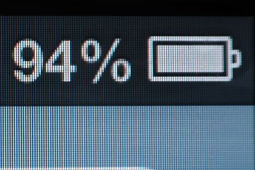

**两代iPhone 的物理尺寸（屏幕宽高有多少英寸）是一样的**，从上图可以看出，iphone 4的显示效果要明显好于iphone 3GS，虽然 iPhone 4 分辨率提高了，但它**不同于普通的电脑显示器那样为了显示更多的内容，而是提升显示相同内容时的画面精细程度**。这种提升方式是靠**提升单位面积屏幕的像素数量，即像素密度来提升分辨率，这样做的主要目的是为了提高屏幕显示画面的精细程度**。以第三代 `MacBook Pro with Retina Display`为例， 工作时显卡渲染出的`2880x1880`个像素每四个一组，输出原来屏幕的一个像素显示的大小区域内的图像。这样一来，用户所看到的图标与文字的大小与原来的`1440x900`分辨率显示屏相同，但精细度是原来的4倍。

注意：在桌面显示器中，我们调整了显示分辨率，比如从 `800 * 600` 调整到 `1024 * 768` 时，屏幕的文字图标会变小，显示的内容更多了。但 `Retina` 显示方式不会产生这样的问题，或者说， **Retina 显示技术解决的是显示画面精细程度的问题，而不是解决显示内容容量的问题。**

> 以前看那些使用塞班系统的诺基亚手机，其画面精细程度真得不敢恭维啊！

## ★分辨率、像素和屏幕尺寸

`PPI` 说的是像素密度，而分辨率说的是块屏幕的像素尺寸，譬如说 `1334*750` 就是 iPhone（6~7）的分辨率，说 iPhone（6~7）的分辨率是 326 是错误的表述，326 是它的像素密度，单位是 `PPI`。

询问别人一粒像素有多大是一个非常鸡贼的问题（小心面试遇到这样的题），虽然我们说像素是构成屏幕的发光的点，是物理的，但是像素在脱离了屏幕尺寸之后是没有大小可言的，你可以将 `1920 * 1080` 颗像素放到一台 40 寸的小米电视机里面，也可以将同样多的像素全部塞到一台 5.5 寸的 iPhone7 Plus 手机里面去，那么对于 40 寸的电视而言，每个像素颗粒当然会大于 5.5 寸的手机的像素。

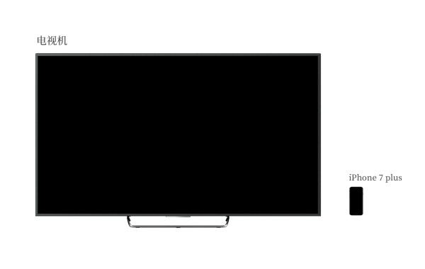

所以光看屏幕的分辨率对于设计师来说是不具备多少实际意义的，通过分辨率计算得出的像素密度（PPI）才是设计师要关心的问题，我们通过屏幕分辨率和屏幕尺寸就能计算出屏幕的像素密度的。

再次使用 iPhone（6~7）作为例子。我们知道该屏幕的横向物理尺寸为 2.3 英寸 ，且横向具有 750 颗像素，根据下面的公式，我们能够算出 iPhone（6~7）的屏幕是 326 PPI，意为每寸存在 326 颗像素。

其实不论我们怎么除，计算得出来的`像素密度（PPI）`都会是这个数，**宽存在像素除以宽物理长度，高存在像素除以高物理长度，得数都接近于 326。**

> 设计师要关心的问题：「设备的像素密度」，根据像素密度确定给1x的icon、2x的icon、还是3x的icon……这些icon是自动在不同的1x、2x、3x等设备上切换，不然，我们得手动在1x设备上弄44px，在2x设备上弄88px……不然，只用一张1x图片的话，那么该图片的呈现会自动缩水呀！

## **★三个viewport**

### ◇PPK的关于三个viewport的理论

[ppk大神](http://www.quirksmode.org/)对于移动设备上的viewport有着非常多的研究（[第一篇](http://www.quirksmode.org/mobile/viewports.html)，[第二篇](http://www.quirksmode.org/mobile/viewports2.html)，[第三篇](http://www.quirksmode.org/mobile/metaviewport/)），有兴趣的同学可以去看一下，本文中有很多数据和观点也是出自那里。ppk认为，移动设备上有三个viewport。

首先，**移动设备上的浏览器认为自己必须能让所有的网站都正常显示，即使是那些不是为移动设备设计的网站。**但如果以浏览器的可视区域作为`viewport`的话，因为移动设备的屏幕都不是很宽，所以那些为桌面浏览器设计的网站放到移动设备上显示时，必然会因为移动设备的`viewport`太窄，而挤作一团，甚至布局什么的都会乱掉。也许有人会问，现在不是有很多手机分辨率都非常大吗，比如`768x1024`，或者`1080x1920`这样，那这样的手机用来显示为桌面浏览器设计的网站是没问题的吧？前面我们已经说了，`css`中的1px并不是代表屏幕上的1px，你分辨率越大，`css`中1px代表的物理像素就越多，`devicePixelRatio`的值也越大，这很好理解，因为**你分辨率增大了，但屏幕尺寸并没有变大多少，必须让`css`中的1px代表更多的物理像素，才能让1px的东西在屏幕上的大小与那些低分辨率的设备差不多，不然就会因为太小而看不清。**

所以在`1080x1920`这样的设备上，在默认情况下，也许你只要把一个div的宽度设为300多px（视`devicePixelRatio`的值而定），就是满屏的宽度了。回到正题上来，如果把移动设备上浏览器的可视区域设为viewport的话，某些网站就会因为`viewport`太窄而显示错乱，所以这些浏览器就决定默认情况下把`viewport`设为一个较宽的值，比如980px，这样的话即使是那些为桌面设计的网站也能在移动浏览器上正常显示了。ppk把这个浏览器默认的`viewport`叫做 **layout viewport**。

这个`layout viewport`的宽度可以通过`document.documentElement.clientWidth` 来获取。

然而，**layout viewport** 的宽度是大于浏览器可视区域的宽度的，所以我们还需要一个`viewport`来代表 浏览器可视区域的大小，ppk把这个`viewport`叫做 **visual viewport** 。`visual viewport`的宽度可以通过window.innerWidth 来获取，但在Android 2, Oprea mini 和 UC 8中无法正确获取。


> 不知为何，为啥我认为在移动端浏览器为PC端设计的页面，之所以缩小了，是因为drp的缘故呢？
>
> 这980px是什么鬼呀？
>
> 这个layout viewport要出现的话，设置viewport为屏幕的设备独立像素的宽不就好了么？

现在我们已经有两个`viewport`了：**layout viewport** 和  **visual viewport**。但浏览器觉得还不够，因为现在越来越多的网站都会为移动设备进行单独的设计，所以必须还要有一个能完美适配移动设备的`viewport`。所谓的完美适配指的是，首先不需要用户缩放和横向滚动条就能正常的查看网站的所有内容；第二，显示的文字的大小是合适，比如一段14px大小的文字，不会因为在一个高密度像素的屏幕里显示得太小而无法看清，理想的情况是这段14px的文字无论是在何种密度屏幕，何种分辨率下，显示出来的大小都是差不多的。当然，不只是文字，其他元素像图片什么的也是这个道理。ppk把这个`viewport`叫做 **ideal viewport**，也就是第三个`viewport`——移动设备的理想`viewport`。

**`ideal viewport`并没有一个固定的尺寸，不同的设备拥有有不同的`ideal viewport`。**所有的`iphone`的`ideal viewport`宽度都是320px，无论它的屏幕宽度是320还是640，也就是说，在`iphone`中，`css`中的320px就代表`iphone`屏幕的宽度。

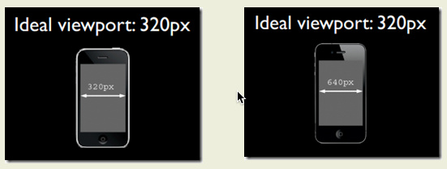

但是安卓设备就比较复杂了，有320px的，有360px的，有384px的等等，关于不同的设备`ideal viewport`的宽度都为多少，可以到[http://viewportsizes.com](http://viewportsizes.com/)去查看一下，里面收集了众多设备的理想宽度。

再总结一下：ppk把移动设备上的`viewport`分为 **layout viewport** 、 **visual viewport** 和 **ideal viewport** 三类，其中的`ideal viewport`是最适合移动设备的`viewport`，**`ideal viewport`的宽度等于移动设备的屏幕宽度**，只要在css中把某一元素的宽度设为`ideal viewport`的宽度(单位用px)，那么这个元素的宽度就是设备屏幕的宽度了，也就是宽度为100%的效果。`ideal viewport` 的意义在于，无论在何种分辨率的屏幕下，那些针对`ideal viewport `而设计的网站，不需要用户手动缩放，也不需要出现横向滚动条，都可以完美的呈现给用户。

### ◇利用meta标签对viewport进行控制

移动设备默认的`viewport`是`layout viewport`，也就是那个比屏幕要宽的`viewport`，但在进行移动设备网站的开发时，我们需要的是`ideal viewport`。那么怎么才能得到`ideal viewport`呢？这就该轮到`meta`标签出场了。

我们在开发移动设备的网站时，最常见的的一个动作就是把下面这个东西复制到我们的`head`标签中：

```html
<meta name="viewport" content="width=device-width, initial-scale=1.0, maximum-scale=1.0, user-scalable=0">
```

该`meta`标签的作用是让当前`viewport`的宽度等于设备的宽度，同时不允许用户手动缩放。也许允不允许用户缩放不同的网站有不同的要求，但让`viewport`的宽度等于设备的宽度，这个应该是大家都想要的效果，如果你不这样的设定的话，那就会使用那个比屏幕宽的默认`viewport`，也就是说会出现横向滚动条。

这个`nam`e为`viewport`的`meta`标签到底有哪些东西呢，又都有什么作用呢？

`meta viewport` 标签首先是由苹果公司在其`safari`浏览器中引入的，目的就是解决移动设备的`viewport`问题。后来安卓以及各大浏览器厂商也都纷纷效仿，引入对`meta viewport`的支持，事实也证明这个东西还是非常有用的。

在苹果的规范中，`meta viewport` 有**6**个属性(暂且把`content`中的那些东西称为一个个属性和值)，如下：

| width         | 设置***layout viewport***  的宽度，为一个正整数，或字符串"width-device" |
| ------------- | ------------------------------------------------------------ |
| initial-scale | 设置页面的初始缩放值，为一个数字，可以带小数                 |
| minimum-scale | 允许用户的最小缩放值，为一个数字，可以带小数                 |
| maximum-scale | 允许用户的最大缩放值，为一个数字，可以带小数                 |
| height        | 设置***layout viewport***  的高度，这个属性对我们并不重要，很少使用 |
| user-scalable | 是否允许用户进行缩放，值为"no"或"yes", no 代表不允许，yes代表允许 |

这些属性可以同时使用，也可以单独使用或混合使用，多个属性同时使用时用逗号隔开就行了。

此外，在安卓中还支持  `target-densitydpi`  这个私有属性，它表示目标设备的密度等级，作用是决定`css`中的1px代表多少物理像素

|                   |                                                              |
| ----------------- | ------------------------------------------------------------ |
| target-densitydpi | 值可以为一个数值或 high-dpi 、 medium-dpi、 low-dpi、 device-dpi 这几个字符串中的一个 |

特别说明的是，当 `target-densitydpi=device-dpi` 时， css中的1px会等于物理像素中的1px。

因为这个属性只有安卓支持，并且安卓已经决定要废弃 ~~target-densitydpi~~  这个属性了，所以这个属性我们要避免进行使用  。

### ◇把当前的viewport宽度设置为 ideal viewport 的宽度

要得到`ideal viewport`就必须把默认的`layout viewport`的宽度设为移动设备的屏幕宽度。因为`meta viewport`中的`width`能控制`layout viewport`的宽度，所以我们只需要把`width`设为`width-device`这个特殊的值就行了。

```html
<meta name="viewport" content="width=device-width">
```

下图是这句代码在各大移动端浏览器上的测试结果：


可以看到通过`width=device-width`，所有浏览器都能把当前的`viewport`宽度变成`ideal viewport`的宽度，但要注意的是，在iphone和ipad上，无论是竖屏还是横屏，宽度都是竖屏时`ideal viewport`的宽度。

这样的写法看起来谁都会做，没吃过猪肉，谁还没见过猪跑啊~，确实，我们在开发移动设备上的网页时，不管你明不明白什么是`viewport`，可能你只需要这么一句代码就够了。

可是你肯定不知道：

```html
<meta name="viewport" content="initial-scale=1">
```

> 让页面不因为dpr的值而缩放，这不是很正常的吗？

这句代码也能达到和前一句代码一样的效果，也可以把当前的的`viewport`变为 `ideal viewport`。

呵呵，傻眼了吧，因为从理论上来讲，这句代码的作用只是不对当前的页面进行缩放，也就是页面本该是多大就是多大。那为什么会有 `width=device-width` 的效果呢？

要想清楚这件事情，首先你得弄明白这个缩放是相对于什么来缩放的，因为这里的缩放值是1，也就是没缩放，但却达到了 ideal viewport 的效果，所以，那答案就只有一个了，缩放是相对于 `ideal viewport`来进行缩放的，当对`ideal viewport`进行100%的缩放，也就是缩放值为1的时候，不就得到了 `ideal viewport`吗？事实证明，的确是这样的。下图是各大移动端的浏览器当设置了`<meta name="viewport" content="initial-scale=1"> `后是否能把当前的`viewport` 宽度变成 `ideal viewport` 的宽度的测试结果。

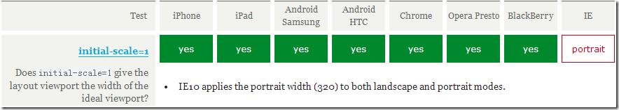

测试结果表明 `initial-scale=1` 也能把当前的 `viewport` 宽度变成 `ideal viewport` 的宽度，但这次轮到了windows phone 上的IE 无论是竖屏还是横屏都把宽度设为竖屏时 `ideal viewport` 的宽度。但这点小瑕疵已经无关紧要了。

但如果 `width` 和 `initial-scale=1` 同时出现，并且还出现了冲突呢？比如：

```html
<meta name="viewport" content="width=400, initial-scale=1">
```

`width=400` 表示把当前 `viewport` 的宽度设为`400px`，`initial-scale=1` 则表示把当前 `viewport` 的宽度设为ideal viewport的宽度，那么浏览器到底该服从哪个命令呢？是书写顺序在后面的那个吗？不是。当遇到这种情况时，浏览器会取它们两个中较大的那个值。例如，当`width=400`，`ideal viewport` 的宽度为320时，取的是400；当width=400， ideal viewport的宽度为480时，取的是`ideal viewport`的宽度。（ps:在uc9浏览器中，当`initial-scale=1`时，无论width属性的值为多少，此时viewport的宽度永远都是ideal viewport的宽度）

最后，总结一下，要把当前的viewport宽度设为ideal viewport的宽度，既可以设置 `width=device-width`，也可以设置 `initial-scale=1`，但这两者各有一个小缺陷，就是iphone、ipad以及IE 会横竖屏不分，通通以竖屏的ideal viewport宽度为准。所以，最完美的写法应该是，两者都写上去，这样就 `initial-scale=1` 解决了 iphone、ipad的毛病，`width=device-width`则解决了IE的毛病：

```html
<meta name="viewport" content="width=device-width, initial-scale=1">
```

### ◇关于meta viewport的更多知识

#### 关于缩放以及initial-scale的默认值

首先我们先来讨论一下缩放的问题，前面已经提到过，缩放是相对于 `ideal viewport` 缩放的，缩放值越大，当前viewport的宽度就会越小，反之亦然。例如在iphone中，`ideal viewport` 的宽度是320px，如果我们设置 `initial-scale=2` ，此时 `viewport` 的宽度会变为只有160px了，这也好理解，放大了一倍嘛，就是原来1px的东西变成2px了，但是1px变为2px并不是把原来的320px变为640px了，而是在实际宽度不变的情况下，1px变得跟原来的2px的长度一样了，所以放大2倍后原来需要320px才能填满的宽度现在只需要160px就做到了。因此，我们可以得出一个公式：

> visual viewport宽度 = ideal viewport宽度 / 当前缩放值

> 当前缩放值 = ideal viewport宽度 / visual viewport宽度

ps: `visual viewport` 的宽度指的是浏览器可视区域的宽度。

大多数浏览器都符合这个理论，但是安卓上的原生浏览器以及IE有些问题。安卓自带的`webkit`浏览器只有在 `initial-scale = 1` 以及没有设置`width`属性时才是表现正常的，也就相当于这理论在它身上基本没用；而IE则根本不甩initial-scale这个属性，无论你给他设置什么，`initial-scale`表现出来的效果永远是1。

好了，现在再来说下 `initial-scale` 的默认值问题，就是不写这个属性的时候，它的默认值会是多少呢？很显然不会是1，因为当 `initial-scale = 1` 时，当前的 `layout viewport` 宽度会被设为 `ideal viewport` 的宽度，但前面说了，各浏览器默认的 `layout viewport` 宽度一般都是980啊，1024啊，800啊等等这些个值，没有一开始就是 `ideal viewport` 的宽度的，所以 `initial-scale` 的默认值肯定不是1。安卓设备上的 `initial-scale` 默认值好像没有方法能够得到，或者就是干脆它就没有默认值，一定要你显示的写出来这个东西才会起作用，我们不管它了，这里我们重点说一下iphone和ipad上的 `initial-scale` 默认值。

根据测试，我们可以在iphone和ipad上得到一个结论，就是无论你给 `layout viewpor` 设置的宽度是多少，而又没有指定初始的缩放值的话，那么iphone和ipad会自动计算 `initial-scale` 这个值，以保证当前 `layout viewport` 的宽度在缩放后就是浏览器可视区域的宽度，也就是说不会出现横向滚动条。比如说，在iphone上，我们不设置任何的 `viewport meta` 标签，此时 `layout viewport` 的宽度为980px，但我们可以看到浏览器并没有出现横向滚动条，浏览器默认的把页面缩小了。根据上面的公式，`当前缩放值 = ideal viewport宽度 / visual viewport宽度`，我们可以得出：

> 当前缩放值 = 320 / 980

也就是当前的 `initial-scale` 默认值应该是 0.33这样子。当你指定了 `initial-scale` 的值后，这个默认值就不起作用了。

总之记住这个结论就行了：**在iphone和ipad上，无论你给viewport设的宽的是多少，如果没有指定默认的缩放值，则iphone和ipad会自动计算这个缩放值，以达到当前页面不会出现横向滚动条(或者说viewport的宽度就是屏幕的宽度)的目的。**

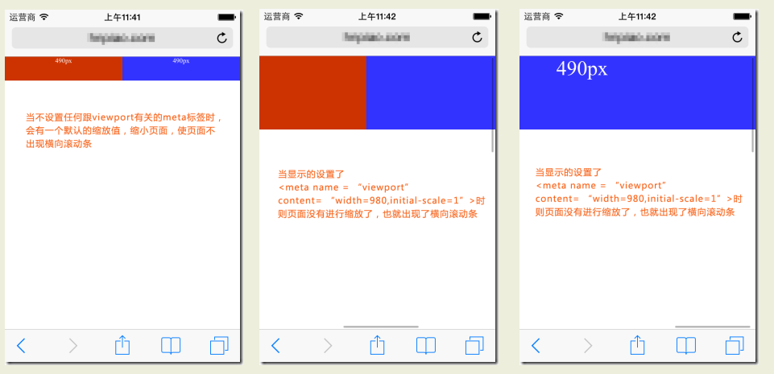

#### 动态改变meta viewport标签

第一种方法

可以使用 `document.write` 来动态输出 `meta viewport` 标签，例如：

```html
document.write('<meta name="viewport" content="width=device-width,initial-scale=1">')
```


第二种方法

通过 `setAttribute` 来改变

```html
<meta id="testViewport" name="viewport" content="width = 380">
<script>
var mvp = document.getElementById('testViewport');
mvp.setAttribute('content','width=480');
</script>
```

安卓2.3自带浏览器上的一个 `bug`

```html
<meta name="viewport" content="width=device-width">

<script type="text/javascript">
alert(document.documentElement.clientWidth); //弹出600，正常情况应该弹出320
</script>

<meta name="viewport" content="width=600">

<script type="text/javascript">
alert(document.documentElement.clientWidth); //弹出320，正常情况应该弹出600
</script>
```

测试的手机 `ideal viewport` 宽度为320px，第一次弹出的值是600,但这个值应该是第行meta标签的结果啊，然后第二次弹出的值是320，这才是第一行meta标签所达到的效果啊，所以在安卓2.3(或许是所有2.x版本中)的自带浏览器中，对 `meta viewport` 标签进行覆盖或更改，会出现让人非常迷糊的结果。

### ◇最后我们来看一个栗子来加深上面概念的印象：

一只笔的像素如下：

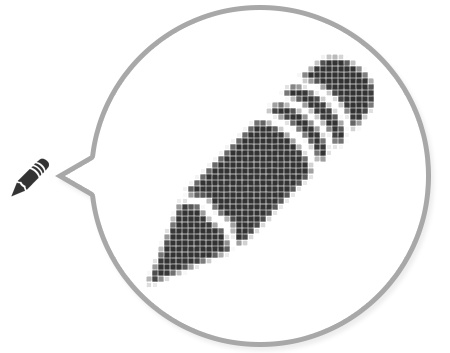

这只笔在屏幕c,d,e下的显示效果如下：

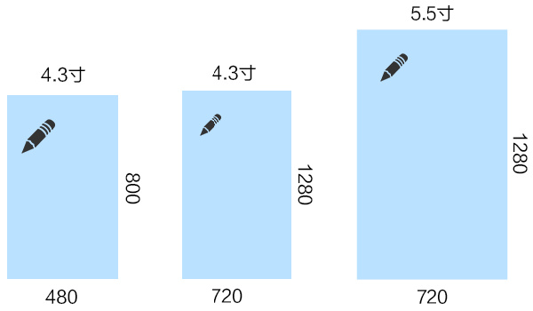

看到同一张图片在各屏幕显示大小不一。
我们希望不同屏幕显示图片的大小要一致。
我们要计算图片缩放比例。
计算公式：
(图片逻辑像素大小px1) / (图片缩放后实际像素大小px2) = (设备像素dp) / (设备独立像素dips)
px2 = px1 * (dp / dips)
px2 = px1 * dpr
此时，这只笔在屏幕c,d,e下的显示效果如下：

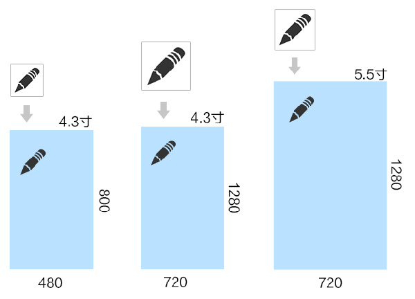

> 通过上面的我们可以看到，不同的 `DPR` (设备像素比)要想显示大小一样，必须准备三张不同分辨率的图片，那么，我想一张图片就在三种不同的屏幕下显示一样的大小，能做到吗？当然能做到，这就需要缩放了，要自己计算缩放多麻烦，那有没有一种简单的方式呢？当然有，那就是你在熟悉不过的**px**,你会发现设置图片宽度为**50px**以后，在各个移动终端的大小看起来都一样，这是什么原因呢。

按照 `CSS` 规范的定义，`CSS` 中的 `px` 是一个相对长度，它相对的，是 `viewing device` 的分辨率。这个`viewing device`，通常就是电脑显示器。典型的电脑显示器的分辨率是`96DPI`，也就是1像素为1/96英寸（实际上，假设我们的显示器分辨率都与物理分辨率一致，而液晶点距其实是0.25mm到0.29mm之间，所以不太可能是正好1/96英寸，而只是接近）。

一般来说，`px` 就是对应设备的物理像素，然而如果输出设备的解析度与电脑显示器大不相同，输出效果就会有问题。例如打印机输出到纸张上，其解析度比电脑屏幕要高许多，如果不缩放，直接使用设备的物理像素，那电脑上的照片由 `600DPI` 的打印机打出来就比用显示器看小了约6倍。

所以 `CSS` 规定，在这种情况下，浏览器应该对像素值进行缩放调节，以保持阅读体验的大体一致。也就是要保持一定像素的长度在不同设备输出上看上去的大小总是差不多。

怎样确保这一点呢？直接按照设备物理像素的大小进行换算当然是一个方式，但是CSS考虑得更多，它建议，转换应按照“参考像素”（`reference pixel`）来进行。

眼睛看到的大小，取决于可视角度。而可视角度取决于物体的实际大小以及物体与眼睛的距离。10米远处一个1米见方的东西，与1米远处的10厘米见方的东西，看上去的大小差不多是一样的，所谓一叶障目不见泰山，讲的就是这个常识。

因此CSS规范使用视角来定义“参考像素”，1参考像素即为从一臂之遥看解析度为96DPI的设备输出（即1英寸96点）时，1点（即1/96英寸）的视角。

请注意这个差别——`CSS`规范定义的参考像素并不是1/96英寸，而是1/96英寸在一臂之遥的看起来的视角。通常认为常人臂长为28英寸，所以其视角可以计算出来是0.0213度。`（即(1/96)in / (28in * 2 * PI / 360deg) ）`

我们在使用不同设备输出时，眼睛与设备输出的典型距离是不同的。比如电脑显示器，通常是一臂之距，而看书和纸张时（对应于打印机的设备输出），则通常会更近一些。看电视时则会更远，比如一般建议是电视机屏幕对角线的2.5到3倍长——如果你是个42'彩电，那就差不多是3米远。看电影的话……我就不知道多远了，您自己量吧。

因此，1参考像素：
对于电脑显示器是0.26mm（即1/96英寸）；
对于激光打印机是0.20mm（假设阅读距离通常为55cm，即21英寸）；

而换算时，对于300DPI的打印机（即每个点是1/300英寸），1px通常会四舍五入到3dots，也就是0.25mm左右；而对于600DPI的打印机，则可能四舍五入到5dots，也就是0.21mm。

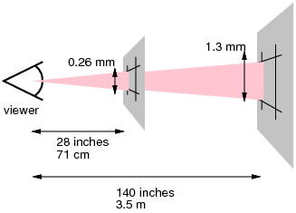

上图中，左边的屏幕（可以认为是电脑屏幕）的典型视觉距离是71厘米即28英寸，其1px对应了0.28mm；
而右边的屏幕（可以认为是你的42寸高清电视）的典型视觉距离是3.5米即120英寸，其1px对应1.3mm。42寸的1080p电视，分辨率是1920*1080，则其物理像素只有0.5mm左右，可见确实是高清哦。

综上，`px` 是一个相对单位，而且在特定设备上总是一个近似值（原则是尽量接近参考像素）。

然而，如果你把绝对单位理解为对输出效果的绝对掌控，事情却大相径庭。就网页输出的最主要对象——电脑屏幕来说，`px` 可被视为一个基准单位——与桌面分辨率一致，如果是液晶屏，则几乎总是与液晶屏物理分辨率一致——也就是说网页设计者设定的1px，就是“最终看到这个网页的用户的显示器上的1个点距”！反倒是那些绝对单位，其实一点也不绝对。

## ★参考资料

**➹：**[CSS像素、物理像素、逻辑像素、设备像素比、PPI、Viewport · Issue #21 · jawil/blog](https://github.com/jawil/blog/issues/21)


## ★总结

- 我得去看看网络是如何连接的这本书！

- 多看看这个视频：

  **➹：**[The Witness实况解说Special Part：6段录像_哔哩哔哩 (゜-゜)つロ 干杯~-bilibili](https://www.bilibili.com/video/av9960165/?p=1)

- 突然觉得网页的CSS动画很屌呀！因为动画在屏幕上渲染显然是件极其复杂的事儿啊！你想如何把数据点阵化显示到屏幕上呢？如何控制屏幕里边每个像素颜色，即如何控制RGB这3盏LED灯的明暗程度呢？

- 我们日常写的1px，指的是1css像素，除了有css像素以外，还有设备独立像素（逻辑像素，密度无关像素）和 设备像素（物理像素）。我能看见颜色就是物理像素起的作用。而这个设备屏幕上有多少个物理像素，这个在设备出厂的时候，就决定好了的，总之我们开发者无法改变它。

  在PC端上，一般写一个CSS像素就是一个物理像素

  而自打手机端有了Retina显示屏之后，一个CSS像素可能是1个物理像素，2个物理像素、3个物理像素，甚至是4个等等……

  我们习惯于在PC端屏幕上看到的1px等于一个那么大的设备独立像素，也就是那么大的物理像素。而在移动端看1px的视觉呈现就不同了。当然，你设置了 `meta:viewport`就能保证视觉呈现一致了。

- 关于viewport的三个理论，以及`meta:viewport`，到底在讲什么呀！

## ★Q&A

### ①什么是信号？

我理解的信号？就是看玄幻小说时，主角被人发现了，然后一帮狗腿子就向天空发射一颗弹，这颗弹就是信号弹，用于通知其它人过来围剿、打杀主角。

而[维基](https://zh.wikipedia.org/wiki/%E4%BF%A1%E5%8F%B7)里边的定义是这样的：

> **信号**（英语：Signal）可以指：
>
> 科学概念：
>
> - [信号 (信息论)](https://zh.wikipedia.org/wiki/信号_(信息论))，可用数学函数表示的一种信息流。
> - [细胞信号传送](https://zh.wikipedia.org/wiki/细胞信号传送)，生物细胞响应周遭环境并与之沟通。
> - [Unix信号](https://zh.wikipedia.org/wiki/Unix信号)，信号是消息的表现形式，消息则是信号的具体内容。
> - 在[计算机科学](https://zh.wikipedia.org/wiki/计算机科学)中，信号表示计算过程中传递的事件。
> - 在[电信](https://zh.wikipedia.org/wiki/电信)中，信号是通信协议的一部分。
>
> 其他：
>
> - [交通信号灯](https://zh.wikipedia.org/wiki/交通信号灯)，交通控制的一种方式。

抽象一来看，信号可以影响xxx的行为，当然，这是信号的用途，而我还是不知道信号到底是什么。

还有我可以理解为信号就是就是消息的载体，如信号弹是「主角在发信号弹的这个位置被我发现了，请大少爷和其它狗腿子快点过来」这个消息的载体！

**➹：**[什么是信号？ - 知乎](https://www.zhihu.com/question/302481988)

**➹：**[通信工程荐书（一）：数字信号处理精要 - 知乎](https://zhuanlan.zhihu.com/p/49894985)

### ②什么是模拟信号？

无线电波「指在自由空间（包括空气和真空）传播的射频频段的电磁波」是用来传输数据的，形象点来说，无线电波就是一种运送东西的交通工具。


无线电波是如何产生的？

打开开关和关闭开关，这旁边的电压表有一定的波动

可件，打开或关闭开关的瞬间，磁场发生了变化，那么就会让旁边的电路产生电流

反复打开和关闭，电压表会有一个周期性的波动！


无线电波可以抽象成啥样？（类似于拍打水面的波纹，一圈又一圈……一波又一波）


如何产生这样的波纹？——加大电流，把开关换成是振荡器，经过振荡器的电流转换成交流电，那么这就意味着正负极是来回交替变化的，然后我们的天线就发射出这种正弦曲线波形了。

> 交流电流是指**大小和方向都发生周期性变化的电流**，在一个周期内的运行平均值为零。不同于直流电，后者的方向是不会随着时间发生改变的，并且直流电没有周期性变化。 **通常波形为正弦曲线**。交流电可以有效传输电力。但实际上还有应用其他的波形，例如三角形波、正方形波。生活中使用的市电就是具有正弦波形的交流电。

---

在手机传输信息之前，往往需要将模拟信号转化为电信号之后才会传输。那么模拟信号是什么呢？

模拟信号简单来说就是用电信号去模拟其它的信号（信息的载体）。比如电信号模拟出我们的图像（信息的载体），模拟出声音的声波：


为啥需要数字信号？


> 电信号是指以电压、电流、电磁波等为载体的信号。简单来说就可以把「周末去做头发」这个信息放在电磁波（可以简单地把电磁波看做是信息）里边。而电信号是以电磁波的方式在传输线上传播的。
>
> 额……似乎这样理解才是对的，电信号是二进制信息流的载体呀！然后我们要传输数据的话，显然需要把电信号转化成是电磁波的形式，然而搜索得知「电信号实际上是一种电磁波」。
>
> 无线电波和有线电波的区别：都是传输电磁波，不过传输的方式不同。（无线电波和光都是电磁波）
>
> **➹：**[无线电波和有线电波的区别是什么？ 爱问知识人](https://iask.sina.com.cn/b/16594416.html)

如何让模拟信号转化为数字信号？（以下是转换原理，采样率和量化等级比较低，如果提高了，那么形状上自然会越来越接近下边那个曲线。也就意味着能更好的还原出我们的模拟信号）

> 我们用电信号模拟了声波，而这电信号实际是一种信息，至此我们可以量化它！然后搞成是数字信号（这才是二进制流呀！），即便它是数字信号，也是通过无线或无线电波来传输的。传输过去之后数字信号要还原成电信号，然后复原为声波。
>
> 有这样一个例子：
>
> 你想知道声波是如何转化成电信号的？那么首先要明白一件事，就是自己嘴里的电信号是什么。
>
> 对于声音而言，转化得到的电信号就是声音的波形。而波形中就包括了音量、音色等所有的信息
>
> 那么我现在写的这个笔记又是如何从本地传输到github的服务器上的呢？
>
> 传输到指定的主机的不是电磁波，而是数据。数据是可以被解读的，可以描述自己需要被发送到什么主机，解读数据的方式就是网络协议，负责投递到指定主机的协议就是IP（网际协议）。
>
> 嗦嘎……传输的居然不是电磁波？电磁波不是数据的载体么？没有载体的话，那么数据是如何被传输的？总不能说电流与二进制数据的关系，就像是水流与轮船的关系吧！
>
> 对了，交流电是发生周期性变化的电流呀！既然有周期性变化，那么就有信息呀！即这是以电流（还是电压呢？）为载体的电信号呀！而平时我们上网都是用有线来上网的，我不知道是不是转化为光信号，既然是光信号，那么这TM还是电磁波呀！

1. 对模拟信号进行采样，如每秒对正弦曲线波形采样一次

2. 采样完成之后，进行量化，由于模拟信号是一个连续变化的值，所以我们需要离散这些值，然后把它们量化为一级、二级、三级这样……类似于在学校时的考试分数，60分以下不及格，60~70为合格，71-100为优秀。同样这量化类似于xxx电器把省电程度量化为一级能效、二级能效……

3. 量化完成之后，对量化的等级进行编码，如一级就是001，二级就是010……即一个等级对应一组二进制数字，然后连接起来，就得到一串二进制数字：

   

> 话说我们拿到的一串二进制数字有何用？
>
> 这是声波的采集和量化而来的，意味着我们可以还原你说过那些话儿
>
> 那么我们平时写的文本文件呢？难道直接就是通过编码化为一串二进制数字，即二进制字节流这样无须采样和量化吗？还是说还要搞成为电磁波，即正弦曲线波形，然后通过无线电波传给遥远的她，然后那么的她解析无线电波为一连串二进制，然后解码为对应的字符串！
>
> 额……好像无线电波就是电磁波额！难道直接就是把一连串二进制数值搞成是电磁波，即无线电波传给远方的她？可是无线电波不是火车吗？用于装东西的啊！按理说应该只有一辆火车，但其实传输了一定量的数据就是一辆崭新的火车了。
>
> 话说，这电磁波的波形即便为正弦曲线波形，也会有矮的和胖的吧？总不可能都是一模一样的波形吧！你看水波一圈比一圈大，形式上都是一个圈圈！

**➹：**[模拟信号_百度百科](https://baike.baidu.com/item/%E6%A8%A1%E6%8B%9F%E4%BF%A1%E5%8F%B7/706796)

**➹：**[无线电波是怎么产生的？为啥无线电波可以隔空传输图片、视频这些数据？_哔哩哔哩 (゜-゜)つロ 干杯~-bilibili](https://www.bilibili.com/video/av23448535/)

**➹：**[什么是模拟信号？数字信号？区别是啥？它们又是如何完成转换的？ - 知乎](https://zhuanlan.zhihu.com/p/39962777)

**➹：**[什么叫信号失真？ - 知乎](https://www.zhihu.com/question/67365966)

**➹：**[为什么要采用交流电？交流电有什么好处？ - 知乎](https://www.zhihu.com/question/52692992)

> 上边这个问题类似于为啥CPU需要时钟一样，如果不用交流电，那么整个xxx系统的工作就是不可靠的！

**➹：**[电信号在传输线中是怎样传播？ - 知乎](https://www.zhihu.com/question/67157381)

**➹：**[声波是如何转化成电信号的？ - 知乎](https://www.zhihu.com/question/25003786)

**➹：**[无线通信中的术语，超通俗解释！（上） - 知乎](https://zhuanlan.zhihu.com/p/48820296)

**➹：**[无线电波是光吗_百度知道](https://zhidao.baidu.com/question/61398368.html)

**➹：**[开脑洞，如果人类能看见无线电波，会是一番怎么样的景象？ - 知乎](https://www.zhihu.com/question/283851254)

**➹：**[数据怎样在网络中传输的？要经过怎样的包装才能保证传输准确？ - 知乎](https://www.zhihu.com/question/57012774)

**➹：**[光纤通信中信号是如何通过光传输的？ - 知乎](https://www.zhihu.com/question/26658211)

### ③CPU？时钟？

> CPU 可以有时钟，也可以没有时钟。使用时钟工作的 CPU 被称为同步 CPU（synchronous CPU），而不使用时钟工作的 CPU 被称为异步 CPU（asynchronous CPU）。目前市面上广泛销售的 CPU 都是同步 CPU。

由于CPU是不可能自己单独完成工作的，而无固定频率（即“时钟“）的CPU和周边工作单元协同工作时，因为**大家步调不一致，沟通起来效率会打折扣**。

所以为什么要引入时钟呢？

> 引入“时钟”最重要的作用是**为了简化 从而降低计算机的设计成本。**

假如没有引入时钟会咋样？

> 想象一下，大BOSS就是CPU分配工作，时刻提醒自己，记着要告诉RAM：你准备好，我要在0.000000000000123456........秒后调用你的数据哦，还有要再对Modem说：0.000000234567....秒开始给我下载，哎那个键盘，老子正忙着呢，你这时候给我提交输入不是添乱嘛！。。。。。。。。哎唷，搞的大家都很累好么！

而引入时钟（周期）的话，这些都简化了：**比如只要在固定周期去接收和处理键盘提交的输入就好了**。

什么是同步工作？

> CPU接了个给广场铺砖的活，于是带一帮只懂铺砖的RAM、Modem、key、、去干活，用边长1×1的地砖是最简单的，只要给大家说：A你从第一块开始铺，B从100块开始，C从200块开始。。。。。。这样大家可以同步工作了。
>
> 如果ABCDEFG.....大家各用各自规格的地板砖来开工，CPU准得急死！

这里的同步指的是一起干，而且是大家各自互不干扰的干，类似于一个人干时，未来的活儿，被未来的你干你！

可见，简单来说，**时钟（周期）就是为了规定一个最小单位（比如100块）的地板砖**。

再形象点，我们知道一个交响乐团里边需要有一个指挥，不然整首歌的演奏只靠每个人的记忆来确定自己什么时候该唱，该拉小提琴等等的话，那么这显然很容易让这首歌被演奏的不齐！而有了指挥之后，xx什么时候该唱，yy什么时候该弹等等都有了确切的认识，至此，大家协同工作演绎完整首歌曲将不在话下。

**➹：**[来自外公的一封信_哔哩哔哩 (゜-゜)つロ 干杯~-bilibili](https://www.bilibili.com/video/av45999302/)

或者说它就是个节拍器，作用于寄存器上，以 `1+2+3+4+...+10=？`来说， 用于保证下一个操作数和上一次计算的和是同时进入逻辑运算单元（ALU，算术逻辑单元）「时钟的高压5V脉冲到了就同时写入」，然后得到一个外部输出和内部输出，在下一个时钟脉冲到达之前，一直保持稳定状态，然后当时钟电压再次升高到5V以后，两个寄存器同时被写入新的值，逻辑运算单元接收到两个新输入……依次类推……


> 5v脉冲到了，就打破稳态！即Ay的值发生了变化，至此通过ALU的计算，ZY的值也发生了变化！来到了下一轮的稳态！

总之，时钟保证了ALU的「同步」（同时步入ALU的大门）读取，这样的逻辑电路之间的迭代，才是有章法的！

**讲真，具体实现我是真得不明白，我也不知道我到底理解了没。我只知道时钟的存在，会保证CPU里边的各个小模块的输入和输出是稳定的！不会乱来！然后所有小模块都稳定了，那么整个计算机也就稳定了。**

> 记得高中当宿舍长的时候，那时的我并不会管理宿舍的卫生状况，只秉持着自愿原则去搞，或者大家想搞了那就一起搞……而这样一来宿舍的卫生是毫无章法的，即可能某一天是干净的，或者一直到学期结束都没有打扫过一次卫生，或者xx打扫了这块，第二天yy还是打扫了这块，然后干净的还是干净的，不干净的一直不干净……如果那时的我有「时钟」的概念，那么我想我一定会保证整个宿舍的卫生状况是稳定的！

**➹：**[为什么CPU需要时钟才能工作？ - 知乎](https://www.zhihu.com/question/21981280)

### ④韩顺平的话？

> ”韩老师当时就把这个王同学骂了一顿，你太不像话了，你看你的同期同学，他们薪水基本上都能够在一万以上，你为什么就不坚持下去。现在不管是摆地摊还是做开发，你都给我坚持下去。你不要今天摆地摊，遇到了城管，你明天又去当厨师。你当厨师你又觉得油烟对身体有害，又去干出租车司机，不要转来转去。人家的时间都用在了努力，而你的时间却用在了选择，当你将放弃当作一种习惯，你一辈子也不会有出息。
>
> 韩老师告诉我们说，成功其实也不难，只要树立一个目标，不需要你是一个很强的人，不需要你很高智商，不需要你是[千里马](https://baike.baidu.com/item/千里马)，你只要像[老黄牛](https://baike.baidu.com/item/老黄牛)一样，每天哪怕做一点点，往目标前进一点点，你就会成功。可是成功又很难，因为在通往成功的路上，很少人能够坚持下来。在坚持的过程中，很多人都选择了放弃“。

我每日的生活，有小说就会看小说，没有小说就学习前端，然后做菜吃饭睡觉……讲真，我学习前端真得不是说它的工资看起来还可以，而是我实在是太无聊了，因为小说看完了，除了学习一些东西以外，没有什么东西可以让我觉得不无聊。讲真，这其实是一件很可悲的事儿，因为生活还有很多很美好的事儿，而就目前而言的你来看，你认为美好的事儿只有小说和前端，你说这难道不可悲吗？

**➹：**[韩顺平（国内著名软件培训高级讲师）_百度百科](https://baike.baidu.com/item/%E9%9F%A9%E9%A1%BA%E5%B9%B3/12811105)

### ⑤每英寸像素？

这是指每英寸平方矩形里边有多少像素（水平方向+垂直方向），还是就是类似于1米种2棵树？（只有一个方向）

百度百科里说到：

> 它是描述在水平的和垂直的方向上，每英寸距离的图像包含的像素（[pixel](https://baike.baidu.com/item/pixel/3111775)）数目。


直观点就是这样：


> 可以把设置的44px，在2x下相当于是88px。此时我们可以认为px就是物理像素，只是物理像素的大小，相较于1x的，要小很多。

我们知道当我们放大位图的时候，图片就会变得很有颗粒感，显然这是因为每英寸所容纳的像素少了许多！

那么我们写网页时，对某个元素写上宽100px，高也是100px，而这表示的是啥呀？

拿我手机举例的话，难道是1英里边留给`100px*100px`的房间给我们元素吗？假如背景色为红色，即在1英寸大小区域里边的某个位置里边点亮`100*100`个像素吗？

假如是这样，那么我们在屏幕里边是看不见这个元素的背景色的

而现实是，我们能看见！但是我写的css像素其实作用于这个的：


> 填满一英寸面积，相当于填了`403*403`个像素，而`1`个像素是由RGB组成的，即由`3`盏LED灯所构成的！那么这个屏幕的某个位置一英寸面积就TM相当于有`403*403*3`盏LED灯呀！

归纳一些概念的认识：

- CSS像素(CSS pixels) ：是浏览器使用的抽象单位，用来精确度量网页上的内容。

- 设备独立像素(device independent pixels)：（也可以称为设备无关的逻辑像素），meta里面设置`width=device-width`，这个`device-width`就是设备独立像素，即上边的`667*375`，它们在数值上与css数值是相等的

- 设备像素(device pixels )：也可以称为物理像素，是显示屏的最小物理单位，每一像素都包含自己的颜色、亮度。像素是没有大小的、是一个抽象概念、是一个相对单位。 关于像素有一个常见的**错误**理解：**认为像素是一个宽高相等的小方块，并且的像素都是“那么大”，但是不知道这个宽高的具体数字。**

  > 还是拿我手机举例，我的是403ppi的，可见这个数据是硬件自己决定的，即由分辨率和屏幕尺寸决定的，比如说屏幕尺寸一样的手机，但是分辨率却不一样，分辨率高的，设备像素肯定会越多，即LED灯也会越多！
  >
  > 总之，你在做移动开发时要考虑手机的ppi，不然某些图片的呈现会有问题，比如相同尺寸的两个手机，同一张图片看起来会有差别！

- 分辨率：泛指量测或显示系统对细节的分辨能力。以PC屏幕，手机屏幕为例，分辨率1920*1080 是指屏幕纵向能显示1920个像素，横向能显示1080个像素。

  而描述分辨率的单位有：dpi（点每英寸）、lpi（线每英寸）和ppi（像素 每英寸）。从技术角度说，**“像素”只存在于电脑、手机显示领域，而“点”只出现于打印或印刷领域。**对于web开发者，我们只需要清楚ppi（ pixel per inch）即可！

**➹：**[设备像素，物理像素 css 1px 逻辑像素， 分辨率 这些名词 我都搞糊涂了 求大神解释下？ - 知乎](https://www.zhihu.com/question/32011095)

**➹：**[像素每英寸_百度百科](https://baike.baidu.com/item/%E5%83%8F%E7%B4%A0%E6%AF%8F%E8%8B%B1%E5%AF%B8)

### ⑥px单位到底是 绝对的还是相对？

之前了解到，CSS像素是浏览器使用抽象的单位，而它所代表的物理像素确实可以变化的！也就是说这单位是相对的单位，而不是绝对的单位。

就拿我这台电脑来说：


我们知道以下这三个概念：

- **设备像素**：设备像素又称物理像素（physical pixel），设备能控制显示的最小单位，我们可以把这些像素看作成显示器上一个个的点。
- **CSS像素**：CSS像素是Web编程的概念，独立于设备的用于逻辑上衡量像素的单位，也就是说我们在做网页时用到的CSS像素单位，是抽象的，而不是实际存在的。
- **设备独立像素**：(也叫密度无关像素)，可以认为是**计算机坐标系统中的一个点**，这个点代表一个可以由程序使用并控制的虚拟像素(比如：CSS 像素,只是在android机中CSS 像素就不叫”CSS 像素”了而是叫”设备独立像素”)，然后由相关系统转换为物理像素。

那么问题来了，**1px到表示多少个物理像素呢？**即**CSS像素的真正含义是什么！**

由于**不同的物理设备的物理像素的大小**是不一样的，所以`css`认为浏览器应该对`css`中的像素进行调节，使得浏览器中 **1css像素的大小在不同物理设备上看上去大小总是差不多** ，目的是为了保证阅读体验一致。为了达到这一点浏览器可以直接按照设备的**物理像素**大小进行换算，而`css`规范中使用**"参考像素"**来进行换算。

> 设备的物理像素大小？
>
> 按照我的理解就是因为像素密度ppi的不同，同一尺寸下的两台设备（A和B），假如ppi不同的话，那么ppi小的A的一个物理像素会显得大一点，意味着LED灯比较少。而ppi大的B，则一个物理像素会显得小一点，意味着LED灯比较多。
>
> 如果你写了一个1px，那么在A的屏幕下显示和在B的屏幕下显示会不会有区别呢？即1px到底占据了多少个物理像素呢？
>
> 所以保证为了阅读体验的一致，浏览器可以直接根据设备的**物理像素**大小进行换算，而这一过程CSS规范说到了「使用参考像素来进行换算」
>
> 举个例子来说，你写了1px，为了保证显示一致，于是就有一个黑盒子（就像是译码器），可以让1px的呈现在A和B两个设备下显示的大小是一致的。比如A的1px占用了10个物理像素，而B则是占用了20个物理像素，可见B的显示效果要得多。
>
> 这时「相对」的概念就可以体现出来了，即同样一份网页，在A设备下所显示的效果没有在B设备下所显示的那么精致。

那么1参考像素是多少呢？

我们知道，看手机时我们离屏幕很近，看电脑时远一点，而看电视时则很远了，就像这样：


**1参考像素**即为从一臂之遥看解析度为`96DPI`的设备输出（即1英寸96点）时，1点（即1/96英寸）的视角。它并不是1/96英寸长度，而是从一臂之遥的距离处看解析度为`96DPI`的设备输出一单位（即1/96英寸）时视线与水平线的夹角。通常认为常人臂长为28英寸，所以它的视角是:
**(1/96)in / (28in \* 2 \* PI / 360deg) = 0.0213度。**

由于`css`像素是一个**视角单位**，所以在真正实现时，为了方便基本都是根据**设备像素**换算的。**浏览器根据硬件设备能够直接获取`css`像素**

**再次理解css像素的相对性：**

作为Web开发者，我们接触的更多的是用于控制元素样式的样式单位像素。这里的像素我们称之为CSS像素。

CSS像素有什么特别的地方？我们可以借用[quirksmode](http://www.quirksmode.org/mobile/viewports.html)中的这个例子：

假设我们用PC浏览器打开一个页面，浏览器此时的宽度为800px，页面上同时有一个400px宽的块级元素容器。很明显此时块状容器应该占页面的一半。

但如果我们把页面放大（通过“Ctrl键”加上“+号键”），放大为200%，也就是原来的两倍。此时块状容器则横向占满了整个浏览器。

吊诡的是此时我们既没有调整浏览器窗口大小，也没有改变块状元素的css宽度，但是它看上去却变大了一倍——这是因为我们把CSS像素放大为了原来的两倍。

CSS像素与屏幕像素1：1同样大小时：

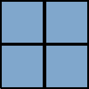

CSS像素(黑色边框)开始被拉伸，此时**1个CSS像素大于1个屏幕像素**：


也就是说默认情况下一个CSS像素应该是等于一个物理像素的宽度的，但是**浏览器的放大操作让一个CSS像素等于了两个设备像素宽度**。在后面你会看到更复杂的情况，**在高PPI的设备上，CSS像素甚至在默认状态下就相当于多个物理像素的尺寸。**

可见，**CSS像素从来都只是一个相对值。**

结论：

在`CSS`规范中，长度单位可以分为两类，绝对(`absolute`)单位以及相对(`relative`)单位。`px`是一个**相对单位**，相对的是设备像素(`device pixel`)，即物理像素。

- 在同样一个设备上，每1个CSS像素所代表的物理像素是可以变化的(**即CSS像素的第一方面的相对性**); 

- 在不同的设备之间，每1个CSS像素所代表的物理像素是可以变化的(**即CSS像素的第二方面的相对性**);

> 在同样一个设备上，让1个CSS像素发生缩放的操作，那么这个1像素所表示的物理像素就会发生相应的变化，如放大1倍，比原先多占用了一个像素。
>
> 在不同的设备之间，这个就很好理解了，如手机、iPad、笔记本、电视等，总之就是物理像素大小不同。

---

### ⑦我在PC端写的文字是16px的，那么在移动端，我需要把字体变为多少才合适？毕竟看手机眼睛离得比较近呀，不然文字忒大的话，就不精致了，而且用户能看到的内容也会少很多？


**➹：**[移动端最适合阅读的主体字号是14px吗？ - 边城的回答 - SegmentFault 思否](https://segmentfault.com/q/1010000004221779/a-1020000004221963)

**➹：**[从PC端过渡到移动端网页设计 - 看看俺 – KanKanAn.com](http://blog.kankanan.com/article/4ece-pc-7aef8fc76e21523079fb52a87aef7f5198758bbe8ba1.html)

### ⑧Retina显示屏？

> Retina显示屏（英文：Retina Display）是一种由苹果公司设计和委托制造的显示屏，具备足够高像素密度而使得人体肉眼无法分辨其中单独像素点的液晶屏，最初采用该种屏幕的产品iPhone 4由首席执行官史蒂夫·乔布斯于WWDC2010发布，其屏幕分辨率为960×640（每英寸像素数326ppi）。这种分辨率在正常观看距离下足以使人肉眼无法分辨其中的单独像素。如今苹果正逐步将其推广到全线产品之上，同时随着技术的提升，苹果也推出了Retina HD与Super Retina等不同规格的Retina高分辨率屏幕。


**➹：**[视网膜显示屏 - 维基百科，自由的百科全书](https://zh.wikipedia.org/wiki/Retina%E6%98%BE%E7%A4%BA%E5%B1%8F)

**➹：**[4K 和 Retina 显示屏哪个分辨率更高？ - 知乎](https://www.zhihu.com/question/24935579)

### ⑨css中的1px是否等于设备的1px？

**css中的1px并不等于设备的1px**

>   在css中我们一般使用px作为单位，**在桌面浏览器中css的1个像素往往都是对应着电脑屏幕的1个物理像素**，这可能会造成我们的一个错觉，那就是css中的像素就是设备的物理像素。但实际情况却并非如此，**css中的像素只是一个抽象的单位，在不同的设备或不同的环境中，css中的1px所代表的设备物理像素是不同的**。
>
> **在为桌面浏览器设计的网页中，我们无需对这个津津计较，但在移动设备上，必须弄明白这点**。在早先的移动设备中，屏幕像素密度都比较低，如iphone3，它的分辨率为320x480，在iphone3上，**一个css像素确实是等于一个屏幕物理像素的**。后来随着技术的发展，**移动设备的屏幕像素密度越来越高**，从iphone4开始，苹果公司便推出了**所谓的Retina屏**，分辨率提高了一倍，变成640x960，但屏幕尺寸却没变化，这就意味着**同样大小的屏幕上，像素却多了一倍**，这时，**一个css像素是等于两个物理像素的**。其他品牌的移动设备也是这个道理。例如安卓设备根据屏幕像素密度可分为ldpi、mdpi、hdpi、xhdpi等不同的等级，分辨率也是五花八门，**安卓设备上的一个css像素相当于多少个屏幕物理像素，也因设备的不同而不同，没有一个定论**。
>
> ​    **还有一个因素也会引起css中px的变化，那就是用户缩放**。例如，当用户把页面放大一倍，那么css中1px所代表的物理像素也会增加一倍；反之把页面缩小一倍，css中1px所代表的物理像素也会减少一倍。关于这点，在文章后面的部分还会讲到。
>
> ​    在移动端浏览器中以及某些桌面浏览器中，window对象有一个`devicePixelRatio`属性，它的官方的定义为：设备物理像素和设备独立像素的比例，也就是 `devicePixelRatio = 物理像素 / 独立像素`。css中的px就可以看做是设备的独立像素，所以通过`devicePixelRatio`，我们可以知道该设备上一个css像素代表多少个物理像素。例如，在Retina屏的iphone上，`devicePixelRatio`的值为2，也就是说**1个css像素相当于2个物理像素**。但是要注意的是，`devicePixelRatio`在不同的浏览器中还存在些许的兼容性问题，所以我们现在还并不能完全信赖这个东西，具体的情况可以看下[这篇文章](http://www.quirksmode.org/blog/archives/2012/06/devicepixelrati.html)。
>
> `devicePixelRatio`的测试结果：
>
> 

从这可以看出「CSS像素的第一方面的相对性（缩放）」和「CSS像素的第二方面的相对性（不同设备之间的ppi一般都会不同）」

我测试了这台电脑的DPR，其值为1：


测试自己的手机：


回过头看这幅图：


我之前的理解是有错误的，我之前认为这个方格为一英寸

其实 `1x`表示的 `1px`

拿我电脑和手机举例：

- 电脑dpr为1，即符合1x，换言之就是1px等于1个物理像素
- 手机dpr为3，即符合3x，换言之就是1px等于3个物理像素

可见，在电脑看到1px宽的border，其实就是1个物理像素，即RGB这三盏灯；而在手机上看，则是9盏LED灯，或者说放大这1px，有三个方格。

现在你该知道，为啥你在PC端放大一个一倍网页，就会有两倍的宽了吧：


> 这是svg icon，放大不会失真！
>
> 没有放大1倍之前：
>
> 
>
> 放大1倍之后：
>
> 
>
> 针对我们肉眼看这些图标、图片来看，其1个px，占据了2个物理像素，也就是说，假如我的屏幕分辨率是1366*768，可以看作是横向有1366个物理像素，当我们放大1倍网页时，我们写的1px，实际上写的是2px，简单来说，看到的是2px的效果。
>
> 在举个手机端的例子（没有`meta:viewport`）：
>
> ```html
> <h1>Hello</h1>
> ```
>
> 预览效果：
>
> 
>
> 上边那个我是用手指粗暴的放大三倍，如果要准确的，那就是使用 `meta:viewport`就好，这个东西，你新建网页的时候都会添加上的。
>
> 注：
>
> 

结论：

1. 你写了一个PC端页面，然后想想象移动端的呈现是怎样的，那么这个如何想象准确呢？

   1. 确定移动端的dpr，如我的手机是3x
   2. 然后把PC端页面的呈现，缩小3倍，当然这无法缩小到那么小，所以你直接缩小到最小（25%）即可，即把缩小为25%的页面当作是你在移动端看到的效果一样！

2. 如何让页面呈现的效果一致？在PC端和移动端上！

   1. 使用`meta:viewport`即可！

      ```html
      <meta name="viewport" content="width=device-width, initial-scale=1.0">
      ```

3. 如何写移动端的页面？

   1. `meta:viewport`
   2. 使用媒体查询控制布局，而布局一般都是用flex和grid。
   3. 不写宽度或者不用px这样的单位，不然手机尺寸那么小，显然会有横向滚动条呀！所以需要用到rem、vw、vh、em这样的单位

----


### ⑩为Vscode安装两个插件，用于网页预览和调试？

- Browser Preview: 把Chrome浏览器带入VS Code中

-  Debugger for Chrome，配置 launch.json：

  ```json
  {
      "version": "0.1.0",
      "configurations": [
          {
              "type": "browser-preview",
              "request": "attach",
              "name": "Browser Preview: Attach"
          },    
          {
              "type": "browser-preview",
              "request": "launch",
              "name": "Browser Preview: Launch",
              "url": "http://localhost:3000"
          }
      ]
  }
  ```

关于手机预览：

1. 安装[极简二维码](https://chrome.google.com/webstore/detail/%E6%9E%81%E7%AE%80%E4%BA%8C%E7%BB%B4%E7%A0%81/bfpobnbhgondhofhkolbelkijdmgfjfm)插件

2. 在你要预览网页的目录启动 `http-server . -c-1`

3. 

4. 点击插件，扫码or copy：

   

**➹：**[Browser Preview: 把Chrome浏览器带入VS Code中 - 知乎](https://zhuanlan.zhihu.com/p/55491444)

**➹：**[VSCode 调试中 launch.json 配置不完全指南 - 小胡子哥的个人网站](https://www.barretlee.com/blog/2019/03/18/debugging-in-vscode-tutorial/)

**➹：**[eruda/README_CN.md at master · liriliri/eruda](https://github.com/liriliri/eruda/blob/master/doc/README_CN.md)

### ⑪质量、体积、密度？


> 右侧那张图是在测量石头的体积呀！水面上升部分的体积就是石头的体积啦！

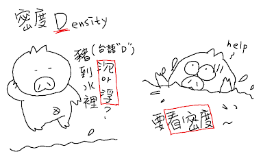

> 没想到沉浮是要密度的呀！有些时候，你体积很大，但是密度小，你是没法沉下去的，如大黄鸭！

**密度 = 质量 / 体积（D = M / V）**

**➹：**[Kirby's Blog: 質量、體積、密度](http://kirbyjian.blogspot.com/2013/09/blog-post.html)

### ⑫密度的意义？

密度是什么？

其实跟人口密度很像


当要问两个东西谁比较重?

其实很难比......


**➹：**[Kirby's Blog: 密度的意义](http://kirbyjian.blogspot.com/2013/09/blog-post_3154.html)

### ⑬1x、2x、3x的图片是怎样的？

先来看看这些图片应用于哪些设备？


设计各种尺寸的图片：

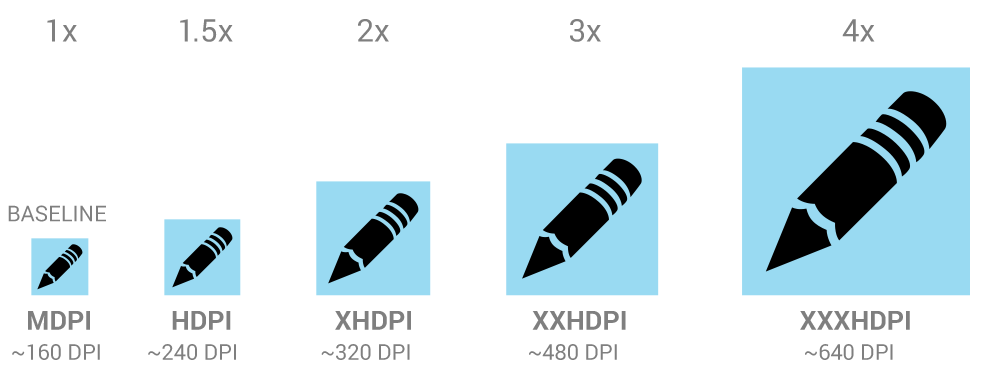

如果你在iPhone6 plus上用了1x图片，那么该图片的呈现就会缩小1/3，为了保证不缩小，所以用了3x，这种思想类似于在网页上使用了 `meta:viewport`

**➹：**[IOS Android Iocn 尺寸 - 槑UI設計](http://mei-ui-designer.blogspot.com/2014/11/ios-android-iocn.html)

⑭⑮⑯⑰⑱⑲⑳

