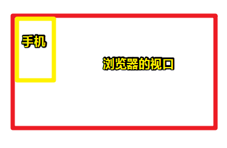

# 两个viewport的故事（part1）

## ★资料

**➹：**[[译] 关于两种视口（viewport）的故事：其一 - Know little more JS and Technology - SegmentFault 思否](https://segmentfault.com/a/1190000006837963#articleHeader5)

**➹：**[两个viewport的故事（第一部分）](https://web.archive.org/web/20170705090419/http://weizhifeng.net/viewports.html)

## ★引子

在上篇04笔记中，我发现我对viewport的概念是懵逼的，而且「像素」二字看多了，脑海里边完全就是混乱的状态，我似乎知道了「很多」概念，但又似乎并不知道。或许，当我理解viewport这个概念之后，才能真正知晓理解这个「像素」到底对我们写CSS有什么特别的帮助。

目前的认识：

1. 为什么你能看到屏幕上所显示的东西？——那时因为屏幕有很多像素（叫设备像素或物理像素都行）呀！而且它们都会发光

2. 我们写CSS时，写的 `1px`表示什么？——我知道 1 个CSS像素是等于1个设备独立像素（叫逻辑像素也行），而1个设备独立像素是否等于 1 个物理像素，就得看这浏览器是桌面端的还是移动端的了，如果是桌面端，那倒是好说，就拿我笔记本来说 设备独立像素是 `1366*768`，而我们写的1个CSS像素，刚好等于1个物理像素，即我们在屏幕上所看到的1个CSS像素就是那么宽那么大！如果你放大1倍网页，那么此时放大的是1px到底能表示多少个物理像素呢？显然放大一倍，即1个CSS像素表示2个物理像素了，而视觉呈现明显发生了变化，因为发光点相较放大之前的网页，多了一个，即有两个发光点支撑着1px，可见，我们的`px`单位是相对单位呀，当然，这只是**CSS像素的第一方面的相对性（同一设备之间）**。还有另一方面，而这另一方面，来自于移动端设备。

   就拿现在2019年说，我们知道移动端设备大多都是分辨率贼高，而设备独立像素则是也就那样，即一个成年人就能握住这些设备（尺寸小），而这些设备根据不同的ppi，有了1x、2x、3x、4x等之分。

   之前在PC端浏览页面，即在1x设备浏览，这意味着1个CSS像素表示1个物理像素；

   如果你在2x设备浏览，这意味着1个CSS像素表示2个物理像素，而为了保证，1个CSS像素等于1个物理像素，于是在2x设备上的浏览器，直接把网页缩小了`1/2`。同理3x设备，则缩小了 `1/3`……

   而这就是为什么为PC所写的页面，跑到了移动端去，就会把整个网页都给缩小了，然后我们还得用手指放大它们，以此来看清网页内容。

   而这也是 **CSS像素的第二方面的相对性（不同设备之间）**

3. 如何让为PC端所写的网页，在移动端上浏览，也有一样大小的CSS呈现？简单来说就是，我写10px的border，PC端呈现的border就那么大，而移动端呈现的也那么大？

   很简单，使用 `meta:viewport`即可。这时你可以想象把移动端设备放到PC端屏幕的左上角，然后遮住PC端一角的内容就是手机上的，而手机上看不到的，即需要你拖动滚动条才能看见的，就是PC端上没有被手机遮住的其它部分。

   

4. 我看手机、看笔记本……显然眼睛对这些设备屏幕的距离是不一致的，所以为PC端所写的页面（加上了 `meta:viewport`），显然在移动端上浏览，会显得内容过于暴力、张狂！那么问题来了，我想让同一个URL的网页（为PC端所写的），能在移动端上浏览作出某种响应？（比如说布局、字体大小、盒子大小等等，反正涉及尺寸的以及布局的都得发生变化）

   这个也很简单，使用媒体查询即可！然后加上一些弹性网格布局（如flex、grid）、弹性图片、以及一些诸如rem、vw、vh、em、百分比这样的单位（可见，不要写px单位，不然针对盒子大小以及字体大小会很麻烦。）

   总之，你要保证移动端的网页不要出现水平滚动条，即便内容显示得没有PC端上的多，也无关紧要，只要你写好布局，最后能把你想要呈现的内容都给呈现出来就好了，无须理会用户向下滑网页到天荒地老……

