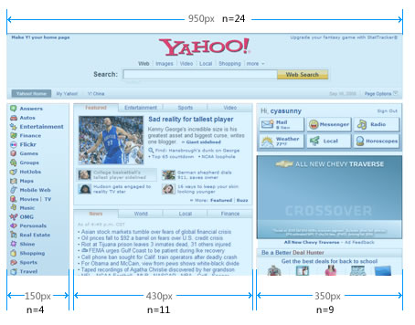

# 栅格系统设计

## ★引子

刚好看到，芳芳的造轮课程之「简单轮子：网格系统」

根据这个链接：[什么是栅格化设计？ - 知乎](https://www.zhihu.com/question/19602912) or [什么是960 栅格系统？ - 知乎](https://www.zhihu.com/question/20309521)

看了一下高票答案，根据这答案提供的相关链接：

**➹：** [网页栅格系统研究:960的秘密 - 设计理论 - 蓝色理想](http://www.blueidea.com/design/doc/2008/6247.asp)

**➹：**[网页栅格系统研究:蛋糕的切法 - 设计理论 - 蓝色理想](http://www.blueidea.com/design/doc/2008/6248.asp)

**➹：**[网页栅格系统研究:粒度问题 - 设计理论 - 蓝色理想](http://www.blueidea.com/design/doc/2008/6256.asp)

**➹：**[网页栅格系统研究:技术实现 - 网页制作 - 蓝色理想](http://www.blueidea.com/tech/web/2008/6272.asp)

我大致了解了一下什么是栅格化设计。

而当我大概看完了这些链接之后，我真想说一句「操！为啥现在才给我看到？」

我终于明白为啥我总是不会布局了（其中一个叫gutter的概念很关键），因为这TM我从未看过960Grid啊！

以下内容我完全拷贝[玉伯](http://caibaojian.com/lifesinger)的文章：

## <a id="yi">★网页栅格系统研究:960的秘密</a>

| **网站**    | **首页页面宽度（px）** |
| ----------- | ---------------------- |
| Yahoo!      | 950                    |
| 淘宝        | 950                    |
| MySpace     | 960                    |
| 新浪        | 950                    |
| 网易        | 960                    |
| Live Search | 958                    |
| 搜狐        | 950                    |
| 优酷        | 960                    |
| AOL         | 960                    |

上面列举的都是 Alexa全球排名前100的站点（以前的数据）。它们的首页宽度为`950px/960px`. 除了微软的Live Search, 这些站点有个共同特点：**页面结构较复杂，都可以认为是门户型网站（百货商场，即各种类型网站的入口，类似于提供一扇门，然后你进入这扇门，就能看到你想要看到某个类型的信息，你想想「怪兽电力公司」这部漫画片里边的门你就知道了）**。

再来看看Google, YouTube, Facebook, Flickr!, eBay等知名站点，它们的**首页宽度没什么固定规律**，共同的特点是：**功能专一，页面结构相对简单**。

根据上面的简单分析可以认为：**当搭建页面结构复杂的门户型网站时，开发工程师们不约而同地都选择将页面宽度定为950px/960px.**

这是一件很有趣的事情，为什么要选择这个宽度呢？这个宽度值究竟有什么魔力？

### ◇**神奇的960**

设计师们对苹果情有独衷。在 1024 x 768 的分辨率下，打开Firefox：


自然状态下，Firefox窗体的大小约为 974 x 650. 减掉左右两边7px的边框，网页的实际大小为上图中的红色部分，宽高为 960 x 650.

有趣的960就这样出现了。是的，可以认为一切就这么简单。栅格系统最早出现在平面设计领域，设计师们爱用苹果，苹果下浏览器的默认宽度为960px, 于是960就这么“自然”地出现了。

**数字背后的奥妙**

上面的“自然”出现，细究自然是不让人信服的。苹果系统的设计者们在没有喝醉酒的情况下选择了960，而不是其它什么1000之类的整数，自然另有奥妙。

科学界有很多问题都可以归结到数学问题上，我们也从数学着手：


**➷：**[如何分解质因数？](#er)

960可以分解为2的6次方乘以3和5, 这使得960可以分割成以下宽度的整数倍：

```
2, 3, 4, 5, 6, 8, 10, 12, 15, 16, 20, 24, 30, 32, 40,
48, 60, 64, 80, 96, 120, 160, 192, 240, 320, 480
```

共26种（26 = 7 * 2 * 2 - 2, 减去2是去掉1和960自身），我们标记为：

同理可以得到：

```
N(480) = N(2^5 * 3 * 5) = 6 * 2 * 2 - 2 = 22
N(750) = N(2 * 3 * 5^3) = 2 * 2 * 4 - 2 = 14
N(800) = N(2^5 * 5^2) = 6 * 3 - 2 = 16
N(1000) = N(2^3 * 5^3) = 4 * 4 - 2 = 14
N(1024) = N(2^10) = 11 - 2 = 9
N(1920) = N(2^7 * 3 * 5) = 8 * 2 * 2 - 2 = 30
```

根据直觉（严格证明也不难，不过还是留给数学系的学生去证明吧），我们得到一个有趣的结论：

要使得N(width)最大，width的取值必须是 …, 480, 960, 1920, …

N越大，可组合的宽度值就越多。**对栅格系统来说，这意味着越灵活！**

目前绝大多数显示器都支持 1024 x 768 及其以上分辨率，480太窄，1920则太宽（**太宽也不利于阅读**），因此**960就成为网页栅格系统中的最佳宽度了**。（补充：480可以应用在Flash的栅格设计中）

细心的你也许会记得，本文开头列举的宽度值中，950也出现了好几次。950是怎么来的？和960是啥关系？

## ★**网页栅格系统研究:蛋糕的切法**

首先澄清一个应用场景问题。之前 [研究（1）](#yi) 指出，**对于结构复杂的网站，不少设计师们喜欢采用960固定宽度布局**。但要注意的是，960并不是万能钥匙，大部分网站没有也不需要栅格系统。Amazon采用的是宽度自适应布局，最大限度的呈现信息。Google更是简简单单，主题部分就一个列表。eBay的页面非常简洁，商品页面宽度自适应，信息自然流畅，噪音少，购物很踏实。类似的站点还有很多，对于这些站点来说，**宽度自适应布局更受青睐**。

有个很有意思的网站是Yahoo!, 看起来是固定宽度布局，实际上在CSS中只要去掉一行，就能摇身一变自适应宽度了：

```css
#page {
    width: 70em;
}
```

为什么Yahoo!最后选择了定宽布局呢？这很可能是因为定宽布局比宽度自适应布局更容易控制。对于结构复杂的网站来说，可维护性和可扩展性非常重要。Yahoo!是以信息展示为主的门户型网站，960的宽度对于信息的阅读比较友善（[Joe Clark写了一篇屏幕阅读时有关行长的有趣文章](http://blog.fawny.org/2005/09/21/measures/)）。种种因素使得Yahoo!最后采用了定宽布局（Tommy Olsson总结了 [每种布局设计的优缺点](https://web.archive.org/web/20090913051359/http://www.autisticcuckoo.net/archive.php?id=2004/07/21/fixed-liquid-elastic) )

> 有关行长大概72个字符（英文字符和标点符号）左右。而中文字符可能大概36个字符左右吧！
>
> 或者说：「960到980像素是最适合人眼视觉接受范围的宽度」
>
> **➹：**[960网页栅格系统设计 - 后时代](http://houshidai.com/design/960-grid-system-design.html)

这里将只关注定宽布局，适用的场景是搭建复杂的门户型网站。对于宽度自适应布局和相应的栅格系统，暂不讨论（根据实现的技术手段不同，宽度自适应布局又分为流体布局和弹性布局。我个人蛮喜欢弹性布局，以后有时间再研究）。

好了，已经将范围缩小到**定宽布局的网页栅格系统**，那我们开始吧。

### ◇**并不遥远的750**

还记得800×600的显示器不？虽然才时隔几年，感觉却好像是上个世纪的事了。Mark Boulton做了 [最早的探索](https://web.archive.org/web/20081217212540/http://www.markboulton.co.uk/journal/comments/five_simple_steps_to_designing_grid_systems_part_4/)：


将750分割成均等的6份，这就形成了栅格系统，稍加组合划分就形成了两栏布局和三栏布局。Mark Boulton还研究了Gutter（垂直栏之间的间隙）对栅格的影响，有兴趣的可以阅读原文，或者跟着我往下看吧，下面将详细阐述。

### ◇**几个术语和一个公式**

一个标准的栅格系统，包括以下部分：


将Flowline的总宽度标记为W, Column的宽度标记为c, Gutter宽度标记为g, Margin的宽度标记为m, Column的个数标记为N, 我们可以得到以下公式：

```
W = c * N + g * (N - 1) + 2 * m
```

**一般来说，Gutter的宽度是Margin的两倍**，上面的公式可以简化为：

```
W = c * N + g * (N - 1) + g = (c + g) * N
```

将c+g标记为C, 公式变得非常简单：

```
W = C * N
```

上面的公式就是栅格系统的基础，很简单吧。

### ◇**950的来历**

具体应用时，Margin其实是一个空白边，从视觉上看并不属于总宽度。不少栅格设计里习惯性地设定Gutter为10px, 这样Margin就是5px. 当W为960，分割成6列（**应该是4列吧！**）时，栅格如下图：


上图的处理是左右Margin各为5px. 也可以将Margin集中放在一边，比如右边：


无论Margin放在何处（这只影响技术实现，不影响设计），我们真正要关注的是去除Margin之后的部分：


这就是我们要真正关注的950！将W的含义变为去除Margin的总宽度，公式变化为：

```
W = N * C - g
```

> C=div+gutter = 230+10，有4个div，即3个gutter。
>
> W=4*240-10=960-10=950

将上面的公式实例化一下：

```
950 = 12 * 80 - 10
950 = 16 * 60 - 10
950 = 24 * 40 - 10
```

这就形成了960蛋糕的三种常见切法。

- 12 x 80

  

  切成12份的蛋糕。有11份边角料。

- 16 x 60

  

- 24 x 40

  

上面三种切法，N越大，灵活度越高。可以根据网页的实际复杂度来选用对应的切法。在960 Grid System首页中，展示了12 x 80的应用：


我们来看下 [研究（1）](#yi)中开头列举的网站的栅格应用情况。

Yahoo!是很标准的 24 x 40 栅格：


> 我发现typora的编辑区域，一行的宽度也是960px

淘宝网目前只有商城上部分使用了栅格系统（大的两栏布局遵守了 24 x 40 的栅格化，主体部分使用的另一套7×40的栅格划分）：


网易很不错，采用的是 16 x 60 的栅格系统：


[研究（1）](#yi)中的其它站点都没有真正严格地采用栅格系统

### ◇**栅格系统的优势**

上面的“发现”是让人有点沮丧的。目前严格采用栅格系统的站点非常少，为什么我们还要努力的让网页栅格化呢？

栅格系统具有以下优势：

1. 能大大提高网页的规范性。在栅格系统下，页面中所有组件的尺寸都是有规律的。这对于大型网站的开发和维护来说，能节约不少成本。
2. 基于栅格进行设计，可以让整个网站各个页面的布局保持一致。这能增加页面的相似度，提升用户体验。
3. 对于设计师们来说，灵活地运用栅格系统，能做出很多优秀和独特的设计。（详见《超越CSS》一书）

对于大型网站来说，我相信栅格化将是一种潮流和趋势。

下面讨论栅格系统中的黄金分割。

#### **黄金分割**

黄金分割可以归结为数学问题：对于长度为1的线段，将其分成两部分 `x` 和 `1 - x`, 使得：

```
x / 1 = (1 - x) / x
```

化为简单的二次方程：

```
x^2 + x - 1 = 0
```

正数解为：

```
x = (sqrt(5) - 1) / 2 ~= 0.618
```

这就是黄金分割。这个比例不仅仅出现在诸如绘画、雕塑、音乐、建筑等艺术领域，在管理、工程设计等方面也有着不可忽视的作用。 （这是个自然界的魔数，类似的还有真空光速、普朗克常数、精细结构等等，感兴趣的Google吧）

在平面设计领域，黄金分割点被广泛采用。比如下面这种图：


> 矩形的长宽比是黄金比例的。

数一数上面有多少黄金分割？（5个？）

对于960栅格，实际宽度是950. 两栏布局时，黄金分割为：


> 360/580 是最接近黄金比例的，如果其中的gutter是5px，或者 15px的话，都会有很大的偏差。

对于 24 x 40 的情景，最接近黄金分割的两栏布局是 350 : 590, 栏数比例为 9 : 15. 但实际使用时，因为窄栏经常用来做导航或放辅助信息，并不需要350px这么宽。因此实际情况下经常被采用的布局是：


上面讲的都是宽度方向上的栅格化，下面我们看看高度方向上如何应用。

#### **高度方向上的栅格**

还记得研究（1）中那张红红的很刺眼的图吗？注意高度值560也是很神奇的。

```
N(560) = N(2^4 * 5 * 7) = 18
560 / 960 ~= 0.583
```

N(560)比较大，同时可以让高宽比接近黄金分割。针对560, 我们采用 14 x 40 栅格：


这样，我们就在宽度和高度两个方向上都实现了栅格化。

接下来将详细阐述960栅格系统的模块化应用。

## ★**网页栅格系统研究:粒度问题**

上一个★中讨论了栅格系统的基础知识。这一篇将集中探讨栅格系统的粒度问题。（注：如非特别指明，栅格系统均指24列960栅格系统）

[淘宝的首页](http://www.taobao.com/)（[截图](http://www.blueidea.com/articleimg/2008/10/6256/taobao_snapshot_20081026.jpg)）目前尚未严格遵守栅格系统，如果重构的话，宽度方向可以考虑采用下面的栅格布局（只考虑页面主体部分，忽略高度的比例）：


### ◇**纷乱的高度世界**


我们来看下图的左上角。左上角部分目前的宽度为256px, 重构的话可以将宽度缩小到230px以符合栅格（不可避免的要调整内容，比如人气宝贝中将只能放下3张图片）。来仔细看下高度方向：


高度方向的布局是：90 : 117 : 100, 第一个间隔是8, 总高度为325. 很明显，高度方向没有任何栅格化的迹象。实际上，即便是严格遵守栅格系统的Yahoo!首页，高度方向上也没有严格栅格化。

这究竟是为何？

### ◇**一切皆有可能**

我们缩小关注点：


上图（图3）中，图像的大小是70 x 70, 刚好是24列960栅格系统两列的宽度。对于右边的文字，采取了如下样式：

```
font-size: 12px;
line-height: 150%; /* 12 x 150% = 18px */中文字体是宋体，line-height的计算值是18px.
```

注意图中文字部分可视区域的高度为65, 上下各有4px和1px的间隙。为什么会产生这么奇怪的间隙呢？我们来看下图：


从上图中我们可以得知，12px的宋体中文字，实际高度只有11px. line-height减去11多出来的高度，则“均匀”分布在上下间隙中（**如果多出来的高度为偶数，则上下均分；为奇数时，上面比下面多1px**）。这样，对于70px的高度来说，要布局4行文字时，假设行高多出来的上半部分为x, 下半部分为y, 在最理想的情况下，应该满足以下公式：

```
11 * 4 + 4 * x + 3 * y = 70
x = y 或 x = y + 1不难推出，x最理想的整数解为4. 从而line-height为 4 + 11 + 3 = 18.
```

> 这难道是所谓的行高叠加？而不是margin合并？

因此：

对于24列960栅格系统来说，如果要在高度方向上实现栅格，**font-size为12px时**，**line-height的最佳取值是18px(150%)**.

追求完美点话，还可以将文字部分`margin-top: -1px`, 使得65上下的间隙为3和2.

至此，我们可以初步判断：

高度方向上是有可能严格栅格化的。一切皆有可能！

**然而，现实总那么残酷**


上图中的标题高度为22, 这在24列960栅格系统中是无法对齐的。而且总高度为100, 在24列960栅格系统中也不存在（110才可以）。或许高度方向上我们可以细化行宽为20, 但依旧没法解决上面两个问题（22是明显不能解决的，而对于100px的高度，也无法通过细化行宽来解决。可选高度永远是10的奇数倍，如果进一步细化，小于10后，会变得非常繁琐，没什么实际应用价值）

> 我在想这TM高度也要栅格吗？而且这部分内容我是真得没看懂，这些东西难道不是设计师交个设计稿给我们就可以直接搞的吗？

### ◇**宽度世界里会好些吗**


上面是Yahoo!首页上的两个小模块，我都不想去标注模块里面的布局宽度了（因为一点都不符合24列960栅格系统）。宽度世界里，和高度世界一样充满希望但现实却残酷无比。

### ◇**银弹是不存在的**

栅格系统是美好的。但如果我们一味地追求将所有设计都栅格化（必须承认我曾有这个幻想），则立刻会陷入地狱一般的黑暗中。这篇文章中的艰难尝试（我分析了20多个小模块），让我突然醒悟到一个粒度问题：**任何设计都有适用范围，超出最佳适用范围，强行使用只会带来无尽的烦恼**。对于栅格系统（这里指所有栅格系统，包括多种栅格系统混合使用的情景）来说，我觉得以下场景非常适合：

1. 页面的总体宽度布局，比如两栏、三栏等布局
2. 一些固定区块的尺寸，比如广告图片的尺寸
3. **区块之间的间距，可以参考栅格系统的槽宽（Gutter）**
4. 一些可以栅格化的小区域，比如图3中的例子，暗合栅格往往能简化布局上的考虑

除了上面这些应用场景，强行使用栅格系统，往往会束手束脚，适得其反。这篇文章的目的，就是尝试用最啰嗦最费神貌似很科学实际很无聊的分析来指出栅格系统应用时的粒度问题。在粒度问题上达成一致后，下一篇中我们将讨论栅格系统的技术实现，最后一篇则讨论栅格系统的压轴好戏：模块化开发。

## ★**网页栅格系统研究:技术实现**

前三篇文章（三个★）中，明确了栅格系统的设计细节和适用范围。这一篇将集中讨论960栅格系统的技术实现。

### ◇**Blueprint的实现**

[Blueprint](http://blueprintcss.org/)是一个完整的CSS框架，栅格系统是它的一部分功能。我们来看 [demo](https://web.archive.org/web/20081011072026/http://www.blueprintcss.org/grid.html)页面：


抽象简洁点：


以上三栏布局的代码为：

```html
<style type="text/css">
    .container { margin: 0 auto; width: 950px }
    .span-8 { float: left; margin-right: 10px }
    div.last { margin-right: 0 }
    hr { clear: both; height: 0; border: none }
</style>
<div class="container">
    <div class="span-8"></div>
    <div class="span-8"></div>
    <div class="span-8 last"></div>
    <hr />
</div>
```

上面是基本功能，Blueprint还支持append-n, prepend-m, border等“高级”功能，这些就不细说了。Blueprint的特点简单总结如下：

1. 采用浮动来实现布局，简单明了
2. 950两侧没有margin, 最后一列的class需要加上last
3. 采用额外标签来清除浮动

> 现在不需要浮动了吧！直接使用flex布局或者grid布局。
>
> 我开始明白理解一个技术之所以诞生的缘由，远远比去知道这个技术的how要重要得多。

### ◇**960.gs的实现**

谈到960栅格系统，不得不提 [960.gs](http://960.gs/) . Nathan Smith在 [这篇文章](http://sonspring.com/journal/960-grid-system) 中，详细阐述了他的想法和设计思路。这里有个 [demo页面](http://960.gs/demo.html) ，核心代码很简单：

```html
<style type="text/css">
    .container_12 { margin: 0 auto; width: 960px }
    .grid_4 { float: left; margin: 0 10px }
</style>
<div class="container_12">
    <div class="grid_4"></div>
    <div class="grid_4"></div>
    <div class="grid_4"></div>
    <div class="clear"></div>
</div>
```

上面就构建了三栏布局：


有意思的几点：

1. margin是均匀放在950两侧的
2. 所有grid除了宽度不同，左右边距都一致margin: 0 10px;
3. 代码简单清晰，起始和结束列不需要添加额外class

很明显，Blueprint和960.gs都是采用浮动来实现布局的，主容器需要添加额外标签来清除浮动（[可以参考这里](http://sonspring.com/journal/clearing-floats)）。当然，这也不是什么大问题，请看 [这篇文章的总结](https://web.archive.org/web/20090518090712/http://lifesinger.org/blog/?p=614) ，不添加额外标签也可以清除浮动。

### ◇**YUI的实现**

接着来看大名鼎鼎的[YUI Grids CSS](https://web.archive.org/web/20081223180428/http://developer.yahoo.com/yui/grids/). YUI的CSS框架由三个文件组成：

```
reset.css - 样式重置
fonts.css - 版式字体控制
grids.css - 栅格系统
```

我们从 [demo](https://web.archive.org/web/20081221001328/http://developer.yahoo.com/yui/examples/grids/grids-gb_source.html) 开始：


注意，demo链接中的宽度是750的，但我们只要将<div id="doc"></div>中的id改为doc2, 页面宽度就自动变为950宽了（YUI非常强大^o^）。来看下dom结构：


采用的也是浮动布局，简化后的CSS代码为：

```html
<style type="text/css">
    .doc2 { margin: auto; width: 73.076em }
    .yui-u { float: left; margin-left: 1.99%; width: 32% }
    div.first { margin-left: 0 }
    #ft { clear: both }
</style>
```

**YUI的特点是**：

1. 依旧是采用浮动布局，槽（Gutter）宽通过margin-left来控制（Blueprint采用右边距，960.gs采用均分，这三个框架对槽的处理实在有意思）
2. 总宽度采用em, 这样可以用在弹性布局上
3. 栏的布局用的是百分比，采用了流体布局

YUI的好处是能用来做自适应布局，在这前面两个框架里是没有的。但普通的定宽布局，YUI则显得有点麻烦，比如我们要实现四栏布局，dom得这样写：


先来两个两栏布局，再细分为四栏布局，清晰度上欠佳。

### ◇**更多栅格实现**

栅格化更多是一种布局思想，实现技术可以千差万别。比如今年冒出来的 [伪绝对定位](http://www.alistapart.com/articles/fauxabsolutepositioning) ，立刻就可以用来实现栅格系统。明城兄弟就 [尝试了一把](https://web.archive.org/web/20081220055030/http://lab.gracecode.com/demo/grid.html)。

肯定还有非常多的栅格化实现方案，这里就不一一挖掘了。

### ◇**双飞翼栅格系统**

挺奇怪这个名字？请先阅读这篇文章：[渐进增强式布局探讨](https://web.archive.org/web/20081228122255/http://lifesinger.org/blog/?p=659). 简单说，双飞翼布局是一种布局实现技术，可以利用它来实现一整套栅格系统。

先看test页面：[Grids Layout Test](https://web.archive.org/web/20081210183405/http://lifesinger.org/lab/grids_test1.html).

具体技术细节在 [渐进增强式布局探讨](https://web.archive.org/web/20081228122255/http://lifesinger.org/blog/?p=659) 一文中已经阐述，这里不再重复。有几点需要说明：

1. 这套栅格系统并不能实现所有布局。这和YUI Grids类似，只能实现预定的一些布局。比如三栏布局，目前只加入了5 : 13 : 6, 5 : 12 : 7, 9 : 9 : 6, 8 : 8 : 8四种情况，这是从淘宝的现有页面中分析总结出来的。对于同一个站点来说，太多不同的三栏比例不是好事（淘宝目前都有点多，以后可能还会进一步统一）。因此如果采用这套栅格系统的话，需要先分析站点，定义出一套合适的比例。这里有个所有比例的自动生成工具：[grids_css_generator.html.](https://web.archive.org/web/20081210183400/http://lifesinger.org/lab/grids_css_generator.html)
2. 关于命名：.grid-c2-s6表示两栏（`c2: column 2`）布局，sub栏的宽度是4列（`s4: sub width is 4 * 40 -10`）. 而.grid-c2-s6f, 最后的f表示两栏布局的第二种情况，即sub和main互换。类似地，.grid-c3-s5e6d表示三栏布局，其中sub栏的宽度是5, extra栏的宽度是6, 最后的d表示是s5e6三栏布局中的第四种情况。
3. 为了方便使用，将最常用的两栏布局.grid-c2-s5用.grid-c2直接表示。同样的，.grid-c3表示.grid-c3-s5e6. 这是淘宝的默认值，其他站点可以根据实际情况修改。
4. 这套布局符合渐进增强式工作流程。细心的你可能已经发现，所有两栏布局和三栏布局，HTML中的DOM结构是完全一样的，只有最外层div的class不同。如果要交换左右栏，只要非常简单的修改下class就可以。
5. 实际使用时，两栏布局和三栏布局已经够用。其实有了两栏，其它布局就都可以组合出来。这里有一个尝试性页面：[grids_test4_v0.1.html](https://web.archive.org/web/20090206021058/http://lifesinger.org/lab/grids_test4_v0.1.html). 组合布局看起来很强大，但实际使用时会把问题搞复杂，不推荐使用，干脆忘掉吧。

最后来看下两个测试页面：两栏布局[grid-c2_test.html ](https://web.archive.org/web/20090205181900/http://lifesinger.org/lab/grid-c2_test.html)和 三栏布局[grid-c3_test.html](https://web.archive.org/web/20090205184424/http://lifesinger.org/lab/grid-c3_test.html).

目前除了发现在ie6下有个bug（超大图片等会撑乱布局，其实可以用overflow: hidden来解决，但考虑overflow的[负面影响](https://web.archive.org/web/20090518090712/http://lifesinger.org/blog/?p=614)，最后还是由布局内部的模块来自主控制的好），尚未发现其他问题。

### ◇**小结**

栅格系统更多的是一种布局思想，在实际使用时，根据具体需求选用合适的技术来实现即可。需要注意的是，对于栅格的技术实现来说，太灵活未必是件好事，适度灵活最难得。怎么才能适度呢？这需要**疯狂实践 + 不断的反思 + 持续的重构 + 悟…**

栅格搭好了页面框架，接下来很重要的一件事情就是往里面添加内容模块。让内容模块规范化，让页面生成工业化，对大型站点来说，这是栅格系统最有商业价值的地方。下一篇也是本系列最后一篇将展示栅格系统中的模块化应用。

## ★来个网页的栅格系统设计的总览


### ◇**栅格系统的形成**

1692年，新登基的法国国王路易十四感到法国的印刷水平强差人意，因此命令成立一个管理印刷的皇家特别委员会。他们的首要任务是设计出科学的、合理的， 重视功能性的新字体。委员会由数学家尼古拉斯加宗（Nicolas Jaugeon）担任领导，他们以罗马体为基础，采用方格为设计依据，每个字体方格分为64个基本方各单位，每个方各单位再分成36个小格，这样，一个印 刷版面就有 2304个小格组成，在这个严谨的几何网格网络中设计字体的形状，版面的编排，试验传达功能的效能，这是是世界上最早对字体和版面进行科学实验的活动，也 是栅格系统最早的雏形。

栅格系统英文为“grid systems”，也有人翻译为“网格系统”，其实是一回事。不过从定义上说，栅格更为准确些，从[维基百科](https://zh.wikipedia.org/w/index.php?title=%E6%A0%85%E6%A0%BC%E8%AE%BE%E8%AE%A1&variant=zh-cn)查到栅格的定义为：

> 栅格设计系统（又称网格设计系统、标准尺寸系统、程序版面设计、瑞士平面设计风格、国际主义平面设计风格），是一种平面设计的方法与风格。运用固定的格子设计版面布局，其风格工整简洁，在二战后大受欢迎，已成为今日出版物设计的主流风格之一。

**➹：**[Grid (graphic design) - Wikipedia](https://en.wikipedia.org/wiki/Grid_%28graphic_design%29)

### ◇**网页设计中的栅格系统**

我给网页栅格系统下的定义为：**以规则的网格阵列来指导和规范网页中的版面布局以及信息分布**。
网页栅格系统是从平面栅格系统中发展而来。**对于网页设计来说，栅格系统的使用，不仅可以让网页的信息呈现更加美观易读，更具可用性。而且，对于前端开发来说，网页将更加的灵活与规范。**


栅格系统在现在的网页设计中应用越来越多，从网络上搜罗了一篇关于栅格系统应用的文章：[30个最顶尖的基于栅格系统的博客网站设计](https://web.archive.org/web/20090330160626/http://www.yeeyan.com/articles/view/snlchina/3570)

### ◇**栅格系统的设计原理及应用**

那么如何设计一个栅格系统？接下来我们将通过实例，详细的介绍一下网页栅格系统的原理与应用：


在网页设计中，我们把宽度为“W”的页面分割成n个网格单元“a”，每个单元与单元之间的间隙设为“i”,此时我们把“a+i”定义“A”。他们之间的关系如下：

`W =（a×n）+（n-1）i`

由于a+i=A，

可得：**(A×n) - i = W**

这个公式表述了网页的布局与网页“背后”的栅格系统之间的某种关系。我们拿yahoo作例，来看一下栅格系统的应用：



yahoo的网站页面宽度为W=950px，每个区块与区块的间隔为i=10px；如果应用上面的公式，可以推出A=40px，既yahoo首页横向版式设计采用的栅格系统为：

**（40×n）- 10 = W**

下面我们列出当n等于不同数值时W变化的数值表格 ：


> 这图给我的感觉就是，当你想在一行里边搞不同栏的时候，请满足n的相加等于24
>
> 如你想搞个三分等分栏：那么就是310*3，通过间隙10px，加起来刚好是950px。

从表格可以看出：yahoo首页的布局完全是按照栅格系统进行设计的，每个区块的宽度对应的n值分别为：4，11，9。在这里我们看到一个很有意思 的事情：只要保证一个横向维度的各个区块的n值相加等于24，则即可保证页面的宽度一定是950px。然而，950px的宽度也恰好就是当n=24的时 候，W的宽度值。由此我们得出以下的应用模式：


> 高度上栅格是`14*40`，保证了黄金矩形（不然，n=5为啥就是那么宽。）。形式上看，同处一行的div的高度是一致的，但是从竖直来看，他们的宽度是一致的。总之，你要确定div的高度，那么你可以用`14*40`

在栅格系统中，设计师根据需要制定不同的版式或者划分区块，他们的依据将是上面的那张对应表进行设计。这样，一个栅格系统的应用就从此开始了。我们 看到，使用栅格系统的网页设计，非常的有条理性；看上去也很舒服。最重要的是，它给整个网站的页面结构定义了一个标准。对于视觉设计师来说，他们不用再为 设计一个网站每个页面都要想一个宽度或高度而烦恼了。对于前端开发工程师来说，页面的布局设计将完全是规范的和可重用的，这将大大节约了开发成本。对于内 容编辑或广告销售来说，所有的广告都是规则的，通用的，他们再也不用做出一套N张不同尺寸的广告图了……

当然只要你愿意，我们可以衍生出任何一种栅格系统，只要改变A和i的值，这个根据网站的实际情况来制定。那么如何选择合适栅格系统，主要通过“构成 要素与程序、限制与选择、构成要素的比例、组合、虚空间与组合、四边联系与轴的联系、三的法则、圆与构成、水平构成这些设计元素规划，来实现比例和谐的平 面设计”。比较深奥，我们在这里就不详细阐述了。

呵呵，说了一堆栅格系统的优点。大家可能会问：**难道栅格系统真的是完美的么？答案是否定的：对于内容信息不确定导致高度不确定的页面，在高度层面上就无法做到栅格了。当然，具体的情况还需具体的分析与解决，这就需要设计师们在实际的应用中不断的总结经验，不断实践了。**


---

## ★总结

- 结构复杂的首页，会采取960px宽度，而结构单一的，则随你喜欢。

- 先栅格，然后几个栅格组合在一起可以变成一个大div。

- 确定了首页的宽度，可以宽度栅格，也可以高度栅格，但栅格并不是银弹。

- 虽然都是摘抄的文章，但是，栅格系统设计，让我对CSS布局有了更深一层的认识，比如我现在看网页，真得是带着格子的视野去看的，况且每个元素都是矩形的。栅格这种设计理念，真得让我们布局变得灵活起来了。当你不知道这一行需要几个div，纵向方向上需要几个div，那么不妨想想栅格，当你想给一个div宽高，不妨想想黄金矩形。

- 通俗理解什么是栅格化设计：

  > 在一个有限的、固定的平面上，用水平线和垂直线（虚拟的线，“参考线”），将平面划分成有规律的一系列“格子”（虚拟的格子），并依托这些格子、或以格子的边线为基准线，来进行有规律的版面布局。

  **➹：**[什么是栅格化设计？ - 钱争予的回答 - 知乎](https://www.zhihu.com/question/19602912/answer/13114343)
  这个答案之前我是看不懂的，如今经过一系列的copy文章，我就明白「格子」「规律」就是理解栅格化设计的关键。

- 一个可视化栅格的网站：[960 Grid System](https://960.gs/)

- 一个写栅格的网站：[Grid.Guide — Pixel Perfect Grids](http://grid.guide/)

- 现代点的栅格文章：[深度好文！如何用栅格系统布局网页界面 - 知乎](https://zhuanlan.zhihu.com/p/55494640)

- 当在做响应式布局的时候，其实就是TM改一下gutter，以及改一下栏（要么三栏变两栏，要么两栏变一栏，要么把无须在移动端显示的栏给删掉）。栏的变化可以使用flex布局。记住，不要在用float。


## ★Q&A

### ①查看全球最受欢迎网站的排名？

全球top：[Alexa - Top sites](https://www.alexa.com/topsites)

全球top：[Website Ranking: Top Websites Rank In The World - SimilarWeb](https://www.similarweb.com/top-websites)

中国top：[Alexa - Top Sites in China - Alexa](https://www.alexa.com/topsites/countries/CN)

美国top：[Alexa - Top Sites in United States - Alexa](https://www.alexa.com/topsites/countries/US)

香港top：[Alexa - Top Sites in Hong Kong - Alexa](https://www.alexa.com/topsites/countries/HK)

澳门top：[Alexa - Top Sites in Macao - Alexa](https://www.alexa.com/topsites/countries/MO)

台湾top：[Alexa - Top Sites in Taiwan - Alexa](https://www.alexa.com/topsites/countries/TW)

你懂的top：[Alexa - Top Sites by Category: Top/Adult](https://www.alexa.com/topsites/category/Top/Adult)（请不要说「我怀疑你在开车 但是我没有证据」）

总之，用google和youtube是全球排名前2的。我没有想到在台湾是没有淘宝和京东的。在中国前三baidu、qq、taobao。让我感觉到好笑的是 <https://login.tmall.com/>排名11。

或许可以通过这些网站排名，可以反应一个国家或者地区，大部分人都在干嘛 。像中国，3、4、5名分别是淘宝、天猫、京东。

**➹：**[全球排名前十万的网站中将近21%仍然没有使用HTTPS - 简书](https://www.jianshu.com/p/1f3ae52b7333)

**➹：**[最受欢迎网站列表 - 维基百科，自由的百科全书](https://zh.wikipedia.org/wiki/%E6%9C%80%E5%8F%97%E6%AC%A2%E8%BF%8E%E7%BD%91%E7%AB%99%E5%88%97%E8%A1%A8)

### <a id="er">②分解质因数？</a>

这个你通过分解质因数就能拿到

关于因子树这个概念（找数的 **任何** 因子，然后找因子的因子，继续这样做，直至不能再分解下去），我是第一次遇到：


**➹：**[质因数分解](https://zh.numberempire.com/numberfactorizer.php?number=960)

**➹：**[质因子分解](https://www.shuxuele.com/prime-factorization.html)

**➹：**[代数因式分解](https://www.shuxuele.com/algebra/factoring.html)

### ③如何计算一个整数的因数个数？

有工具可以帮我们直接拿到：

**➹：**[该数性质 960](https://zh.numberempire.com/960)

如计算960，它有28个因数，可是我想知道这个28的由来公式是怎样的呀？

说白了，我就是想知道「求960的约数个数」的公式：

```
约数个数=指数+1的连乘积
```

如 960 = 2^6^×3×5：`(6+1)(1+1)(1+1) = 28`

我不会去问公式由来，因为我觉得没有必要呀！毕竟在编程世界可以DRY呀！

当然如果你非得对公式有些记忆联系的话，可以了解一些抽屉原理：

> 桌上有十个苹果，要把这十个苹果放到九个抽屉里，无论怎样放，我们会发现至少会有一个抽屉里面放两个苹果。这一现象就是我们所说的“抽屉原理”。 抽屉原理的一般含义为：“**如果每个抽屉代表一个集合，每一个苹果就可以代表一个元素，假如有n+1个元素放到n个集合中去，其中必定有一个集合里至少有两个元素**。” 抽屉原理有时也被称为鸽巢原理。它是组合数学中一个重要的原理

把11个元素放到10个数组里边去，**至少**有一个数组有2个元素。5个鸽子笼，6只鸽子。

记忆联系：6+1是苹果呀！指数6是抽屉呀！

一个题目：

例1、一副扑克牌有四种花色，每种花色各有13张，现在从中任意抽牌。问最少抽几张牌，才能保证有4张牌是同一种花色的？

```
A．12 B．13 C．15 D．16
```

【解析】根据抽屉原理，当每次取出4张牌时，则至少可以保障每种花色一样一张，按此类推，当取出12张牌时，则至少可以保障每种花色一样三张，所以当抽取第13张牌时，无论是什么花色，都可以至少保障有4张牌是同一种花色，选B。

> 请抓住「保证」和「至少」。保证意味着不会出现极端情况，如一幅新牌，它们的花色都是按顺序排好的，如果是新牌，那么我只要抽4张就能拿到同一种花色，但是我并不能保证这幅牌是新牌呀！
>
> 为了保证，才有了至少。不管是什么规矩的新牌还是混乱的旧牌，我随意抽4张，4种花色任意一种都可能存在，我抽3次，那么就一定有3张牌是同一种花色的。
>
> 额……讲真我还是没有理解抽屉原理。我分不清上边那牌谁是鸽子和笼子。假如牌是鸽子，有52只鸽子，黑的、白的、灰的、红的各13只，那么我至少抓多少只鸽子才能保证有4只鸽子是一个颜色的？
>
> 我第一次抓4只，显然这抓是随机的，是变量的，那么按照概率学来说，我至少能抓到1种颜色（4种颜色之一，变量呀！）的鸽子。我连续抓3次（12只），那么至少能抓到3只一样颜色（变量呀！）的鸽子。我抓第13只，显然，不管哪种颜色，我的变量都会配对这只鸽子的颜色。
>
> 啊……我TM是在为了记忆这题而理解啊，我理解得毫无逻辑，就像是只能意会不能言传。

我只能说数字很奇妙，也有很奇妙的公式。虽说知道公式的推理原理比较好，但是我还是想直接吃到劳动果实。

**➹：**[怎么计算一个数的正约数有多少个_百度知道](https://zhidao.baidu.com/question/423900663078961172.html)

**➹：**[抽屉原理（名词）_百度百科](https://baike.baidu.com/item/%E6%8A%BD%E5%B1%89%E5%8E%9F%E7%90%86/233776)

**➹：**[国考学霸技巧：数学运算之抽屉原理专题 - 知乎](https://zhuanlan.zhihu.com/p/22998671)

**➹：**[960_百度百科](https://baike.baidu.com/item/960)

**➹：**[计算一个整数因子个数 - 大眼睛男孩儿](http://zhangxiaoya.github.io/2015/07/12/calculate-the-number-of-devisor-of-a-integer/)

**➹：**[整数（数学名词）_百度百科](https://baike.baidu.com/item/%E6%95%B4%E6%95%B0/1293937?fr=aladdin)

**➹：**[鸽子的颜色有哪几种_百度知道](https://zhidao.baidu.com/question/543502975.html)

### ④黄金分割原理？

**什么是黄金分割：**


数字上来说，就是0.618,
直观的从图上来看：`AC：AB=CB：AC`

如何画？


一个黄金矩形，裁掉最大正方形，剩下的矩形的长宽比，和原矩形一样。右边剩下的矩形还可以用同样的方法继续裁剪下去，虽然我们经常看到的只是裁了几次的版本，实际是可以无限的裁剪下去的哒～

至于黄金矩形里的“黄金比”便是**黄金矩形的长宽比**，和斐波拉契数列比一样，这个比在数学里最后得出的极限和斐波那契数列极限比如出一辙，象征自然美的公式之间都是相通哒

所谓的美？

就是自然美和数学公式相通了

如花瓣的瓣数、河流的石头（源头的石头数量小，但是块头大）……

实例？

不同重要性文字之间视觉强度递减：


这种递减是指数递减规律，就像这样：


**➹：**[为什么黄金分割是最美的？依据是什么？ - 知乎](https://www.zhihu.com/question/19601018)

### ⑤通栏、二分栏、三分栏……？


| 栏数           | 可划分宽度（px），元素间隔为10px             |
| -------------- | -------------------------------------------- |
| 通栏（一分栏） | 950                                          |
| 二分栏         | （190,750）（230,710）（270,670）（350,590） |
| 三分栏         | （190，470，270）（190，510，230）           |
| 四分栏         | （190，230，230，270）                       |
| 等分栏         | （`310*3`）（`470*2`）（`230*4`）            |

从这可以看出当你布局的时候，可以先分析几栏，确定一行有几个div。然后再搞事情。

需要注意的是，一个div里边同样可以分栏。

**➹：**[栅格系统](https://web.archive.org/web/20081220055030/http://lab.gracecode.com/demo/grid.html)

### ⑥屏幕分辨率统计使用情况？

**➹：**[屏幕分辨率统计 - 菜鸟教程](https://www.runoob.com/browsers/browsers-display.html)

**➹：**[显示器统计](http://www.w3school.com.cn/browsers/browsers_display.asp)

**➹：**[分辨率使用情况 - 百度统计流量研究院](https://tongji.baidu.com/data/screen)

