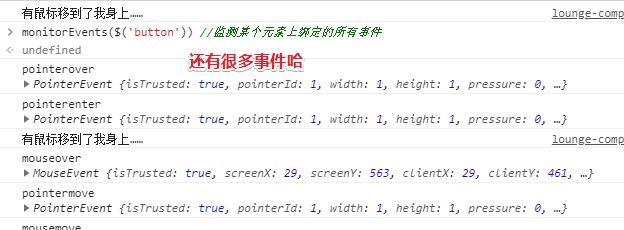

# chrome开发者工具

打开开发者工具的几种姿势：

- `Ctrl+shift+I`
- `F12`

## ★控制面板简介

按下 `F12`，我们就可以看见浏览器为我们所打开的开发者工具了：


每个工具都有其特定的功能……比如说：

- Elements：DOM节点和CSS。Elements 面板可以让您查看 DOM 树里的所有节点，包括JavaScript创建的节点和 iframe 里的节点；当然，您也可以看到每个节点的CSS样式。

  简而言之，通过使用它，我们就可以自由操纵DOM和CSS来重演网站的布局和设计

- Console：在开发期间，可以使用控制台面板记录诊断信息。或者使用它作为 shell,在页面上与JavaScript交互

- Source：可以通过这个面板来断点调试 JavaScript 。或者通过Workspaces（工作区）连接本地文件，使用开发者工具实时编辑

- Network：网络连接情况。Network 面板可以让您查看所有的网络请求，包括图片、JS文件、CSS和AJAX等。

  

- Timeline：时间抽。Timeline 面板可以让您了解解析当前网页所花费的时间细节，包括解析JavaScript、加载网络资源、绘制DOM等。不过，目前已经改名为[Performance](https://zhuanlan.zhihu.com/p/29879682)……

  我之前有用到过这个面板，主要是使用其旗下的Record功能，看看异步任务的执行情况……

  **➹：**[Chrome DevTools — Timeline - 小前端 - SegmentFault 思否](https://segmentfault.com/a/1190000008608538)

- Application：使用“资源”面板检查加载的所有资源，包括IndexedDB与Web SQL数据库，本地和会话存储，cookie，应用程序缓存，图像，字体和样式表。

  目前我有用到的功能，就是看看当前页面有哪些好看图片然后「可耻」的下载下来、localStorage、Cookie……

- ……

## ★Elements面板详解

> 关键词：编辑DOM和CSS样式

首先来看看它的功能吧！

它可以让我们动态查看和编辑DOM节点和CSS样式表，并且立即生效，避免了频繁切换浏览器和编辑器的麻烦。

我们常用它来查看源代码……为啥会这样说呢？照理说 `Ctrl+U`不就可以做到了吗？

因为它不但可以很好的格式化DOM节点，清晰的展现HTML文档，还可以**查看JavaScript创建的DOM节点和iframe中的DOM节点**，总之它就是可以查看用JavaScript动态生成的DOM节点，而 `Ctrl+U`可以做到吗？更别说其它能力了！

### ◇查看DOM树


### ◇选取DOM节点

也就是说查看某个DOM节点咯！

有3种姿势：

- 直接在页面选
- 直接在DOM树中选
- 直接在DOM层次中选

选中后，也就意味着，我们想要查看它的样式的目的已经达到了！


### ◇编辑DOM节点

也就是说增加、删除和修改DOM节点


选中了你想要选的DOM节点，此刻为蓝色背景，然后右击鼠标，弹出一个菜单……

菜单说明：

- Edit text（编辑文本）：编辑该节点中的文本。也可以在文本处双击进行编辑。

- Edit as HTML（编辑HTML）：编辑该节点及其子节点的所有HTML元素（包括节点中的文本）。

- Copy as HTML（复制HTML）：复制该节点及其子节点的所有HTML元素（HTML文档）。

- Copy XPath（复制XPath路径）：复制该节点的XPath路径，即DOM层次路径。例如，h2节点的XPath路径为 `/html/body/h2`。

- Delete node（删除节点）：删除该节点及其子节点的所有HTML元素。也可以使用 `Backspace` 和 `Delete` 键删除。

- Inspect DOM properties（审查DOM属性）：在控制台中显示该节点的所有标准属性（如果有的话）。

  我没有找到该菜单项，其实这个会在DOM层次中显示：

  

另外，我们也可以通过拖动节点来改变节点的顺序，双击属性节点来改变它的值

**➹：**[编辑 DOM  -  Tools for Web Developers  -  Google Developers](https://developers.google.com/web/tools/chrome-devtools/inspect-styles/edit-dom?hl=zh-cn)

### ◇查看CSS样式

CSS样式审查面板是一个非常有用的面板，实际开发中，有时候CSS样式表会非常复杂，甚至连我们自己都不知道当前节点应用了哪些样式。使用CSS样式审查面板，可以让我们清楚地知道当前节点使用了哪些样式，分别来自哪些文件，哪些样式是被覆盖的，哪些样式是最终样式，哪些样式是无效的，等等。

#### 测试

选中h2这个节点，Element面板右侧的CSS样式审查面板会展示出该节点的CSS样式：


在CSS样式审查面板中，我们可以添加、删除和修改CSS样式。

另外，除了刚才Style面板以外，还有其它几个子面板，如Computed之类的……

子面板说明：

- Style（样式）：当前节点的样式；
- Computed（计算）：查看当前节点经过计算后的样式以及盒模型数据；
- Event Listeners（事件监听）：查看为当前节点绑定的事件和事件监听函数；
- DOM Breakpoints（DOM断点）：查看为当前节点设置的DOM断点；
- Properties（属性）：当**前节点（对象）的所有属性**。

#### 使用JS获取样式

需求：

我们有的时候需要测试看一下某个CSS属性是否设置成功，所以需要通过dom去获取css样式。但是，如果使用原生去获取的话，会发现只有在dom身上设置的才能够获取的到，如`dom.style.width`，只有直接写到标签上，才能够获取的到，而在别的地方的我们将获取不到。

那么如何才能直接获取到写在style标签中的某个元素的css属性呢？就像jq的css()方法一样……


封装一波：


**➹：**[获取dom的最终的css属性值 - 现在学习也不晚 - CSDN博客](https://blog.csdn.net/qq_30100043/article/details/78495585)

**➹：**[Window.getComputedStyle() - MDN](https://developer.mozilla.org/zh-CN/docs/Web/API/Window/getComputedStyle)

**➹：**[获取元素CSS值之getComputedStyle方法熟悉 « 张鑫旭-鑫空间-鑫生活](https://www.zhangxinxu.com/wordpress/2012/05/getcomputedstyle-js-getpropertyvalue-currentstyle/)

#### 小技巧

1. **使用键盘方向键改变数值**，如某个元素的padding之类的值，总之在实际开发中，会经常使用该方法来微调元素的外边距、内补白和大小等，非常方便。

2. **颜色拾取器**，如某个元素的背景色，总之在实际开发中，会经常使用该方法来微调节点的颜色。

3. **添加阴影效果**

   

---

#### 一些你想不到的技巧

**①一秒钟让Chrome变成所见即所得的编辑器**

在控制台中输入这个`document.body.contentEditable=true`，然后敲下回车执行即可！


**②选取DOM元素**

之前我想要获取某个DOM对象的话，就得为该DOM节点添加id属性才行，不过现在不需要了：


当然，这是在控制台里，你才可以这样用！

不管 `$('tagName') 、$('.class')、 $('#id') 还是 $('.class #id')` 等类似的选择器，都相当于原生JS的`document.querySelector('')` 方法。这个方法返回第一个匹配选择规则的DOM元素。

在Chrome的控制台里，你可以通过 `$$('tagName') 或者 $$('.className') `（记得是两个`$$`符号）来选择所有匹配规则的DOM元素。选择返回的结果是一个数组，然后你就可以通过数组的方法来访问其中的单个元素了！

> 这个相当于是：`document.querySelectorAll()`
>
> 使用场景：**使用$(selector)即可满足验证css selector是否有效的需求**

**③获取某个DOM元素绑定的事件**

源码：

```html
<button id='btn'>点我!</button>
<script type="text/javascript">
    btn.onclick = function() { console.log('我被点击了……')}
    btn.addEventListener('mouseover',() => {
        console.log('有鼠标移到了我身上……')
    })
</script>
```


拿到某个事件的回调，可以这样：`getEventListeners($('selector')).eventName[0].listener`

这里的 `eventName` 表示某种事件类型

---

**④监测事件**

讲真，我找不到有哪些应用场景呀！



当我用到上个技巧的时候，发现button多了很多事件啊！


取消监测：


我认为是因为我在监测button元素后，在button身上移入移出的缘故，结果才导致button需要监听那么多事件，为此，我就做了测试，结果：


你想多了！

看看多出来的那些事件的回调：


我觉得应该很少监测元素的所有事件吧！


---

总结：

> 当你需要监视某个DOM触发的事件时，也可以用到控制台。例如下面这些方法：
>
> - `monitorEvents($('selector'))` 会监测某个元素上绑定的所有事件，一旦该元素的某个事件被触发就会在控制台里显示出来。
> - `monitorEvents($('selector'),'eventName')` 可以监听某个元素上绑定的具体事件。第二个参数代表事件类型的名称。例如 `monitorEvents($('#firstName'),'click') `只监测ID为`firstName`的元素上的`click`事件。
> - `monitorEvents($('selector'),['eventName1','eventName3',….]) `同上。可以同时检测具体指定的多个事件类型。
> - `unmonitorEvents($('selector'))` 用来停止对某个元素的事件监测。

讲真，我是实在想不到这个监测事件的应用场景……难道有了这个就不用打log了，即不用通过log的结果来告诉我xxx元素被「小猪佩奇用户」触发了某某事件……还有就是可以知道我们点击一个按钮这样的一个行为，而这其中事件的回调顺序是怎样的……如鼠标移入时的触发顺序：


**➹：**[深入理解DOM事件类型系列第一篇——鼠标事件 - 小火柴的蓝色理想 - 博客园](https://www.cnblogs.com/xiaohuochai/p/5867195.html)

**➹：**[监控事件  -  Tools for Web Developers  -  Google Developers](https://developers.google.com/web/tools/chrome-devtools/console/events?hl=zh-cn)

---

**⑤用计时器来获取某段代码块的运行时间**

通过 `console.time('labelName')` 来设定一个计时器，其中的 `labelName` 是计时器的名称。通过`console.timeEnd('labelName')` 方法来停止并输出某个计时器的时间。例如：


再举一个通过计时器来计算代码块运行时间的例子：


测试一下把var换成是let看看会不会有什么不同：


我不知道其中是不是存在什么缓存额……

**⑥以表格的形式输出数组**

假设我们有一个像下面这样的数组：

```js
var myArray=[{a:1,b:2,c:3},{a:1,b:2,c:3,d:4},{k:11,f:22},{a:1,b:2,c:3}]
```

要是你直接在控制台里输入数组的名称，Chrome会以文本的形式返回一个数组对象。但你完全可以通过`console.table(variableName)` 方法来以表格的形式输出每个元素的值。例如下图：


再次测试，因为我以为是abcd……顺序的缘故（其实k、f就在打你的脸……）


---

**⑦通过控制台方法来检查元素**

你可以直接在控制台里输入下面的方法来检查元素

- `inspect($('selector'))` 会检查所有匹配选择器的DOM元素，并返回所有选择器选择的DOM对象。例如`inspect($('#firstName'))` 选择所有ID是 `firstName` 的元素，`inspect($('a')[3])` 检查并返回页面上第四个 p元素。
- `$0, $1, $2`等等会返回你最近检查过的几个元素，例如 `$0` 会返回你最后检查的元素，`$1` 则返回倒数第二个。


试一下 `$`之类的：


其实想了想，倒也不奇怪，因为`$0`不正好是最后所审查的元素吗？不过倒数第6个就GG了……

---

**⑧列出某个元素的所有属性**

你也可以通过控制台列出某个元素的所有属性：

`dir($('selector'))` 会返回匹配选择器的DOM元素的所有属性，你可以展开输出的结果查看详细内容。


我之前是审查某个元素，然后直接看这个：


现在你想要获取某个元素的DOM对象，直接在DOM树中选中了某个元素，也就是说审查某个元素，那么你就可以直接这样——在控制台输入 `$0`就可以拿到该DOM对象……

总之，你可以在审查元素后，就可以在控制台输入$0，那么就可以直接获取该元素啦！

---

**⑨获取最后计算结果的值**

你可以把控制台当作计算器使用。当你在Chrome控制台里进行计算时，可以通过`$_`来获取最后的计算结果值，还是直接看例子吧：

```js
2+3+4
9 //- The Answer of the SUM is 9

$_
9 // Gives the last Result

$_ * $_
81  // As the last Result was 9

Math.sqrt($_)
9 // As the last Result was 81

$_
9 // As the Last Result is 9
```


---

**⑩清空控制台输出**

当你需要这么做的时候，只需要输入 `clear()` 然后回车就好啦！

其实 `Ctrl+L`不就好了吗？

> **Chrome开发者工具**的强大远远超出你的想象！这只是其中的一部分小技巧而已，希望能够帮到你！

补充：


其实所有内容都可以参照这个：

**➹：**[Command Line API 参考  -  Tools for Web Developers  -  Google Developers](https://developers.google.cn/web/tools/chrome-devtools/console/command-line-reference?hl=zh-cn)

> Command Line API 包含一个用于执行以下常见任务的**便捷函数集合**：**选择和检查 DOM 元素**，以可读格式显示数据，停止和启动分析器，以及监控 DOM 事件。
>
> **Note:** 此 API 仅能通过控制台本身获取。您无法通过网页上的脚本访问 Command Line API……

很尴尬……

## ★参考链接

**➹：**[概述 · Chrome 开发者工具](http://shouce.jb51.net/chrome/jian-pan-kuai-jie-jian-he-ui-kuai-jie-jian-can-kao/bian-ji-yang-shi.html#%E7%BC%96%E8%BE%91%E6%A0%B7%E5%BC%8F)

**➹：**[Chrome开发者工具控制面板简介-JavaScript编程学院-IT学院](http://www.itxueyuan.org/view/6707.html)

**➹：**[Chrome开发工具Elements面板(编辑DOM和CSS样式)详解-JavaScript编程学院-IT学院](http://www.itxueyuan.org/view/6708.html)

## ★总结

- 有时间就去看看这个：

  **➹：**[Chrome 开发者工具  -  Tools for Web Developers  -  Google Developers](https://developers.google.com/web/tools/chrome-devtools/?hl=zh-cn)

