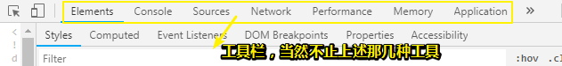

# chrome开发者工具

打开开发者工具的几种姿势：

- `Ctrl+shift+I`
- `F12`

## ★控制面板简介

按下 `F12`，我们就可以看见浏览器为我们所打开的开发者工具了：

每个工具都有其特定的功能……比如说：

- Elements：DOM节点和CSS。Elements 面板可以让您查看 DOM 树里的所有节点，包括JavaScript创建的节点和 iframe 里的节点；当然，您也可以看到每个节点的CSS样式。

  简而言之，通过使用它，我们就可以自由操纵DOM和CSS来重演网站的布局和设计

- Console：在开发期间，可以使用控制台面板记录诊断信息。或者使用它作为 shell,在页面上与JavaScript交互

- Source：可以通过这个面板来断点调试 JavaScript 。或者通过Workspaces（工作区）连接本地文件，使用开发者工具实时编辑

- Network：网络连接情况。Network 面板可以让您查看所有的网络请求，包括图片、JS文件、CSS和AJAX等。

  

- Timeline：时间抽。Timeline 面板可以让您了解解析当前网页所花费的时间细节，包括解析JavaScript、加载网络资源、绘制DOM等。不过，目前已经改名为[Performance](https://zhuanlan.zhihu.com/p/29879682)……

  我之前有用到过这个面板，主要是使用其旗下的Record功能，看看异步任务的执行情况……

  **➹：**[Chrome DevTools — Timeline - 小前端 - SegmentFault 思否](https://segmentfault.com/a/1190000008608538)

- Application：使用“资源”面板检查加载的所有资源，包括IndexedDB与Web SQL数据库，本地和会话存储，cookie，应用程序缓存，图像，字体和样式表。

  目前我有用到的功能，就是看看当前页面有哪些好看图片然后「可耻」的下载下来、localStorage、Cookie……

- ……

## ★Elements面板详解

> 关键词：编辑DOM和CSS样式

首先来看看它的功能吧！

它可以让我们动态查看和编辑DOM节点和CSS样式表，并且立即生效，避免了频繁切换浏览器和编辑器的麻烦。

我们常用它来查看源代码……为啥会这样说呢？照理说 `Ctrl+U`不就可以做到了吗？

因为它不但可以很好的格式化DOM节点，清晰的展现HTML文档，还可以**查看JavaScript创建的DOM节点和iframe中的DOM节点**，总之它就是可以查看用JavaScript动态生成的DOM节点，而 `Ctrl+U`可以做到吗？更别说其它能力了！

### ◇查看DOM树

### ◇选取DOM节点

也就是说查看某个DOM节点咯！

有3种姿势：

- 直接在页面选
- 直接在DOM树中选
- 直接在DOM层次中选

选中后，也就意味着，我们想要查看它的样式的目的已经达到了！

### ◇编辑DOM节点

也就是说增加、删除和修改DOM节点

选中了你想要选的DOM节点，此刻为蓝色背景，然后右击鼠标，弹出一个菜单……

菜单说明：

- Edit text（编辑文本）：编辑该节点中的文本。也可以在文本处双击进行编辑。

- Edit as HTML（编辑HTML）：编辑该节点及其子节点的所有HTML元素（包括节点中的文本）。

- Copy as HTML（复制HTML）：复制该节点及其子节点的所有HTML元素（HTML文档）。

- Copy XPath（复制XPath路径）：复制该节点的XPath路径，即DOM层次路径。例如，h2节点的XPath路径为 `/html/body/h2`。

- Delete node（删除节点）：删除该节点及其子节点的所有HTML元素。也可以使用 `Backspace` 和 `Delete` 键删除。

- Inspect DOM properties（审查DOM属性）：在控制台中显示该节点的所有标准属性（如果有的话）。

  我没有找到该菜单项，其实这个会在DOM层次中显示：

  

另外，我们也可以通过拖动节点来改变节点的顺序，双击属性节点来改变它的值

**➹：**[编辑 DOM  -  Tools for Web Developers  -  Google Developers](https://developers.google.com/web/tools/chrome-devtools/inspect-styles/edit-dom?hl=zh-cn)

### ◇查看CSS样式

CSS样式审查面板是一个非常有用的面板，实际开发中，有时候CSS样式表会非常复杂，甚至连我们自己都不知道当前节点应用了哪些样式。使用CSS样式审查面板，可以让我们清楚地知道当前节点使用了哪些样式，分别来自哪些文件，哪些样式是被覆盖的，哪些样式是最终样式，哪些样式是无效的，等等。

#### 测试

选中h2这个节点，Element面板右侧的CSS样式审查面板会展示出该节点的CSS样式：

在CSS样式审查面板中，我们可以添加、删除和修改CSS样式。

另外，除了刚才Style面板以外，还有其它几个子面板，如Computed之类的……

子面板说明：

- Style（样式）：当前节点的样式；
- Computed（计算）：查看当前节点经过计算后的样式以及盒模型数据；
- Event Listeners（事件监听）：查看为当前节点绑定的事件和事件监听函数；
- DOM Breakpoints（DOM断点）：查看为当前节点设置的DOM断点；
- Properties（属性）：当**前节点（对象）的所有属性**。

#### 使用JS获取样式

需求：

我们有的时候需要测试看一下某个CSS属性是否设置成功，所以需要通过dom去获取css样式。但是，如果使用原生去获取的话，会发现只有在dom身上设置的才能够获取的到，如`dom.style.width`，只有直接写到标签上，才能够获取的到，而在别的地方的我们将获取不到。

那么如何才能直接获取到写在style标签中的某个元素的css属性呢？就像jq的css()方法一样……

封装一波：

**➹：**[获取dom的最终的css属性值 - 现在学习也不晚 - CSDN博客](https://blog.csdn.net/qq_30100043/article/details/78495585)

**➹：**[Window.getComputedStyle() - MDN](https://developer.mozilla.org/zh-CN/docs/Web/API/Window/getComputedStyle)

**➹：**[获取元素CSS值之getComputedStyle方法熟悉 « 张鑫旭-鑫空间-鑫生活](https://www.zhangxinxu.com/wordpress/2012/05/getcomputedstyle-js-getpropertyvalue-currentstyle/)

#### 小技巧

1. **使用键盘方向键改变数值**，如某个元素的padding之类的值，总之在实际开发中，会经常使用该方法来微调元素的外边距、内补白和大小等，非常方便。

2. **颜色拾取器**，如某个元素的背景色，总之在实际开发中，会经常使用该方法来微调节点的颜色。

3. **添加阴影效果**

   

## ★参考链接

**➹：**[概述 · Chrome 开发者工具](http://shouce.jb51.net/chrome/jian-pan-kuai-jie-jian-he-ui-kuai-jie-jian-can-kao/bian-ji-yang-shi.html#%E7%BC%96%E8%BE%91%E6%A0%B7%E5%BC%8F)

**➹：**[Chrome开发者工具控制面板简介-JavaScript编程学院-IT学院](http://www.itxueyuan.org/view/6707.html)

**➹：**[Chrome开发工具Elements面板(编辑DOM和CSS样式)详解-JavaScript编程学院-IT学院](http://www.itxueyuan.org/view/6708.html)

## ★总结

- 有时间就去看看这个：

  **➹：**[Chrome 开发者工具  -  Tools for Web Developers  |  Google Developers](https://developers.google.com/web/tools/chrome-devtools/?hl=zh-cn)

