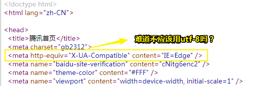
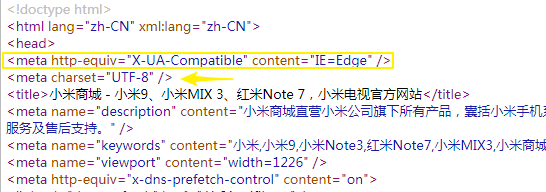
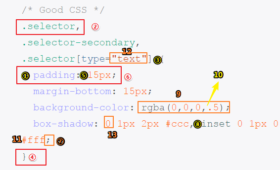

# 编码规范（Code Guide）

## ★引子

准备开始写豆瓣电影轻项目了，而这其中肯定会涉及HTML和CSS的，所以在此之前我想看看之前一直都很想了解的关于HTML和CSS的编码规范！

## ★资料

**➹：** [编码规范 by @mdo](https://codeguide.bootcss.com/)

**➹：**[Code Guide by @mdo](http://codeguide.co/)

## ★是什么？

> Standards for developing flexible, durable（耐用的、持久的）, and sustainable（可持续的） HTML and CSS.

这是一份用于编写灵活、稳定、高质量的 HTML 和 CSS 代码的规范

## ★黄金定律

- 永远遵循同一套编码规范 -- 可以是这里列出的，也可以是你自己总结的。

  > 发现该规范有问题请[issue](https://github.com/mdo/code-guide/issues)下，不管是大问题还是小问题，当然，你认为自己的套路也是可以的，想给大家参考参考，也是可以issue一下的！

- **不管有多少人共同参与同一项目，一定要确保每一行代码都像是同一个人编写的。**（ Every line of code should appear to be written by a single person, no matter the number of contributors.）

## ★HTML

### ◇语法

```html
<!DOCTYPE html>
<html>
  <head>
    <title>Page title</title>
  </head>
  <body>
    
    <h1 class="hello-world">Hello, world!</h1>
  </body>
</html>
```

1. 用两个空格来代替制表符（tab） -- 这是唯一能保证在所有环境下获得一致展现的方法。
2. 嵌套元素应当缩进一次（即两个空格）。
3. 对于属性的定义，确保全部使用双引号，绝不要使用单引号。
4. 不要在自闭合（self-closing）元素的尾部添加斜线 -- [HTML5 规范](http://dev.w3.org/html5/spec-author-view/syntax.html#syntax-start-tag)中明确说明这是可选的。
5. 不要省略可选的结束标签（closing tag）（例如，`</li>`或 `</body>`）。

> 缩进风格是按一下tab，还是两个空格？不过当你把tab设键置成了两个空格的话，那就用tab好了！（难怪若愚老师上课时所展示的代码是两个空格缩进的，而不像我的是4个空格缩进）
>
> **➹：**[【视频】HBO的喜剧片《硅谷》第三季：空格键 vs Tab键](http://www.techug.com/post/space-vs-tab.html)
>
> 在使用vue的过程中，针对指令，显然它是弄在HTML上作为一个类似属性的存在，所以用的是双引号，而写JavaScript代码时显然用单引号比较好！
>
> 在这个[issue](https://github.com/mdo/code-guide/issues/190)中提到：说什么不要个斜杠，就会导致兼容性特别差，不过现在谁还想着用低版本的浏览器啊，虽然说万维网的宗旨是普适性——万维网上的信息应该能被所有人访问，为此你需要渐进增强，所以就要加斜杆吗？——当竟然HTML5规范提到了，秉持着能省则省的原则，还是不加好了！当然加了也没事
>
> 不省略闭合标签这操作，显然已经是常识了！

### ◇HTML5 doctype

```html
<!DOCTYPE html>
<html>
  <head>
  </head>
</html>
```

为每个 HTML 页面的第一行添加一个简单的标准模式（standard mode）的声明，这样能够确保在每个浏览器中拥有一致的展现。

> 这也是常识，直接用emmet插件就能快速创建一个符合最新标准的HTML5页面了，这样浏览器在解析HTML文档的时候，就会知道这些新出现的HTML5元素是什么鬼东西了
>
> **➹：**[Cheat Sheet](https://docs.emmet.io/cheat-sheet/)
>
> **➹：**[前端开发必备！Emmet使用手册_Emmet 教程_w3cplus](https://www.w3cplus.com/tools/emmet-cheat-sheet.html)

### ◇语言属性

```html
<html lang="en-us">
  <!-- ... -->
</html>
```

根据 HTML5 规范：

> 强烈建议为 html 根元素指定 lang 属性，从而为文档设置正确的语言。这将有助于语音合成工具确定其所应该采用的发音，有助于翻译工具确定其翻译时所应遵守的规则等等。

更多关于 `lang` 属性的知识可以从 [此规范](http://www.w3.org/html/wg/drafts/html/master/semantics.html#the-html-element) 中了解。

这里列出了[语言代码表](http://reference.sitepoint.com/html/lang-codes)。

> 对于中文网站，那就 `zh-Hans`就好了呀！当然，你也可以用 `zh-CN`，[腾讯首页](https://www.qq.com/)就是用这个的！
>
> **➹：**[zh-cn 与 zh-hans 是什么关系、有什么区别？ - 知乎](https://www.zhihu.com/question/21980689)
>
> ps：这个主题涉及国际化……

### ◇IE 兼容模式（IE compatibility mode）

```html
<!--告诉IE浏览器，IE8/9及以后的版本都会以最高版本IE来渲染页面-->
<meta http-equiv="X-UA-Compatible" content="IE=Edge">
```

IE 支持通过特定的 `<meta>` 标签来确定绘制（渲染）当前页面所应该采用的 IE 版本。除非有强烈的特殊需求，否则最好是设置为 **edge mode**，从而通知 IE 采用其所支持的最新的模式。

[阅读这篇 stack overflow 上的文章](http://stackoverflow.com/questions/6771258/whats-the-difference-if-meta-http-equiv-x-ua-compatible-content-ie-edge-e)可以获得更多有用的信息。

> 还是直接照搬腾讯首页好了：
>
> 
>
> 那我看看小米的：
>
> 
>
> 有一种姿势很强大：
>
> ```html
> <!--chrome=1表示可以激活Chrome Frame-->
> <meta http-equiv="X-UA-Compatible" content="IE=Edge,chrome=1">
> ```
>
> Chrome Frame可以让旧版IE浏览器使用Chrome的WebKit渲染引擎处理网页，因此**旧版IE用户可以体验到包括HTML5在内的众多现代网页技术。**
>
> 一些注意事项：
>
> 1. 根据官网定义`X-UA-compatible` 标头不区分大小写；不过，它必须显示在网页中除`title`元素和其他`meta`元素以外的所有其他元素之前。如果不是的话，它不起作用
> 2. `content`的内容如果不写“**IE=**”，将不起作用。
>
> 我们知道了如何使用 `X-UA-Compatible`，但是 `X-UA-Compatible`到底是什么呢？——`X-UA-Compatible`是自从**IE8**新加的一个设置，对于IE8以下的浏览器是不识别的。通过在meta中设置`X-UA-Compatible`的值，可以指定网页的兼容性模式设置。
>
> 注意：在网页中指定的模式优先权高于服务器中(通过**HTTP Header**)所指定的模式。不过关于编码的设置，`Content-Type`的优先级更高，因为浏览器省略了嗅探的步骤，提高了效率，从而忽略了文档内的声明 
>
> **➹：**[[FE] IE兼容性模式X-UA-Compatible - 简书](https://www.jianshu.com/p/11adc0ef158e)

### ◇字符编码

```html
<head>
  <meta charset="UTF-8">
</head>
```

通过显示声明明确字符编码，能够确保浏览器快速并容易的判断页面内容的渲染方式。这样做的好处是，可以**避免在 HTML 中使用字符实体标记（character entity）**，从而全部与文档编码一致（一般采用 UTF-8 编码）。

> 字符实体：
>
> - 告诉我它存在的理由？
>
>   1. 在HTML中对`空格/回车/tab`不敏感, 会把多个`空格/回车/tab`当做一个空格来处理
>   2. 在HTML中有的字符是被HTML**保留**的, 有的HTML字符在HTML中是有**特殊含义**的, 是不能在浏览器中直接显示出来的, 所以这些东西要想显示出来就必须通过「字符实体」才能做到
>
> - 使用？
>
>   ```tex
>   &nbsp; 空格, 一个&nbsp;就是一个空格, 有多少个&nbsp;就有多少个空格
>   &lt; 小于符号 <
>   (less than)
>   &gt; 大于符号 >
>   (greater than)
>   &copy; 版权符号
>   ```
>
>   其它的字符实体：[Character Entity Reference Chart](https://dev.w3.org/html5/html-author/charref)
>
>   当我用了  `<meta charset="UTF-8">`  ，就别想着用 `&lt;a&gt;我是一个链接文本&lt;/a&gt;`这种姿势来标记一个内容？——讲真，为啥字符编码会与字符实体有关联？我不写这个字符编码也不会有问题啊！
>
> - 是什么？
>
>   html字符实体是一个以`“＆”`开始并以分号`（;）`结尾的文本**（“字符串”）**。实体经常被用来显示保留的字符（否则会被解释为html代码）和不可见的字符（如不间断的空格）。还可以使用它们代替难以用标准键盘键入的其他字符。
>
>   
>
> 保留字：
>
> - 一些特殊字符保留在html中使用，这意味着浏览器将解析它们为html代码。例如，如果使用小于（<）符号，则浏览器会将随后的任何文本解释为标记。将这些字符显示为文本，将其替换为相应的字符实体……
>
> **➹：**[HTML 字符实体参考 - 掘金](https://juejin.im/post/5b37639951882574ec30b353)
>
> **➹：**[字符实体 - 简书](https://www.jianshu.com/p/9b407185e46e)
>
> **➹：**[html实体编码问题总结 - zouhao's blog](https://blog.owlsn.com/2016-03-08/html%E5%AE%9E%E4%BD%93%E7%BC%96%E7%A0%81%E9%97%AE%E9%A2%98%E6%80%BB%E7%BB%93/)

### ◇引入 CSS 和 JavaScript 文件

```html
<!-- External CSS -->
<link rel="stylesheet" href="code-guide.css">

<!-- In-document CSS -->
<style>
  /* ... */
</style>

<!-- JavaScript -->
<script src="code-guide.js"></script>
```

根据 HTML5 规范，在引入 CSS 和 JavaScript 文件时一般不需要指定 `type` 属性，因为 `text/css` 和 `text/javascript`分别是它们的默认值。

#### HTML5 spec links

- [Using link](http://www.w3.org/TR/2011/WD-html5-20110525/semantics.html#the-link-element)
- [Using style](http://www.w3.org/TR/2011/WD-html5-20110525/semantics.html#the-style-element)
- [Using script](http://www.w3.org/TR/2011/WD-html5-20110525/scripting-1.html#the-script-element)

### ◇实用为王

尽量遵循 HTML 标准和语义，但是不要以牺牲实用性为代价。任何时候都要尽量使用最少的标签并保持最小的复杂度。

> 虽然叫你尽量遵循，但是如果不实用的话，那就算了……
>
> 看看能否用伪元素取代这些对内容起到装饰性的标签？
>
> 不要让整个页面看起来很多标签，也不要嵌套好几层……

### ◇属性顺序

```html
<a class="..." id="..." data-toggle="modal" href="#">
  Example link
</a>

<input class="form-control" type="text">


```

HTML 属性应当按照以下给出的顺序依次排列，确保代码的易读性。

- `class`
- `id`, `name`
- `data-*`
- `src`, `for`, `type`, `href`, `value`
- `title`, `alt`
- `role`, `aria-*`

class 用于标识高度可复用组件，因此应该排在首位。而id 用于标识具体组件，应当谨慎使用（例如，页面内的书签），因此排在第二位。

> 在我看来唯有可复用的东西才能算是组件……
>
> 只好记住这些套路了，有时候我也不知道，这样写有啥意义（或许是因为属性的常用程度吧），总之，习惯就好！
>
> 其实一般我都用class搞样式，然后用id搞JavaScript

### ◇布尔（boolean）型属性

```html
<!--存在即为true，所以禁用这个输入框，如果不存在此属性，那么就是false啦，所以可以输入-->
<input type="text" disabled>

<input type="checkbox" value="1" checked>

<select>
  <option value="1" selected>1</option>
</select>
```

布尔型属性可以在声明时不赋值。XHTML 规范要求为其赋值，但是 HTML5 规范不需要。

更多信息请参考 [WhatWG section on boolean attributes](http://www.whatwg.org/specs/web-apps/current-work/multipage/common-microsyntaxes.html#boolean-attributes)：

> 元素上存在布尔属性就表示真值，同理，缺少属性就表示false值啦

如果*一定*要为其赋值的话，请参考 WhatWG 规范：

> 如果属性存在，其值必须是空字符串或 [...] 属性的规范名称，并且不要在首尾添加空白符。

**简单来说，就是不用赋值。**

> 这个东西在vue中关于对表单的处理经常会遇到，类似于这样 ` :checked="checked"`

### ◇减少标签的数量

编写 HTML 代码时，尽量避免多余的父元素。很多时候，这需要迭代和重构来实现，但产生的HTML更少。请看下面的案例：

```html
<!-- Not so great -->
<span class="avatar">
  
</span>

<!-- Better -->

```

> 所以不要画蛇添足！不过一开始你是无法预料的你是否真得不需要父元素的，尤其是当你在写CSS和JavaScript的时候，为了更方便一点，你不得不搞点父元素……总之，HTML存在重构的可能，所以别想着一次就写好，这得跟CSS和JavaScript商量好，当然，如果自己的水平高一点，真得是可以避免多余的父元素，所以你只要有这样的意识就好了，即能不用父元素尽量不用父元素……

## ★CSS

### ◇语法

```css
/* Bad CSS */
.selector, .selector-secondary, .selector[type=text] {
  padding:15px;
  margin:0px 0px 15px;
  background-color:rgba(0, 0, 0, 0.5);
  box-shadow:0px 1px 2px #CCC,inset 0 1px 0 #FFFFFF
}

/* Good CSS */
.selector,
.selector-secondary,
.selector[type="text"] {
  padding: 15px;
  margin-bottom: 15px;
  background-color: rgba(0,0,0,.5);
  box-shadow: 0 1px 2px #ccc, inset 0 1px 0 #fff;
}
```

- 用两个空格来代替制表符（tab） -- 这是唯一能保证在所有环境下获得一致展现的方法。
- 为选择器分组时，将单独的选择器单独放在一行。
- 为了代码的易读性，在每个声明块的左花括号前添加一个空格。
- 声明块的右花括号应当单独成行。
- 每条声明语句的 `:` 后应该插入一个空格。
- 为了获得更准确的错误报告，每条声明都应该独占一行。
- 所有声明语句都应当以分号结尾。最后一条声明语句后面的分号是可选的，但是，如果省略这个分号，你的代码可能更易出错。
- 对于以逗号分隔的属性值，每个逗号后面都应该插入一个空格（例如，`box-shadow`）。
- 不要在 `rgb()`、`rgba()`、`hsl()`、`hsla()` 或 `rect()` 值的*内部*的逗号后面插入空格。这样利于从多个属性值（既加逗号也加空格）中区分多个颜色值（只加逗号，不加空格）。
- 对于属性值或颜色参数，省略小于 1 的小数前面的 0 （例如，`.5` 代替 `0.5`；`-.5px` 代替 `-0.5px`）。
- 十六进制值应该全部小写，例如，`#fff`。在扫描文档时，小写字符易于分辨，因为他们的形式更易于区分。
- 尽量使用简写形式的十六进制值，例如，用 `#fff` 代替 `#ffffff`。
- 为选择器中的属性添加双引号，例如，`input[type="text"]`。[只有在某些情况下是可选的](http://mathiasbynens.be/notes/unquoted-attribute-values#css)，但是，为了代码的一致性，建议都加上双引号。
- 避免为 0 值指定单位，例如，用 `margin: 0;` 代替 `margin: 0px;`。

对于这里用到的术语有疑问吗？请参考 Wikipedia 上的 [syntax section of the Cascading Style Sheets article](http://en.wikipedia.org/wiki/Cascading_Style_Sheets#Syntax)。



> 一个格式化插件就能搞定了，当然，涉及内容的就得自己弄了……

### ◇声明顺序

```css
.declaration-order {
  /* Positioning */
  position: absolute;
  top: 0;
  right: 0;
  bottom: 0;
  left: 0;
  z-index: 100;

  /* Box-model */
  display: block;
  float: right;
  width: 100px;
  height: 100px;

  /* Typography */
  font: normal 13px "Helvetica Neue", sans-serif;
  line-height: 1.5;
  color: #333;
  text-align: center;

  /* Visual */
  background-color: #f5f5f5;
  border: 1px solid #e5e5e5;
  border-radius: 3px;

  /* Misc */
  opacity: 1;
}
```

相关的属性声明应当归为一组，并按照下面的顺序排列：

1. Positioning（定位）
2. Box model（盒模型）
3. Typographic（印刷）
4. Visual（视觉）
5. Misc（杂项）

由于定位（positioning）可以从正常的文档流中移除元素，并且还能覆盖盒模型（box model）相关的样式，因此排在首位。盒模型排在第二位，因为它决定了组件的尺寸和位置。

其他属性只是影响组件的*内部（inside）*或者是不影响前两组属性，因此排在后面。

完整的属性列表及其排列顺序请参考 [Recess](http://twitter.github.com/recess)。

> - 如果包含 content 属性，应放在最前面；（伪元素）

### ◇不要使用 `@import`

```html
<!-- Use link elements -->
<link rel="stylesheet" href="core.css">

<!-- Avoid @imports -->
<style>
  @import url("more.css");
</style>
```

与 `<link>` 标签相比，`@import` 指令要慢很多，不光增加了额外的请求次数，还会导致不可预料的问题。替代办法有以下几种：

- 使用多个 `<link>` 元素
- 通过 Sass 或 Less 类似的 CSS 预处理器将多个 CSS 文件编译为一个文件
- 通过 Rails、Jekyll 或其他系统中提供过 CSS 文件合并功能

请参考 [Steve Souders 的文章](http://www.stevesouders.com/blog/2009/04/09/dont-use-import/)了解更多知识。

### ◇媒体查询（Media query）的位置

将媒体查询放在尽可能相关规则的附近。不要将他们打包放在一个单一样式文件中或者放在文档底部。如果你把他们分开了，将来只会被大家遗忘。下面给出一个典型的实例。

```css
.element { ... }
.element-avatar { ... }
.element-selected { ... }

@media (min-width: 480px) {
  .element { ...}
  .element-avatar { ... }
  .element-selected { ... }
}
```

### ◇带前缀的属性

```css
/* Prefixed properties */
.selector {
  -webkit-box-shadow: 0 1px 2px rgba(0,0,0,.15);
          box-shadow: 0 1px 2px rgba(0,0,0,.15);
}
```

当使用特定厂商的带有前缀的属性时，通过缩进的方式，**让每个属性的值在垂直方向对齐**，这样便于多行编辑。

在 Textmate 中，使用 **Text → Edit Each Line in Selection**(⌃⌘A)。在 Sublime Text 2 中，使用 **Selection → Add Previous Line** (⌃⇧↑) 和 **Selection → Add Next Line**(⌃⇧↓)。

如：

```css
.avatar img {
  -webkit-box-shadow: inset 0 1px 5px rgba(0, 0, 0, 0.2);
     -moz-box-shadow: inset 0 1px 5px rgba(0, 0, 0, 0.2);
      -ms-box-shadow: inset 0 1px 5px rgba(0, 0, 0, 0.2);
       -o-box-shadow: inset 0 1px 5px rgba(0, 0, 0, 0.2);
          box-shadow: inset 0 1px 5px rgba(0, 0, 0, 0.2);
}
```

> 这些应该是有工具可以生成的！

### ◇单行规则声明

```css
/* Single declarations on one line */
.span1 { width: 60px; }
.span2 { width: 140px; }
.span3 { width: 220px; }

/* Multiple declarations, one per line */
.sprite {
  display: inline-block;
  width: 16px;
  height: 15px;
  background-image: url(../img/sprite.png);
}
.icon           { background-position: 0 0; }
.icon-home      { background-position: 0 -20px; }
.icon-account   { background-position: 0 -40px; }
```

对于**只包含一条声明**的样式，为了易读性和便于快速编辑，建议将语句放在同一行。对于带有多条声明的样式，还是应当将声明分为多行。

这样做的关键因素是为了错误检测 -- 例如，CSS 校验器指出在 183 行有语法错误。如果是单行单条声明，你就不会忽略这个错误；如果是单行多条声明的话，你就要仔细分析避免漏掉错误了。

> 存在的意义就是因为单行如果有多条声明的话，那么该行如果有错误的话，那么我们的肉眼就得仔细分析了！
>
> 显然，这并不好！

### ◇简写形式的属性声明

```css
/* Bad example */
.element {
  margin: 0 0 10px;
  background: red;
  background: url("image.jpg");
  border-radius: 3px 3px 0 0;
}

/* Good example */
.element {
  margin-bottom: 10px;
  background-color: red;
  background-image: url("image.jpg");
  border-top-left-radius: 3px;
  border-top-right-radius: 3px;
}
```

在需要显示地设置所有值的情况下，应当尽量限制使用简写形式的属性声明。常见的滥用简写属性声明的情况如下：

- `padding`
- `margin`
- `font`
- `background`
- `border`
- `border-radius`

大部分情况下，我们不需要为简写形式的属性声明指定所有值。例如，HTML 的 heading 元素只需要设置上、下边距（margin）的值，因此，在必要的时候，只需覆盖这两个值就可以。过度使用简写形式的属性声明会导致代码混乱，并且会对属性值带来不必要的覆盖从而引起意外的副作用。

在 MDN（Mozilla Developer Network）上一篇非常好的关于[shorthand properties](https://developer.mozilla.org/en-US/docs/Web/CSS/Shorthand_properties) 的文章，对于不太熟悉简写属性声明及其行为的用户很有用。

> 这个习惯看来需要改掉啊！简写姿势，确实让人感到恶心……关于flex布局中的一些可以用shorthand的属性，似乎没有什么问题哦！

### ◇Less 和 Sass 中的嵌套

```scss
// Without nesting
.table > thead > tr > th { … }
.table > thead > tr > td { … }

// With nesting
.table > thead > tr {
  > th { … }
  > td { … }
}
```

避免不必要的嵌套。这是因为虽然你可以使用嵌套，但是并不意味着应该使用嵌套。只有在必须将样式限制在父元素内（也就是后代选择器），并且存在多个需要嵌套的元素时才使用嵌套。

扩展阅读：

- [Nesting in Sass and Less](http://markdotto.com/2015/07/20/css-nesting/)

> 那些不必要的嵌套见鬼去吧！除非你用到了后代选择器且有多个后代元素需要嵌套！

### ◇Less 和 Sass 中的操作符

```scss
// Bad example
.element {
  margin: 10px 0 @variable*2 10px;
}

// Good example
.element {
  margin: 10px 0 (@variable * 2) 10px;
}
```

为了提高可读性，在圆括号中的数学计算表达式的数值、变量和操作符之间均添加一个空格。

### ◇注释

```css
/* Bad example */
/* Modal header */
.modal-header {
  ...
}

/* Good example */
/* Wrapping element for .modal-title and .modal-close */
.modal-header {
  ...
}
```

代码是由人编写并维护的。请确保你的代码能够自描述、注释良好并且易于他人理解。好的代码注释能够传达上下文关系和代码目的。不要简单地重申组件或 class 名称。

对于较长的注释，务必书写完整的句子；对于一般性注解，可以书写简洁的短语。

> 注释写好点，要么一个句子，要么一个简洁的短语，总之不要直接重申一下类名！

### ◇class 命名

```css
/* Bad example */
.t { ... }
.red { ... }
.header { ... }

/* Good example */
.tweet { ... }
.important { ... }
.tweet-header { ... }
```

- class 名称中只能出现小写字符和破折号（dashe）（不是下划线，也不是驼峰命名法）。破折号应当用于相关 class 的命名（类似于命名空间）（例如，`.btn` 和 `.btn-danger`）。
- 避免过度任意的简写。`.btn` 代表 *button*，但是 `.s` 不能表达任何意思。
- class 名称应当尽可能短，并且意义明确。
- 使用有意义的名称。使用有组织的或目的明确的名称，不要使用表现形式（presentational）的名称。
- 基于最近的父 class 或基本（base） class 作为新 class 的前缀。（面向对象中的父类或基类概念）
- 使用 `.js-*` class 来标识行为（与样式相对），并且不要将这些 class 包含到 CSS 文件中。

在为 Sass 和 Less 变量命名时也可以参考上面列出的各项规范。

> 简写的话，可以去掉元音字母
>
> 最后一点不是很明白啊！一般都是用id来处理行为的！或者在这里是说，这个是需要用到JavaScript控制样式的类，而且需要单独拎出来放到另外一个CSS文件对吗？还是说，这个类就是专门用于处理行为的，不能搞样式的？
>
> 有一种叫BEM的命名姿势很流行
>
> **➹：**[⒛ [规范] CSS BEM 书写规范 · Tencent/tmt-workflow Wiki](https://github.com/Tencent/tmt-workflow/wiki/%E2%92%9B-%5B%E8%A7%84%E8%8C%83%5D--CSS-BEM-%E4%B9%A6%E5%86%99%E8%A7%84%E8%8C%83)

### ◇选择器

```css
/* Bad example */
span { ... }
.page-container #stream .stream-item .tweet .tweet-header .username { ... }
.avatar { ... }

/* Good example */
.avatar { ... }
.tweet-header .username { ... }
.tweet .avatar { ... }
```

- 对于通用元素使用 class ，这样利于渲染性能的优化。
- 对于经常出现的组件，避免使用属性选择器（例如，`[class^="..."]`）。浏览器的性能会受到这些因素的影响。
- 选择器要尽可能短，并且尽量限制组成选择器的元素个数，建议不要超过 3 。
- **只有**在必要的时候才将 class 限制在最近的父元素内（也就是后代选择器）（例如，不使用带前缀的 class 时 -- 前缀类似于命名空间）。

扩展阅读：

- [Scope CSS classes with prefixes](http://markdotto.com/2012/02/16/scope-css-classes-with-prefixes/)
- [Stop the cascade](http://markdotto.com/2012/03/02/stop-the-cascade/)

> 选择器的规范不是很懂啊！我之前看看芳芳的，关于常见的基于关系的选择器中就 很喜欢用 `A>E`
>
> | **选择器**      | **选择的元素**                                               |
> | --------------- | ------------------------------------------------------------ |
> | `A E`           | 元素A的任一后代元素E (后代节点指A的子节点，子节点的子节点，以此类推) |
> | `A > E`         | 元素A的任一子元素E(也就是直系后代)                           |
> | `E:first-child` | 任一是其父母结点的第一个子节点的元素E                        |
> | `B + E`         | 元素B的任一下一个兄弟元素E                                   |
> | `B ~ E`         | B元素后面的拥有共同父元素的兄弟元素E                         |
>
> **➹：**[选择器 - Web 开发者指南 - MDN](https://developer.mozilla.org/zh-CN/docs/Web/Guide/CSS/Getting_started/Selectors)

### ◇代码组织

```css
/*
 * Component section heading
 */

.element { ... }


/*
 * Component section heading
 *
 * Sometimes you need to include optional context for the entire component. Do that up here if it's important enough.
 */

.element { ... }

/* Contextual sub-component or modifer */
.element-heading { ... }
```

- 以组件为单位组织代码段。
- 制定一致的注释规范。
- 使用一致的空白符将代码分隔成块，这样利于扫描较大的文档。
- 如果使用了多个 CSS 文件，将其按照组件而非页面的形式分拆，因为页面会被重组，而组件只会被移动。


---

## ★总结

- 去看的文章：

  **➹：**[CSS 的简写属性 - CSS：层叠样式表 - MDN](https://developer.mozilla.org/zh-CN/docs/Web/CSS/Shorthand_properties)

  **➹：**[Code Guide by @AlloyTeam](http://alloyteam.github.io/CodeGuide/)

  **➹：**[⒛ [规范] CSS BEM 书写规范 · Tencent/tmt-workflow Wiki](https://github.com/Tencent/tmt-workflow/wiki/%E2%92%9B-%5B%E8%A7%84%E8%8C%83%5D--CSS-BEM-%E4%B9%A6%E5%86%99%E8%A7%84%E8%8C%83)

  **➹：**[组织css代码 - 掘金](https://juejin.im/post/5c34b176518825258513f9be)


## ★Q&A

### ①组件修饰符？


