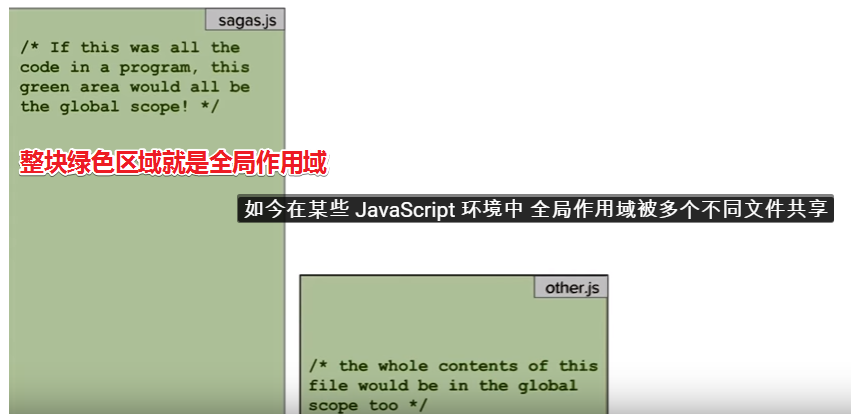

# 作用域

## ★资料

**➹：**[词法作用域 - YouTube](https://www.youtube.com/watch?v=N76Z5hoTkzA)

**➹：**[JavaScript Scope (Local vs Global) - YouTube](https://www.youtube.com/watch?v=iJKkZA215tQ&index=12&list=PLTjRvDozrdlxEIuOBZkMAK5uiqp8rHUax)

## ★词法作用域

作用域这个词有很多种使用方式，其中最简单的一种用法就是「词法作用域」啦！

这种用法描述了你的源代码中的范围，在这个范围中你可以使用变量名引用变量而不出现访问错误。

> 为什么说是引用变量呢？而不是引用那些Entity呢？之前有了解到，变量名→☞变量→☞Entity，为什么这么说呢？在内存里面我们都知道所存储的二进制数据都会有个存储位址的概念，这个存储位址就是变量啦！而变量名也就是标识符，我们可以同过标识符来引用变量，既然引用了变量，那也就找到了Entity。
>
> 在JS中，我们了解到按值传递和按共享传递，前者针对栈，而后者则是堆！栈和堆是两种不一样的数据而结构，由于栈的分配内存速度快且数据比较小，而堆是无序的、游离的且分配内存慢、数据比较大，所以针对在堆存储的数据，如对象什么的，按共享传递就很科学了！
>
> 那么问题来了，针对按值传递，标识符即变量名存储的是一个值，这个值不是一个地址，而是实实在在的`1、'xxx'`之类的，针对按共享传递，这个标识符存储的到底是不是存储位址呢？
>
> 我可以认为当我们访问标识符的时候即访问的是存储位址，只是内存有栈堆之分，栈比较大气，只要你是原始类型的数据，我们就深拷贝，而引用类型的数据则是浅拷贝。也就是说：
>
> ```js
> var a = 'xx'
> var b = a
> 
> var c = {}
> var d =c
> ```
>
> JS解释器看到把a赋值给了b，按照栈规则，有钱任性，地址是互斥的，即便里面是一样的内容！
>
> 而看到把c赋值给了d，按照堆规则，为了节省点内存，地址可以共享
>
> 额……似乎有点牵强……不管了……say goodbay!
>
> **➹：** [变量 (程序设计) - Wikiwand](https://www.wikiwand.com/zh-hans/%E5%8F%98%E9%87%8F_%28%E7%A8%8B%E5%BA%8F%E8%AE%BE%E8%AE%A1%29)
>
> **➹：** [什么是堆和栈，它们在哪儿？ - 文章 - 伯乐在线](http://blog.jobbole.com/75321/)

言归正传，这种作用域 的具体规则即便不运行代码也很容易理解，因为它仅代表你的代码中的不同变量名**有意义的区域**。

举个例子来说：

假设xxx.js文件包含了一个非常简单的程序的源代码，换句话说，这个js文件中没有任何函数，即便这个文件很简单，但是它仍包含了一个作用域，而这个作用域被称为全局作用域！这个程序中的每一个变量都存储在其中。

> 有种全局作用域就像是个巨大的对象，或者说它就是window，全局变量都可以通过window.yyy来访问

如今在某些 JavaScript 环境中， 全局作用域被多个不同文件共享。这意味着程序（sagas.js）的任意部分都可以和其它部分（other.js）交互，如果我们在程序中添加一个变量，这个变量就存在于全局作用域中，因此在整个程序的任意位置都可以访问这个变量。



总之，在全局作用域中声明变量之后，你就可以在该词法作用域的任意位置引用这个变量了：

```js
var hero = aHero()
//hero作为log函数的一个形参，相当于是在log函数体中这个所谓的局部作用域中访问全局变量hero，根据词法作用域，一直找这个hero变量，直到在全局中找到了这个变量！
console.log(hero)
```

全局变量是最简单的，因为在你的代码中任何一个地方都可以访问它

关于console：

console是个hash表，可以说console是个命名空间吧！而console旗下就有个log函数：


其实想了想，函数是独立的，而且我们是作为形参给传进去的！

让形参失效：


似乎可以做惰性求值：


## ★Local vs Global Scope

一个非常重要的概念——作用域

1. 定义一个const message，初始化为「hi」，然后于console处log出来，看看会发生什么？

   

   ```js
   const message = 'hi';
   console.log(message);
   ```

   显然我们会log出hi这个值！

   那么问题来了，如果我把这个message扔到一对花括号（code block）里面去呢？你猜会发什么？

   

   ```js
   {
   	const message = 'hi';    
   }
   console.log(message);
   ```

   报错啊！大佬！

   

更多内容参考：

**➹：**[新版变量声明：let 和 const - xiedaimala](https://ppambler.github.io/xiedaimala/02-ES6%E6%B7%B1%E5%85%A5%E6%B5%85%E5%87%BA/02-%E6%96%B0%E7%89%88%E5%8F%98%E9%87%8F%E5%A3%B0%E6%98%8E-let%E5%92%8Cconst.html)

## ★总结

## ★Q&A

### ①Entity的翻译问题？

一般会把它翻译成「实体」，但严格来说，这不是一个好翻译。为什么这么说呢？因为从哲学上来说，「实体」通常用来翻译「substance」这个单词！

「实体」表达了东西是实实在在存在的，而对于抽象的东西，「实体」二字是无法表达的。可以说「Entity」比「substance」来得广泛和抽象。因此在计算科学中，我们一般把「Entity」翻译为「单元」，因为这比较可以保持它既能表达具体事物又能表达抽象存有的意涵。当然，你也可以把它通俗的翻译为「东西」

> 单元：整体中一个相对独立的部分。

**➹：**[淺談 Entity 的概念 - Twin Earth Conservancy Bureau](http://www.drupaltky.org/article/43)

### ②Name binding？

在编程语言中，名称绑定（Name binding）是单元「Entity」(数据 和/或 代码)与标识符的关联。绑定到对象的标识符被称为引用该对象。机器语言没有内置的标识符概念，但是名称-对象（name-object）绑定作为程序员的服务和符号是由编程语言实现的。绑定与作用域密切相关，因为作用域决定了哪些名称绑定到哪些对象——在程序代码中的哪些位置(词法上)，以及在哪些可能的执行路径中(时间上)。

> 按照我的理解就是，我们可以通过标识符找到Entity，如一段代码单元（函数等之类的）、一些原始类型的值（字符串、数字等之类的）

**➹：** [Name binding - Wikiwand](https://www.wikiwand.com/en/Name_binding)

### ③Scope？

在计算机编程中，名称绑定「名称(如变量)与实体的关联」的范围（Scope）——是计算机程序中绑定有效的区域：在这个区域中我们可以使用名称来引用实体。而这样的区域被称为范围块。在程序的其他部分，该名称可能指不同的实体，为什么这么说呢？因为它可能有不同的绑定，或者根本不指任何实体，即它可能是未绑定的。

很多时候，我们叫Scope为「作用域」/「上下文（context）」/「环境（environment）」

**➹：**[Scope (computer science) - Wikiwand](https://www.wikiwand.com/en/Scope_%28computer_science%29)

Scope分为词法作用域和动态作用域，这两个概念是针对「程序的一部分」而言的，前者是「源代码的一部分(文本区域)」，而后者则是「运行时间的一部分(执行期间的时间段)」。总之词法作用域是本文的重点，动态作用域是通过与词法作用域的对比来理解的。

对了，词法作用域也叫静态作用域！

我简单地理解了一下它们的规则：

- 这个变量到底是哪个取决于源代码中的位置和词法上下文，这是一个词法作用域树吧！
- 这个变量到底是哪个取决于程序状态，似乎是根据Call Stack而来的！

不管怎样，在这两个规则中，我们得的首先寻找变量的局部定义。

更进一步来说：

词法解析可以在编译时确定，也称为早期绑定，而动态解析通常只能在运行时确定，因此称为后期绑定

对于编程语言来说，它们可以选择一种Scope，或者两种兼顾！还有就是命名空间也是一种Scope

以JS为例：

词法作用域：

```js
function foo() {
	console.log(a)
}
function bar() {
	var a = 3
	foo()
}
var a = 2
bar() //2
```

如果JS是动态作用域的，那么同一份demo，其结果是不一样的：

```js
function foo() {
	console.log(a) //输出3而不是2
}
function bar() {
	var a = 3
	foo()
}
var a = 2
bar() 
```

当我们调用bar函数：


