# 到底什么是Event Loop呢？

## ★资料

**➹：**[Philip Roberts: What the heck is the event loop anyway? - JSConf EU - YouTube](https://www.youtube.com/watch?v=8aGhZQkoFbQ&t=285s)

## ★概述

JavaScript实际上是怎样运作的？

我们都知道V8是Chrome里的JavaScript运行环境，但是它是什么呢？以及它做了什么呢？

我们都知道说到JavaScript，就想到了单线程，但是很明显我们在用回调函数啊！那么回调函数又是怎么运作的呢？

既然如此，JavaScript到底是什么？——嗯，类似这样的：JavaScript是一个单线程、非阻塞、异步、并发的、解释性脚本语言，而且它还有一个调用栈、事件循环、回调队列和一些其它的API……总之它们都是一些名词，而且是一些专业名词！

相较于其它浏览器的运行环境，V8是否有特别之处呢？

所以我想问问V8「你是否有调用栈、事件循环、回调队列和其他API？」，于是，V8回答说「我有一个call stack和一个heap，至于其它的？什么鬼？完全不知道哈！」

言归正传，以下内容将为你讲述「为啥JavaScript如此怪异？」，毕竟你在学习JavaScript的过程中，所遇怪异之问题，可谓之如滔滔江水，绵绵不绝……如当你与其它语言比较的时候，你会发现回调明明是个灾难，但还是被引入了。不管怎样，我希望你能够对JavaScript的运行环境有了一些新的见解，为此你能够对这些「怪异」问题考虑得更周全一些……而不是觉得它们就是很「怪异」，没有道理可言！

## ★V8-JS的运行环境

关于JavaScript的运行环境，比如V8，V8是Chrome里的JavaScript运行环境。

下面这个是一个JavaScript的运行环境（Runtime）示意图：

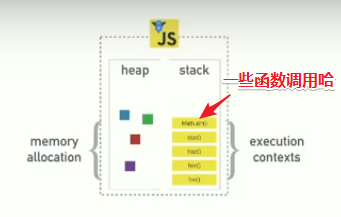

解释一下：

- heap记录了内存的分配，想想C语言就知道这个所谓的内存分配了…
- call stack记录了函数调用的执行上下文！总之这是栈帧这类东西所在的地方

此刻或许你会疑问「就这么两个东东吗？」

当然，你可以克隆了V8的代码，然后看看这里面到底有什么东西，你通过搜索  `setTimeout`或者 `DOM`、HTTP请求这些东西的时候，你会发现它们并不在里面！

它们不存在于V8引擎，显然，这会让人大吃一惊，毕竟当你想要异步编程的时候，这些是你首先考虑要使用的东西……可是它们并不存在于V8的源码里面啊！嗯，这很有趣！

作者经过18个月的探索，他开始意识到这是极其重要的部分！而理解「这些部分是什么」显然对你理解JS之所以怪异有很大的助力！

## ★V8之外的一些东西

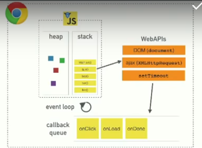

从这张图中我们可以看到：

首先是V8运行环境，然后是浏览器提供的其他东西（被称之为web APIs，DOM、AJAX、setTimeout之类的东西），再然后是神秘的事件循环和回调队列。

想必大家事先都听说过这些术语了吧！但是你们未必能理解这些部分是怎么结合在一起的。

### ◇解释这些术语

#### Call Stack

> 一个线程 == 一个调用栈 == 一次只做一件事
>
> 关于一段代码？我理解就是一个js文件里的所有代码吧！

JavaScript是一个单线程的编程语言。单线程的运行环境意味着它有且只有一个调用栈，它每次只能够做一件事，所以单线程的意思就是「程序每次只可以运行一段代码」。**✎：**

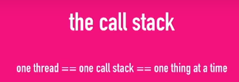

对上面所说的内容可视化一下：

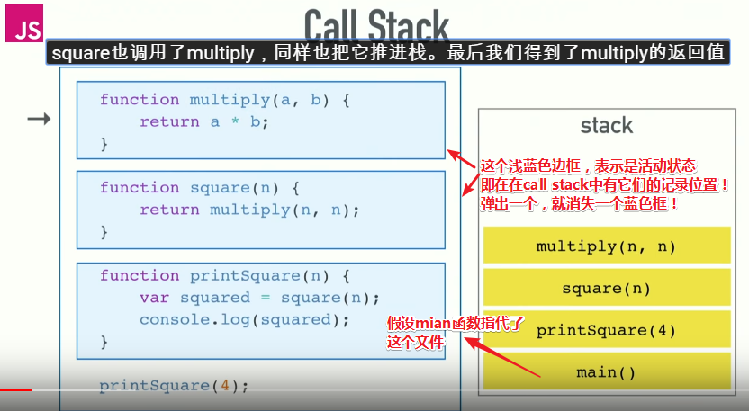

解释一波：

有一些像左边这样的代码，有一些函数，如一个将两个数字相乘的函数multiply、一个调用了前者的平方函数square、一个打印函数printSquare，它调用了square，然后将结果用console.log打印出来。（函数之间的嵌套调用习以为常……），然后在最后我们调用了printSquare。

这些代码看起来没啥问题，那么我们就来运行它！

Call Stack基本上是一个记录当前程序所在位置的数据结构，如果当前进入了某个函数，那么这个函数就会被放在栈里面。如果当前离开了某个函数，那么这个函数就会被弹出栈外，这就是栈所做的事啦！

如果你运行这个文件，那么将会有一个类似main的函数，它指代文件自身，我们首先把它放进栈，然后，我们从上而下查看声明了的函数，最后是printSquare，我们知道printSquare被调用了，那么我们把它推进栈里。然后它调用了square，所以也把它推进栈里。而square也调用了multiply，同样也把它推进栈。最后我们得到了multiply的返回值。

接着我们把multiply弹出栈，然后square也得到了返回值，再把square弹出栈，最后到printSquare，它调用了console.log，到这里已经没有返回值了。接着我们到了函数的最后部分，然后我们完成了，即call Stack里空空如也！**✎：**

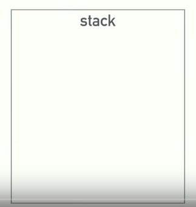


这就是一个可视化的调用栈过程啦！如果你以前没有了解过Call Stack，那么现在你就知道了。

当我们在浏览器端做网站开发的时候，如果在Chrome运行下面左边这样的代码，即baz函数调用了bar函数，bar函数调用了foo函数，而foo函数抛出一个错误，那么我们看到会是这样的结果：它将整个栈树都打印了出来，错误从foo开始，到bar， 到baz，到匿名函数（也就是我们说的main函数）。

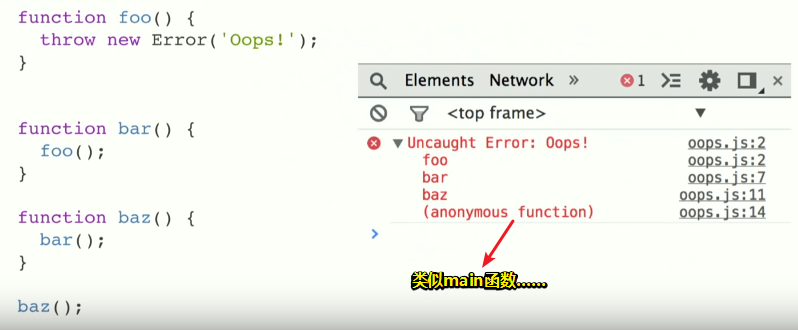

同样地，如果你听说过像内存泄露这类名词，下面的代码就是其中一个例子：

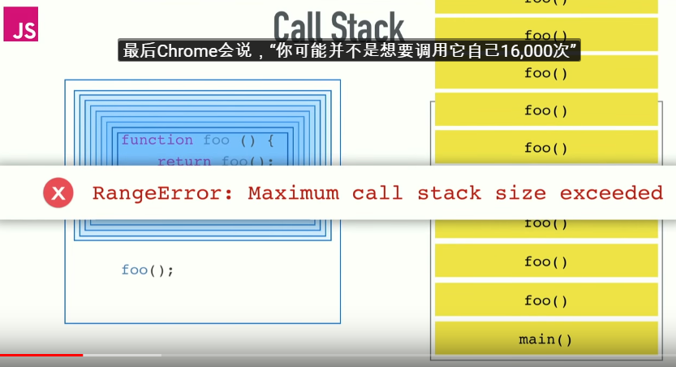

我们有一个调用自身的函数foo，然后调用这个foo函数，你猜会发生什么？

我们有一个函数调用了foo，foo又调用了foo，如此一直下去……最后Chrome会说，“你可能并不是想要调用它自己16,000次”、“我为你终止了它，这样你可以找到bug在哪里。”

> 超出最大调用栈大小……

以上就是作者向我们所呈现的一个调用栈了，可能你在开发的时候就已经注意到了……

#### blocking

> 当事情进展缓慢时会发生什么?

什么使程序运行变慢？这是一个很难的问题，当然我们借此就来谈谈阻塞！

> 没有严格的定义说什么是阻塞，什么不阻塞。仅仅是指代码运行得很慢，比如说，console.log不慢，遍历从1到10亿很慢，网络请求很慢，下载图片也很慢。反正在栈里表现很慢的东西都叫阻塞……

这里有一个小例子，比如说我们有这样一些伪码（就像jQuery的AJAX请求，如果这些是同步的，会发生什么？，关于请求，请忘记我们对异步的了解，总之虽然它们是在发请求，但调用这些函数是同步的，即这一步结束了，才走下一步，可视化到call stack的话，就是运行一个函数，就在调用栈中记录一次，运行结束后，就弹出栈！不会像之前的嵌套函数调用那样，一直在叠罗汉！），**✎：**

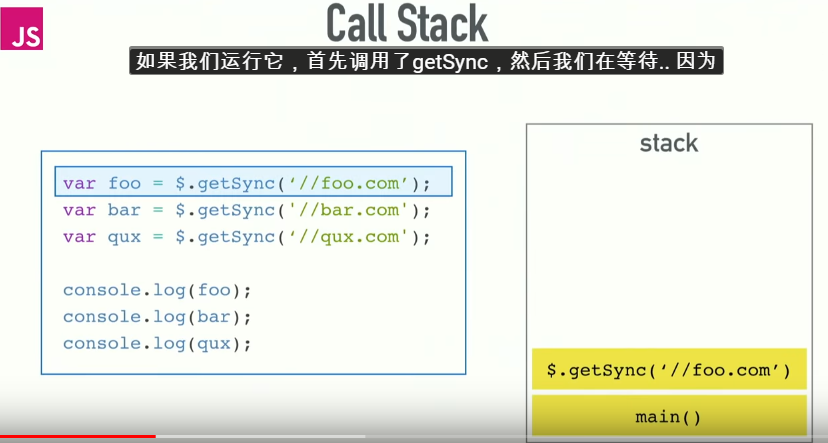

如果我们运行这些伪码，那么首先调用了getSync，然后我们在等待.. 因为我们在做网络请求，网络请求相对于计算机本地来说很慢，那么等请求完成了，我们才继续。然后是继续等，再继续……其实我想说的是「这些请求可能永远也不会结束，身为开发者，或许等待没什么，可是用户就不买账了……」，接下来就是请求结束了，接着就运行下面的，当这些所有都跑一遍，栈才会被清空……

如果一个编程语言是单线程的，比如ruby，刚才的状况就会发生。

我们来请求一个资源，我们就要干巴巴地等着请求完成，我们并没有办法可以让我们不需要等待，所以这会有很大的问题，而这个问题就是我们的代码是要跑在浏览器上的……

为什么这么说呢？举个例子你就明白了！

下面张图上的代码就是刚刚的伪码，相当于是浏览器给我们的**同步**AJAX请求！

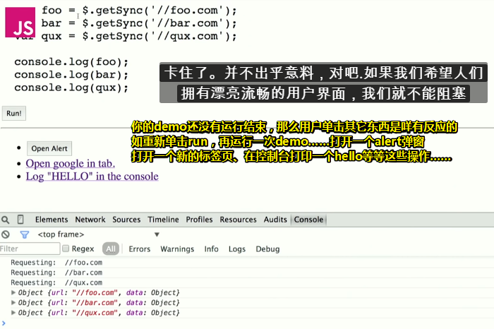

解释一波：

我用了一个while循环伪造了这一点，因为它是同步的，要循环五秒钟，我才能继续。

如果我们打开控制台，那么我们就可以看到这段代码将会发生什么，我们单击了 `Run!`按钮，可以看到控制台 ` 正在请求foo.com`，而当我们单击其它东西（如 `Open Alert`、其它链接文本…… ）时，居然发现没有反应……那么为什么发生这种情况？话又说回来，此刻我不能做任何事情，对不对？即便我再次单击 `Run！`按钮，这个按钮也没有任何反应（照理说，应该重头开始再运行一遍代码吧！换言之，之前还没有跑完的代码可以不用跑了……），总之它就是没有重现我点击它事实……

可见，浏览器被阻塞了，它卡住了，它不能做任何事情，直到这些请求完成。然后将所有的东西蹦出来了，因为我之前做了一些操作，它发现是我干的，但实际上，它并不能地实时地呈现出我刚刚所做的那些调皮捣蛋的事儿，总之它不能做任何事情，那是因为调用栈里如果有东西的话，那么浏览器它就不能干其它的，这就像是不能一心二用。

> 感觉这里有个伏笔，那就是浏览器怎么知道那些打扰到它的事儿呢？而且这其中的执行顺序又是怎样的呢？

不管怎样，我们已经弄清了同步请求，浏览器现在不能做别的事情，即它不能渲染（render，呈现），它不能运行任何其他代码，它卡住了。并不出乎意料，如果我们希望人们拥有漂亮流畅的用户界面，我们就不能阻塞调用栈，即你不要让的call stack中出现运行得很慢的代码，因为如果你不这样的话，那么就会流失很多用户了……

#### asynchronous callbacks

> 这是一个函数，请调用它！

那么，我们应该如何处理呢？我们最简单的方式是提供异步回调（回调就是一个函数）

在浏览器中几乎没有阻塞的函数，node里也是这样，它们都是异步函数，这基本上意味着我们运行一些代码，给它一个回调函数并在之后运行，如果你看过JavaScript代码你就会看过这些异步回调，那么这实际上是什么样的呢？

这里有些简单的例子来提示我们到底运行到哪了，像这样的代码，**✎：**

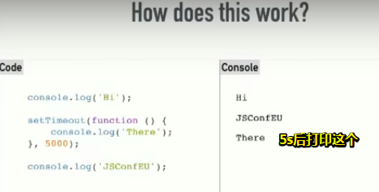

console.log输出`Hi`，对吧！接着我们运行`setTimeout`，但我们把console.log放到队列里了，这将会在之后再运行，所以我们跳到下一行语句，即运行 `JSConfEU` 这里，然后5秒钟之后，我们输出“`There`”，对吧！理解了吗？（开心）基本上这是setTimeout正在做的事情。

我们把异步回调以及关于我们之前所看到的call stack结合起来，看看它们是如何工作的？

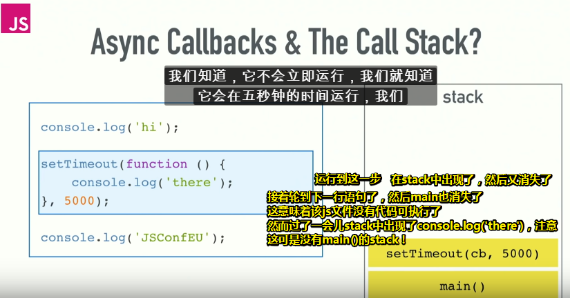

让我们来运行代码，console.log一个`Hi`。

接着轮到setTimeout了，我们知道，它不会立即运行，它将会在5s后运行，所以我们不能把它推到stack中，毕竟这有blocking啊！虽然我们把它push到stack中了，但不知是什么缘故（我们还没有描述这样做的这个方法，但是我们之后会讲到），它就如昙花一现般，不久之后就消失了或者你可以把它当作像是一个运行`console.log()`那样的函数就好了，总之没有blocking就对了！

接着我们log了`JSConfEU`，然后stack中就被清空了，然而5秒钟后，不知何故，在stack中神奇地出现了 `console.log('JSConfEU')`……

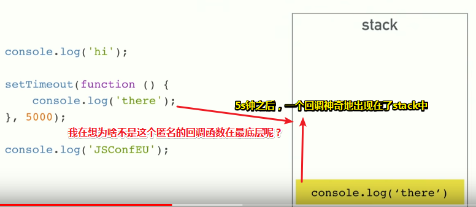

所以，这是怎么发生的呢？那就是 ——这基本上是在起并发作用的那个事件循环所发生的，简而言之，是事件循环导致了这件事情的发生，而且这体现了并发……即当你这个JS文件还在运行代码的时候，还有其它线程在处理诸如setTimeout这样的任务……

对，所以我一直有点说谎，即告诉你JavaScript一次只能做一件事……换言之就是不能边吃饭边看电视，只能吃完饭后才能看电视……所以是谁帮助了我可以边吃饭边看电视呢？——是event loop……

#### Concurrency & the Event Loop

> One thing at a time.
>
> except not really.

当然，**V8引擎同一个时间只能做一件事**这是事实！这可没有欺骗你们哈！如当V8引擎在执行其他代码的时候，它（**是指浏览器还是V8引擎？**应该是V8引擎吧！）无法同时发出AJAX请求；当V8引擎在执行另一个代码时，它也无法同时执行setTimeout。而我们之所以可以同时做事情的原因是浏览器不仅仅只有V8引擎……

> So, remember this diagram, the JavaScript Runtime can do one thing at a time, but the browser gives us these other things, gives us these we shall APIs, these are effectively threads, you can just make calls to, and those pieces of the browser are aware of this concurrency kicks in. If you're back end person this diagram looks basically identical for node, instead of web APIs we have C++ APIs and the threading is being hidden from you by C++.

所以，请记住这个图表，V8引擎只能有一个call stack，意味着V8引擎只能管着手头上的那件事（执行整个js文件），但是浏览器给了我们做其他事情的机会，给了我们这些我们应该要有的API，这些实际上是线程，你可以直接调用，而浏览器的这些部分也意识到了这种并发性。如果你是后端人员，那么这个图对于Node来说看起来基本相同，当然这其中并不是webAPIs，我们有C++ API，线程被c++隐藏起来。

> 这个翻译不太靠谱！不过大致理解一下就好了！

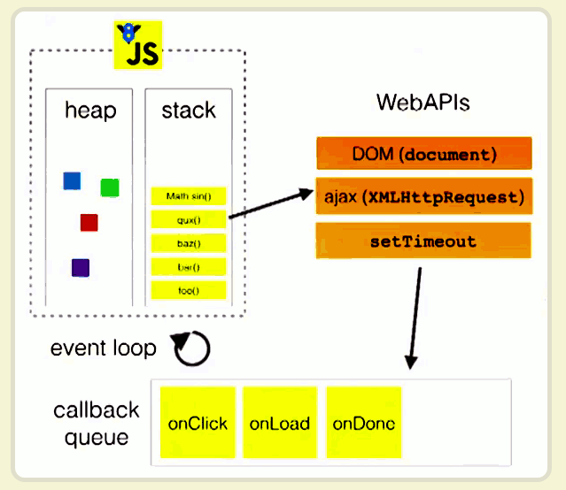

> 按照我目前的理解，onClick、onLoad、onDone等表示指向callback的地址！即它们都是一个个callback来的

这是一张图很全面地展示了浏览器是如何运行代码的！下面有这样一段代码：

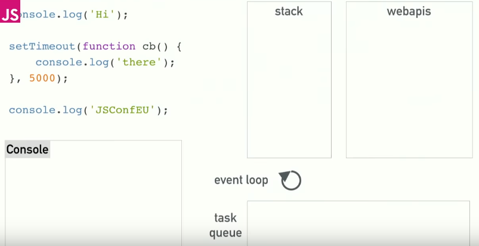

和以前一样，运行代码， `cconsole.log('Hi')` ，显然在Console中打印了一个`hi`，这很简单。

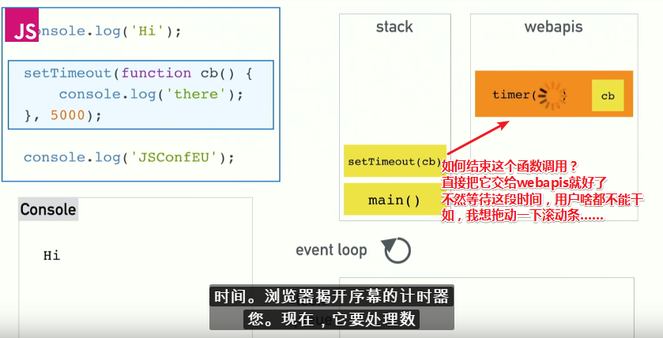

接着下一行语句，我们可以看到当我们调用setTimeout时会发生什么！可以看到，我们将一个callback和延迟（5000ms）传递给setTimeout作为形参来调用它。关于setTimeout，它是浏览器提供给我们的API，它不存在于V8源代码中，它是我们的JavaScript代码在V8引擎跑的时候所得到的额外的东西……接着浏览器会为你启动一个计时器，然后它将会为你处理倒计时，同时这意味着我们的setTimeout调用已经完成了……所以我们可从stack中pop它出来了，那么接下来就是运行下一行语句了！

Console中打印一个 `JSConfEU`后，意味着没有语句可以运行了，所以就清空了这个stack……

目前，我们在Web API中还有个计时器，5s之后它就会完成！

5s之后，web API不能就这么开始修改你代码，即当它准备好（倒计时结束后）时，它不能直接把东西（那个callback）扔到stack上，如果它真得这样做了，那么它就会随机出现在代码中间，显然stack中的代码就会混乱起来了，毕竟代码运行得好好的，突然来了一个不速之客说「正在运行的代码，你可以休息一下了，轮到我了」，所以这两个代码就会产生冲突！

> 注：其实也就是说如果stack中还有很多代码需要执行，那么即便你倒计时结束了，也不会让你执行这个callback……除非stack中已经空空如也了！

所以这就是任务队列或者说是回调队列出现的原因了，因此，web API就会把callback扔到task queue中而不是stack中……

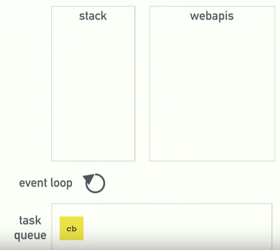

总之，任何Web API都会在自己的处理（如倒计时、网络请求、监听事件发生 ……）完成后将回调推送到任务队列中去……

最后我们来到本次的演讲主题——事件循环！

事件循环是个什么鬼东西？它就像整个等式（equation，平衡？方程？）中最简单的一小段，它有一个非常简单的工作，那么这是什么工作呢？——它的工作就是查看stack和任务队列。

> 这是在判断吗？就像这样： 
>
> ```js
> if (stack == null && taskQueue !== null) { 
> 	stack.push(taskQueue.shift())
> }
> ```

如果stack为空，那么它将会获取队列上的第一个东西，并将其推到可以有效运行它的stack上。

上图中，我们可以看到stack是空的，任务队列上有一个回调，事件循环在运行并且说着「我得做点什么，如把回调推到堆栈上。」

记住，堆栈就像JavaScript的领土一样，即我们需要通过event loop把callback回传到V8里面，这样回调就出现在堆栈里，然后运行…在Console中打印`there`，然后清空stack，这样一来我们就完成了对这段代码的运行探讨……

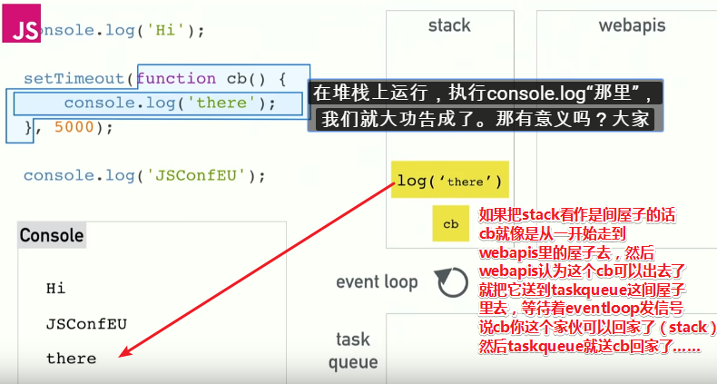

> 我之前有了解到，回调即是作为一个函数的形参，并且在这个函数的函数体中被调用！
>
> 现如今，我可以理解异步这种回调了，它的回在于cb从stack中出去，然后又回到stack中去！

明白了吗？我身边的每一个人？——Awesome（棒极了）!

现在我们可以看到这是如何工作的……对吧！

可能是你第一次接触异步的时候，因为一些奇怪的原因，有人说你必须在调用setTimeout时，所传的延迟是个0才行！即想要让你以0时间运行这个callback……可是我为什么要把callback包装在一个setTimeout中呢？直接运行不就好了吗？当然，请丢掉你脑子已有的认识，这就像是你第一次碰到这个，如果你像我一样，即我能够看到它在做什么，但是我不知道为什么会产生这样的结果哈！……

而这其中的原因通常是，如果你试图将某些事情推迟，然后直到stack空空如也之后才去做的话，那么就用这个setTimeout把这个callback给包裹起来吧！

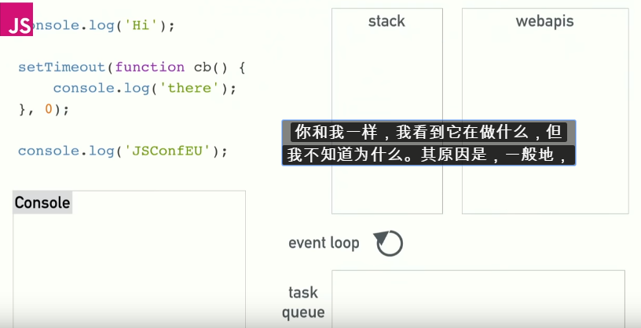

我们知道，如果你写了JavaScript，我们会看到相同的结果，我们会在Console中看到`Hi`、 `JSConfEU`，而`there`将会出现在最后面……

我们可以看到这是怎么发生的。

 setTimeout为0延迟，那么现在它将立即完成并将其推送到队列中去，记住我之前所说关于事件循环的那些事儿，它必须等到堆栈清空之后才能将回调推送到堆栈中去，所以你的stack将会继续运行。首先在Console中打印一个“`Hi`”，然后处理这个setTimeout，接着打印“`JSConfEU`”，接着清空stack。

那么现在事件循环就可以启动了，即旋转一圈，像是把callback推送到stack中一样！之后就可以调用这个回调了……

setTimeout的延迟为0的这个例子就像是**不管出于什么原因，都将代码的执行推迟到堆栈的末尾或者说是直到堆栈被清空**所说的那样

言归正传，所有这些web APIs都以相同的方式工作。 

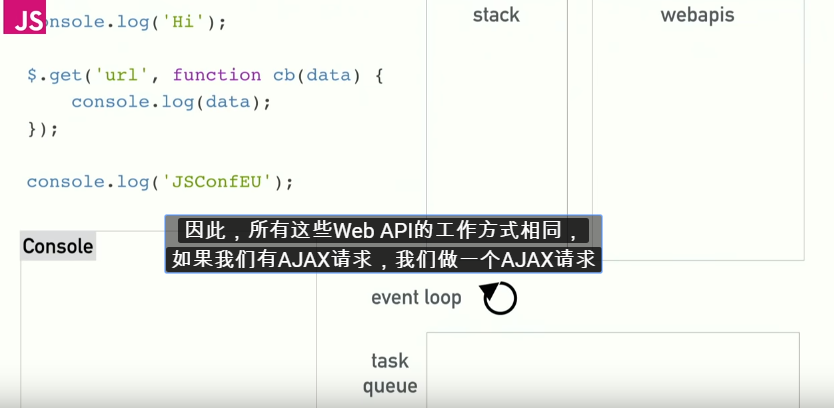

如果我们有AJAX请求，那么我们使用了一个回调然后向URL发出了AJAX请求，而这其中的工作原理是相同的！

首先在Console中打印一个Hi，然后运行下一行语句，即发送一个AJAX请求，由于运行AJAX请求的代码并不存在于V8中，而是作为web API存在于浏览器中，因此我们把这个回调扔到webAPI中去了，接着您的代码就可以继续运行下去了，而不是需要等待响应才能进行下一步……

直到XHR请求完成后，或者它可能永远不会完成……

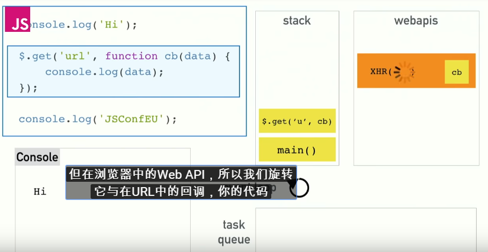

> 这个请求是怎么做到的？换句话说这些线程是如何做到的？用到IO？是用C++代码吗？不知道哈！当然这也不是我目前所要关心的，我只需要知道 `$.get(……)`这行语句已经运行完毕了……而其中的回调函数将会拿到一些data，然后扔到task queue中去，接着就看事件循环的操作了！
>
> 很多时候，stack中已经被清空了，但是请求还没有完成……所以很多时候，在我们开始发起请求之前都会加一个过渡动画，等请求完成后，就执行这个callback——首先去掉过渡动画，然年接着就开始渲染数据了！

假如请求完成了，就把callback扔到任务队列中去，**✎：**

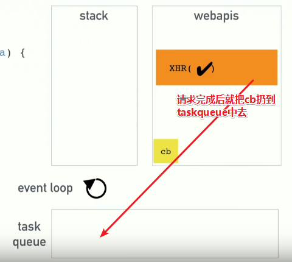

接着就轮到事件循环干活了，一旦发现stack清空了，那么事件循环就启动了，即把这个callback推送到stack中，然后V8就可以执行这个callback了！

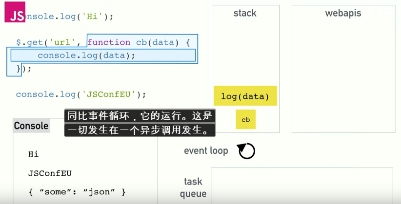

好了，这就是异步调用发生时所发生的一切了……

> Let's do a crazy complicated example, I hope this going to work, if you haven't realized all this is in keynote there's like I don't know 500 animation steps in this whole deck.

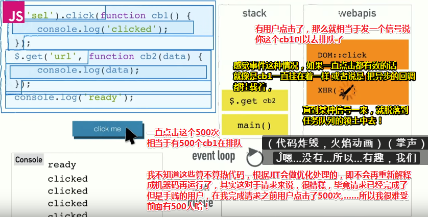

## ★一个工具

作者编写了一个V8在工作时的可视化工具——[loupe](http://latentflip.com/loupe)，当然这个工具也是需要V8去运行的，这就有点循环的味道了……

一些要点：

- setTimeout的延时ms数：它不是保证的执行时间，它是执行的最短时间，就像setTimeout 0不会立即运行代码一样，它会在下一次运行代码。总之只要回调队列中有其它callback在排队，如在倒计时结束之前，有用户点击了100次按钮，那么这个callback就不会立即执行了……我在想如果是0呢？你说点击的速度快还是0这样的倒计时比较快！我想0这样的，应该会排在最前面吧！——这个其实很难说的！当你的call stack中还没有运行到setTimeout的时候，已经有用户点击了按钮，那么这是可以做到在延时之前就能把点击事件的回调函数排到队伍里去的！不过一般来说这很难……毕竟在你拿起鼠标的那一瞬间已经过去2s了……

- 有个按钮是模拟浏览器重绘或者说是渲染的：

  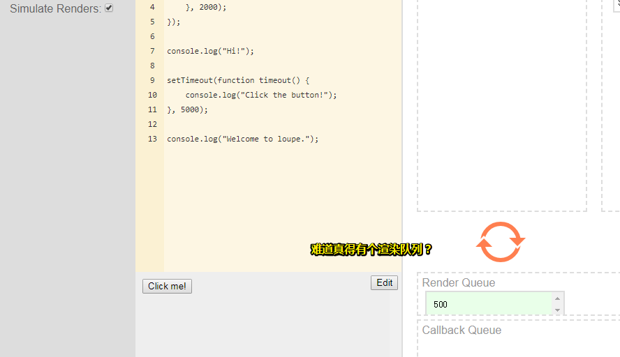

- 当V8引擎在运行JavaScript代码的时候，浏览器通常会受到一些束缚……

  浏览器想每隔16.6ms就重绘一次屏幕，而每秒60帧是最佳的……如果可以，那么这将是浏览器重绘的最快速度！

  但是由于各种原因，如你的JavaScript代码正在运行，为此它会受到了影响……所以如果stack上有代码的话，那么它实际上不能进行渲染的，这就像是渲染也是需要调用callback，如有个渲染队列什么的……所以，它同样必须等到stack清空才能进行渲染！

  > 难道不会产生冲突吗？即渲染队列和callback队列，它们俩总有个优先级吧！

  当然这跟回调队列是有不同之处，它们之间的不同之处在于，**Render的优先级高于Callback**，每隔16毫秒，它就会进入到渲染队列中去，等到stack清空后，它才能真正进行渲染。

  > 在这个过程中，会等到渲染间隙16ms的时间之内，把回调队列中的任务push到stack中去，如果这个回调执行的很慢，那么即便16ms已到，也不会渲染，如果有机会同时进入到stack中的话，那么肯定是render队列优先……
  >
  > 所以不要让回调队列中的callback阻塞事件循环对render queue的操作！即callback不要写得很复杂，最好在16ms之内执行完毕，或者说是10ms就执行完毕！

  所以当你的stack中出现一些运行很慢的代码，那么渲染就被阻塞了……这意味着如果我们的渲染被阻止了，你不能在屏幕上选择文本，你不能点击东西并看到响应，对吧，就像我们之前所展示的那个例子那样……

  所以不要在堆栈上放劣质的慢速代码，因为当你这样做的时候，意味着浏览器不能够做它需要做的事情了，如创建一个流畅的界面。

  这就是为什么当你在做图像处理或动画制作的时候，如果你不注意回调队列中的回调的排列的话，那么很多事情都会变得迟钝起来……

  > 一个callback运行了2ms就完事了，另外一个callback则运行了10s……

  举个例子，我们可以通过滚动处理程序看到滚动处理比如DOM中的滚动事件触发很多，它们触发就像我假设它们在每一帧上触发就像每16毫秒，如果我有这样的代码在document中，滚动，一些动画，或者做一些工作。

   如果我有这段代码，就像我滚动一样，它会像大量回调一样排队

  然后，它必须经历并处理所有这些，并且这些的每个处理都很慢，然后，好吧，你没有阻塞堆栈，你在队列中充斥着排队的事件。


### ◇同步回调和异步回调

```js
[1,2,3,4].forEach(function(i){
    console.log(i)
});
function asyncForEach(array, cb){
	array.forEach(function(){
	setTimeout(cb,0);
})}
asyncForEach([1,2,3,4], function(i){
	console.log(i);
})
```

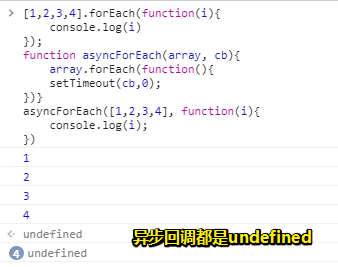

这个例子可以体现异步执行的好处，当同步回调和异步回调中有类似延迟的函数时，即一些让代码运行得很慢的操作时，异步执行就能很明显的体现出它的价值了！如这样：

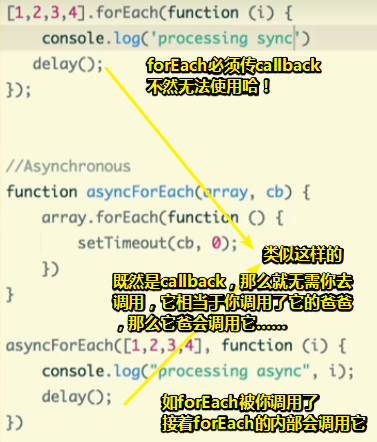

### ◇动画？迟钝？

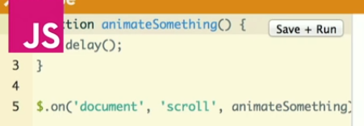

类似16ms就触发渲染一帧……（与scroll事件类似！）

一旦你滚动了页面，那么就会运行这个animateSomething这个回调函数（可以做其它的事，不单只是动画的事），而且这是大量的回调函数在排队……

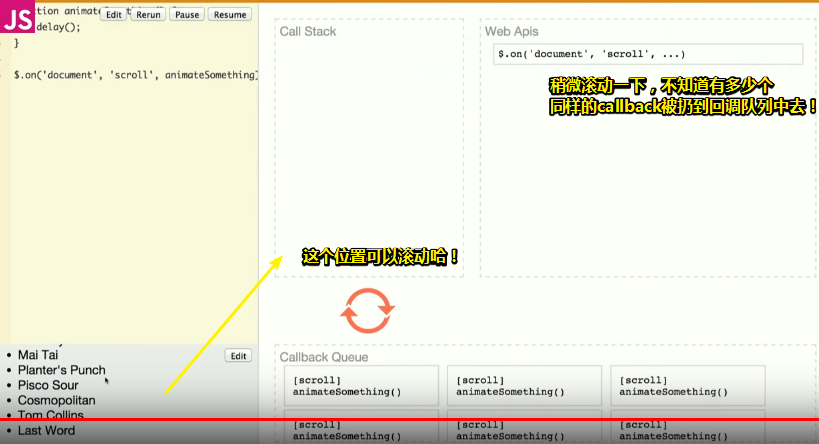

我们可以看到这个回调函数中有个delay()，这表示回调函数在stack中存活得比较长久，即V8处理起来花费了不少时间，虽然这个callback并没有阻塞stack，但是胜在有数量啊！你看回调队列中有一大堆在排队的家伙们……

根据图中的可视化，当你触发了这些回调，你猜这将会发生什么？或许你可以这样一种方式debounce（函数去抖）去解决这种情况……

**➹：**[JS魔法堂：函数节流（throttle）与函数去抖（debounce） - ^_^肥仔John - 博客园](https://www.cnblogs.com/fsjohnhuang/p/4147810.html)

以下内容纯属猜测：

当然可以让用户停止滚动一段时间……或者每隔几秒再执行这些callback，也就是说在这些callback中弄些定时器之类的……即插个队哈……

视频中最后讲到，那个delay函数中插入了一个大的while循环，这需要半秒种的运行时间，总之它只是用于缓慢代码的运行……

还有提到了Web worker……

**➹：**[Web Worker 使用教程 - 阮一峰的网络日志](http://www.ruanyifeng.com/blog/2018/07/web-worker.html)

## ★总结

- `all hell breaks loose`

  > If you say that all hell breaks loose, you are emphasizing that a lot of arguing or fighting suddenly starts.
  >
  > 如果你说……你强调的是很多争论或争斗突然开始了

  **➹：**[All hell breaks loose 释义 - 柯林斯英语词典](https://www.collinsdictionary.com/zh/dictionary/english/all-hell-breaks-loose)

- 可以把一个js文件封装成，或者说是看成是一个main函数！这个js文件没有函数调用，那么call stack中不需要记录一个函数的调用位置了，也就不需要切换执行环境了……

- 感觉所演讲的视频很好，在细讲某个概念的时候，不会出现一个新的概念，让你云里雾里，而在引出这个概念之前，会告诉你之所以会有这个概念的原因，或者说先告诉你神秘现象，然后再解释这种神秘想象，接着就是用一个概念概括这个解释过程……

- 根据上面这点，我突然想起了若愚老师所说的话，如果你在理解一个东西（假设为A）的过程中，发现对这个A的叙述中有超过2个（包括2）以上的东西（假设B、C……）不理解，那么你是不能理解这个A的……如果你非要理解，那么你就得找到能理解的根，即先递，然后再归……

  总之理解一个东西出现两次疑惑或者在解决一次疑惑的过程中又遇到了疑惑，那么你就不要理解了……

- 如果你能对这段即将运行的代码，即对JavaScript的运行机制有一个可视化的运行过程，那么这将会对你理解这段代码的逻辑起到很大的帮助！

- 不知为何，我觉得事件二字是个不好的翻译，我觉得我比较能接受把event叫做行为、动作、活动，用户做出了某个活动，然后就会相应的反馈给用户，如背后是运行了一个callback……

  > 事件是您在编程时系统内发生的动作或者发生的事情，系统通过它来告诉您在您愿意的情况下您可以以某种方式对它做出回应。例如：如果您在网页上单击一个按钮，您可能想通过显示一个信息框来响应这个动作。

  事件就是要响应的事，即可以理解为一个callback或者说是「用户的行为以及浏览器根据这个行为所作出的一系列响应统称为事件」？

  所以我可以理解为：`事件 = 用户行为+callback`吗？

  **➹：**[事件介绍 - MDN](https://developer.mozilla.org/zh-CN/docs/Learn/JavaScript/Building_blocks/Events)

- 永不阻塞

  > 事件循环模型的一个非常有趣的特性是，与许多其他语言不同，JavaScript 永不阻塞。 处理 I/O 通常通过事件和回调来执行，所以当一个应用正等待一个 [`IndexedDB`](https://developer.mozilla.org/zh-CN/docs/Web/API/IndexedDB_API) 查询返回或者一个 [`XHR`](https://developer.mozilla.org/zh-CN/docs/Web/API/XMLHttpRequest)请求返回时，它仍然可以处理其它事情，比如用户输入。
  >
  > 遗留的例外是存在的，如 `alert` 或者同步 XHR，但应该尽量避免使用它们。注意，[例外的例外也是存在的](https://stackoverflow.com/questions/2734025/is-javascript-guaranteed-to-be-single-threaded/2734311#2734311)（但通常是实现错误而非其它原因）。

  **➹：**[并发模型与事件循环 - MDN](https://developer.mozilla.org/zh-CN/docs/Web/JavaScript/EventLoop)

- 突然发觉我们所看到的网页，假如存在JavaScript代码的话，都是把JS给执行了一遍了的……此刻栈和堆中始终会存在有很多数据……当用户作出某个动作的时候，那些在任务队列中的callback就会被调用执行了……

- 日后看英文视频的姿势：

  先找到有英文字幕的，然后下载下来，用谷歌全局翻译，然后把截取翻译的片段，粘贴到屏幕上方，然后视频中的人物讲一句话，就对着翻译加上自己的理解，给翻译出来即可！

  主要是提高对句子成分的分析，即翻译的顺序是怎样的，以及句子中出现的代词指的是哪个东西

  总之，你得把一个句子给划分开了，然后翻译顺序给它标好号！


## ★Q&A

### ①console.log的返回值问题


 `<·` 标志，说明最后一个 `undefined` 是浏览器为了标识函数的返回值，**自动加上以供使用者识别**，可以不管！！！

控制台只会显示函数最终的返回值，那些在函数肚子里的嵌套调用所返回的值，都见鬼去吧！

**➹：**[关于console.log()默认返回的undefined - 自由交流 - JSCode](https://jscode.me/t/console-log-undefined/2109)

补充：

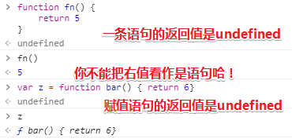

### ②单线程和多线程？

简单理解单线程就是一次只做一个任务，多线程同时做多个任务！

#### （1）进程与线程有何区别

> 有人在[StackOverflow](https://stackoverflow.com/questions/200469/what-is-the-difference-between-a-process-and-a-thread)概括得比较全面，线程其实就是轻量级的进程。一般进程都有自己的一部分独立的系统资源，彼此是隔离的。为了能使不同的进程之间能够互相访问资源并进行协调工作，则需要通过进程间的通信。而线程则采用共享内存空间的形式，多个线程可以共享同一份内存空间。相比起进程，虽然线程看起来占用内存空间少了，但是却会出现资源竞争的情况。

#### （2）并行与并发

> 采用多线程或者多进程的方式进行开发的方式称为并发，有些语言甚至可以充分利用电脑CPU的多核特征实现并行。那么并行与并发又有何区别？这里有比较有意思的解答[Github](https://github.com/forhappy/Cplusplus-Concurrency-In-Practice/blob/master/zh/chapter1-Introduction/1.1%20What%20is%20concurrency.md)。
>
> 简单来讲，并行就是多个任务同时执行，而并发则是同一时间段多个任务交替执行。**并行强调的是同一时间点两个任务同时执行，而并发强调的是同一时间段两个任务同时执行。**

**➹：**[多线程有什么用？ - 知乎](https://www.zhihu.com/question/19901763)

**➹：**[谈谈ruby的线程 - Beansmile](http://www.beansmile.com/blog/posts/thread-talk-by-lan)

### ③JavaScript是如何体现并发的？

> JavaScript 的并发模型基于“事件循环”。这个模型与像 C 或者 Java 这种其它语言中的模型截然不同

说到并发应该很多人会想到多线程或多进程，很遗憾JavaScript是单线程的，但是JavaScript也有一个很有趣的东西，可以让你产生在使用多线程的感受，事件循环（Event Loop）提供了一些很有意思的东西，今天我想和大家一起讨论讨论。

> "Event Loop是一个程序结构，用于等待和发送消息和事件。（a programming construct that waits for and dispatches events or mes

简单的来说Event Loop就是在程序中跑了两个线程（参考iOS的Event Loop），一个线程负责自身的运行（主线程），一个线程负责主线程与其它线程通信。这样来描述其实很好理解，换到JavaScript的语境中，当你在使用setTimeout时，添加一个任务（task functon），这个任务交给了你看不见的一个线程在处理，同时主线程继续保持自身的运行，当主线程运行结束后，它就会去Event Loop中拿之前你添加的任务，继续执行。

**➹：**[子曰五溪](https://mp.weixin.qq.com/s/h3QfVdWyzmiUt-HSSoiJjQ?)

**➹：**[并发模型与事件循环 - MDN](https://developer.mozilla.org/zh-CN/docs/Web/JavaScript/EventLoop)

### ④去掉txt文件中的回车？

由于在使用翻译插件的过程中，有句子因为回车而断开，导致翻译不顺畅，所以我就用了sublimeText的正则替换来把回车给去掉：

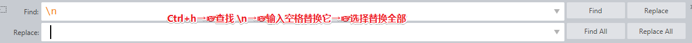

更进一步：

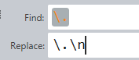

**➹：**[批量去掉或替换文本中的换行符（notepad++、sublime text） - hgg923的专栏 - CSDN博客](https://blog.csdn.net/hgg923/article/details/43228729)

### ⑤关于JavaScript runtime？

有人说这是V8引擎哈！即这是JavaScript的运行环境哈！

摘录了这个答案：[Runtime, Engine, VM 的区别是什么？ - 沈万马的回答 - 知乎](https://www.zhihu.com/question/34634496/answer/59537636)

> 这就是个WiFi和WLAN关系的问题嘛。
> Runtime是指用于支持程序运行时的组件，它可以是个Engine和/或VM。
> VM是一种系统抽象，它提供代码执行所需的API环境。Engine是一种处理抽象，它负责将代码变为底层可执行代码。
> 一个运行时，可以是VM和Engine中的一种，也可以同时是两者。当然也可以两者都不是。
>
> 以题主的例子而言，V8是JS的Engine，但同时它也提供了环境，所以它也是VM。
> JVM是Java的VM，但它也负责代码的转换，所以它也是Engine。
> 之所以习惯上JS的称Engine，是因为JS最初并没有明确的VM概念，也就是说它并没有明确地定义一套环境。而Java的称VM，也是因为早期JVM要强调它提供了环境，而不光光用来解释代码。
>
> 至于其他的还有一些例子：
>
> VC++ Runtime，它提供了API环境，但它并不抽象系统，也不翻译代码，所以它是另一种Runtime。类似的还有VB Runtime和MFC。
>
> .Net Framework，它提供了API，抽象了系统，翻译代码，之所以叫它Framework大概是为了显得大气。

**➹：**[node.js - What is javascript runtime..? - Stack Overflow](https://stackoverflow.com/questions/30838412/what-is-javascript-runtime)

**➹：**[Runtime, Engine, VM 的区别是什么？ - 知乎](https://www.zhihu.com/question/34634496)

### ⑥线程是什么？

在此之前，你需要了解进程的概念：

> 进程（英语：process），是指计算机中已运行的**程序**。目前，进程本身不是基本运行单位，而是线程的容器。程序本身只是指令、数据及其组织形式的描述，**进程才是程序（那些指令和数据）的真正运行实例**。

关于进程的状态：

> 进程在运行时，状态（*state*）会改变。所谓状态，就是指**进程目前的动作**：
>
> - 新生（*new*）：进程新产生中。
> - 运行（*running*）：正在运行。
> - 等待（*waiting*）：等待某事发生，例如等待用户输入完成。亦称“阻塞”（*blocked*）
> - 就绪（*ready*）：[排班中](https://www.wikiwand.com/zh-cn/%E6%8E%92%E7%A8%8B)，等待CPU。
> - 结束（*terminated*）：完成运行。
>
> 各状态名称可能随不同操作系统而相异；对于单CPU系统（UP），任何时间可能有多个进程为等待、就绪，但**必定仅有一个进程在运行**。

线程：

> 线程（英语：thread）是操作系统能够进行**运算调度的最小单位**。它被包含在进程之中，是进程中的实际运作单位。一条线程指的是进程中一个单一顺序的控制流，**一个进程中可以并发多个线程**，**每条线程并行执行不同的任务**。在Unix System V及SunOS中也被称为**轻量进程**（lightweight processes），但轻量进程更多指内核线程（kernel thread），而把用户线程（user thread）称为线程

关于线程的状态：

> 线程有四种基本状态，分别为：
>
> - 产生（spawn）
> - 中断（block）
> - 非中断（unblock）
> - 结束（finish）

我在想这些线程是不是在进程处于运行状态时才会产生……

**➹：**[进程 - Wikiwand](https://www.wikiwand.com/zh-cn/%E8%A1%8C%E7%A8%8B)

**➹：**[线程 - Wikiwand](https://www.wikiwand.com/zh-cn/%E7%BA%BF%E7%A8%8B)

**➹：**[多核 CPU 和多个 CPU 有何区别？ - 知乎](https://www.zhihu.com/question/20998226)

### ⑦定时器原理？

**➹：**[JavaScript定时器原理分析 - 谢灿勇 - 博客园](http://www.cnblogs.com/st-leslie/p/6082450.html)

**➹：**[浅谈定时器原理及应用 - 简书](https://www.jianshu.com/p/1e7c6efc83dc)

### ⑧事件都是异步的吗？

或者我应该问事件是阻塞的吗？

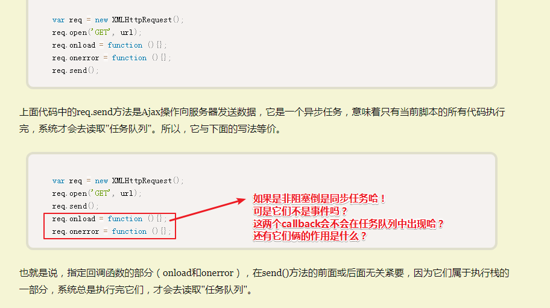

| 事件      | 触发条件                                                     |
| --------- | ------------------------------------------------------------ |
| `onload`  | 当请求成功完成时触发，此时`xhr.readystate=4`                 |
| `onerror` | 在请求过程中，若发生`Network error`则会触发此事件（若发生`Network error`时，上传还没有结束，则会先触发`xhr.upload.onerror`，再触发`xhr.onerror`；若发生`Network error`时，上传已经结束，则只会触发`xhr.onerror`）。**注意**，只有发生了网络层级别的异常才会触发此事件，对于应用层级别的异常，如响应返回的`xhr.statusCode`是`4xx`时，并不属于`Network error`，所以不会触发`onerror`事件，而是会触发`onload`事件。 |

突然觉得这只是为了处理阻塞而存在的事件循环……毕竟如果执行栈中有很慢的代码的话，那么此时这个页面是无法和用户交互的！

如果按照该你阮一峰大神的理解，我可以认为如果事件触发了，那么就会在把其中的callback扔到消息队列中去！

反正函数最终的运行都会在call stack中！

**➹：**[异步调用和单线程，多线程的疑惑？ - 知乎](https://www.zhihu.com/question/47371217)

**➹：**[JavaScript 既是单线程又是异步的，请问这二者是否冲突，以及有什么区别？ - 知乎](https://www.zhihu.com/question/20866267)


