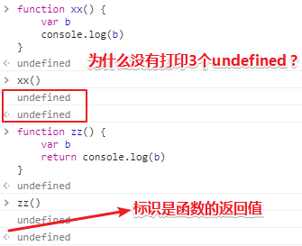

# 到底什么是Event Loop呢？

## ★资料

**➹：**[Philip Roberts: What the heck is the event loop anyway? - JSConf EU - YouTube](https://www.youtube.com/watch?v=8aGhZQkoFbQ&t=285s)

## ★概述

JavaScript实际上是怎样运作的？

我们都知道V8是Chrome里的JavaScript运行环境，但是它是什么呢？以及它做了什么呢？

我们都知道说到JavaScript，就想到了单线程，但是很明显我们在用回调函数啊！那么回调函数又是怎么运作的呢？

既然如此，JavaScript到底是什么？——嗯，类似这样的：JavaScript是一个单线程、非阻塞、异步、并发的、解释性脚本语言，而且它还有一个调用栈、事件循环、回调队列和一些其它的API……总之它们都是一些名词，而且是一些专业名词！

相较于其它浏览器的运行环境，V8是否有特别之处呢？

所以我想问问V8「你是否有调用栈、事件循环、回调队列和其他API？」，于是，V8回答说「我有一个call stack和一个heap，至于其它的？什么鬼？完全不知道哈！」

言归正传，以下内容将为你讲述「为啥JavaScript如此怪异？」，毕竟你在学习JavaScript的过程中，所遇怪异之问题，可谓之如滔滔江水，绵绵不绝……如当你与其它语言比较的时候，你会发现回调明明是个灾难，但还是被引入了。不管怎样，我希望你能够对JavaScript的运行环境有了一些新的见解，为此你能够对这些「怪异」问题考虑得更周全一些……而不是觉得它们就是很「怪异」，没有道理可言！

## ★V8-JS的运行环境

关于JavaScript的运行环境，比如V8，V8是Chrome里的JavaScript运行环境。

下面这个是一个JavaScript的运行环境（Runtime）示意图：

解释一下：

- heap记录了内存的分配，想想C语言就知道这个所谓的内存分配了…
- call stack记录了函数调用的执行上下文！总之这是栈帧这类东西所在的地方

此刻或许你会疑问「就这么两个东东吗？」

当然，你可以克隆了V8的代码，然后看看这里面到底有什么东西，你通过搜索  `setTimeout`或者 `DOM`、HTTP请求这些东西的时候，你会发现它们并不在里面！

它们不存在于V8引擎，显然，这会让人大吃一惊，毕竟当你想要异步编程的时候，这些是你首先考虑要使用的东西……可是它们并不存在于V8的源码里面啊！嗯，这很有趣！

作者经过18个月的探索，他开始意识到这是极其重要的部分！而理解「这些部分是什么」显然对你理解JS之所以怪异有很大的助力！

## ★V8之外的一些东西

从这张图中我们可以看到：

首先是V8运行环境，然后是浏览器提供的其他东西（被称之为web APIs，DOM、AJAX、setTimeout之类的东西），再然后是神秘的事件循环和回调队列。

想必大家事先都听说过这些术语了吧！但是你们未必能理解这些部分是怎么结合在一起的。

### ◇解释这些术语

#### Call Stack

JavaScript是一个单线程的编程语言。单线程的运行环境意味着它有且只有一个调用栈，它每次只能够做一件事，所以单线程的意思就是「程序每次只可以运行一段代码」。**✎：**

对上面所说的内容可视化一下：

解释一波：

有一些像左边这样的代码，有一些函数，如一个将两个数字相乘的函数multiply、一个调用了前者的平方函数square、一个打印函数printSquare，它调用了square，然后将结果用console.log打印出来。（函数之间的嵌套调用习以为常……），然后在最后我们调用了printSquare。

这些代码看起来没啥问题，那么我们就来运行它！

Call Stack基本上是一个记录当前程序所在位置的数据结构，如果当前进入了某个函数，那么这个函数就会被放在栈里面。如果当前离开了某个函数，那么这个函数就会被弹出栈外，这就是栈所做的事啦！

如果你运行这个文件，那么将会有一个类似main的函数，它指代文件自身，我们首先把它放进栈，然后，我们从上而下查看声明了的函数，最后是printSquare，我们知道printSquare被调用了，那么我们把它推进栈里。然后它调用了square，所以也把它推进栈里。而square也调用了multiply，同样也把它推进栈。最后我们得到了multiply的返回值。

接着我们把multiply弹出栈，然后square也得到了返回值，再把square弹出栈，最后到printSquare，它调用了console.log，到这里已经没有返回值了。接着我们到了函数的最后部分，然后我们完成了，即call Stack里空空如也！**✎：**

这就是一个可视化的调用栈过程啦！如果你以前没有了解过Call Stack，那么现在你就知道了。

当我们在浏览器端做网站开发的时候，如果在Chrome运行下面左边这样的代码，即baz函数调用了bar函数，bar函数调用了foo函数，而foo函数抛出一个错误，那么我们看到会是这样的结果：它将整个栈树都打印了出来，错误从foo开始，到bar， 到baz，到匿名函数（也就是我们说的main函数）。

同样地，如果你听说过像内存泄露这类名词，下面的代码就是其中一个例子：

我们有一个调用自身的函数foo，然后调用这个foo函数，你猜会发生什么？

我们有一个函数调用了foo，foo又调用了foo，如此一直下去……最后Chrome会说，“你可能并不是想要调用它自己16,000次”、“我为你终止了它，这样你可以找到bug在哪里。”

> 超出最大调用栈大小……

以上就是作者向我们所呈现的一个调用栈了，可能你在开发的时候就已经注意到了……

#### blocking

什么使程序运行变慢？这是一个很难的问题，当然我们借此就来谈谈阻塞！

> 没有严格的定义说什么是阻塞，什么不阻塞。仅仅是指代码运行得很慢，比如说，console.log不慢，遍历从1到10亿很慢，网络请求很慢，下载图片也很慢。反正在栈里表现很慢的东西都叫阻塞……

这里有一个小例子，比如说我们有这样一些伪码（就像jQuery的AJAX请求，如果这些是同步的，会发生什么？，关于请求，请忘记我们对异步的了解，总之虽然它们是在发请求，但调用这些函数是同步的，即这一步结束了，才走下一步，可视化到call stack的话，就是运行一个函数，就在调用栈中记录一次，运行结束后，就弹出栈！不会像之前的嵌套函数调用那样，一直在叠罗汉！），**✎：**

如果我们运行这些伪码，那么首先调用了getSync，然后我们在等待.. 因为我们在做网络请求，网络请求相对于计算机本地来说很慢，那么等请求完成了，我们才继续。然后是继续等，再继续……其实我想说的是「这些请求可能永远也不会结束，身为开发者，或许等待没什么，可是用户就不买账了……」，接下来就是请求结束了，接着就运行下面的，当这些所有都跑一遍，栈才会被清空……

如果一个编程语言是单线程的，比如ruby，刚才的状况就会发生。

我们来请求一个资源，我们就要干巴巴地等着请求完成，我们并没有办法可以让我们不需要等待，所以这会有很大的问题，而这个问题就是我们的代码是要跑在浏览器上的……

为什么这么说呢？举个例子你就明白了！

下面张图上的代码就是刚刚的伪码，相当于是浏览器给我们的**同步**AJAX请求！

解释一波：

我用了一个while循环伪造了这一点，因为它是同步的，要循环五秒钟，我才能继续。

如果我们打开控制台，那么我们就可以看到这段代码将会发生什么，我们单击了 `Run!`按钮，可以看到控制台 ` 正在请求foo.com`，而当我们单击其它东西（如 `Open Alert`、其它链接文本…… ）时，居然发现没有反应……那么为什么发生这种情况？话又说回来，此刻我不能做任何事情，对不对？即便我再次单击 `Run！`按钮，这个按钮也没有任何反应（照理说，应该重头开始再运行一遍代码吧！换言之，之前还没有跑完的代码可以不用跑了……），总之它就是没有重现我点击它事实……

可见，浏览器被阻塞了，它卡住了，它不能做任何事情，直到这些请求完成。然后将所有的东西蹦出来了，因为我之前做了一些操作，它发现是我干的，但实际上，它并不能地实时地呈现出我刚刚所做的那些调皮捣蛋的事儿，总之它不能做任何事情，那是因为调用栈里如果有东西的话，那么浏览器它就不能干其它的，这就像是不能一心二用。

> 感觉这里有个伏笔，那就是浏览器怎么知道那些打扰到它的事儿呢？而且这其中的执行顺序又是怎样的呢？

不管怎样，我们已经弄清了同步请求，浏览器现在不能做别的事情，即它不能渲染（render，呈现），它不能运行任何其他代码，它卡住了。并不出乎意料，如果我们希望人们拥有漂亮流畅的用户界面，我们就不能阻塞调用栈，即你不要让的call stack中出现运行得很慢的代码，因为如果你不这样的话，那么就会流失很多用户了……

#### asynchronous callbacks

那么，我们应该如何处理呢？我们最简单的方式是提供异步回调（回调就是一个函数）

在浏览器中几乎没有阻塞的函数，node里也是这样，它们都是异步函数，这基本上意味着我们运行一些代码，给它一个回调函数并在之后运行，如果你看过JavaScript代码你就会看过这些异步回调，那么这实际上是什么样的呢？

这里有些简单的例子来提示我们到底运行到哪了，像这样的代码，**✎：**

console.log输出`Hi`，对吧！接着我们运行`setTimeout`，但我们把console.log放到队列里了，这将会在之后再运行，所以我们跳到下一行语句，即运行 `JSConfEU` 这里，然后5秒钟之后，我们输出“`There`”，对吧！理解了吗？（开心）基本上这是setTimeout正在做的事情。

我们把异步回调以及关于我们之前所看到的call stack结合起来，看看它们是如何工作的？

让我们来运行代码，console.log一个`Hi`。

接着轮到setTimeout了，我们知道，它不会立即运行，它将会在5s后运行，所以我们不能把它推到stack中，毕竟这有blocking啊！虽然我们把它push到stack中了，但不知是什么缘故（我们还没有描述这样做的这个方法，但是我们之后会讲到），它就如昙花一现般，不久之后就消失了或者你可以把它当作像是一个运行`console.log()`那样的函数就好了，总之没有blocking就对了！

接着我们log了`JSConfEU`，然后stack中就被清空了，然而5秒钟后，不知何故，在stack中神奇地出现了 `console.log('JSConfEU')`……

所以，这是怎么发生的呢？那就是 ——这基本上是在起并发作用的那个事件循环所发生的，简而言之，是事件循环导致了这件事情的发生，而且这体现了并发……即当你这个JS文件还在运行代码的时候，还有其它线程在处理诸如setTimeout这样的任务……

对，所以我一直有点说谎，即告诉你JavaScript一次只能做一件事……换言之就是不能边吃饭边看电视，只能吃完饭后才能看电视……所以是谁帮助了我可以边吃饭边看电视呢？——是event loop……

## ★总结

- `all hell breaks loose`

  > If you say that all hell breaks loose, you are emphasizing that a lot of arguing or fighting suddenly starts.
  >
  > 如果你说……你强调的是很多争论或争斗突然开始了

  **➹：**[All hell breaks loose 释义 - 柯林斯英语词典](https://www.collinsdictionary.com/zh/dictionary/english/all-hell-breaks-loose)

- 可以把一个js文件封装成，或者说是看成是一个main函数！这个js文件没有函数调用，那么call stack中不需要记录一个函数的调用位置了，也就不需要切换执行环境了……

- 感觉所演讲的视频很好，在细讲某个概念的时候，不会出现一个新的概念，让你云里雾里，而在引出这个概念之前，会告诉你之所以会有这个概念的原因，或者说先告诉你神秘现象，然后再解释这种神秘想象，接着就是用一个概念概括这个解释过程……

- 根据上面这点，我突然想起了若愚老师所说的话，如果你在理解一个东西（假设为A）的过程中，发现对这个A的叙述中有超过2个（包括2）以上的东西（假设B、C……）不理解，那么你是不能理解这个A的……如果你非要理解，那么你就得找到能理解的根，即先递，然后再归……

  总之理解一个东西出现两次疑惑或者在解决一次疑惑的过程中又遇到了疑惑，那么你就不要理解了……

## ★Q&A

### ①console.log的返回值问题

 `<·` 标志，说明最后一个 `undefined` 是浏览器为了标识函数的返回值，**自动加上以供使用者识别**，可以不管！！！

控制台只会显示函数最终的返回值，那些在函数肚子里的嵌套调用所返回的值，都见鬼去吧！

**➹：**[关于console.log()默认返回的undefined - 自由交流 - JSCode](https://jscode.me/t/console-log-undefined/2109)

补充：

### ②单线程和多线程？

简单理解单线程就是一次只做一个任务，多线程同时做多个任务！

#### （1）进程与线程有何区别

> 有人在[StackOverflow](https://stackoverflow.com/questions/200469/what-is-the-difference-between-a-process-and-a-thread)概括得比较全面，线程其实就是轻量级的进程。一般进程都有自己的一部分独立的系统资源，彼此是隔离的。为了能使不同的进程之间能够互相访问资源并进行协调工作，则需要通过进程间的通信。而线程则采用共享内存空间的形式，多个线程可以共享同一份内存空间。相比起进程，虽然线程看起来占用内存空间少了，但是却会出现资源竞争的情况。

#### （2）并行与并发

> 采用多线程或者多进程的方式进行开发的方式称为并发，有些语言甚至可以充分利用电脑CPU的多核特征实现并行。那么并行与并发又有何区别？这里有比较有意思的解答[Github](https://github.com/forhappy/Cplusplus-Concurrency-In-Practice/blob/master/zh/chapter1-Introduction/1.1%20What%20is%20concurrency.md)。
>
> 简单来讲，并行就是多个任务同时执行，而并发则是同一时间段多个任务交替执行。**并行强调的是同一时间点两个任务同时执行，而并发强调的是同一时间段两个任务同时执行。**

**➹：**[多线程有什么用？ - 知乎](https://www.zhihu.com/question/19901763)

**➹：**[谈谈ruby的线程 - Beansmile](http://www.beansmile.com/blog/posts/thread-talk-by-lan)

### ③JavaScript是如何体现并发的？

> JavaScript 的并发模型基于“事件循环”。这个模型与像 C 或者 Java 这种其它语言中的模型截然不同

说到并发应该很多人会想到多线程或多进程，很遗憾JavaScript是单线程的，但是JavaScript也有一个很有趣的东西，可以让你产生在使用多线程的感受，事件循环（Event Loop）提供了一些很有意思的东西，今天我想和大家一起讨论讨论。

> "Event Loop是一个程序结构，用于等待和发送消息和事件。（a programming construct that waits for and dispatches events or mes

简单的来说Event Loop就是在程序中跑了两个线程（参考iOS的Event Loop），一个线程负责自身的运行（主线程），一个线程负责主线程与其它线程通信。这样来描述其实很好理解，换到JavaScript的语境中，当你在使用setTimeout时，添加一个任务（task functon），这个任务交给了你看不见的一个线程在处理，同时主线程继续保持自身的运行，当主线程运行结束后，它就会去Event Loop中拿之前你添加的任务，继续执行。

**➹：**[子曰五溪](https://mp.weixin.qq.com/s/h3QfVdWyzmiUt-HSSoiJjQ?)

**➹：**[并发模型与事件循环 - MDN](https://developer.mozilla.org/zh-CN/docs/Web/JavaScript/EventLoop)

