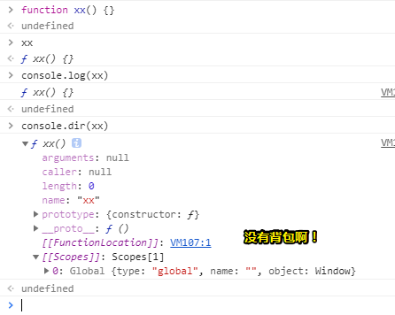

# I never understood JavaScript closures

直到有人向我这样解释

原文：[I never understood JavaScript closures – DailyJS – Medium](https://medium.com/dailyjs/i-never-understood-javascript-closures-9663703368e8)

正如标题所述，JavaScript闭包对我来说一直是个谜。我已经[阅读了](https://medium.freecodecamp.org/lets-learn-javascript-closures-66feb44f6a44) [好几篇](https://medium.freecodecamp.org/whats-a-javascript-closure-in-plain-english-please-6a1fc1d2ff1c) [文章](https://en.wikipedia.org/wiki/Closure_%28computer_programming%29) 了，我在工作中使用了闭包，有时我甚至使用了闭包，但却没有意识到我正在使用闭包。

最近我去参加了一个讲座，有人以一种能让我终于明白的方式对它进行了真正的解释。在这篇文章中，我将尝试用这种方法来解释这所谓的闭包。让我把这个功劳归于[CodeSmith](https://www.codesmith.io/)和他们的JavaScript the Hard Parts系列

## ★在我们开始之前

在你开始去理解闭包之前，有一些极其重要的概念得要你事先知晓的，比如执行上下文（ *execution context*）等等

[这篇文章](http://davidshariff.com/blog/what-is-the-execution-context-in-javascript/)对执行上下文有一个很好的入门，因此，你可以去看看。我引用了这篇文章的一些内容：

> 当代码在JavaScript中运行时，执行它的环境是非常重要的，而这其中的环境被JavaScript引擎评估为以下之一:
>
> - 全局代码 - 首次执行代码的默认环境
> - 函数代码 - 每当执行流程进入函数体时。
>
> ……
>
> 关于术语`execution context`，我们可以视它为当前代码所被评估的环境/作用域（ *environment / scope*）。

换句话说，当我们启动程序时，我们是从全局的执行上下文开始的。一些变量在全局执行上下文中声明。我们就把这些变量称之为全局变量。当程序中，有调用函数时，会发生什么呢？——有以下几个步骤：

1. JavaScript创建一个新的执行上下文，即，一个局部执行上下文，其实你可以认为这就是一个局部作用域哈！
2. 该局部执行上下文将具有其自己的变量集，而这些变量将会是该执行上下文的局部变量。
3. 这新的执行上下文被抛到执行堆栈（call stack）上 。你可以将执行堆栈视为用来**跟踪程序在执行中的位置**的这样一种机制

那么被调用的函数什么时候就执行结束了呢？当遇到`return`语句或遇到结束括号`}` 时，就GG了。函数结束时，会发生以下情况：

1. 局部执行上下文会从执行堆栈中弹出
2. 这个函数将其返回值发送回调用上下文。调用上下文是调用此函数的执行上下文，它可以是全局执行上下文或另一个局部执行上下文。由调用执行上下文来处理该点的返回值。返回的值可以是一个对象，一个数组，一个函数，一个布尔值等等其它任何东西。如果函数没有`return`语句，则返回`undefined` 。
3. 局部执行上下文被**销毁**。这个很重要。再次强调「销毁（Destroyed）」。意味着在局部执行上下文中声明的所有变量都将被删除。它们不再可用。这就是它们被称为**局部变量**的原因啦！

## ★一个非常基础的例子

在我们开始讲解闭包之前，让我们先来看一下下面这段代码。它看起来非常简单，任何读这篇文章的人都可能确切地知道它的作用。

```
1: let a = 3
2: function addTwo(x) {
3:   let ret = x + 2
4:   return ret
5: }
6: let b = addTwo(a)
7: console.log(b)
```

为了理解JavaScript引擎是如何工作的，所以我们来仔细地分析一下它，看看这段代码到底有什么名堂

1. 在第1行，我们在全局执行上下文中声明了一个新变量a ，并为其分配（assign）了一个数值`3` 。
2. 接下来就有点棘手了。第2行到第5行是一个整体。那么这里发生了什么呢？我们在全局执行上下文中声明了一个名为`addTwo`的新变量。然后我们分配（assign）给它的是什么呢？一个函数定义。两个括号`{ }`之间的任何内容都分配给了`addTwo` 了。函数内部的代码不会被评估，也不会执行，只是存储在变量中以备将来使用。
3. 那么现在我们来到第6行代码了。它看起来很简单，但是这里有很多东西需要拆开来看。首先，我们在全局执行上下文中声明了一个新变量，并将其标记为`b` 。声明变量后，它的值就默认初始为`undefined` 啦。
4. 接下来，仍然还是在第6行，我们看到了一个赋值运算符。我们正准备给变量`b`分配一个新值。接下来我们看到一个被调用的函数。当你看到一个变量后跟圆括号`(…)` ，那么这就是调用函数的信号啦！暂且快进一下（[Flash forward](https://zh.wikipedia.org/wiki/%E6%9C%AA%E6%9D%A5%E9%97%AA%E5%BD%B1)），即假设我们已经拿到了函数调用的结果。每个函数都会返回一些东西（如值，对象或`undefined` ）。而从函数返回的任何内容都将分配给变量`b` 。
5. 然而首先我们需要调用标记为`addTwo`的函数。JavaScript（默认指JavaScript引擎）将在其全局执行上下文内存中查找名为`addTwo`的变量。哦，它找到了一个，它是在步骤2（或第2-5行）中定义的。 然后就瞧见（lo）变量`addTwo`包含一个函数定义。请注意，变量`a`作为参数传递给了这个函数。JavaScript在其全局执行上下文内存中搜索到了变量`a` ，找到它之后，发现它的值为`3`，接着就将数值`3`作为参数传递给函数。准备执行该函数啦！
6. 现在执行上下文将会切换。创建一个新的局部执行上下文，我们将其命名为“addTwo执行上下文”。而这执行上下文将会被推送到调用堆栈里边（call stack）。那么我们在局部执行上下文中做的第一件事是什么呢？
7. 您可能会想说，“在局部执行上下文中声明了一个新的变量`ret` ”。不过，这不是答案。正确答案是，我们首先需要查看函数的参数。在局部执行上下文中声明了一个新变量`x` 。接着，由于值3作为参数传递给了形参x，因此局部变量x被赋值为`3` 。
8. 下一步是：在局部执行上下文中声明新的变量`ret` 。其值被设置为undefined。（第3行）
9. 仍然是第3行，接着需要执行一个加法。首先，我们需要拿到x的值。为此，JavaScript将会查找变量`x` 。它将首先查看局部执行上下文。它找到了一个，值是`3`。第二个操作数是`2` 。加法（ `5` ）的结果被赋予变量`ret` 。
10. 第4行。我们返回变量`ret`的内容。同样，我们也要在局部执行上下文里边查找ret变量。查找得知，`ret`包含`5`这个值。所以该函数返回的是数值`5`。至此，函数就结束了。
11. 第4-5行。这函数就结束了。该局部执行上下文也就意味着就被销毁了。 局部变量`x`和`ret`被消灭了。它们已经不存在了。其上下文已经被弹出调用堆栈了，返回值则返回到调用函数的那个上下文里边。对于我们这个例子的这种情况，调用上下文就是全局执行上下文，毕竟函数`addTwo`是从全局执行上下文中调用的。
12. 现在，我们从第4步中断的地方开始。返回值(数值`5` )被赋给变量`b`。我们仍然在这个小程序的第6行。
13. 我不打算详细介绍log函数是个什么执行情况了，但是在第7行里边，变量`b`的内容将在控制台中打印出来。而在我们的这个例子里边是`5`。

对于一个非常简单的程序来说，这是一个非常冗长的解释，我们甚至还没有触及闭包。当然，我保证我们会实现这篇文章的目标。不过，首先我们还需要再走一两条弯路先。

## ★词法作用域（Lexical scope）

 我们需要理解词法作用域的某些方面。请看下面的例子。

```
1: let val1 = 2
2: function multiplyThis(n) {
3:   let ret = n * val1
4:   return ret
5: }
6: let multiplied = multiplyThis(6)
7: console.log('example of scope:', multiplied)
```

这里的想法是我们在局部执行上下文中有变量，而在全局执行上下文中同样也有变量。 JavaScript的一个复杂之处在于它**如何查找变量**。 如果它在局部执行上下文中找不到变量，那么它将在其调用上下文中查找它（变量）。 如果没有在其调用上下文中找到它（变量），那么反复地，直到它（JavaScript引擎）查看全局执行上下文。 （如果JavaScript引擎没有找到它，那么它就是`undefined`的）。 根据上面的例子，而该例子将会弄清楚这件事。 如果您了解作用域的工作原理，则可以跳过此步骤。  

> 我了解了，但我不打算跳过！

1. 在全局执行上下文中声明一个新变量`val1` ，并为其分配数字`2` 。
2. 2到5行，声明一个新变量`multiplyThis`并为其赋值一个函数定义，就是一个函数啦！
3. 第6行。在全局执行上下文中声明一个叫`multiplied`的新变量。
4. 从全局执行上下文内存中检索变量`multiplyThis`并将其作为函数执行。传递数字`6`作为该函数的参数，也就是作为形参的实参啦！
5. **新函数调用=新执行上下文**。创建一个新的局部执行上下文。
6. 在局部执行上下文里边，声明一个变量`n`并为其分配数字`6`。
7. 第3行。在局部执行上下文里边，声明一个变量`ret` 。
8. 第3行（续）。 用两个操作数执行乘法运算; 那么变量`n`和`val1`的内容是什么呢？ 在局部执行上下文中查找变量`n`。 我们知道在第6步中声明了它。它的内容是数字`6`。 在局部执行上下文中查找变量`val1`。 然而局部执行上下文里边并没有标记为`val1`的变量。 因此，让我们来检查调用上下文。 而调用上下文是全局执行上下文。 至此，让我们在全局执行上下文中查找`val1`。 哦，是的，它就在那里。 它在步骤1里边被定义了。而且它的值为数字`2`。
9.  第3行（续）。 将两个操作数相乘并将其分配给`ret`变量。 `6 * 2 = 12`. `ret`现在是`12`了！而不是原先的`undefined`了！
10. 返回ret变量。局部执行上下文连同变量`ret`和`n`一起被销毁了，换句话说，从call stack中弹出去了。当然，变量`val1`没有被销毁，因为它是全局执行上下文的一部分哈！
11. 返回第6行。在调用上下文中，将数字`12`分配给`multiplied`变量。
12. 最后，在第7行，我们在控制台中显示`multiplied`变量的值。

所以在这个例子中，我们需要记住的是**一个函数是可以访问在其调用上下文中所定义的变量的**。而这种现象的正式名称是**词法作用域**。

> 需要注意的是，JavaScript是静态词法作用域，而不是动态词法作用域，即前者是JavaScript引擎评估你的代码时就确定好的！而后者则是在代码执行时确定好的！

## ★A function that returns a function（一个返回函数的函数）

在第一个例子中，函数`addTwo`返回一个数字。**请记住，函数可以返回任何值**。让我们看一个返回函数的函数示例，因为这对于理解闭包非常重要。下面是我们将要分析的例子。

```
 1: let val = 7
 2: function createAdder() {
 3:   function addNumbers(a, b) {
 4:     let ret = a + b
 5:     return ret
 6:   }
 7:   return addNumbers
 8: }
 9: let adder = createAdder()
10: let sum = adder(val, 8)
11: console.log('example of function returning a function: ', sum)
```

同之前一样， 让我们逐步分解一下。

1. 第1行。我们在全局执行上下文中声明一个变量`val` ，并将数字`7`赋给该变量。

2. 第2至8行。我们在全局执行上下文中声明一个名为`createAdder`的变量，并为其分配了一个函数定义。第3至7行描述了上述函数定义。和之前一样，在这一点上，我们并没有跳到那个函数里边。我们只是将函数定义存储到该变量(`createAdder`)中。

3. 第9行。我们在全局执行上下文中声明一个名为`adder`的新变量。暂时， `undefined`被分配给了`adder` 。

4. 任然是第9行。我们看到括号`()`;既然如此，那么我们就需要执行或调用一个函数了。让我们来查询一下全局执行上下文的内存，并寻找一个名为`createAdder`的变量。它是在步骤2中创建的。好的，让我们来调用一下它吧！

5. 调用一个函数。现在我们在第2行。创建一个新的局部执行上下文。我们可以在新的执行上下文中创建局部变量。引擎将新的上下文添加到调用堆栈最上边。这个函数没有参数，既然如此，那我们就直接进入它的函数体。

6. 任然是3–6行。我们有一个新的函数声明。我们在局部执行上下文里边创建了一个变量`addNumbers`。这很重要。`addNumbers`只存在于局部执行上下文中。我们将函数定义存储在名为`addNumbers`的局部变量里边。

7. 现在我们在第7行。我们返回变量`addNumbers`的内容。引擎查找一个名为`addNumbers`的变量并且找到了它。它是一个函数定义。好吧，**函数可以返回任何东西，包括函数定义**。所以我们返回了`addNumbers`的定义。**括号之间的任何内容（如第4行和第5行）构成了函数定义**。我们还从调用堆栈中移除了局部执行上下文。

8. 返回后，这局部执行上下文就被销毁了。而`addNumbers`变量也就不再存在了。但是函数定义仍然存在，为什么这么说呢？因为它从这函数里边`return`了呀，并且被分配给了变量`adder` ；而这个变量就是我们在步骤3中所创建的变量。

9. 现在我们在第10行。我们在全局执行上下文中定义了一个新的变量`sum`。并临时给它分配了个 `undefined`值 。

10. 接下来我们需要执行一个函数。那么是哪个函数呢？——在名为`adder` 的变量中所定义的函数。我们在全局执行上下文中查找它，果然，我们找到了它。瞧，这个函数有两个参数呀！

11. 让我们检索这两个参数，这样我们就可以调用函数并传入正确的参数了。第一个是变量`val`，它是我们在步骤1中所定义的，它表示数字`7`，接着，第二个则是数字`8`。

12. 现在我们必须执行这个函数了。第3 - 5行概述了函数定义。创建一个新的局部执行上下文。在局部上下文里边，创建了两个新变量：`a`和`b`。它们分别被赋予值`7`和`8`，毕竟这些值是我们在上一步中传入给该函数的实参呀。

13. 第4行。声明了一个新变量，名为`ret`。请注意，它是在局部执行上下文中所声明的。

14. 第4行。执行加法操作，我们将变量`a`的内容和变量`b`的内容相加。加法的结果( `15` )被分配给了ret变量。

15. `ret`变量从该函数里边返回。局部执行上下文被销毁，并从调用堆栈中删除，至此，变量`a`、`b`和`ret`不再存在。

    > 我之前一直以为ret还在，而且也感觉到这不符合逻辑，没想到那只是函数定义

16. 返回的值将分配给我们在步骤9中所定义的`sum`变量。

17. 我们将`sum`的值打印到控制台里边。

不出所料，控制台将会打印出15。我们在这里真的经历了很多磨难。但我想在这里说明几点。首先，函数定义是可以被存储在变量里边的，还有，函数定义在被调用之前对程序是不可见的，换句话说，就是JavaScript引擎不会进去瞧瞧这个函数是怎样的定义姿势，直到我们调用了该函数，JavaScript引擎才会进去瞧瞧。其次，每次调用一个函数，都会(临时)创建一个局部执行上下文。当函数执行完成时，这执行上下文就会消失不见了。那么什么叫函数执行完成呢？——当一个函数遇到`return`或结束括号 `}` 时，它就完成了，白话一点就是GG了。

## ★最后，闭包（closure）

看一下下面的这个代码，并试着弄清楚这代码会发生什么。

```
 1: function createCounter() {
 2:   let counter = 0
 3:   const myFunction = function() {
 4:     counter = counter + 1
 5:     return counter
 6:   }
 7:   return myFunction
 8: }
 9: const increment = createCounter()
10: const c1 = increment()
11: const c2 = increment()
12: const c3 = increment()
13: console.log('example increment', c1, c2, c3)
```

现在我们已经从前面的两个例子中掌握了这些代码执行的窍门了，让我们按照我们期望它运行的方式执行此操作。

1. 第1 - 8行。我们在全局执行上下文中创建一个新的变量`createCounter`，并为它赋值为一个函数定义。

2. 第9行。我们在全局执行上下文中声明了一个名为`increment`的新变量。

3. 还是第9行。我们需要调用`createCounter`函数并将它的返回值赋值给`increment`变量。

4. 第1-8行。调用这个函数。创建新的局部执行上下文。

5. 第2行。在局部执行上下文中，声明一个名为`counter`的新变量。并将数字0分配给`counter` 。

6. 第3–6行。声明名为`myFunction`的新变量。注意，该变量是在局部执行上下文中声明的。而变量的内容是另一个函数定义。如第4行和第5行所定义的那样。

7. 第7行。返回`myFunction`变量的内容。删除局部执行上下文。至此，`myFunction`和`counter`不再存在。接下来的操作就返回到调用上下文继续进行……

8. 第9行。在调用上下文(全局执行上下文)中，`createCounter`所返回的值被赋值给了`increment` 。变量 `increment ` 现在包含了一个函数定义。毕竟`createCounter`返回的是函数定义。虽然它不再被标记为`myFunction` 了，但是它们具有相同的定义。说白了，都是同一个函数引用地址，之前可以通过`myFunction`找到函数定义，而现在只能通过 `increment ` 找到函数定义了。不管怎样， 现在在全局上下文中，它（函数定义）被标记为`increment`。

9. 第10行。声明一个新变量（ `c1` ）。

10. 第10行（续）。查找变量`increment` ，它是一个函数， 调用它。它包含从前面返回的函数定义，即在第4-5行中所定义的。

11. 创建一个新的执行上下文。没有参数。开始执行该函数。

    > 之前了解过，在执行函数里边的代码之前，JavaScript引擎需要评估一下，如初始化作用域链，确定this的值，于变量对象中存储一些状态啊，如arguments对象有哪些东西，一些变量声明初始化等等……
    >
    > 做好了这些操作之后，才会真正地去执行代码！

12. 第4行。`counter = counter + 1` 。在局部执行上下文中查找`counter`的值。我们只是创建了上下文，从未声明过任何的局部变量。让我们看看全局执行上下文。显然，这里没有标记为`counter`的变量。因此，Javascript引擎就会将  `counter = counter + 1`评估为`counter = undefined + 1`，然后声明一个新的的局部变量，并标记为`counter`，并给它赋值为 `1`，因为`undefined`是0呀。

    > 怎么感觉在一脸正经地胡说八道呢？谁说undefined是0啊？undefined+1的结果明明是NaN呀！（不去深究undefined+1为啥是NaN，因为之前已经知道过为啥是这样，但是过后又忘记了……）
    >
    > 为啥说声明了一个新的局部变量呢？难道不是全局变量吗？毕竟你这个counter没有var等声明关键字啊！当你调用了一遍该函数之后，该counter的值是可以在全局作用域中被访问到的！并不会因为函数调用了之后，该变量counter也就被销毁了，至此就无法访问该变量了！
    >
    > 其实我知道在查找counter的值，是顺着作用域链往上找的，因此，如果没有在当前上下文中找到counter的话，那么就会去检查作用域链，确定我们即将前往哪个执行上下文，确定好之后，就去查找，如此反复，直到全局执行上下文，如果全局上下文还是没有它的身影，那么就给它一个undefined值吧！（我不知道是不是先声明定义了counter变量再去赋值为undefined，因为这是在右值呀！如果声明了，那么左边那个变量又是什么情况呢？是重新赋值一遍吗？）
    >
    > 
    >
    > 可件并不会评估为 `counter = undefined + 1`而是报错了！（注意，假设你在这里不知道作用域链，只知道往函数的调用位置上下文里边找！）

13. 第5行。我们返回`counter`的内容，即所谓的数字1 。我们销毁局部执行上下文和`counter`变量。

14. 返回第10行。返回值（ `1` ）被分配给了`c1` 。

15. 第11行。我们重复步骤10-14， `c2`同样被分配了一个1 。

16. 第12行。我们重复步骤10-14， `c3`同样也被分配了一个1 。

17. 第13行。我们log出变量c1 ， c2以及c3 的内容。

亲自尝试一下，看看会发生什么？你会注意到它并没有像我从上面的解释中所期望的那样log出 `1`、`1`和`1`。而是log 出 `1`、 `2`和 `3`。所以这倒是啥情况呢？居然和自己所预期的不一致呀！

不知何故，那个increment函数居然记住了`counter` 的值。这是怎么一回事？这其中是如何工作的呢？

`counter`是全局执行上下文的一部分吗？尝试`console.log(counter)`一下，您将得`undefined`这么一个结果。所以这并不是这样的。

> 注意counter并不存在于全局上下文中，而且当你log它出来的时候，明显是报错的哈！
>
> 
>
> 如果没有 `let counter = 0 `
>
> 
>
> 如果找着了，并且counter是undefined的话：
>
> 
>
> 假如为0：
>
> 

也许，当您调用`increment`时，它会以某种方式返回到创建它的函数(createCounter)？可是这怎么可能呢？这变量`increment` 可是包含了函数定义，而不是函数的来源（来自creatCounter这个函数）啊！所以这并不是这样的。

所以这肯定有另一种机制啊！**闭包（Closure）**。我们终于找到了——丢失的那一块

它是这样工作的。每当您声明一个新函数并将其分配给一个变量时，您就存储了函数定义以及闭包。闭包包含创建函数时其当前作用域里边的所有变量。它类似于一个背包。函数定义附带了一个小背包。在它的包里边，它存储了函数定义创建时在其当前作用域里边的所有变量。

> 这是在告诉我定义了一个函数还送一个小背包吗？

所以我们上面的解释都是错的 ，让我们再试一次，但这一次是正确的。

```
 1: function createCounter() {
 2:   let counter = 0
 3:   const myFunction = function() {
 4:     counter = counter + 1
 5:     return counter
 6:   }
 7:   return myFunction
 8: }
 9: const increment = createCounter()
10: const c1 = increment()
11: const c2 = increment()
12: const c3 = increment()
13: console.log('example increment', c1, c2, c3)
```

1. 第1-8行。我们在全局执行上下文中创建了一个新变量`createCounter` ，并为它赋值一个函数定义。与上述相同。

2. 第9行。我们在全局执行上下文中声明了一个名为`increment`的新变量。与上述相同。

3. 又是第9行。我们需要调用`createCounter`函数，并将其返回值赋给`increment` 变量。同上。

4. 第1 - 8行。调用函数。创建新的局部执行上下文。同上。

5. 第2行。在局部执行上下文中，声明一个名为`counter`的新变量。并将数值0赋值给 `counter`  。与上面一样。

6. 第3–6行。声明一个名为`myFunction`的新变量。注意，该变量所在局部执行上下文中声明。而变量的内容是另一个函数定义。如第4行和第5行所定义。现在我们还创建了一个闭包，并将它包含在函数定义中，总之就是作为函数定义的一部分啦！闭包包含当前作用域内的变量，在本例中是变量`counter` (值为`0` )。

7. 第7行。返回`myFunction`变量的内容。删除局部执行上下文。至此，`myFunction`和`counter` 不再存在。执行焦点返回到了调用上下文。因此，**我们返回的是函数定义和它的闭包**，背包中包含了该函数定义被创建时所在作用域内的变量。

8. 第9行。在调用上下文(全局执行上下文)中，`createCounter`返回的值被赋值给了`increment` 。变量`increment` 现在包含一个函数定义(和闭包)。`createCounter`返回的函数定义。它不再被标记为`myFunction`，但函数定义依然是相同的。而在全局上下文中，它现在被叫做`increment`了。

9. 第10行。声明一个新变量（ `c1` ）。

10. 第10行(续)。查找变量`increment`，它是一个函数，调用它。它包含从前面返回的函数定义，如第4–5行中所定义的。（**别忘了，它还有一个带有变量的背包**）

11. 创建一个新的执行上下文。没有参数。开始执行该函数。

12. 第4行。`counter = counter + 1`。我们需要寻找变量`counter` 。在我们查看局部或全局执行环境之前，让我们先看看我们的背包。让我们检查一下闭包情况。瞧，闭包包含一个名为`counter`的变量，它的值是`0`。在第4行的表达式之后，它的值被设置为`1`了。然后它又储存在背包里边了。现在，闭包是包含值为1的变量`counter`了。而不是原先的值为`0`的`counter`

    > 这就是所谓的闭包吗？假如我定义一个全局函数，那么这个函数是否也会存在同样的闭包？即闭包里边，形象点来说就是小背包里边，有全局变量哈！当然这前提是你的函数定义里边有用到这个全局变量哈！
    >
    > 总之，就是当前函数定义有用到父级及其爷爷祖先辈的作用域里边所定义的变量！那么就会构成闭包，至于你在不在全局环境中体现它的价值，那就是你的事儿了！
    >
    > 记住，有个概念叫做作用域树！

13. 第5行。我们返回`counter` 的内容，即数字 `1`。接着我们就销毁了该局部执行环境。

14. 返回第10行。返回值（ `1` ）被赋值给了`c1` 。

15. 第11行。我们重复步骤10 - 14。这一次，当我们查看闭包时，我们看到`counter`变量的值为1。它是在第12步或着是说在程序的第4行设置的。接着递增它的值，并在递增（`increment`）函数的闭包中存储为2。至此，`c2`就被赋值为2了。

16. 第12行。我们重复步骤10-14， `c3`被赋值为`3` 。

17. 第13行。我们log出变量`c1` ， `c2`和`c3`的内容 。

现在我们明白这是怎么一回事了。要记住的关键是，当一个函数被声明时，它包含一个函数定义和一个闭包。闭包是创建函数时所在的那个作用域中所有的变量的集合。[对闭包的一些测试](#er)

您可能会问，任何函数是否都有闭包，甚至是在全局作用域内创建的函数？答案是肯定的。在全局作用域中创建的函数会创建一个闭包。但是由于这些函数是在全局作用域里边所创建的，因此它们可以访问全局作用域内的所有变量。由此可见，在这里，闭包的概念其实并不相关。

当一个函数返回一个函数时，闭包的概念就变得更加相关了。返回的函数可以访问不在全局作用域里边的变量，不过，它们只存在于这个所返回函数的闭包当中。

> 也就是说前者是弱闭包，而后者则是强闭包咯！然而我对闭包的一些测试似乎与作者所说的有冲突哈！

## ★不是那么简单的闭包

有时闭包会在您还没有注意到它的时候就出现了。您可能已经看到了我们称为部分应用程序的示例。如下面的代码所示。

```
let c = 4
const addX = x => n => n + x
const addThree = addX(3)
let d = addThree(c)
console.log('example partial application', d)
```

下面这个是不用箭头函数的例子，这是等价的。

```
let c = 4
function addX(x) {
  return function(n) {
     return n + x
  }
}
const addThree = addX(3)
let d = addThree(c)
console.log('example partial application', d)
```

我们声明了一个很普通的加法器函数`addX` ，它接受一个参数（ `x` ），然后它返回的是另一个函数。

返回的函数也接受一个参数（`n`），并将其与变量`x` 相加。

变量`x`是闭包的一部分。当变量`addThree`在全局（文章中是local，或许全局和局部都行）上下文中声明时，它被分配了一个函数定义和一个闭包。而且这个所谓的闭包包含变量`x`。

所以现在当你调用`addThree`，然后执行它时，它可以从其闭包中访问变量`x` ，以及我们把变量`c`的值作为参数传递给了变量`n`，接着，就是返回它们俩（一个来自闭包的值`3`，一个来自我们所传的参数`4`）的总和了

> 这有种柯里化的感觉！当然这个addX函数也是所谓的高阶函数

在本例中，控制台将会打印数字`7`。

---

## ★结论（Conclusion）

通过**把闭包与背包进行类比**，我将会永远记住闭包到底是什么。当一个函数被创建、传递或从另一个函数返回时，该函数都会随身携带一个背包。那么背包里边装的是什么东西呢？一些辣条？还是一些黄色小书？嗯……都不是。——背包里边的东西是函数声明时其所在作用域里边的所有变量。

---

## ★总结

- 闭包？背包？很形象的比喻。
- 在这文章当中提到「所有函数都会有闭包」，我对此深表怀疑（因为这得满足一些条件才能构成一个闭包吧）！不知是不是自己的翻译有问题，还是自己的理解有问题！按照我的理解，函数可以访问全局变量，不算是闭包，函数里边嵌套函数，而且嵌套的函数用到了其声明时的那个局部作用域里的变量，或者是其祖先的局部作用域的变量，那么这个嵌套函数与那些局部变量就构成了闭包！也就是说这个嵌套函数有个小背包，里边存有嵌套函数需要的值，至此每次取值的时候，就无须往父级局部作用域或者祖先级局部作用域里去获取值了，因为变量和值都因为闭包而独立起来了，况且那些父级、组先级变量都被销毁了，哪里还找得着啊！

## ★Q&A

### ①由于代码存在行号，我想用正则去掉行号来测试代码？不然得手动去弄掉行号，或者自己手动敲一遍代码


接着把匹配到的结果，eval一下就好了！


### <a id="er">②对闭包的一些测试？</a>

如果函数定义没有用到那些变量是否还会有闭包？——我想咩有吧！即用到了那些变量相当于是用来买书包的钱。还是说书包一直都有，只是里边有没有东西，是由你这个开发者所决定的，为此，我做了这样的测试：

看看原先的那个例子：


背包里的东西是：


如果没有用到变量：



用到全局变量是否构成闭包：


跨级作用域闭包：


不过这种函数嵌套函数的做法，最好就是两层，不然超过两层，代码就不好阅读了！

小结：函数定义无法与全局作用域构成闭包！还有就是你要返回一个函数的函数才行，而且还要调用一下，拿到那个函数定义才行！那个函数定义才有小背包！

