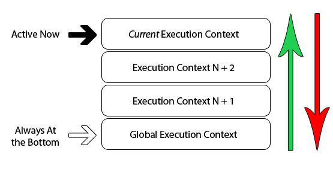
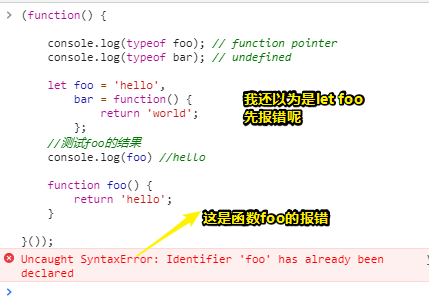
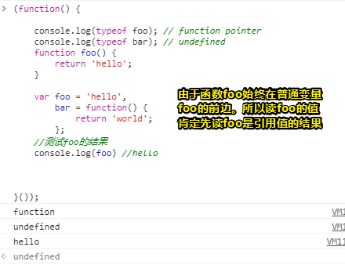
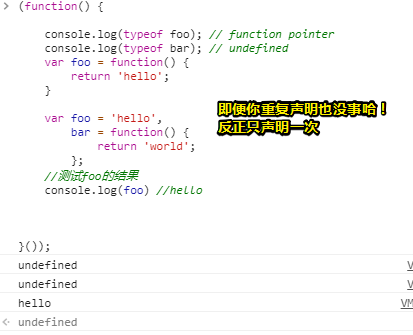
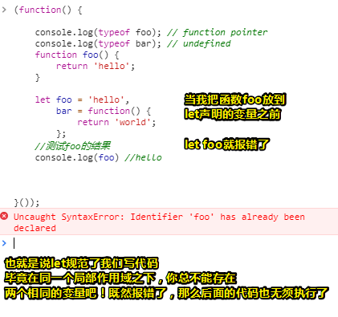

# What is the Execution Context & Stack in JavaScript?

原文：[What is the Execution Context & Stack in JavaScript? by David Shariff](http://davidshariff.com/blog/what-is-the-execution-context-in-javascript/)

在这篇文章中，我将深入研究JavaScript最基本的部分之一——「执行上下文」。本文结束之后，我想你应该对解释器对代码试图做了些什么有了一个更清楚的理解，为什么一些函数/变量可以在声明之前被使用，以及它们的值是如何被真正确定的。

## ★什么是执行上下文呢？

当代码在JavaScript中运行时，执行代码的环境是非常重要的，其中可以评估为有以下这么几种不同情况：

- 全局代码 —— 首次执行代码的默认环境。
- 函数代码 —— 每当执行流程进入函数体时
- Eval代码 —— 要在eval函数内部执行的文本代码。

您可以在网上阅读大量涉及`scope`的资源，对了，为了使本文更容易理解，让我们将术语`execution context`视为当前代码被认定为的环境（environment）/作用域（scope）。现在，说得够多了，让我们先来看一个例子吧，这是一个包含`global`  和`function / local`这样的上下文的代码例子。（注意这是解释器评估代码时所认定具有的上下文）


我们可以看见图中并没有什么特别之处，只是有一个由紫色边框表示的`global context`以及由绿色，蓝色和橙色边框表示的3个不同的`function contexts` 。需要注意的是，只能有一个 `global context`（ 全局上下文），而且我们可以在程序中的任何其它的上下文对这个所谓的全局上下文进行访问哈！

当然，您可以有任意数量的 `function contexts`，并且每个函数调用都会创建一个新的上下文，而这其中将会创建一个私有作用域（private scope），而且在该作用域内，不能从当前函数作用域之外直接访问该函数内部声明的任何内容。（如果想要访问函数内部声明变量，可以使用闭包）

在上面的示例中，函数可以访问在其当前上下文之外声明的变量，但其外部的上下文是无法访问在其里边所声明的变量或者函数的。为什么会这样呢？这段代码到底是如何被JavaScript引擎评估的呢？

## ★执行上下文堆栈

 浏览器中的JavaScript解释器被实现为单线程的。 这实际上意味着在浏览器中同一时间只能做一件事（不能边吃饭边看电视），然后其他动作（actions）或事件（events）在所谓的 `Execution Stack`（ 执行栈）里边排队。 下图是单线程栈的抽象视图：



我们已经知道，当浏览器首次加载脚本时，它默认进入`global execution context`。如果在全局代码中调用一个函数，程序的时序（sequence，涉及时间、空间、顺序……）流将会进入到被调用的函数里边，而且还会创建一个新的`execution context`，并且将该上下文推送（push）到`execution stack`的顶部。

如果在当前函数中调用了另外一个函数，那么则会发生同样的事情。代码的执行流程进入到了函数的内部里边，然后该函数就会创建一个新的`execution context` ，并且该`execution context`还会被推送到现有的栈（stack）的顶部。对于浏览器来说，它将会始终执行位于栈顶部的当前`execution context` ，并且一旦函数完成执行，那么当前的`execution context` ，它将会从栈的顶部弹出（pop），然后将控制权返回给当前堆栈中的下方上下文。下面的示例显示了递归函数和其程序的`execution stack`：

```js
(function foo(i) {
    if (i === 3) {
        return;
    }
    else {
        foo(++i);
    }
}(0));
```


解释一波：

代码只调用自身3次，将i的值递增1。每次调用函数`foo` ，都会创建一个新的执行上下文。一旦上下文完成执行，那么它就会弹被出堆栈并且把控制权返回到它下面的那个上下文，直到再次达到`global context`。

关于`execution stack`有5个关键要点 ：

- 单线程
- 同步执行（等待结果）
- 一个全局上下文
- 无限个函数上下文
- 每个函数调用都会创建一个新的`execution context` ，甚至是对自身的调用

## ★关于执行上下文的那些细节

所以我们现在知道每次调用一个函数时，都会创建一个新的`execution context` 。而且，在JavaScript解释器里边，对`execution context`的每次调用都会有两个阶段：

1. **Creation Stage** [调用函数时，但在执行里边的任何代码之前]：
   - 创建[作用域链](http://davidshariff.com/blog/javascript-scope-chain-and-closures/)（Scope Chain）
   - 创建变量、函数和参数
   - 确定「[this](http://davidshariff.com/blog/javascript-this-keyword/)」的值
2. **Activation / Code Execution Stage**：
   - 分配变量的值和函数的引用，解释/执行代码

你可以把对每个`execution context`在概念上的理解表示为具有3个属性的对象：

```clike
executionContextObj = {
    'scopeChain': { /* variableObject + all parent execution context's variableObject */ },//变量对象+所有父执行上下文的变量对象
    'variableObject': { /* function arguments / parameters, inner variable and function declarations */ },//函数 arguments/参数，内部变量和函数声明
    'this': {}
}
```

###   ◇Activation / Variable Object [AO/VO]

当调用该函数，但在实际函数执行之前的这个时候 ，会创建所谓的`executionContextObj`。这被称为第一阶段，即`Creation Stage`。  在此阶段里边，解释器会通过扫描传递给函数的参数（parameters ）或arguments、以及函数里边的局部函数声明以及局部变量声明来创建`executionContextObj` 。然后就把此扫描出来的结果作为`executionContextObj`的`variableObject`。

> 注意函数默认是有arguments和this这两个家伙的，当然箭头函数是没有的！  

**以下是解释器如何评估或者说是如何看待代码的伪逻辑：**

1. 找到那些用来调用函数的代码

2. 在执行`function`里边的代码之前，先创建个`execution context` 。

3. 进入创建阶段（creation stage）：

   - 初始化[作用域链](http://davidshariff.com/blog/javascript-scope-chain-and-closures/)

   - 创建`variable object` ：

     - 创建`arguments object` ，检查参数（parameters）的上下文，初始化参数名称和值并创建引用副本。
     - 扫描上下文以获取函数声明：
       - 对于找到的每个函数，在`variable object`中创建一个属性，而且该属性是确切的函数名，还有该属性具有指向内存中函数的引用指针。
       - 如果函数名已存在，则将覆盖引用指针值

     - 扫描上下文以获取变量声明：
       - 对于找到的每个变量声明，在`variable object`中创建一个属性，该属性是变量名，并将值初始化为[undefined](http://davidshariff.com/blog/javascripts-undefined-explored/) 。
       - 如果变量名已存在于`variable object`里边 ，就不执行任何操作，然后继续扫描。

   - 确定上下文中"[this](http://davidshariff.com/blog/javascript-this-keyword/)"的值。

4. Activation / Code Execution Stage（激活或者代码执行阶段）:

   - 在当前上下文中运行/解释函数代码，并在代码被逐行（line by line）执行（executed）时分配变量值。

我们来看一个例子     

```js
function foo(i) {
    var a = 'hello';
    var b = function privateB() {

    };
    function c() {

    }
}

foo(22);
```

在调用`foo(22)` ，执行里边的代码前， `creation stage`如下所示：

```clike
fooExecutionContext = {
    scopeChain: { ... },
    variableObject: {
        arguments: {
            0: 22,
            length: 1
        },
        i: 22,
        c: pointer to function c()
        a: undefined,
        b: undefined
    },
    this: { ... }
}
```

 如您所见， `creation stage`处理定义属性的名称，而不是为它们赋值，但arguments对象/parameters（形参）除外。一旦`creation stage`完成后，那么接下来的执行流程就会进入到函数里边了，这样就来到了第二个阶段，即激活/代码`execution stage`，以下是函数执行完毕后的结果：

```clike
fooExecutionContext = {
    scopeChain: { ... },
    variableObject: {
        arguments: {
            0: 22,
            length: 1
        },
        i: 22,
        c: pointer to function c()
        a: 'hello',
        b: pointer to function privateB()
    },
    this: { ... }
}
```

### ◇一个单词——提升（Hoisting）

您可以在网上找到许多关于术语`hoisting`在JavaScript里边是如何定义的资料，如解释变量和函数声明是否会被提升到其函数作用域的顶部（请回答是与不是）。但是，没有人详细解释为什么会发生这种情况，当然，如果你已经掌握了关于解释器是如何创建`activation object`的新知识，那么你会很容易理解为什么。看看下面的示例代码：

```javascript
(function() {

    console.log(typeof foo); // function pointer
    console.log(typeof bar); // undefined

    var foo = 'hello',
        bar = function() {
            return 'world';
        };

    function foo() {
        return 'hello';
    }

}());
```

我们现在可以回答的问题是：

- **为什么我们可以在声明foo之前访问foo？**

  - 如果我们遵循`creation stage` ，我们就知道在`activation / code execution stage`之前就已经创建了变量。因此，当函数流开始执行时，`foo`已经在`activation object`里边被定义了 。

    > 这个`activation object`是在创建阶段里的 `variableObject`吗？因为到了第二阶段所以我们可以称之为激活对象（AO）了吗？

- **Foo被声明两次，为什么foo显示为 `function` 而不是 `undefined` 或 `string` ？**

  - 尽管`foo`被声明了两次，但我们还是可以从`creation stage`里边找到原因所在，在`activation object`里边，那些函数要早于那些变量被创建，并且如果此时在`activation object`里边已经存在属性名了，那么我们只是绕过了声明而已。

  - 因此，首先在`activation object`里边创建对`function foo()`的引用，接着当解释器到达了`var foo` 时，此时我们看到属性名`foo`已经存在了，因此代码什么都不做，接着就是继续啦！

    ```js
    (function() {
    
        console.log(typeof foo); // function pointer
        console.log(typeof bar); // undefined
    
        var foo = 'hello',
            bar = function() {
                return 'world';
            };
        //测试foo的结果
    	console.log(foo) //hello
    
        function foo() {
            return 'hello';
        }
    
    }());
    ```

- **为什么bar是 `undefined` ？**

  - `bar`实际上是一个具有函数赋值的变量，我们知道变量是在`creation stage`创建的，但它们是使用`undefined`值初始化的。

> 如果用了let又会怎样呢？是不是不会提升呢？这样我们只能在第二阶段才能确定还有啥变量以及其值又是什么了呢？同样会声明，但是let存在暂时性死区啊！即用let声明的变量没有初始化
>
> 而所谓的提升指的是变量的耦合，即变量的声明以及初始化的耦合！
>
> 
>
> 所以说，这并咩有什么声明先后顺序之分呢？谁在前就谁先声明咯？假设我把foo函数写在`var foo`前边：
>
> 
>
> 总之，在当前同一个作用域下，如果存在var声明的变量名与使用function声明的变量名，那么前者打不过后者，而且不管你前者顺序是在前还是在后的，如果都是var声明变量的话，那就只声明一次就好了：
>
> 
>
> 假如foo是个数组呢？那么foo的类型就是undefined了呀！看来用function关键字声明的变量是要比var声明的变量叼一点的
>
> 测试函数foo声明在前，let声明在后：
>
> 
>
> 结论：谁先声明是讲究顺序的，这一点可以在上面这幅图中可以看出！但是，关于var和function声明同一个变量，不管它们俩声明的顺序是怎样的，反正function声明的变量就是先声明的，这跟它们在VO里边定义的顺序有关，但是let所声明的变量呢？则是讲究顺序的，它会告诉function声明的变量「要先来后到，不要随意插队」
>
> 其实讲这么多，也没用，因为你不会在同一个作用域之下，声明两个一样的变量名，毕竟这太TM傻逼了吧，那么多名字供你取，非得取个同名同姓的？这一点let就做得很好了……
>
> **➹：**[异步 - 代码烧脑的原因 - xiedaimala](https://ppambler.github.io/xiedaimala/01-JS%E6%B7%B1%E5%85%A5%E6%B5%85%E5%87%BA/03-%E5%BC%82%E6%AD%A5-%E4%BB%A3%E7%A0%81%E7%83%A7%E8%84%91%E7%9A%84%E5%8E%9F%E5%9B%A0.html#let%E5%A3%B0%E6%98%8E%E7%9A%84%E5%8F%98%E9%87%8F%E6%98%AF%E5%90%A6%E4%BC%9A%E6%8F%90%E5%8D%87)
>
> **➹：**[JavaScript variables lifecycle: why let is not hoisted](https://dmitripavlutin.com/variables-lifecycle-and-why-let-is-not-hoisted/)

## ★总结

希望现在的您已经很好地了解了JavaScript解释器是如何评估您的代码的。了解执行上下文和堆栈可以让你了解JavaScript引擎对代码的评估以及代码执行结果与你预期所想的结果不一致的原因

您是否认为了解解释器的内部工作方式对您的JavaScript知识来说是过多的开销还是必需要了解的知识？ 了解执行上下文阶段有助于您编写更好的JavaScript吗？

> 注意无穷的函数嵌套，小心栈溢出哈！

注意：有些人一直在问闭包，回调，延时等问题，我将在[下一篇文章](http://davidshariff.com/blog/javascript-scope-chain-and-closures/)里提到，更多关注域执行上下文有关的[作用域链](http://davidshariff.com/blog/javascript-scope-chain-and-closures/)相关方面。

## ★深入阅读

- [ECMA-262 5th Edition](http://www.ecma-international.org/publications/files/ECMA-ST/ECMA-262.pdf)
- [ECMA-262-3 in detail. Chapter 2. Variable object](http://dmitrysoshnikov.com/ecmascript/chapter-2-variable-object/)
- [Identifier Resolution, Execution Contexts and scope chains](http://jibbering.com/faq/notes/closures/#clIRExSc)

## ★我的总结

- 关于对评估代码的翻译，或许我们对于翻译为分析、猜测或者说是焯水比较感冒……

- 在调用这个函数，但还没有执行代码之前，需要搞一波操作，这步操作做了很多执行代码之前的预备处理，如确定作用域链，确定函数里边的arguments对象的值，确定形参的实参值，确定函数里边还有函数的函数引用值，初始化变量为undefined值，确定this的值

  在代码执行阶段，就带着第一阶段弄出来的这些值搞事情吧！

- 其它翻译：

  **➹：**[了解JavaScript的执行上下文](https://yanhaijing.com/javascript/2014/04/29/what-is-the-execution-context-in-javascript/)

  **➹：**[【译】JS的执行上下文和环境栈是什么？ - 掘金](https://juejin.im/post/5c855410e51d45555e2626fd)


