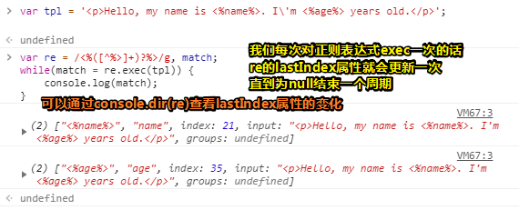

# 只有20行的JS模板引擎

原文：[JavaScript template engine in just 20 lines](http://krasimirtsonev.com/blog/article/Javascript-template-engine-in-just-20-line)

## ★引子

为什么要阅读这篇文章？最近在看一个关于「实现一个MVVM框架」的视频，当我观看到关于对单向绑定的实现时，我就卡住了！具体卡住的点是关于模板实现那部分内容！于是我就搜索了有关模板的内容：

**➹：**[如何实现一个基于 DOM 的模板引擎 - 知乎](https://zhuanlan.zhihu.com/p/28376182)

**➹：**[yanhaijing/template.js: A javascript template engine, simple, easy & extras, support webpack and fis](https://github.com/yanhaijing/template.js)

**➹：**[只有20行Javascript代码！手把手教你写一个页面模板引擎 - 文章 - 伯乐在线](http://blog.jobbole.com/56689/)

秉持着看一手资料原则，所以我就先试着自己翻译一遍原文吧！

---

 我仍然在研究我的基于JavaScript的预处理器——[AbsurdJS](http://krasimirtsonev.com/blog/article/AbsurdJS-fundamentals)（荒谬的JS，建议大概看一下这个链接里边的内容）。它最初是作为CSS预处理器开始的，但是后来它被扩展为了CSS / HTML预处理器。很快，它就能真正允许JavaScript到CSS/HTML的转换了。当然，由于它生成的是HTML，所以你把它充当成模板引擎也是正常的。即，你可以通过某种方式实现用数据填充标记哈！

因此，我想编写一个简单的模板引擎逻辑，而且它与我当前的这个实现AbsurdJS能够很好地配合。 [AbsurdJS](http://krasimirtsonev.com/blog/article/AbsurdJS-fundamentals)主要作为一个NodeJS模块发布，但是它也可以被移植到客户端使用。考虑到这一点，我就知道无法使用现有的一些引擎了，毕竟它们里边的大多数代码都是基于Node这个环境所运行的，因此复制它们到浏览器里边跑起来显然是很无厘头的一件事。我需要一些用纯JavaScript代码编写的小东西。偶然的某一天，我浏览了 [John Resig](http://ejohn.org/)的这篇[博客](http://ejohn.org/blog/javascript-micro-templating/)。文章里边所介绍的内容，看起来就像是我所需要的东西。然后我稍微修改了一下它，让它大概在20行代码左右。我认为这里边的代码逻辑非常有意思。在这篇文章中，我将一步一步地重建这个模板引擎，这样你就可以看到最初来自约翰的奇妙想法。

 这是我们一开始就可以拥有的（**起点**）：

```js
var TemplateEngine = function(tpl, data) {
    // magic here ...
}
var template = '<p>Hello, my name is <%name%>. I\'m <%age%> years old.</p>';
console.log(TemplateEngine(template, {
    name: "Krasimir",
    age: 29
}));
```

一个简单的函数，它接受我们的模板和数据对象。正如您可能猜到的那样，我们最终想要达到的结果是（**终点**）：

```html
<p>Hello, my name is Krasimir. I'm 29 years old.</p>
```

> 以上过程可以理解为输入和输出！之前一直以为动态块是模板，而模板则是View，模板确实可以是View，但动态块则是模板字符串的子串而已！而不是说动态块就是模板啊！就像盲人摸象一样，你不能以偏概全哈！

 我们必须要做的第一件事就是**在模板中获取动态块**（dynamic blocks）。稍后，我们将用传递给该模板引擎的真实数据替换掉它们。我决定使用正则表达式来实现这一点。不过，这不是我的强项，所以请阅读这篇文章的你们随意评论一下，并推荐一个更好的RegExp。

```js
var re = /<%([^%>]+)?%>/g;
```

> 我之前所了解的语法是大胡子语法，即 \{\{xxx}}，而在这里则是 `<%xxx%>`，不过也差不多啦！
>
> 关于这个正则表达式所描述的子串正是 我们所要获取的动态块！
>
> 不过按照我目前对正则的理解， 你得去看看JS的变量命名规范（不过默认是遵循该规则的）！

我们将捕获所有以`<%`开始，以`%>`结束的片段。标志`g` (global)意味着我们不会得到一个匹配项，而是得到所有匹配项。有很多方法可以接受正则表达式。然而，我们需要的是**一个包含字符串的数组**。而[exec](http://www.w3schools.com/jsref/jsref_regexp_exec.asp)正是我们所想要的这么一个方法：

```js
var re = /<%([^%>]+)?%>/g;
var match = re.exec(tpl);
//["<%name%>", "name", index: 21, input: "<p>Hello, my name is <%name%>. I'm <%age%> years old.</p>", groups: undefined]
```

> 第二个元素的来源是圆括号中的分组捕获哈！  可是那个 `<%age%>`呢？

 如果我们`console.log`这个`match`变量，我们将会得到这么一个结果：

```js
[
    "<%name%>",
    " name ", 
    index: 21,
    input: 
    "<p>Hello, my name is <%name%>. I\'m <%age%> years old.</p>"
]
```

可见，我们得到了我们所想要的数据，但是你可以看到返回的数组当中只有一个元素。而我们需要处理所有的匹配项。为此，我们应该将逻辑封装到或者说打包到while循环里边去：

```js
//在一行上声明了多个变量
var re = /<%([^%>]+)?%>/g, match;
while(match = re.exec(tpl)) {
    console.log(match);
}
```



如果你运行了上面的代码，您将看到`<%name%>`和`<%age%>`都显示出来。

现在它变得有趣了。接着我们必须要用传递给这个模板引擎函数的真实数据替换掉占位符。而我们可以使用的最简单的方法是对模板使用`.replace`方法。因此，我们可以这样写：

```javascript
var TemplateEngine = function(tpl, data) {
    var re = /<%([^%>]+)?%>/g, match;
    while(match = re.exec(tpl)) {
        tpl = tpl.replace(match[0], data[match[1]])
    }
    return tpl;
}
```

可见，这运行起来没毛病！不过，这还不够好呀！毕竟，在这里边我们拥有的是一个非常简单的数据对象，并且我们使用`data["property"]`这种姿势也没有什么bug可言。但实际上，我们可能有复杂的嵌套对象。例如，让我们将数据更改为：

```javascript
{
    name: "Krasimir Tsonev",
    profile: { age: 29 }
}
```

可见，这是行不通的，因为当我们输入的动态块`<%profile.age%>`时，我们将得到`["profile.age"]`的数据，而该数据显然是`undefined`的。所以，我们需要别的东西。毕竟，那个`.replace`方法对我们现在这种情况是不起作用的。所以我们最好的办法是将真正的JavaScript代码放在`<%`和`%>`之间。如果可以根据传递的数据对它进行求值的话，那就太好了。例如：

```js
var template = '<p>Hello, my name is <%this.name%>. I\'m <%this.profile.age%> years old.</p>';
```

 可是，这怎么可能呢？约翰使用了`new Function `语法。即使用字符串来创建函数。让我们看一个简单的例子：

```javascript
var fn = new Function("arg", "console.log(arg + 1);");
fn(2); // outputs 3
```

 `fn`是一个真正的函数，它接受一个参数。 它的函数体是 `console.log(arg + 1);` 换句话说，上面的代码等价于：

```javascript
var fn = function(arg) {
    console.log(arg + 1);
}
fn(2); // outputs 3
```

我们能够从简单的字符串里边定义一个函数的参数以及的函数体。而这正是我们所需要的。但是在创建这样一个函数之前，我们需要先构建它的函数体。该方法应该返回的是最终编译好的模板。让我们使用到目前为止一直在使用的字符串，并试着想象它会是什么样子：

```javascript
return 
"<p>Hello, my name is " + 
this.name + 
". I\'m " + 
this.profile.age + 
" years old.</p>";
```

毫无疑问的是，我们将把模板拆分成文本和有意义的JavaScript代码。正如您在上面所看到的那样，我们可以使用一个简单的串联（concatenation ），接着就会生成我们所需要的结果了。然而，这种方法并不能100%符合我们的需求。因为我们迟早要传递有效的JavaScript，所以我们想要做一个循环。例如：

```javascript
var template = 
'My skills:' + 
'<%for(var index in this.skills) {%>' + 
'<a href=""><%this.skills[index]%></a>' +
'<%}%>';
```

 如果我们使用串联，结果将是：

```javascript
return
'My skills:' + 
for(var index in this.skills) { +
'<a href="">' + 
this.skills[index] +
'</a>' +
}
```

 当然，这会产生错误。这就是为什么我决定遵循John文章中所使用到的逻辑。即把所有的字符串都放在一个数组里边，并在最后通过数组所提供的`.join`方法，把这些元素都给串联起来，成为一个字符串！

```javascript
var r = [];
r.push('My skills:'); 
for(var index in this.skills) {
r.push('<a href="">');
r.push(this.skills[index]);
r.push('</a>');
}
return r.join('');
```

下一个逻辑步骤是为自定义生成的函数收集不同的行。我们已经从模板中提取了一些信息。我们知道占位符的内容及其位置。因此，通过使用一个辅助（helper）变量(`cursor`)，我们能够得到我们所期望的结果了

```javascript
var TemplateEngine = function(tpl, data) {
    var re = /<%([^%>]+)?%>/g,
        code = 'var r=[];\n',
        cursor = 0, match;
    var add = function(line) {
        code += 'r.push("' + line.replace(/"/g, '\\"') + '");\n';
    }
    while(match = re.exec(tpl)) {
        add(tpl.slice(cursor, match.index));
        add(match[1]);
        cursor = match.index + match[0].length;
    }
    add(tpl.substr(cursor, tpl.length - cursor));
    code += 'return r.join("");'; // <-- return the result
    console.log(code);
    return tpl;
}
var template = '<p>Hello, my name is <%this.name%>. I\'m <%this.profile.age%> years old.</p>';
console.log(TemplateEngine(template, {
    name: "Krasimir Tsonev",
    profile: { age: 29 }
}));
```

`code`变量保存了函数体。它从数组的定义开始。如前所述，`cursor`显示了我们在模板中的位置。我们需要这样一个变量来遍历整个字符串并跳过数据块。创建一个额外的`add`函数。它的工作是向code变量追加行。这里有个棘手的问题。我们需要转义双引号，否则生成的脚本将会无效。如果我们运行这个例子并查看控制台，我们将看到：

```javascript
var r=[];
r.push("<p>Hello, my name is ");
r.push("this.name");
r.push(". I'm ");
r.push("this.profile.age");
r.push(" years old.</p>");
return r.join("");
```

 嗯...不是我们想要的。 不应引用`this.name`和`this.profile.age`。对add方法稍加改进一下就能解决这个问题了。

```javascript
var add = function(line, js) {
    js? code += 'r.push(' + line + ');\n' :
        code += 'r.push("' + line.replace(/"/g, '\\"') + '");\n';
}
var match;
while(match = re.exec(tpl)) {
    add(tpl.slice(cursor, match.index));
    add(match[1], true); // <-- say that this is actually valid js
    cursor = match.index + match[0].length;
}
```

占位符的内容连同布尔变量一起传递。这就生成了正确的函数体了。

```js
var r=[];
r.push("<p>Hello, my name is ");
r.push(this.name);
r.push(". I'm ");
r.push(this.profile.age);
r.push(" years old.</p>");
return r.join("");
```

接着，我们只需要创建函数并执行它。注意在模板引擎的末尾，我们可不是返回`tpl`：

```javascript
return new Function(code.replace(/[\r\t\n]/g, '')).apply(data);
```

我们甚至不需要向函数发送任何参数。我们使用`apply`方法来调用它。它会自动设置作用域。这就是为什么`this.name`起作用了。毕竟`this`实际上指向的是我们的`data`。

 我们差不多完成了。 最后一件事。 我们需要支持更复杂的操作，比如`if/else`语句和循环。 让我们从上面获得相同的示例，并尝试到目前为止的代码。

```javascript
var template = 
'My skills:' + 
'<%for(var index in this.skills) {%>' + 
'<a href="#"><%this.skills[index]%></a>' +
'<%}%>';
console.log(TemplateEngine(template, {
    skills: ["js", "html", "css"]
}));
```

结果是一个错误`Uncaught SyntaxError: Unexpected token for`。 如果我们调试一下并打印出`code`变量，我们就会看到问题所在。

```javascript
var r=[];
r.push("My skills:");
r.push(for(var index in this.skills) {);
r.push("<a href=\"\">");
r.push(this.skills[index]);
r.push("</a>");
r.push(});
r.push("");
return r.join("");
```

 不应将包含`for`循环的行推送到数组里边去。它应该放在脚本里边。为了实现这一点，我们必须在给`code`附加东西之前再做一次检查。

```javascript
var re = /<%([^%>]+)?%>/g,
    reExp = /(^( )?(if|for|else|switch|case|break|{|}))(.*)?/g,
    code = 'var r=[];\n',
    cursor = 0;
var add = function(line, js) {
    js? code += line.match(reExp) ? line + '\n' : 'r.push(' + line + ');\n' :
        code += 'r.push("' + line.replace(/"/g, '\\"') + '");\n';
}
```

添加了一个新的正则表达式。它告诉我们javascript代码是否以` if, for, else, switch, case, break, { or }`开头。如果是，那么它只要简单地添加这行即可。否则，它会将其包装在一个push语句中。结果是:

```javascript
var r=[];
r.push("My skills:");
for(var index in this.skills) {
r.push("<a href=\"#\">");
r.push(this.skills[index]);
r.push("</a>");
}
r.push("");
return r.join("");
```

 当然，所有的东西都被正确地编译了。

```html
My skills:<a href="#">js</a><a href="#">html</a><a href="#">css</a>
```

 实际上，最新的修复给了我们很大的力量。我们可以将复杂的逻辑直接应用到模板中。例如:

```js
var template = 
'My skills:' + 
'<%if(this.showSkills) {%>' +
    '<%for(var index in this.skills) {%>' + 
    '<a href="#"><%this.skills[index]%></a>' +
    '<%}%>' +
'<%} else %>';
console.log(TemplateEngine(template, {
    skills: ["js", "html", "css"],
    showSkills: true
}));
```

 为了改进这一点，我添加了一些小的优化，[最终版本](https://github.com/krasimir/absurd/blob/master/lib/processors/html/helpers/TemplateEngine.js)看起来像这样：

```javascript
var TemplateEngine = function(html, options) {
    var re = /<%([^%>]+)?%>/g, reExp = /(^( )?(if|for|else|switch|case|break|{|}))(.*)?/g, code = 'var r=[];\n', cursor = 0, match;
    var add = function(line, js) {
        js? (code += line.match(reExp) ? line + '\n' : 'r.push(' + line + ');\n') :
            (code += line != '' ? 'r.push("' + line.replace(/"/g, '\\"') + '");\n' : '');
        return add;
    }
    while(match = re.exec(html)) {
        add(html.slice(cursor, match.index))(match[1], true);
        cursor = match.index + match[0].length;
    }
    add(html.substr(cursor, html.length - cursor));
    code += 'return r.join("");';
    return new Function(code.replace(/[\r\t\n]/g, '')).apply(options);
}
```

这比之前预测的20行要少， 这看起15行……


---

## ★总结

- 可以去看看JavaScript忍者揭秘这本书，听说第一版徐涛翻译的有毒，不过豆瓣评分有8.7啊！当然，就目前而言，已经出了[第二版](https://book.douban.com/subject/30143702/)的，是18年出的中文版，这次翻译则是个前端小组翻译的！

  **➹：**[《JavaScript 忍者秘籍》里关于原型的介绍出错了吗？ - 知乎](https://www.zhihu.com/question/45545910)


  


​    