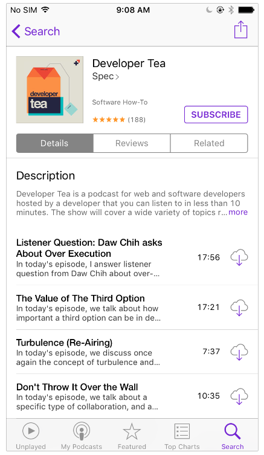
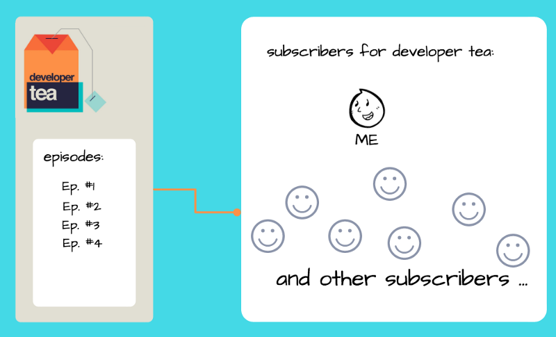
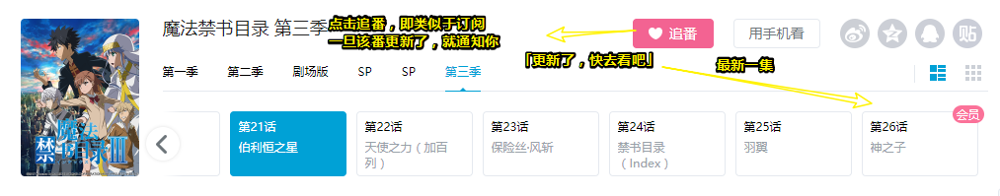
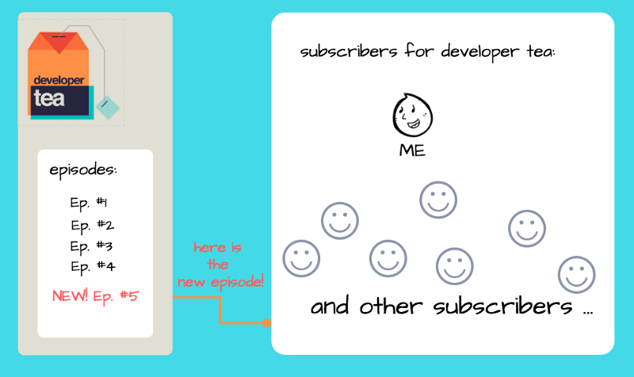
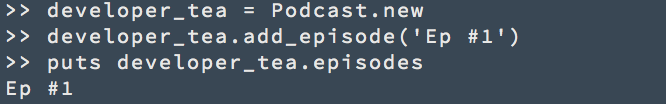
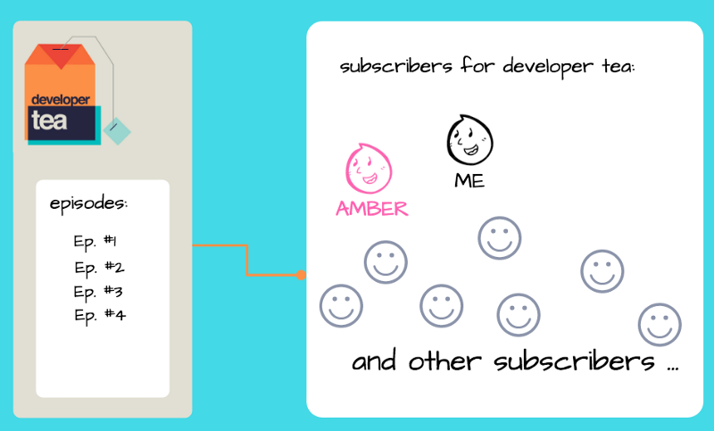
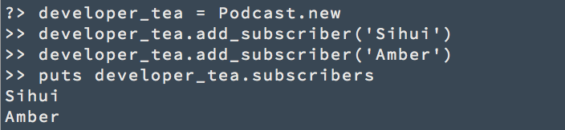
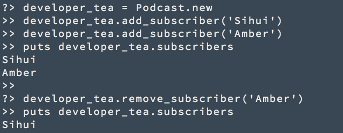

# The Observer Design Pattern is kind of like a podcast


## ★引子

在实现一个简单的mvvm框架的过程中，我发觉对观察者设计模式很不感冒啊！为了让自己对它感冒，于是，我就搜索到了这篇文章：

**➹：**[The Observer Design Pattern is kind of like a podcast](https://medium.freecodecamp.org/the-observer-design-pattern-is-kind-of-like-a-podcast-cdee5ef9f074)

其它参考资料：

**➹：**[从vue源码看观察者模式 - 知乎](https://zhuanlan.zhihu.com/p/33373207)

**➹：**[Observer vs Pub-Sub pattern – Hacker Noon](https://hackernoon.com/observer-vs-pub-sub-pattern-50d3b27f838c)

---

如果您收听[播客](https://baike.baidu.com/item/%E6%92%AD%E5%AE%A2)（podcast），那么，其实您已经熟悉了观察者模式。 因为，这事实上，你就是一个“观察者”呀！

下面是观察者模式的定义：

> 观察者模式定义了对象之间的一对多依赖关系，这样当一个对象改变状态时，那么它的所有依赖关系都会被通知并自动更新。

## ★让我们看一下与播客相关的定义

我发现了一个有趣的播客，它叫做`developer tea`。



点击`SUBSCRIBE` （订阅）按钮后，那么我现在就在它们的订阅列表里边了。



> 左边的episodes：表示有4段音频！
>
> 右边表示的是，除了你这个订阅者以外还有其它的订阅者！

 当`developer tea` 发布新的一集时，该应用程序就会通知我和其他订阅者们。接着，app就为我们下载了最新的一集了！

> 每个观察者都会注册，登录这个应用（整个淡蓝色背景）对吧！然后再这个应用里边搜索到了一个叫`developer tea`的podcast，然后我们就订阅了它！一旦它有更新了，那么通知我们说「最新一集有了，快去下载收听吧！」
>
> 其实这个过程类似于在bilibili里边的追番：
>
> 
>
> 这样就不用每次去轮询了！如「每隔1个小时，就去看看更新了没」，同理看小说也是如此！



所以，这就是观察者模式的定义：

> 观察者模式定义了对象之间的一对多依赖关系，这样当一个对象改变状态时，它的所有依赖关系都会被通知并自动更新。

可见：

- `developer tea`podcast和 `subscribers` 之间存在**一对多**的关系。
- 当`developer tea`改变状态时，例如**发布新的一集**，那么订阅了`developer tea`的所有`subscribers`们都会得到通知并进行更新。

## ★让我们用Ruby实现它

> 虽然我没有学习过关于Ruby的语法，但大致了解这个设计模式的实现应该是不成问题的！我有一种学习姿势是这样子的，当你不能理解这种语言语法写的代码，那么就换一种语言去理解这段代码！如：
>
> **➹：**[有哪些英语用一个单词就能表达清楚但是用中文表达却很难表达的例子？ - 知乎](https://www.zhihu.com/question/22454692)

**从一个简单的版本开始**。

```ruby
class Podcast
  attr_reader :episodes
  
  def initialize()
    @episodes = []
  end
  
  def add_episode(new_episode)
    episodes << new_episode
  end
end
```

> 强制理解一波：
>
> 搞了一个叫`Podcast`的类，搞了一个字段 `episodes` （用于存储播客所发布的一段段音频）和两个方法（初始化`attr_reader`的数据结构为一个数组，向数组里边追加新发布的音频）
>
> 可见这段简单版本的代码，没有和任何对象产生依赖哈！

`Podcast`类拥有一个episodes （剧集）列表，并有一个方法`add_episode`将剧集添加到列表里边去。

然后我们可以创建`developer tea`播客，并将第1集添加到episodes 列表里边，就像下边这样：



> 突然觉得Ruby的语法似乎很符合人类的思维，比如说 `Podcast.new`，我可以理解为**水果生了一个苹果**、**女人生了一个孩子**……

每当有新的一集发布时，我都想要得到一个通知。

我们可以在列表中添加新的一集后就更新我（sihui，作者名字）：

```ruby
class Podcast
  attr_reader :episodes
  
  def initialize()
    @episodes = []
  end
  
  def add_episode(new_episode, sihui)
    episodes << new_episode
    sihui.update(self)
  end
end
```

 每当我从`developer_tea`获得更新时，我都可以继续下载最新的一集。

> 在添加剧集的时候，顺便更新一下我呗！

我非常喜欢听 `developer_tea`，所以我把它推荐给我的朋友Amber。现在，Amber也想订阅它。



我们需要确保Amber在新一集发布时也能收到通知（notification）：

```ruby
class Podcast
  attr_reader :episodes
  
  def initialize()
    @episodes = []
  end
  
  def add_episode(new_episode, sihui, amber)
    episodes << new_episode
    sihui.update(self)
    amber.update(self)
  end
end
```

>   假如Amber也推荐了这个`developer_tea`给其它人，那么我们是不是又得继续添加一个人呢？假如有10个人，100个人，1000个人，那岂不是GG了？

嗯，这段代码做了我们想要的。

但有一个问题。

每次我们想要添加一个订阅者，我们都必须要重新定义这个Podcast类。

有没有办法可以**在不重新定义类的情况下**更新（update ）这个订阅者列表（ subscriber list）呢？🤔🤔🤔

## ★💡💡我们可以保留一个订阅者列表！💡💡

```ruby
class Podcast
  attr_reader :episodes, :subscribers
  
  def initialize()
    @episodes = []
    @subscribers = []
  end
  
  def add_subscriber(new_subscriber)
    subscribers << new_subscriber
  end
  
  def remove_subscriber(party_pooper)
    subscribers.delete(party_pooper)
  end
  
  def add_episode(new_episode)
    episodes << new_episode
    subscribers.each do |subscriber|
      subscriber.update(self)
    end
  end
end
```

> 这次在更新最新一集的时候，顺便去遍历订阅者列表，然后让每一个订阅者去做更新自己的事儿！

新的`Podcast`类在两种新方法的帮助下保存了订阅列表：一种用于添加订阅者，另一种用于删除订阅者。当新的一集发布时，我们会更新每个订阅者。



不幸的是，Amber不像我那么喜欢这个播客，所以她决定退订。我们使用`remove_subscriber`方法将她从订阅者列表中删除。



**🎉🎉哇！你刚刚学会了观察者模式！🎉🎉**

## ★ 观察者模式背后的设计原则（Design Principle ）

观察者模式利用了松耦合设计原则（Loose Coupling design principle）：

> *Strive for loosely coupled designs between objects that interact.*

**努力实现交互对象之间的松散耦合设计。**

`Podcast`类 不太了解它的订阅者。它只知道每个订阅者都有一个更新（`update`）方法。 

这种松耦合将Podcast 与其订阅者之间的依赖性降到最低，而且它还最大限度地提高了灵活性。只要它有一个更新方法，那么订阅者可以是任何东西：一个人、一群人、一只动物，甚至一辆汽车。

**小贴士（Takeaways）：**

1. 观察者模式定义了对象之间的一对多（one-to-many）依赖关系，这样当一个对象改变状态时，它的所有依赖关系都会被通知并自动更新。

   > 订阅者列表就是反映了Podcast实例的状态！一旦我们添加了新的一集，那么所有订阅该播客的订阅者们，就会被通知，然后自动更新！

2.  松耦合设计原则：在相互作用的物体（对象）之间努力寻求松耦合设计。

 谢谢你的阅读。你能想到观察者模式的其他现实生活中的例子吗？🙃

关于最后的结尾：

作者提到每周都会往这个 [sihui.io](http://www.sihui.io/)网站里边发布（publish）一篇关于设计模式文章

所以，如果您订阅（Subscribe）了作者这一系列关于设计模式的文章，那么您将不会错过该系列的下一篇文章

作者其它的关于设计模式的系列文章：

**➹：**[Object-Oriented Design Patterns in Life - Sihui Huang](https://www.sihui.io/design-patterns/)


## ★总结

- 通过将**面向对象设计模式**与现实生活中的例子联系起来，我们将会获得对它们的直观理解

  > 难怪之前在实现一个简单的MVVM框架里边，一直需要定义一个class！原来这是面向对象设计模式呀！

- 实现一个功能，请记住「**先搞个最简单的版本，然后再不断地添加营养，让它茁壮地成长！直到可以独树一帜**」

## ★Q&A

### ①设计模式原则？

**➹：**[Java设计模式七大原则 - 个人文章 - SegmentFault 思否](https://segmentfault.com/a/1190000013099635)

**➹：**[设计模式六大原则 - 简书](https://www.jianshu.com/p/285dbd8cbd2a)

### ②其它现实生活中的例子？

- A：是共产党派往国民党密探，代号 001（发布者）
- B：是共产党的通信人员，负责与 A 进行秘密交接（订阅者）

1. A 日常工作就是在明面采集国民党的一些情报
2. B 则负责暗中观察着 A
3. 一旦 A 传递出一些有关国民党的消息（更多时候需要对消息进行封装传递，后面根据源码具体分析）
4. B 会立马订阅到该消息，然后做一些相对应的变更，比如说通知共产党们做一些事情应对国民党的一些动作。

### ④很多复杂问题的解决都是通过增加中间层来实现的？

这似乎让我想到了与观察者模式有点不一样的真正的发布订阅模式！因为真正的发布订阅模式涉及到中间层或者说是event hub！


这样，这两个对象就真得完全不知道对方的存在了！

**➹：**[松耦合(Loose coupling)笔记 - Paul's Notes - CSDN博客](https://blog.csdn.net/pan_tian/article/details/11527179)

