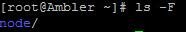
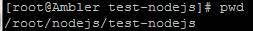
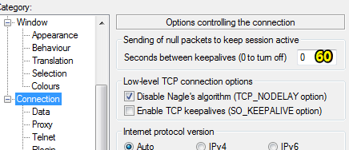
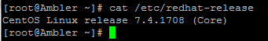
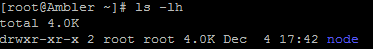
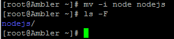
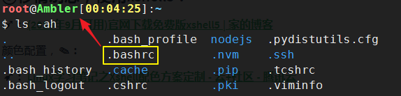
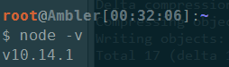

# 部署Node.js项目（CentOS）

## ★资料

**➹：**[部署Node.js项目（CentOS）-建站教程-云服务器 ECS-阿里云](https://help.aliyun.com/document_detail/50775.html?spm=a2c4g.11186623.6.871.61c47aeeVfFWsC)

## ★我做了什么

1. 安装用于连接 Linux 实例的工具，如 [PuTTY](https://www.chiark.greenend.org.uk/~sgtatham/putty/)

2. 使用NVM安装多版本

   **➹：**[使用 nvm 管理不同版本的 node 与 npm - bubkoo](http://bubkoo.com/2017/01/08/quick-tip-multiple-versions-node-nvm/)

3. 安装的nodejs版本是[最新推荐版](https://nodejs.org/en/)的，10.14.1 LTS

4. 在root目录下创建了一个node目录

   

5. 安装vim

   ```bash
   yum install vim
   ```

6. 部署测试项目example.js

   

   在这个目录下创建example.js

   内容为，**✎：**

   ```js
   const http = require('http');
   const hostname = '0.0.0.0';
   const port = 3000;
   const server = http.createServer((req, res) => {
   res.statusCode = 200;
   res.setHeader('Content-Type', 'text/plain');
   res.end('Hello World\n');
   });
   server.listen(port, hostname, () => {
   console.log(`Server running at http://${hostname}:${port}/`);
   });
   ```

7. 当我使用node命令运行这个example.js，发现找不到node这个命令，当我运行了这个 `nvm use v10.14.1`就好了！

8. 添加安全组规则，**✎：**

   

9. 测试

   `http://实例公网IP地址:端口号`

   

   可以直接访问 `http://ppambler.cn:3000/`

## ★我学到了什么

1. 安装git，即安装软件，**✎：**

   ```bash
   yum install git
   ```

   在安装过程中出现了这个 `is this ok [y/d/n]`

   额，按照以往经验，y是yes，n是no。可d是什么鬼？

   我搜索了一下，它是 `d = download only` (只下载不安装)

   显然，我是需要下载和安装的，所以直接type一个 `y`，回车就好了！

2. vim：`i`进入编辑模式、`esc`退出编辑、`:wq`回车保存文件内容并退出

3. 查看端口占用情况：`netstat -tpln`，我使用这个 `node ~/example.js &`让项目在后台运行，然后我再node一下执行这个项目，结果报错了

4. 需要在安全组中 [添加安全组规则](http://help.aliyun.com/document_detail/25471.html?spm=a2c4g.11186623.2.16.74115ea5QEoZTx) 放行端口（如本示例中为TCP 3000端口）

5. 重新回顾了域名解析


## ★Q&A

### ①linux命令和unix命令区别？

>   Linux是从Unix发展来的，因此，两个系统中很多命令都是通用的。
>
> 但是因为不同系统的发展各不相同，尤其是[Linux系统](https://www.baidu.com/s?wd=Linux%E7%B3%BB%E7%BB%9F&tn=SE_PcZhidaonwhc_ngpagmjz&rsv_dl=gh_pc_zhidao)有很多版本，而不同版本本身又有各不相同的特色，或者说，每个[linux版本](https://www.baidu.com/s?wd=linux%E7%89%88%E6%9C%AC&tn=SE_PcZhidaonwhc_ngpagmjz&rsv_dl=gh_pc_zhidao)都有比其他版本强的地方，也有比其他版本弱的地方，所以，他们的发展方向也各不相同。
>
> 基于这个原因，不同版本的linux/unix，有些命令是不相同的。
>
> 举个例子：
> 在CentOS Linux中，我们用yum来管理软件包。
> 而在openSUSE Linux中，我们则使用YaST来管理。
>
> 还有很多很多细节命令上的不同，但是，整体来说，他们的工作原理都是相似的，他们的基础命令都是相同的。
>
> 因此，很多Linux的学习书记，并不会很对哪一个版本的Linux，因为，基础都是通用的。  

大同小异

**➹：**[所有的linux和unix的命令行下的命令都一样吗_百度知道](https://zhidao.baidu.com/question/81716511.html?qbl=relate_question_1)


### ②putty（inactive）了？



**➹：**[PuTTY连接Linux服务器经常断线解决方案 - 王艺强的博客 - CSDN博客](https://blog.csdn.net/wyqwclsn/article/details/41014797)

### ③Linux查看安装的系统版本？

```bash
cat /etc/redhat-release
```



➹：**[Linux查看安装的系统版本 - 用时间去蜕变 - CSDN博客](https://blog.csdn.net/u011669700/article/details/79443134)

### ④话说，如何修改putty的主题？

**➹：**[求PuTTY高大上配色方案！ - V2EX](https://www.v2ex.com/t/95733)

**➹：**[chriskempson/tomorrow-theme: Tomorrow Theme the precursor to Base16 Theme](https://github.com/chriskempson/tomorrow-theme)

**➹：**[Solarized](https://ethanschoonover.com/solarized/)

### ⑤drwxr-xr-x是什么鬼？



> 第1位表示文件类型。d是目录文件，l是链接文件，-是普通文件，p是管道
> 第2-4位表示这个文件的属主拥有的权限，r是读，w是写，x是执行。
> 第5-7位表示和这个文件属主所在同一个组的用户所具有的权限。
> 第8-10位表示其他用户所具有的权限。
>
> 如：
> `drwxr-xr-x   user1  group1       filename`
>
> 表示filename是个目录，user1拥有读写执行的权限，和user1所在同一个group1组里的用户拥有只读和执行权限，剩下其他用户拥有只读和执行权限。  

**➹：**[linux下文件属性drwxr-xr-x各是什么意思-Linux-51CTO博客](http://blog.51cto.com/wukang/686204)

这也就是说我所创建的node是个 「目录」、「可读可写可执行」、……

话说目录是如何可执行的？「可执行」为何意啊？

> 文件或目录的访问权限分为只读，只写和可执行三种。以文件为例，只读权限表示只允许读其内容，而禁止对其做任何的更改操作。**可执行权限表示允许将该文件作为一个程序执行**。文件被创建时，文件所有者自动拥有对该文件的读、写和可执行权限，以便于对文件的阅读和修改。用户也可根据需要把访问权限设置为需要的任何组合。

**➹：**[每天一个linux命令（27）：linux chmod命令 - peida - 博客园](http://www.cnblogs.com/peida/archive/2012/11/29/2794010.html)

### ⑥我要修改node这个目录的名字？

我要改node名字为nodejs



### ⑦能否多个域名映射一个ip？

我在namesilo注册的域名，还咩有域名解析成功……

我之前在腾讯云也买了一个域名，既然在namesilo注册的域名还不能解析成功，那么就用原来在腾讯注册的这个域名吧！就配置了2个A记录，**✎：**


大概过几分钟后，就能看到效果了！

**➹：**https://console.cloud.tencent.com/domain

**➹：**[多个域名解析到一个 IP-网站解析-产品使用问题-常见问题-云解析-阿里云](https://help.aliyun.com/knowledge_detail/39806.html)

### ⑧linux系统 图形化桌面？

**➹：**[云服务器 ECS Linux 系统如何安装图形化桌面 - 阿里云](https://bbs.aliyun.com/simple/t542317.html)

我想了想，如果直接线上开发的话，那么测试起来是很不方便，还不如在本地做好，再post到云服务器上！

### ⑨移情别恋，使用xshell5？

**➹：**[(2018年9月可用)官网下载免费版xshell5 | 家的博客](https://anjia0532.github.io/2018/09/14/xshell5/)

颜色配置，**✎：**

**➹：**[Linux学习笔记之Xshell配色方案定制 - 云+社区 - 腾讯云](https://cloud.tencent.com/developer/article/1173234)

**➹：**[hellojukay/xshell-themes: 一系列xshell主题](https://github.com/hellojukay/xshell-themes)

为了让路径有颜色所以需要往root目录下的 `.bashrc`中追加，**✎：**

```
export PS1="\[\033[01;31m\]\u\[\033[00m\]@\[\033[01;32m\]\h\[\033[00m\][\[\033[01;33m\]\t\[\033[00m\]]:\[\033[01;34m\]\w\[\033[00m\]\n$ "
```



**➹：**[修改Linux终端命令提示符颜色、PS1 - 心之所向，不负初衷 - CSDN博客](https://blog.csdn.net/zhangym199312/article/details/77600375)

**➹：**[Linux修改Shell命令提示符及颜色 - 简书](https://www.jianshu.com/p/426d0eeee671)

似乎，还有更好的选择，**✎：**

**➹：**[SSH客户端神器MobaXterm，是时候放弃putty、Xshell和CRT了 - 知乎](https://zhuanlan.zhihu.com/p/34455520)

**➹：**[MobaXterm free Xserver and tabbed SSH client for Windows](https://mobaxterm.mobatek.net/)

### ⑩nvm 与 每次重新登录？

我用了nvm的方式装了node，然而每次登录进来node命令就失效了！

要想激活，就得使用这个，**✎：**

```bash
nvm use v10.14.1
```

如何默认就是使用这个呢？

很简单，直接，**✎：**

```basg
nvm alias default v10.14.1 // 使用 v10.14.1 作为预设使用的 node 版本
```

不过，在此之前似乎需要配置一下，`~/.bashrc`才行，**✎：**

```bash
export NVM_DIR="$HOME/.nvm"
[ -s "$NVM_DIR/nvm.sh" ] && . "$NVM_DIR/nvm.sh" # This loads nvm
```



**➹：**[linux下安装nvm - 简书](https://www.jianshu.com/p/6249d1d24914)

