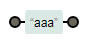

# regex入门

## ★regex是什么？

> **正则表达式是一种描述性的语言, 用来概括一类字符串 (或者说一个字符串集合)**

我们常说的，**✎：**

1. 含有hello的字符串
2. 010开头的电话号码
3. ip地址、邮箱地址……

这些我们叫用自然语言来描述一类字符串！

### ◇实际应用中的需求

1. 查找：提取一篇邮件中所有的 email 地址
2. 替换：把提取到的某类电话号码, 升个位, 加个区号什么的

怎么做？——开启血轮眼模式，肉眼搜索，手动操作！

然而这样做重复且单调，不需要太多的智力，真是无聊至极！

我需要一个工具可以办我弄！——计算机是最好的工具……

那么问题来了，我可以直接对计算机说「哥！帮我查找、替换一下！」

计算机此刻一脸懵逼，就像是这样，**✎：**


我想它此刻的内心独白是「说的是什么东东玩意儿？完全听不懂！」

所以，我们怎么样能够告诉计算机, 我们对哪类字符串感兴趣呢? ——正则表达式

### ◇重新认识下regex是什么？

> 计算机科学家帮我们设计了一种让人能够简单的写出来, 表达我们人类想表达的含义, 而计算机又恰好能够很容易的理解和处理的一种表达式, 这就是正则表达式了

也就说，它是一种对大家都有好处的描述性语言咯！

换个角度来看，**✎：**

> 从人和计算机的角度说, 正则表达式是一种人和计算机都能轻松处理的约定, 用来描述一类具有某个性质的字符串

我对这里的「性质」的理解是，含有哪些字符的字符串！

## ★regex的双面人生

> 正则表达式它既有倾向于人的思考方式的一面, 也有倾向于计算机工作原理 (有限自动机) 的一面。

所以，在传统意义上, 如果想真正理解正则表达式, 就要从理解计算机原理入手。

### ◇一个好消息，一个坏消息

所幸的是, 我们普通用户, 在日常使用中, 并不需要了解计算机的原理, 因为这么多年技术的发展给了正则表达式很多新特性, 让**正则表达式越来越脱离计算机的局限**, 变得更加适合复杂的任务, 但这样的代价是**正则表达式的细节越来越繁杂了**, 对于初学者来说更加难学了。

所以后续内容是**先讲本质，后谈细节**

## ★本质

### ◇三句话，讲述最基本的正则表达式

1. **一个字符串是一个正则表达式**, 比如 `aaa`, 就是一个正则表达式, 它**描述了一个字符串集合**, 这个字符串集合里面只有 `aaa` 这一个元素

   `{aaa}`？

   

2. **两个正则表达式可以直接串起来**, 比如 `aaabbb`， 其实, 是由六个正则表达式 `a a a b b b` 接起来组成的. 我们先**笼统的说, 接起来就等于把描述的内容接起来**

   

3. `|` 两个字符串，比如 `aaa` 和 `bbb`, 用 `|` 连起来, 变成了 `aaa|bbb`, 也构成一个正则表达式，它描述的字符串集合是原来分别的并集。比如 `aaa|bbb` 描述了一个集合, 这个集合里面有 `{aaa, bbb}` 两个字符串

   

就这两三句话，就可以解释**正则表达式最基本的思维方式了: 用一个表达式, 去描述一类字符串 (或者说, 一个集合**).

### ◇ `*`的出现

之前说到，要么直接串起两个字符串，要么就只用 `|`连起两个字符串，而这样做就只是描述几个字符串而已，经此而已，说到好听点就是 **有限的集合**，不好听点就是**守着一亩三分地**。

那么如何才能描述无限的集合呢？就像是我们想描述的整数啊、域名啊、邮箱地址啊等等这些各有各的花哨的字符串……

为此，**我们有必要引入一个新的记号, 能够描述无限的集合**

这个记号长啥样呢？

一个正则表达式 `X` 可以加上一个 `*`, 用来描述任意多个原来 `X` 描述的字符串拼起来的字符串


怎么？不理解？——好吧！举例子好了，**✎：**

 `a*` 这个正则表达式, 我们知道 `a` 描述了一类字符, 这类字符里面只有一个 `a`, 所以, `a*` 描述了0个或者多个 `a`


为原先的 `a|b`加点料，**✎：**

`a|b*` , 按照定义, 这个正则表达式描述了 `a` 和 `b, bb, bbb` 等，就像是这样的`{a,b,bb,bbb,bbb……}`字符集……


**怎么看这个铁轨图呢？——一个 `|`多了条路，一个 `*`？总之这样就表示它有0个或多个  **

### ◇引入一个 `()`

.如果我们引入一个括号, 写成 `(a|b)*` , 那么 `a|b` 就变成一个整体, 描述了 a 或者 b, 这时候, `(a|b)*` 就是一切只由 a, b 组成的字符串

这个`()`括号的作用？

这里的括号, 是**为了避免歧义**, 表示 `*` 是作用在 a|b 整体上的。这时候, `(a|b)` 描述了 a 和 b, 整体加了一个 \*, 意味者我们**可以任意选 a 或者 b 一个接一个拼起来**。所以, aba, aab 都是在 `(a|b)*` 的那一类里面的。需要注意的是， `*` 可以匹配 0 个, 就是说, **这里面包含了什么都没有**. 比如说 `ab*c` 也描述了 ac, 因为中间可以有 0 个 b。


 如果你想至少要一个 b, 可以写成 `abb*c`


如何去看这个 `(a|b)*`?

我能这样`a*|b*`看吗？，**✎：**将 JS 正则可视化的工具：[https://regexper.com/](https://link.zhihu.com/?target=https%3A//regexper.com/)

- `a*|b*`，**✎：**

  

- `a* | b*`，**✎：**这个是有空格的

  

- `(a|b)*`，**✎：**

  

哥，这铁轨图怎么看？，先从简单的来，**✎：**

1.  `(a)`，**✎：**

   

我想是 `()`的意思是 划分一组看作是一个整体的吧，即可以出现0个咯

### ◇更近一步理解

来看一个「复杂」的例子—— `o(n|ff)`，**✎：**


我们知道, `n|ff` 描述了 n 或者 ff. 当我们直接把 o 接在前面的时候, 描述的是 on 或者 off. 就是说, 接起来的时候, 要把 o 和后面每种情况都组合一次.


 我们再看 `(a|o)(n|ff)`. 前面描述的是 a 或者 o, 后面描述的是 n 或者 ff, 接起来, 描述了 an, aff, on, off


**这个可视化工具真是帮大忙了！非常感谢:baby_chick:**

我们都知道, **正则表达式描述的是一类字符串**, 所以, X 和 Y 在接起来变成 XY 以后, 自然的变成了描述 每一种 X 里面的字符串和 Y 里面字符串接起来的情况.。

同样, `*` 好像把 X 和自己接起来多次一样 (可以是任意次), **每次只要接起来的是 X 里面的字符串, 就一定被 X* 所表述**。

熟悉集合的朋友立即知道 **正则表达式是用一个表达式代表了一个集合**，**✎：**

`X|Y` 等价于两个集合的[并集](https://zh.wikipedia.org/wiki/%E5%B9%B6%E9%9B%86), 而 `XY` 拼起来等价于它们所有的元素 x, y 拼起来的集合

 并集，**✎：**

> 集合和的并集是

**➹：**[集合与简易逻辑 - Wikiversity](https://beta.wikiversity.org/wiki/%E9%9B%86%E5%90%88%E4%B8%8E%E7%AE%80%E6%98%93%E9%80%BB%E8%BE%91)

ps：并集有或者之意，用 `|`，而交集则是且，用 `&`

### ◇一句让你很高兴的话

**恭喜你, 你已经学会正则表达式了。真的, 你已经全部学会了正则表达式的知识。**

也就是前面的知识咯！

回顾一下正则表达式的要点，**✎：**

1. 正则表达式由普通的字符, 以及几个特殊的字符, 即 括号 (), 或者 | 和 星号 * 组成。用来描述一类字符
2. `|` 表示或者，如果有两个正则表达式 X 和 Y, 那么 `X | Y` 就描述了原来 X 描述的和 Y 描述的
3. 正则表达式可以接起来, 变成一个更长的, 描述了一个各个部分被那些被接起来的正则表达式描述的字符串
4. `()` 是为了避免歧义

这上面说的四个东东, 就是 100% 如假包换的正则表达式了. 以后的, 都是为了更加方便的使用正则表达式, 而又引入的一些扩展. **恰恰是这些扩展, 让初学者陷入了细节的泥潭**

## ★之后学习什么

接下来，你得**一个一个的来**对付诸如 `+、[、 -、]、 ^、 $、 {m}` 等这些**非基本的高级的功能**. 需要强调的是, 这些高级的功能, 其实都**只是为了人书写方便, 而且是完全可以用我们上面所说的最基本的几个规则代替的**

## ★练习

写出匹配以下性质字符串的正则表达式，**✎：**

1. 字符串 2009
2. 周曙光同学有两个名字, 分别叫做 zola 和 zuola, 人们常常混淆. 请帮周曙光同学设计一个正则表达式, 可以帮他匹配自己的名字
3. 二进制数字 (最少有一位, 但只含有 0 或者 1 的)
4. 非零的十进制数字 (有至少一位数字, 但是不能以 0 开头)

练习文件，**✎：**

```tex
0108200920088964

zuola -d

zooooola

world hello -012012 2009

0909 zola zhou

0101001

zuola
```

我直接用Sublime Text搞事情好了

答案，**✎：**

1. `2009`，**✎：**

   

2. `z(|u)ola`，**✎：**

   

   或者这样 `zuola|zola`，**✎：**

   

3. `(0|1)(0|1)*`，**✎：**

   

   如果这样 `0|1(0|1)*` 呢，**✎：**

   

   出现干扰了，第一个 `|`就岔开了

4. `(1|2|3|4|5|6|7|8|9)(0|1|2|3|4|5|6|7|8|9)*`，**✎：**

   

   下载下来的资料的参考答案中有空格，于是就这样，**✎：**

   ```js
   '(1 | 2 | 3 | 4 | 5 | 6 | 7 | 8 | 9)(0 | 1 | 2 | 3 | 4 | 5 | 6 | 7 | 8 | 9)*'.replace(/ */g,'')
   //"(1|2|3|4|5|6|7|8|9)(0|1|2|3|4|5|6|7|8|9)*"
   ```

   最好不要看答案，因为，**✎：**

   > **所有正则表达式的需求，都应该经过自己思考完成.** 你每次『ctrl+c ctrl+v』其实都丢失了一次独立思考的机会，即便你事后已经思考了为什么这个正则行得通

   你会看到这个答案很笨拙！这也忒TM长了吧！其实**后面的大部分细节, 就是为了诸如此类的写得更加简洁一点**。

## ★小结

- 关于以层次的姿势去理解regex，我想应该是从基本的内容（简单），去一步步推导现有的内容（多，复杂），总之就是知道这个东东为什么出现，没出现前什么怎样的一个状况，出现后为我们带来了什么……如此反复……
- 书籍推荐——「精通正则表达式」（中文版余晟翻译），质量上乘。这本书可能是正则表达式方面唯一的一本圣经
- 知识之间是存在耦合的，如果你想让人明白你讲得是什么，那么你就得为这些知识解耦，不然是很难让人明白的，如「有同学想要你讲讲关于正则的例子，但这都是需要和应用程序结合的， 需要 sed, htaccess, awk 或者 linux 管道的具体知识……」如果一下子看着天书一样的 sed 替换表达式, 是很难一下子学会的！


## ★Q&A

**①描述性语言？**

**➹：**[什么是描述性语言_百度知道](https://zhidao.baidu.com/question/235487946.html)

**➹：**[为什么我对描述性的语言文字看不下去？ - 知乎](https://www.zhihu.com/question/26741512)

**➹：**[为什么对于语言相关问题的回答大多是描述性的而不是解释性的？ - 知乎](https://www.zhihu.com/question/20493806)

**➹：**[汉语和英语哪个是更优秀的语言？ - 知乎](https://www.zhihu.com/question/39141858)

**➹：**[哪种编程语言的语法最漂亮？ - 知乎](https://www.zhihu.com/question/19643954)

**➹：**[解释性语言存在的意义？ - 知乎](https://www.zhihu.com/question/55656702)

**➹：**[可否举些代码来说明函数式语言的并发性？ - 知乎](https://www.zhihu.com/question/20494346)

**②Regexper这个工具**

> 正则表达式通常被用来检索或替换符合某个模式的文本内容，编写正则是开发人员的必备技能。简单的正则表达式一下就能看懂含义，但是复杂的正则理解起来就很困难了。
>
> 　　Jeff Avallone 开发了一款 [**JavaScript**](http://www.cnblogs.com/lhb25/category/146074.html) 正则表达式可视化工具——[**Regexper**](http://www.regexper.com/)，是 GitHub 上的开源项目，它能够让正则表达式字符串以 Railroad 形式图形化，便于阅读和理解。同时推荐一款 JavaScript 正则在线测试工具——[**Regexpal**](http://regexpal.com/)，可以和 Regexper 配合使用。

**➹：**[Regexper：牛逼的 JavaScript 正则可视化工具 - 程序园](http://www.voidcn.com/article/p-nqwesuxj-rz.html)


