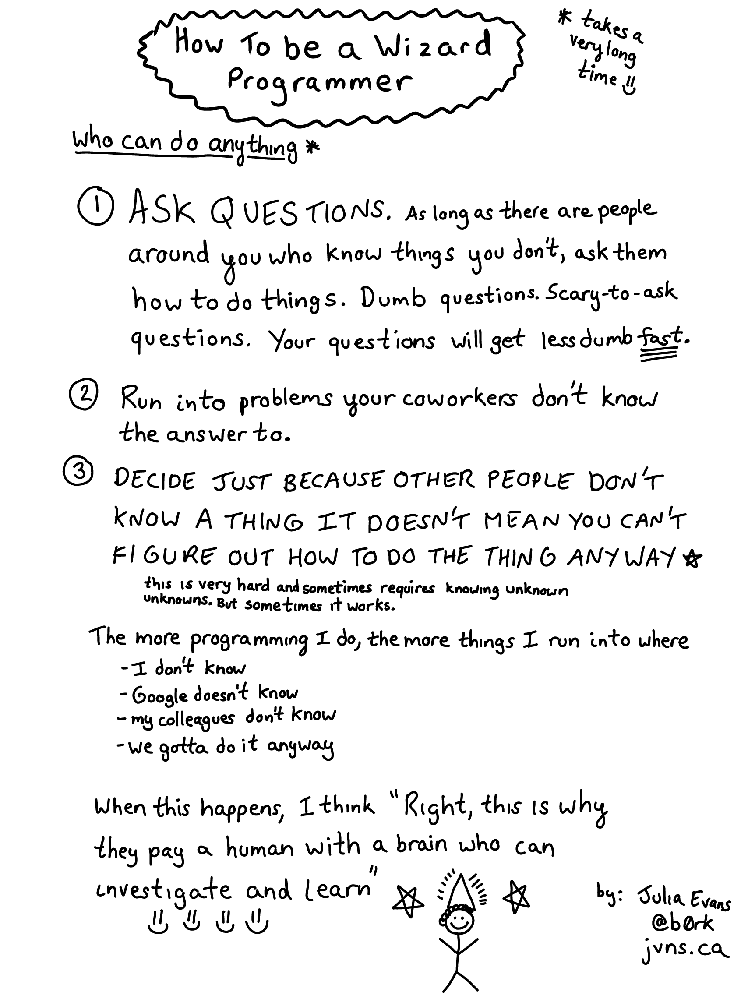

# how To be a wizard Programmer

> takes a very long time

## **who can do anything**

**①ASK QUESTiONS**. 

> As Along as there are people around you who know things you don't，ask them how to do things.Dumb questions.Scary-to-ask questions.Your questions will get less dumb fast.
>

**②Run into problems your coworkers don't know the answer do.**

**③DECIDE JUST BECAUSE OTHER PEOPLE DON'T KNOW A THING IT DOESN'T MEAN YOU CAN'T FIGURE OUT HOW TO DO THE THING ANYWAY**

> **this is very hard and sometimes requires knowing unknown unknowns.But sometimes it works.**

**The more programming I do , the more things I run into where**

- I don't know
- Google doesn't know
- my colleagues don't know
- we gotta do it anyway

When this happens, I think **"Right，this is why they pay a human with a brain who can investigate and learn"**

**➹：**[How to be a wizard programmer · julia's drawings](https://drawings.jvns.ca/wizard-programmer/)

**➹：**：[🔎Julia Evans🔍 (@b0rk) - Twitter](https://twitter.com/b0rk)

