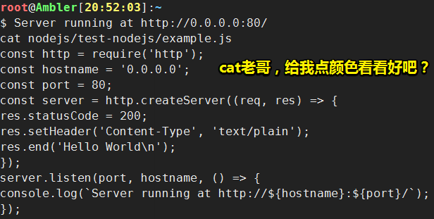
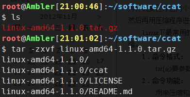
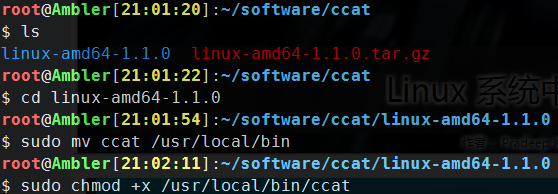
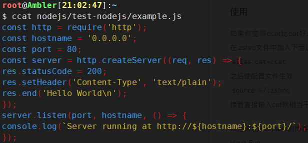
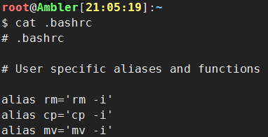
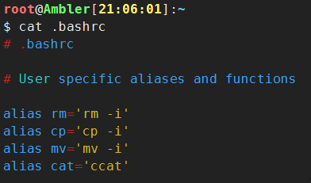
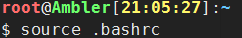

# 如何让cat命令的输出是有颜色的？

## ★引子



没有颜色，眼神都不好了！

## ★使用ccat

### ◇资源

> **➹：**[jingweno/ccat: Colorizing `cat`](https://github.com/jingweno/ccat)

### ◇安装

1. 下载二进制文件

   ```bash
   wget https://github.com/jingweno/ccat/releases/download/v1.1.0/linux-amd64-1.1.0.tar.gz
   ```

   

   第一次使用`wget`，简单了解一下就是「Linux系统中的wget是一个下载文件的工具，它用在命令行下」

   **➹：**[每天一个linux命令（61）：wget命令 - peida - 博客园](http://www.cnblogs.com/peida/archive/2013/03/18/2965369.html)

2. 下载下来后就解压

   ```bash
   tar -zxvf linux-amd64-1.1.0.tar.gz
   ```

   

   关于`tar`和 `-zxvf`，`tar`是个打包程序，使用tar程序打出来的包我们常称为tar包，，tar包文件的命令通常都是以`.tar`结尾的。那么 `xxx.tar.gz`显然是打包后再压缩的结果了……

   难怪解压出来会有好几个家伙……

   既然`tar`是打包的，为啥还能解压？难道是 `-zxvf`的缘故？

   如果是`tar.gz` 结尾的，那么解压的姿势是，**✎：**

   ```bash
   tar -zxvf FileName.tar.gz
   ```

   `-zxvf`难道是多个参数一起写？

   ```bash
   -z 支持gzip解压文件
   -x 从压缩的文件中提取文件
   -v 显示操作过程
   
   -f 指定压缩文件
   ```

   **➹：**[每天一个linux命令（28）：tar命令 - peida - 博客园](http://www.cnblogs.com/peida/archive/2012/11/30/2795656.html)

3. 切换目录，然后移动二进制文件目录，接着给这个文件赋予可执行权限

   ```bash
   cd linux-amd64-1.1.0
   sudo mv ccat /usr/local/bin
   sudo chmod +x /usr/local/bin/ccat
   ```

   

   sudo，**✎：**

   > `sudo` 表示 “superuser do”。 它允许已验证的用户以其他用户的身份来运行命令。其他用户可以是普通用户或者超级用户。然而，大部分时候我们用它来以提升的权限来运行命令。

   提升权限运行命令……

   **➹：**[技术- Linux 系统中 sudo 命令的 10 个技巧](https://linux.cn/article-9559-1.html)

   chmod，**✎：**

   > chmod命令用于改变linux系统文件或目录的访问权限。用它控制文件或目录的访问权限。

   `+x`参数表示添加可执行权限

   **➹：**[每天一个linux命令（27）：linux chmod命令 - peida - 博客园](http://www.cnblogs.com/peida/archive/2012/11/29/2794010.html)

安装后就可以像cat一样执行命令了

### ◇使用



### ◇更好用一点

设置别名，当你觉得ccat比cat好用，而且以后也不想使用cat了，想用ccat来代替cat，那么你就可以这样干了！

在`.bashrc`中加入下面这一行

```bash
alias cat='ccat'
```

没有加入之前，cat命令的效果，**✎：**



加入之后的效果，**✎：**



不过，在加入之后，你得执行下面这个命令后，才能使配置文件生效，**✎：**

```bash
source ~/.bashrc
```



source（或点）命令通常用于重新执行刚修改的初始化文档，如 .bash_profile 和 .profile 等等。

**➹：**[Linux下source命令详解 - 在努力！ - CSDN博客](https://blog.csdn.net/violet_echo_0908/article/details/52056071)

之后你就可以把cat命令当作是ccat命令使用了……

## ★参考资料

**➹：**[让cat命令有颜色得输出文件(ccat) - Bboysoul](https://www.bboysoul.com/2018/01/23/%E8%AE%A9cat%E5%91%BD%E4%BB%A4%E6%9C%89%E9%A2%9C%E8%89%B2%E5%BE%97%E8%BE%93%E5%87%BA%E6%96%87%E4%BB%B6%28ccat%29/)

