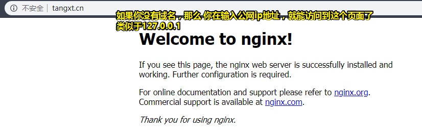

# Nginx 开启 https

## ★引子

xxx网站想打开用户的摄像头

可是，你是烂大街的http协议的呀！

你想打开？——做梦吧！

你得是https协议才行。

## ★资料

**➹：**[Linux环境下安装Nginx - 个人文章 - SegmentFault 思否](https://segmentfault.com/a/1190000012435644)

**➹：**[nginx 开启https - 简书](https://www.jianshu.com/p/cf63ea401866)

## ★Linux环境下安装 Nginx

> 使用源码编译安装，安装Nginx前需要安装C++编译环境

### ◇安装 C++ 编译环境

Centos

```bash
sudo yum install gcc gcc-c++
```

Ubuntu

```bash
apt-get install build-essential
apt-get install libtool
```

由于安装[Nginx](http://nginx.org/en/download.html)之前需要安装3个依赖包：

- gzip模块需要 zlib (http://www.zlib.net/)
- rewrite模块需要 pcre(http://www.pcre.org/)
- ssl 需要 openssl (https://www.openssl.org/source/)

### ◇安装依赖包

#### pcre

**pcre** 的作用是让Nginx支持Rewrite功能。本次介绍使用pcre，非pcre2版本，我在使用pcre2安装Nginx时出现错误，后来改用pcre没有报错。

下载pcre，地址: [ftp://ftp.csx.cam.ac.uk/pub/software/programming/pcre/](ftp://ftp.csx.cam.ac.uk/pub/software/programming/pcre/)

```bash
# 下载
sudo wget ftp://ftp.csx.cam.ac.uk/pub/software/programming/pcre/pcre-8.38.tar.gz
# 解压
sudo tar -zxvf pcre-8.38.tar.gz
# 进入目录
cd pcre-8.38
# 安装
./configure
make && make install
```

#### zlib

```bash
# 下载 
sudo wget http://www.zlib.net/zlib-1.2.11.tar.gz
# 解压
sudo tar -zxvf zlib-1.2.11.tar.gz
# 进入目录
cd zlib-1.2.11
# 安装
sudo ./configure
sudo make && make install
```

#### openssl

```bash
# 下载 
sudo wget https://www.openssl.org/source/openssl-1.0.2n.tar.gz
# 解压
sudo tar -zxvf openssl-1.0.2n.tar.gz
# 进入目录
cd openssl-1.0.2n
# 安装
sudo ./config --prefix=/usr/local/openssl
sudo make && make install
```

### ◇安装Nginx

```bash
# 下载 
sudo wget http://nginx.org/download/nginx-1.8.1.tar.gz
# 解压
sudo tar -zxvf nginx-1.8.1.tar.gz
# 进入目录
cd nginx-1.8.1
# 安装
sudo ./configure --prefix=/usr/local/nginx --with-pcre=/home/user-01/download/pcre-8.38 --with-zlib=/home/user-01/download/zlib-1.2.11 --with-openssl=/usr/local/openssl
sudo make && make install
```

**注意:** 指定`pcre`和`zlib`的路径是源码路径。

```
--with-pcre=/home/user-01/download/pcre-8.38         # 指的是pcre-8.38 的源码路径。
--with-zlib=/home/user-01/download/zlib-1.2.11       # 指的是zlib-1.2.11 的源码路径。
```

> 你最好把之前所安装的依赖包放到一个合适的目录里边去
>
> 如果你直接拷贝上边的代码，执行了一遍，然后发现源码路径是不对劲的，那么你可以在 `nginx-1.8.1`目录里边重新执行一下接下来安装操作，而这次你可别忘了要修改源码路径哦！
>
> 我的是在 `/root`目录下的。

### ◇启动Nginx

```bash
sudo /usr/local/nginx/sbin/nginx
```

浏览器访问，看到下图则说明Nginx安装并启动成功。



**Nginx的其他命令：**

检查配置文件`nginx.conf`的正确性

```bash
/usr/local/nginx/sbin/nginx -t
```

停止Nginx

```bash
/usr/local/nginx/sbin/nginx -s stop
```

重新加载配置文件

```bash
/usr/local/nginx/sbin/nginx -s reload
```

> 你可以在`.bashrc`里边搞个别名。

## ★Nginx 开启 https

> 待续……


## ★总结


## ★Q&A

### ① `./configure`、make、make install是什么鬼？

- 在linux里**编译安装软件**会用到诸如 `configure / make / make install`
  的命令，这些都是典型的使用GNU的autoconf和automake产生的程序的安装步骤。
- `./configure`是用来检测你的安装平台的目标特征的。比如它会检测你是不是有CC或GCC，并不是需要CC或GCC，它**是个shell脚本**。
- `make`是用来编译的，它从Makefile中读取指令，然后编译。
- `make install`是用来安装的，它也从Makefile中读取指令，安装到指定的位置。

关于configure：

configure，这一步一般用来生成 Makefile，为下一步的编译做准备，你可以通过在 configure 后加上参数来对安装进行控制，比如：

```
./configure –prefix=/usr
```

上面的意思是将该软件安装在 `/usr` 下面，执行文件就会安装在 `/usr/bin` （而不是默认的 `/usr/local/bin`),资源文件就会安装在 `/usr/share`（而不是默认的`/usr/local/share`）。

同时一些软件的配置文件你可以通过指定 `–sys-config`= 参数进行设定。有一些软件还可以加上 `–with、–enable、–without、–disable` 等等参数对编译加以控制，你可以通过允许 `./configure –help` 察看详细的说明帮助。

关于 configure 的一些常见错误：[解决./configure ，make，make install的报错](https://web.archive.org/web/20190222114939/http://freetstar.com/trouble-shooting-configure-make-make-install/)

**➹：**[linux命令行为什么输入sudo ./configure提示找不到命令 - SegmentFault 思否](https://segmentfault.com/q/1010000005856233)

### ②curl？

curl命令后加上网址，就可以看到网页源码。可以测试一下域名解析是否成功。

```bash
curl tangxt.cn
```

**➹：**[curl网站开发指南 - 阮一峰的网络日志](http://www.ruanyifeng.com/blog/2011/09/curl.html)

