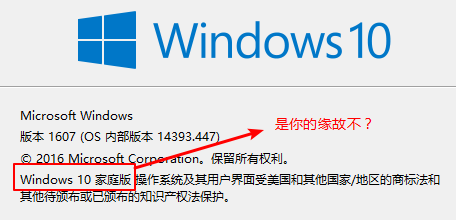
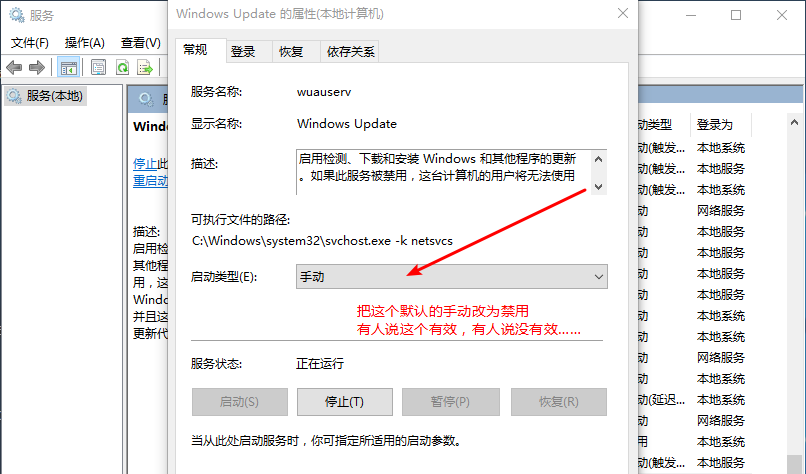
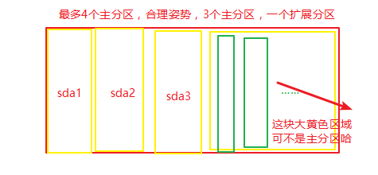

# 安装Win10系统

## ★引子

win7这个系统用了有3年半的时间了，而这里边积累不少删都删不掉的软件，如以前上课用的sql2008、ps6等等这些用不到的却始终赖在硬盘里边的软件。就这样，用不到的软件积累得越来越多，还有那些诸如微信、QQ等在本地存储的那些的数据（如关于聊天的文本、图片、音视频等）同样是件麻烦事！讲真，我开始有点讨厌这些用不到的东西了，毕竟它们的存在让我的笔记本变得贼鸡儿卡，尤其是玩LOL的时候，经常性的被记录为逃兵，以致于游戏结束后的20min之内不准开始另一局游戏，而且这种惩罚机制需要5次！如果有钱，我真想搞台很牛逼的台式电脑，而不是重装这台笔记本系统，不过，重装系统一直是我想要自己独立完成的事儿！为什么这么说呢？因为我这台电脑起初是跑win8的，但是用了不到半年，我就叫我舍友帮我重装了一个win7系统，当时，我认为能够重装系统的人都会很牛逼的！而那时的我，是个超级迷茫的小白，每天过着打游戏、逃课、抄同学作业、期末考试就抄同学试卷的生活……所以，你叫当时的我去装个系统，那岂不是如同吃shi一样难受！但是，那时的我已经把“自己独立（可以参考网上教程，但是不能靠身边人指点）重装一个系统”这么一个任务添加到“人生TODO”里边了。当然，这个TODO的勾选完成，直到今天2019-04-01，愚人节才真正完成（这个系统弄了我3天时间，其实半小时左右就可以搞定）。

## ★装个win10 1607

**①装备工具**

1. 镜像文件：[MSDN, 我告诉你](https://msdn.itellyou.cn/)，注意你的镜像文件要校验一下，以防这里边多了点莫名其妙的东西！总之一个字“纯”
2. 微PE：[微PE工具箱 - 最好用的WinPE装机维护工具](http://www.wepe.com.cn/)
3. 分区精灵：[DiskGenius - 下载](http://www.diskgenius.cn/download.php)

**②制作U盘启动盘**

1. 直接运行微PE的可执行文件
2. 插入U盘，选择把U盘作为启动盘设备。微PE会自动识别它！
3. 都选择默认的勾选按钮即可
4. 在笔记本的本地硬盘里边，找到镜像文件，并添加进去即可！
5. 点击开始制作
6. 制作完成之后，这个U盘里边就被分为2部分了，当然，这个U盘仍然还可以存储东西，如把安装好的整个分区精灵程序给放进去

**③搞bIOS**

1. 我的事宏基E1-572G，所以直接在开始机的时候一直摁F2即可，进入bios里边
2. 选择U盘启动优先，而不是默认的硬盘

**④分区**

1. 进入到微PE系统里边之后，就用分区精灵格式化硬盘（注意格式化之前，要备份数据，或者你可以不格式化除了装系统的C盘以为的盘，我是在装系统之前，就把我需要保留的数据移动到一个移动硬盘里边去了！这个备份数据的过程用了我一天的数据，所以日常的每一日都最好做好备份哈！），这个硬盘的格式化姿势为GUID，而不是我之前默认的MBR，毕竟我现在是以UEFI作为启动的。

**⑤装系统**

1. 格式化好后，就装载镜像
2. 双击那个安装程序
3. 安装过程中，一些勾选，如跳过激活码、选择专业版、自定义安装、安装到C盘……
4. 这个安装过程需要等待一段时间，大概10多分钟吧！

**⑥进入到了windows桌面**

1. 进入之后才连接网络
2. 开始装驱动（似乎都推荐使用根据自己的硬件设备到官网里边下载驱动。我是直接装了个驱动精灵，然后就直接开始检查电脑里边的驱动，那个不行就装那个）
3. 装完驱动后重启电脑，安装你想要装的软件，如先搞个网易云音乐，让自己放松一下，接着就是搞SSR，用于科学上网，以此来下载个chrome浏览器，需要注意的是，软件的安装最后到官网去下，而不是通过一个360软件管家！还有就是最好把所有安装包都搞到一个文件夹里边，而安装文件则另起一个新的文件夹！

**⑦遇到的问题**

1. bios里边选择UEFI，而不是默认legacy，前者是新姿势，而后者则是旧姿势

2. 我的笔记本重启之后就一直黑屏了，用手机的夸克浏览器搜索“win10重装 开机黑屏”等字眼，然后根据答案一个个去试，如

   1. 是不是驱动问题？开机时摁下F8（不是实时的，也是需要2次）或强制关机3次，用于让我们进入安全模式（也可以选择带网络的安全模式），然后进入到系统之后，你就把刚刚那些安装的驱动给禁用掉（安全模式下的操作会映射到我们真正进入win10系统里边的操作）
   2. AMD显卡问题：[windows10开机黑屏数十秒是什么原因？ - 知乎](https://www.zhihu.com/question/33662311)

   最后我也不知道为啥就成功了！

3. 你在使用windows的过程中，突然感觉打开网页的速度贼鸡儿慢，而且持续了一段时间，那么你大可猜测windows在更新了，当然你也可以查看任务管理器！看看有哪些鬼进程在占用你的CPU.

4. 我打算禁用windows更新服务，然而我没有找到合适自己的解决方案。比如说「告知windows我的网络服务是需要流量计费等等」，然而我没有找到这个按钮。

   

   还有修改这个（很多人说禁用了之后又会自动复原为手动，表示无语……）：

   

   还有修改策略组方案，然后家庭版打不开策略组，有人说登录你的microsoft账户就好了！

5. 如果windows更新了，然后驱动也更新了，然后系统蹦了，那这该咋办呢？那就进去安全模式里边，然后重装驱动呗！

6. 关于驱动的下载，我之前再win7里边使用过一次驱动精灵，然后但我把它卸载以后系统就出问题了，如蓝屏什么的。而这次重新装的win10，一开始就使用了驱动精灵，即便它已经帮我把驱动都能好了，但我还是不会卸载它！我无法预料这次卸载是否还会发生上次所遇到的问题！毕竟，就目前而言，电脑使用起来还是挺正常的！

7. 关于分区的操作，我一般都会在正式用启动盘装系统前，先分好区！如之前用微PE制作的启动盘，就是先用U盘里边的分区精灵先分好区后再装的系统！而我在装deepin 深度系统的时候没有弄分区，而是在安装系统的过程中，使用了默认的分区！

   **➹：**[Linux系统安装时分区的选择（推荐） - zbk.gyl - 博客园](https://www.cnblogs.com/gylei/archive/2011/12/04/2275987.html)

## ★参考资料

- [【Windows10官方纯净版安装教程，UEFI启动+GUID分区表】 - 知乎](https://zhuanlan.zhihu.com/p/49437274)
- [Win10系统开机黑屏怎么办 开机黑屏的修复方法_百度经验](https://jingyan.baidu.com/article/c74d60009e542c0f6a595da9.html)
- [重装win10系统 开机总是黑屏一分钟 然后才进入解锁界面？_百度知道](https://zhidao.baidu.com/question/1866089923194892027.html?word=%E9%87%8D%E8%A3%85win10%E5%90%8E%E5%BC%80%E6%9C%BA%E9%BB%91%E5%B1%8F)
- [黑屏或空白屏幕错误疑难解答 - Windows Help](https://support.microsoft.com/zh-cn/help/14106/windows-10-troubleshoot-black-screen-or-blank-screen-errors)
- [win10为什么不能选择关掉自动更新？ - 知乎](https://www.zhihu.com/question/46365518)
- [windows10的UWP应用和普通的应用有啥不同? - 知乎](https://www.zhihu.com/question/36903768)
- [win10 打不开组策略 编辑器_百度知道](https://zhidao.baidu.com/question/2075636438213582508.html)
- [在 Windows 10 中更新驱动程序](https://support.microsoft.com/zh-cn/help/4028443/windows-10-update-drivers)
- [电脑上的驱动软件那个好？ - 知乎](https://www.zhihu.com/question/267095571)
- [win10怎样给系统硬盘分区_百度经验](https://jingyan.baidu.com/article/148a1921a268c94d70c3b150.html)

## ★总结

- 黑屏的bug，一度让我放弃装win10，转而装回win7或者装个deepin系统，deepin系统倒是安装成功，不过，有一些我常用的软件它没有，所以我最后又重装了，不过这次装的是1603了，之前的是1803，毕竟我一度怀疑是硬件带不动1803这个系统的问题，不过我看了官网的介绍之后，我觉得这台电脑的配置是足以胜任的！所以win7，我还是没有尝试，而是退而求次，选择3年前的版本！不过即便用了这个版本，同样的问题还是发生了！至此我开始大肆搜索关于“win10重装、开机黑屏”这样的关键字，然后根据它们所提供的答案，一个个测试，最终解决了（不敢打包票，毕竟才使用了几个小时，至少你也得用个10天8天吧！）

- 不知为何，我这台笔记本的启动方式为有选择的启动（win+R、msconfig、常规、有选择的启动），照理说应该是“正常启动”才对的！至此，我就打算改为「正常启动」，然而即便勾选了也没有效果！而官方的解释则是叫你禁用那些非Microsoft服务，然后勾选再启动。

  **➹：**[Win10，系统配置里，默认“有选择的启动”，想改为“正常启动 - Microsoft Community](https://answers.microsoft.com/zh-hans/windows/forum/windows_10-update/win10%E7%B3%BB%E7%BB%9F%E9%85%8D%E7%BD%AE%E9%87%8C/d3894f9f-8fa4-4b8f-89f7-5ee2a90f0c3d)

- 把能找到的答案，都一个个地去尝试一遍……很多时候都是驱动与硬件的问题！

  **➹：**[本质上软件是如何驱动硬件的？ - 知乎](https://www.zhihu.com/question/23707783)

- 未来对这台笔记本的一些操作：比如搞个双系统，如装个对新手入门友好的linux发行版……

- 一款开源、小巧的，用于制作启动盘的软件——[rufus](https://github.com/pbatard/rufus)，我之前装的那个deepin 深度系统就是用它作为启动盘的！

  **➹：**[Rufus 中文绿色版 - 简单快速制作 USB 启动盘软件 (U盘安装 Windows / Linux 系统) - 异次元软件下载](https://www.iplaysoft.com/rufus.html)

  **➹：**[Debian 9.8 正式版 ISO 镜像 - 稳定快速且方便维护升级的 Linux 操作系统 - 异次元软件下载](https://www.iplaysoft.com/debian.html)

## ★Q&A

### ①关于硬盘的那些事儿?

以下为摘录内容：

> 无论是安装Windows还是Linux操作系统，**硬盘分区都是整个系统安装过程中最为棘手的环节**，网上的一些Ubuntu Linux安装教程一般都是自动分区，给初学者带来很大的不便，下面我就根据多年来在装系统的经验谈谈安装Ubuntu Linux系统时硬盘分区最合理的方法。
>
> 在讲硬盘分区之前，我先来普及一下硬盘的相关分类，**硬盘一般分为IDE硬盘、SCSI硬盘和SATA硬盘三种**，在Linux系统中，IDE接口的硬盘被称为hd，SCSI和SATA接口的硬盘则被称为sd，其中IDE硬盘基本上已经淘汰，现在市面上**最常见的就是SATA接口的硬盘**，**第1块硬盘称为sda**，第2块硬盘称为sdb……，依此类推。
>
> **一块硬盘最多有4个主分区**，主分区以外的分区称为**扩展分区**，硬盘可以没有扩展分区，但是一定要有主分区，**在主分区中要有一个激活分区用来启动Windows系统**，在扩展分区中可以建立若干个逻辑分区，因此，最合理的分区方式应该最多分三个主分区，一个扩展分区，这样可以有效地利用有限的主分区，然后在扩展分区中建立逻辑分区。
>
> **在Linux系统中每一个硬盘总共最多有 16个分区**，硬盘上的4个主分区，分别标识为sdal、sda2、sda3和sda4，逻辑分区则从sda5开始标识一直到sda16。
>
> Ubuntu Linux可以把分区作为挂载点，载入目录

按照我的理解就是：

**➹：**[安装Ubuntu Linux系统时硬盘分区最合理的方法 - 博客堂 - CSDN博客](https://blog.csdn.net/u012052268/article/details/77145427)

### ②关于硬盘的文件系统？

所谓文件系统，它是[操作系统](https://baike.baidu.com/item/%E6%93%8D%E4%BD%9C%E7%B3%BB%E7%BB%9F)中藉以组织、[存储](https://baike.baidu.com/item/%E5%AD%98%E5%82%A8)和[命名](https://baike.baidu.com/item/%E5%91%BD%E5%90%8D)文件的结构。磁盘或分区和它所包括的文件系统的不同是很重要的，大部分应用程序都基于文件系统进行操作，在不同种文件系统上是不能工作的。

**➹：**[磁盘文件系统_百度百科](https://baike.baidu.com/item/%E7%A3%81%E7%9B%98%E6%96%87%E4%BB%B6%E7%B3%BB%E7%BB%9F)

**➹：**[文件系统 - 知乎](https://www.zhihu.com/topic/19560370/hot)

**➹：**[新买的移动硬盘该格式化为 NTFS 还是 exFAT？ - 知乎](https://www.zhihu.com/question/20448164)

**➹：**[NTFS, FAT32和exFAT文件系统有什么区别？ - 知乎](https://zhuanlan.zhihu.com/p/32364955)

### ③宽带连接和以太网连接？

如果你有路由器，建议使用LAN接入，如果你没有路由器或只有一台PC，乖乖“宽带连接”。

**➹：**[以太网连接和宽带连接，WIN10系统连接哪个比较好？ - 知乎](https://www.zhihu.com/question/55118574)

